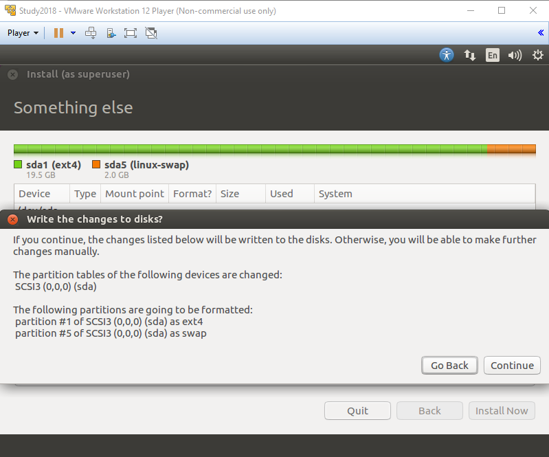
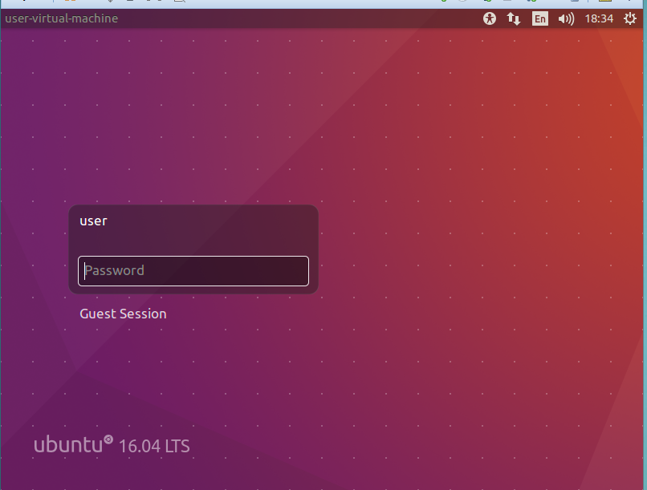
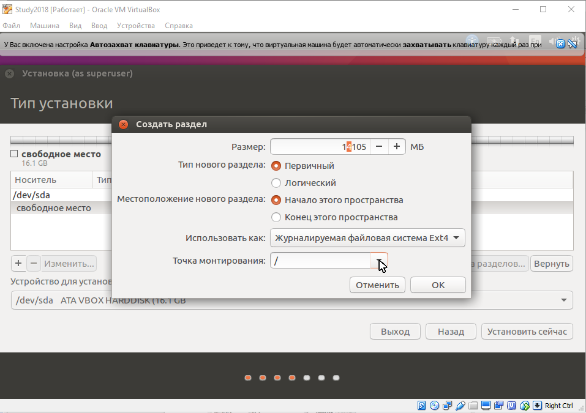
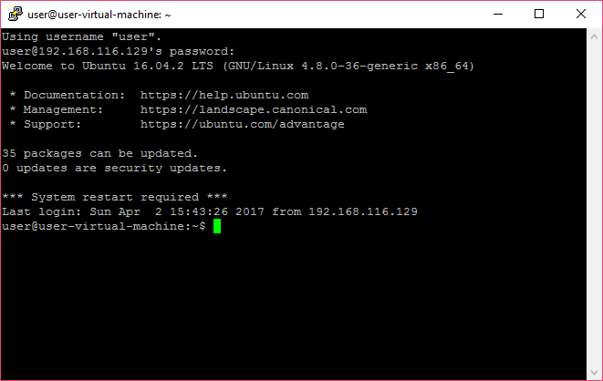

# Знакомство и установка

**Знакомство с GNU/Linux. Что такое GNU, Linux и UNIX. Виртуализация. Установка Ubuntu в виртуальной машине. Базовые возможности работы в Linux.**

## Оглавление
- [Введение](#введение)
- [Кому курс полезен](#кому-курс-полезен)
- [Программа курса](#программа-курса)
- [Что такое Linux](#что-такое-linux)
- [Достоинства Linux](#достоинства-linux)
- [Инструменты](#инструменты)
- [Популярные операционные системы Linux](#популярные-операционные-системы-linux)
- [Сетевые возможности](#сетевые-возможности)
- [Виртуализация](#виртуализация)
- [Технологии виртуализации](#технологии-виртуализации)
- [Примеры виртуализирующих технологий](#примеры-виртуализирующих-технологий)
- [Серверная и клиентская виртуализация](#серверная-и-клиентская-виртуализация)
- [Диски, дисковые устройства, разметка](#диски-дисковые-устройства-разметка)
- [Установка](#установка)
- [Некоторые действия](#некоторые-действия)
- [Сервер и клиент](#сервер-и-клиент)
- [Документация](#документация)
- [Навыки системного администратора](#навыки-системного-администратора)
- [Практическое задание](#практическое-задание)
- [Ресурсы](#ресурсы)
- [Дополнительные материалы](#дополнительные-материалы)
- [Используемая литература](#используемая-литература)

## Введение
Данный курс нужен независимо от того, какую профессию вы выбрали: системный администратор, специалист по информационной безопасности или программист.
Linux — известная серверная операционная система. Большинство веб-сайтов и веб-сервисов работают именно на ней. Независимо от того, какой язык используется для реализации сервиса — PHP, Python или Java — скорее всего, система работает под управлением Linux. Если вы планируете разрабатывать решения на одном из вышеперечисленных языков, надо понимать, что для успешной разработки среда, в которой вы разрабатываете, должна совпадать со средой, где ваш продукт будет работать. Поэтому, если вы используете Windows, хорошим решением будет установить не веб-сервер на вашей ОС, а виртуальную машину и в ней выбрать и настроить такую же операционную систему, как та, что будет работать в production. Для production скорее всего, понадобится сервер. Для решения большинства задач надо использовать не shared-хостинг, а полноценную ОС, пусть и виртуализированную. Обычно хостинг-провайдеры продают такие решения под названием VDS — Virtual Dedicated Server или  VPS — Virtual Private Server. Чтобы суметь настроить систему для своего проекта, все это надо знать.
В крупной компании настройкой занимаются системные администраторы, но вам нужно в общих чертах понимать, как это делается, и суметь настроить для домашнего использования.
Специалист по информационной безопасности сможет найти изъяны в системе, кроме того, для использования профессиональных инструментов, которые предназначены для работы в Linux, необходимо знакомство с операционной системой.
Есть облачные решения Linux и для Data Science. В основном они базируются как раз на Linux-машинах, благодаря стабильности и  надежности операционной системы.
Отдельно стоит упомянуть разработчиков iOS. Система Mac OS основана на UNIX, как и GNU/Linux. Многое, что есть в Linux, есть и в MAC OS X. Кроме того, Mac OS непосредственно содержит компоненты GNU (bash и утилиты). Для работы с Xcode необходимо знакомство с системой.
Если вы работаете с Mac, мы рекомендуем установить VirtualBox (VMWare работает только для Windows/Linux) и в нем запускать Ubuntu 16.0. Вы вскоре сами поймете, что многие вещи можно делать и непосредственно в Mac и его терминале.
Также вы познакомитесь с регулярными выражениями, которые полезны для любой профессии, будь то сисадмин, тестировщик или программист.
Особо отметим, что на последнем занятии мы разберем Git и Docker. Git — инструмент контроля версий, используемый большинством программистов для совместной работы. Он дружит с Linux не случайно, ведь его тоже разработал легендарный Линус Торвальдс. А завершит наше знакомство с Linux экскурс в Docker.
Ничего страшного, если до этого вы не имели опыта с Linux. Курс ориентирован на начинающих пользователей Linux. Он даст основы работы с операционной системой и навыки взаимодействия с командной строкой, а также представление об автоматизации и написании скриптов. Курс рассчитан на изучение Unix-подобной архитектуры с нуля. Но все же будьте готовы к совершенно неожиданным и непривычным методам работы. Концепция администрирования Linux сильно отличается от концепции «администрирования мышкой» Windows.

### Кому курс полезен
*   Системным администраторам. В особенности, если планируете администрировать UNIX-подобные системы.
*   Веб-разработчикам. Хотя, как правило, веб-разработка не требует глубоких познаний Linux и TCP/IP, понимание системы, под которой вы работаете, делает вас квалифицированным и дорогостоящим специалистом.
*   iOS-разработчикам. Вы научитесь лучше понимать систему, которая, как и Linux, UNIX-подобна и содержит GNU-компоненты.
*   Разработчикам решений для Linux: системным программистам, прикладным программистам, разработчикам любых решений, для которых Linux — родная среда выполнения.
*   Инженерам, использующим Linux для встраиваемых и промышленных систем.
*   Тестировщикам.
*   Специалистам ИИ, Data Science, Big Data, так как такие вычисления производятся, как правило, на Linux-машинах.
*   Специалистам по компьютерной безопасности.
*   Системным инженерам DevOps. Развертывание и деплой высоконагруженных сервисов, как правило, осуществляется на линукс-кластерах.
*   Всем, чья работа так или иначе связана с Linux: от внедрения решений до использования Linux-машин в качестве рабочих станций.

## Программа курса
Курс состоит из восьми двухчасовых занятий. Каждое занятие начинается по расписанию, длится полтора-два часа с пятиминутным перерывом в середине. Каждое занятие снабжается методическими материалами, слайдами и видеозаписью. Видеозапись доступна после каждого вебинара, не позднее начала следующего дня. В конце каждой методички есть практическое задание, которое необходимо выполнить. В случае затруднений рекомендуется максимально понятно сформулировать проблему, описать ваше решение и написать об этом в обсуждении под уроком, чтобы преподаватель или другие студенты могли помочь. Помощь одногруппникам приветствуется. А поиск информации в Интернете, чтение документации и мануалов — нормальный режим работы системного администратора.
*   1 урок — зачем нужен Linux, знакомство с Linux,  установка Ubuntu, начальное представление о системе.
*   2 урок — работа в терминале, работа с директориями и файлами. Установка программ, логи.
*   3 урок — управление пользователями, файлы и права доступа.
*   4 урок — введение в регулярные выражения.
*   5 урок — введение в написание скриптов bash, практика написания скриптов, позволяющих автоматизировать рутинные операции, и запуск задач по расписанию.
*   6 урок — установим веб-сервер LAMP/LNMP и защитим его с  помощью iptables.
*   7 урок  —  научимся работать с Git.
*   8 урок —  познакомимся с Docker.
К концу курса вы будете иметь прочную базу для дальнейшего освоения профессии, научившись:
*   устанавливать и настраивать Linux;
*   управлять пользователями и приложениями;
*   работать в командной строке bash;
*   писать скрипты для автоматизации рутинных действий, выполняемые по расписанию;
*   использовать Linux на десктопе и в виртуальной машине,
*   освоите регулярные выражения,
*   освоите Git,
*   научитесь устанавливать веб-сервер,
*   научитесь использовать контейнеры Docker.

## Что такое Linux
Linux или GNU/Linux — популярная операционная система (ОС), которая распространена как серверная ОС, но имеет и другие области применения. Более точно — это целое семейство операционных систем. Они базируются на двух китах:
*   GNU — UNIX-подобное операционное окружение, которое состоит из утилит, операционной оболочки и ее команд, а также средств разработки, прежде всего, ‒  коллекции компиляторов gcc;
*   Linux — ядро операционной системы, по имени которого часто называется и вся ОС.
Если в ОС Linux используется графический режим, появляется еще одна особенность: 
*   X Windows System — оконная система, реализующая клиент-серверную модель.
Одно из главных свойств и достоинств операционной системы — открытость. Поэтому часто применяются и другие компоненты, разработанные независимыми людьми и группами разработчиков.
Вокруг наименования ОС существует спор. Наиболее распространенные варианты: 
*   Linux.  Подразумевается, что не только ядро носит такое название, но и вся ОС целиком;
*   GNU/Linux. На этом варианте настаивает Ричард Столлман, основатель проекта GNU. Он подчеркивает, что операционная система — не только ядро Linux, но и многие важные компоненты, которые в ней используются, в частности, проект GNU.
У каждого из подходов есть аргументы как за, так и против. Существуют операционные системы на ядре Linux, в которых нет GNU: Android или Open webOS. Кроме того, ОС — не только ядро Linux и окружение GNU, но и множество других компонентов: X Windows System,  Systemd и т.д. Полное их перечисление сделало бы название слишком громоздким.
Мы будем считать наименования Linux и GNU/Linux синонимами. Когда будет идти речь о ядре Linux, укажем на это отдельно.

## Достоинства Linux
GNU/Linux как операционная система — это:
*   UNIX-подобная ОС. Это значит, что архитектура, идеология и удобство работы напрямую исходят из истории и архитектуры UNIX-систем. Усвоив архитектуру Linux, просто перейти к работе с другими UNIX-подобными ОС: FreeBSD, OpenBSD, OpenSolaris, Mac OS X. 
*   Многопользовательская операционная система с удачной реализацией управления пользователями и правами, благодаря подобию UNIX.
*   Многозадачная операционная система, которая использует механизмы защиты процессора. Ядро Linux изначально было написано под процессор Intel 80386. Поэтому, в отличие от DOS и Windows 9x, в GNU/Linux не нужно было обеспечивать совместимость в ущерб надежности. В процессоре Intel 80386 уже стала классической полноценная поддержка колец защиты процессора. Это система впервые появилась в процессоре 80286 и позволяла отделить код ядра операционной системы от кода приложений. До этого весь код выполнялся в одном режиме, имея доступ ко всем ресурсам.  Поэтому, например, DOS мог напрочь зависнуть в результате ошибки в прикладной программе. Очень долго Microsoft в целях совместимости приходилось поддерживать выполнение определенных фрагментов пользовательского кода на уровне ядра и в Windows. Это приводило к появлению синего экрана смерти и необходимости перезагрузки. В Linux не было необходимости поддерживать старый код, потому что операционная система сразу использовала механизмы защиты процессора и сейчас является довольно устойчивой и надежной. Kernel panic — сообщение-аналог синего экрана смерти в WIndows, которое говорит о крахе ядра, в Linux можно увидеть очень редко.  Разве что в процессе отладки драйверов для Linux, работающих как модули ядра.
*   Сетевая операционная система, реализующая стек TCP/IP на уровне ядра и обладающая широким набором сетевого программного обеспечения: веб-сервера, почтовые сервера, системы мониторинга и т.д. и т.п.
*   Свободная операционная система. Linux распространяется по лицензии GNU GPL, которая, с одной стороны, позволяет распространять ОС бесплатно, а с другой — обязывает предоставлять исходные коды. Это делает разработку, поиск ошибок и их исправление  прозрачными и надежными. Поэтому многие решения для Linux являются опробованными и надежными, а найденные уязвимости быстро закрываются сообществом. Далеко не всегда то же самое можно сказать о проприетарном (собственническом) программном обеспечении. Но есть и Enterprise-решения — коммерческие решения, созданные на базе свободного Linux. Самый известный пример — Red Hat. Основа остается бесплатной, но производитель может добавлять дополнительные услуги и решения, платную поддержку. Иногда встречается и откровенное нарушение лицензии GPL, когда ОС полностью продается без поставки исходного кода, например Linux XP и, возможно, МСВС. Тем не менее, большая часть операционных систем Linux остается открытой, и даже у коммерческих версий есть функциональные аналоги, например Centos для Red Hat.  Но в таком случае система используется на свой страх и риск — поддержки от производителя нет.
*   Надежная операционная система.  В Linux продуманная система прав, наследуемая из UNIX. Linux не отягощена наследием неверного использования модели безопасности, как Windows, где система безопасности не используется в полную меру из соображений совместимости. Наконец, Linux — прозрачная система, где быстро закрываются все уязвимости. Все вместе это дает надежную систему, на которую всегда можно положиться.
*   Операционная система, дающая полный контроль пользователю. Linux позволяет системному администратору или разработчику полностью управлять операционной системой: разрабатывать скрипты и автоматизировать рутинные действия. Здесь и возможности командной строки, и использование конвейеров и виртуальных файловых систем с доступом ко всем параметрам ядра ОС, процессов и устройств.
*   Опробованная система с широким опытом внедрения. Linux лидирует в мире серверного программного обеспечения, а также используется на десктопах, в т.ч., во встраиваемом программном обеспечении. Это дает огромный пользовательский опыт в технологическом и специализированном программном обеспечении, сформированные пользовательские сообщества. Благодаря этому, во-первых, есть уверенность, что решение испытано, а во-вторых, можно обращаться к пользовательскому опыту в случае возникновения сложностей.
*   Операционная система с возможностью работы в графическом оконном режиме. Механизм X Windows Server в Linux вместе с SSH позволяет реализовать даже удаленное выполнение оконных приложений. Это удобнее, чем, например, механизм RDP. Кроме того, он включает набор сред рабочего стола, например, Gnome, KDE, и позволяет выбрать систему рабочего стола по вкусу. При этом приложения выполняются независимо от используемой среды. И, наконец, проект Wine в Linux реализует трансляцию вызовов WinAPI в системные вызовы ядра и тем самым позволяет запускать в оконной среде Linux приложения Windows.
*   Операционная система с возможностью виртуализации. Набор механизмов Linux позволяет как изолировать пользователей и процессы (как cgroups и chroot), так и запускать гостевые ОС на хост-системе. Для этого используются механизмы виртуализации на уровне ядра, например kvm (в том числе и для Windows-машин), либо контейнерная виртуализация, то есть на уровне ОС, когда запускаются в гостевом режиме другие экземпляры Linux. Например, это LXC или OpenVZ.

## Инструменты
Нам понадобятся: 
*   виртуальная машина VirtualBox или VMWare Player;
*   образ диска с Ubuntu 16.0;
*   дополнительные инструменты для Windows, которые перечислены в разделе «Ресурсы».  
Сносить Windows и устанавливать вместо него Ubuntu лучше не стоит. Могут возникнуть сложности в работе с вебинаром, а чтобы корректно настроить систему, может не хватить опыта. Потому настоятельно рекомендуем незнакомые операционные системы ставить на виртуальной машине и изучать их, прежде чем переходить к использованию на десктопах или ноутбуках.

## Популярные операционные системы Linux
Большинство (но не все) дистрибутивы происходят от двух известных китов — Debian и Red Hat. Есть независимые от них операционные системы — SUSE. Различия операционных систем не всегда основываются на том, от какой системы кто произошел. Так, Ubuntu 14 и CentOS 6 используют систему инициализации Upstart, а Ubuntu 16 и CentOS 7 — Systemd, которые мыссмотрим на пятом уроке. Тем не менее, файлы конфигурации сетевых интерфейсов, например, в Ubuntu одни, в CentOS — другие (схожие с аналогичными в Red Hat и Mandrake).
В таких условиях наиболее важным механизмом, разграничивающим операционные системы, является система управления пакетами. Учитывая, что основных предков дистрибутивов два, наиболее популярные системы управления пакетами тоже исчисляются числом два. 
Это:
*   `dpkg` (расширение файлов `.deb`, для удобства работы используется `apt`) — в основанных на Debian дистрибутивах (но не обязательно, система может быть привнесена и в дистрибутивы иного происхождения);
*   `rpm` (расширение файлов `.rpm`, для удобства работы используется `yum`) — в основанных на Red Hat дистрибутивах.
Итак, классификация:
*   deb-пакеты
    *   Debian
        *   Ubuntu — один из популярных дистрибутивов.
            *   Kubuntu.
            *   Lubuntu, Xubuntu — благодаря легковесной графической оболочке используются на слабой/морально устаревшей технике.
            *   Xandros, ✝ — для ноутбуков Asus Eee.
            *   Идеологические версии, отличающиеся обоями и прикладными программами.
                *   Христианский Linux.
                *   Мусульманский Linux.
                *   Научный Linux.
                *   много...
        *   Linux Mint.
        *   Kali Linux — дистрибутив, ориентированный на проведение тестов на безопасность сети.
*   rpm-пакеты.
    *   Red Hat, $.
        *   Centos — один из популярных дистрибутивов.
        *   Mandrake, ✝.
            *   Mandriva.
        *   Fedora.
            *   LinuxXP, $✝.
            *   Pidora — Fedora для Raspberry — одноплатного компьютера, в том числе пригодного и для встраиваемых систем.
        *   МСВС (Мобильные системы вооруженных сил), $.
            *   Заря, $.
*   SLS — одна из первых операционных систем на базе ядра Linux, в первой версии используемой файловой системой была MINIX.
    *   Slackware (дистрибутивы распространяются тарболлами `.tar.gz`).
        *   SUSE Linux.
            *   Open SUSE (добавилась возможность использовать rpm).
*   ArchLinux (с собственной системой packman) — один из популярных дистрибутивов.
*   Gentoo (популярна благодаря оптимизации под конкретное аппаратное обеспечение).
*   OpenWrt — Linux для маршрутизаторов и встраиваемого оборудования, прежде всего от Lincsys (поддерживает пакетные менеджеры ipkg/opkg).
    *   X-Wrt — развитие, ориентированное на конечного пользователя.
    *   DebWrt — проект запуска Debian на роутерах, поддерживающих OpenWrt.
    *   и т.д. 
Примечания:
*   $ — проприетарный или коммерческий Enterprise-дистрибутив;
*   ✝ — система мертва и не развивается.

## Сетевые возможности
Спор между IBM и Microsoft привел к рождению двух ветвей изначально одной операционной системы — OS/2 и Windows NT. Спор об архитектуре (микроядерная или монолитная) между Эндрю Таненбаумом и Линусом Торвальдсом решило само время. Спор между System V и BSD, в частности, касался используемого сетевого стека, TCP/IP или OSI/ISO.
Что нужно знать начинающему пользователю Linux?
Компьютеры, работающие в сети, взаимодействуют благодаря IP-адресам. IP-адрес позволяет глобально идентифицировать ЭВМ в сети, где бы компьютер ни находился. Если вы в Москве, ваш компьютер с IP-адресом 1.2.3.4 подключен к Интернету, вы можете установить связь с компьютером, находящимся, скажем, в Лос-Анджелесе, и имеющим IP-адрес 130.140.105.1
IPv4-адрес (как правило, используются адреса IP версии 4, хотя постепенно и осуществляется переход на IPv6) состоит из 4-х чисел (байт), именуемых октетами, и записываемых, как правило, в десятичной системе счисления. Есть специальные IP-адреса (адреса сетей и широковещательные адреса), но большинство IP-адресов служат для идентификации хостов, то есть неких машин (не важно, в роли клиентов или серверов они выступают). Машина, которая предоставляет некие услуги, обычно именуется сервером, машина, которая запрашивает эти услуги, выступает клиентом. Терминология клиент-сервер применяется как к аппаратному обеспечению (ваш ноутбук будет выступать клиентом, а компьютер-сервер в серверной стойке в дата-центре, соответственно, сервером), так и к программному (например, если веб-сервером выступает Apache или Nginx, роль клиента на вашем компьютере будет играть Google Chrome или, например, Mozilla Firefox).
Для подключения к серверу используется IP-адрес. Но на практике часто в качестве адреса сервера используются доменные имена: geekbrains.ru, yandex.ru, google.com, linkedin.com. Доменные имена благодаря распределенной системе DNS преобразуются в IP-адреса. То есть, когда вы в браузере вбиваете имя geekbrains.ru, ваш компьютер, выступая в роли DNS-клиента, обращается к DNS-серверу (предоставленному провайдером или настроенному вами вручную), чтобы узнать, на какой IP-адрес должен подключиться браузер в роли http-клиента. Выяснив, что IP-адрес, соответствующий доменному имени geekbrains.ru — 5.61.239.22, браузер подключится к серверу, обращаясь к машине с IP 5.61.239.22. Сообщения, которыми будут обмениваться клиент и сервер, адресуемые на IP-адреса отправителя и получателя (похоже на телеграммы, не правда ли?), именуются IP-пакетами (и иногда IP-дейтаграммами). IP-пакеты могут проходить несколько маршрутизаторов, компьютеров или устройств, определяющих дальнейший путь в соответствии с таблицами маршрутизации. Это обеспечивается, в частности, тем, что часть IP-адреса составляет адрес сети, а часть — идентификатор хоста. Например, для некоего условного адреса IP 199.20.30.5 — 199.20.30 — компонент, который указывает на сеть, а 5 — на конкретную машину в данной сети.
Не все адреса могут маршрутизироваться. Например, пакет, направленный на адрес 127.0.0.1, никогда не покинет машину. Он будет доставлен другому приложению, находящемуся на данной машине. Стоит отметить, что это тоже нормальный способ использования, например, PHP-скрипт, выполняемый на сервере, может обращаться к приложению MySQL, находящемуся на той же машине, используя адрес 127.0.0.1. Такой адрес называется локальная петля. Для таких целей может использоваться любой IP-адрес, начинающийся с 127.
Есть адреса, которые используются для локальных сетей. Вы можете объединить несколько машин в локальную сеть и использовать адреса из диапазонов таких сетей, например 192.168.1.X или 10.X.X.X — и машины смогут обмениваться между собой информацией. Но нельзя обратиться на машину с адресом 192.168.1.1 из сети Интернет. Более того, и обратное не было бы верным без специальных средств. Если вы посмотрите настройки TCP/IP-соединения, то обнаружите, что, скорее всего, у вас тоже используется адрес из такого диапазона. Но как тогда осуществляется выход в сеть?
Если вы зайдете на сайт вроде myip.ru, то увидите, что адрес, под которым вы видны указанному серверу, не совпадает с вашим собственным IP-адресом, указанным в настройках TCP/IP-соединения. Это означает, что ваш провайдер маскирует адреса, подменяя их своим внешним IP-адресом, запоминая, с какого компьютера был осуществлен какой запрос, и заменяя IP-адрес получателя со своего на ваш при прохождении ответа. Обладая «серым» IP-адресом при использовании механизма трансляции адресов (NAT), вы можете обращаться к другим серверам, но внешние машины не смогут инициировать соединение к вашей машине как к серверу.
Следующий вопрос — как сервисы определяют, какое приложение на какой запрос должно реагировать. Ведь один и тот же сервер может отдавать и веб-страницы, и файлы по протоколу http, и почту по протоколу SMTP. Более того, если вы администрируете сервер, наверняка вам понадобится доступ к нему по протоколу VNC или ssh.
Соответственно, протокол — некий набор правил, который определяет, как то или иное приложение (сервер или клиент) будет взаимодействовать с аналогичным (клиентом или сервером) по сети. Для веб-содержимого используются протоколы HTTP и HTTPS (шифрованный HTTP), для работы с файлами — FTP и FTPS (шифрованный FTP), для администрирования — шифрованный SSH и SFTP (надстройка над SSH, реализующая схожий с FTP доступ к файлам). 
Теперь осталось понять, каким образом сервер понимает, какому приложению следует отдать тот или иной пакет. Для этого используются порты. Порт — число от 0 до 65535, которое используется для идентификации приложения. Существует 65535 TCP-портов, служащих для надежных соединений, и 65535 UDP-портов, для которых надежное соединение не требуется. Одно приложение может использовать несколько портов. Например, веб-сервер обычно использует 80 TCP-порт для установки незашифрованного соединения по протоколу HTTP и 443 TCP-порт для установки шифрованного соединения по протоколу HTTPS. Для удаленного администрирования по протоколу SSH (и его составной части SFTP) используется 22 TCP-порт. Соответственно, если вы купите VDS-сервер и будете его администрировать (с помощью клиента ssh в Linux или Mac OS X, либо с помощью PuTTY в Windows) вам понадобится указать: доменное имя (или IP-адрес) вашего сервера, номер порта, по которому запущен сервер ssh (обычно 22), ваши логин и пароль от операционной системы. Кстати, система DNS для преобразования доменных имен в IP-адреса (и не только) использует UDP-порт с номером 53.
Мы рассмотрели упрощенно модель TCP/IP.
Она состоит всего из четырех уровней: 
*   4 уровень — прикладные протоколы (DNS — 53 UDP-порт, HTTP — 80 TCP-порт, HTTPS — 443 TCP-порт, SSH и SFTP — 22 TCP-порт). Реализуют набор правил взаимодействия приложения-клиента и приложения-сервера.
*   3 уровень — транспортные протоколы (UDP — протоколы без подтверждений, TCP — протоколы с установкой соединения и надежной доставкой). Именно транспортные протоколы в заголовках содержат номера портов, позволяя идентифицировать приложения.
*   2 уровень — сетевой — протокол IP. Заголовок содержит IP-адреса отправителя и получателя, позволяя идентифицировать машину-отправителя и машину-получателя.
*   1 уровень — межсетевые протоколы — реализуют доступ к физической среде передачи информации. В качестве примеров можно привести Ethernet и Wi-Fi.
Модель OSI/ISO более сложная, состоит из 7 уровней и не имеет однозначной трактовки применительно к используемым в сети Интернет-протоколам.
Знакомству с моделями TCP/IP и OSI/ISO посвящен курс «Введение в TCP/IP», а использованию сетевых возможностей Linux — «Linux: серверное ПО».    

## Виртуализация
Виртуализация — механизм, который позволяет гибко использовать аппаратные возможности машины. Например, у вас имеется два приложения, одно активно использует диск, другое — процессор. Друг другу не мешают, так как не конкурируют за аппаратные возможности. Но еще более гибко можно работать, если запускать на одной машине не два процесса, а две или более операционных систем. Такую возможность дает виртуализация. Виртуализацию не следует путать с эмуляцией, код виртуализированной (гостевой) операционной системы выполняется на процессоре исходной машины (в операционной системе-хосте). При этом виртуализация позволяет гибко управлять виртуальными машинами, добавляя дополнительную безопасность (изолируя процессы и ресурсы внутри виртуальных машин), позволяя гибко перемещать виртуальные машины между машинами-хостами. 
Виртуализация позволяет запускать на одном компьютере несколько параллельно исполняющихся операционных систем, более того, в работе несколько виртуальных машин выглядят аналогично, как если бы работали несколько аппаратных машин. Это достигается, в частности, благодаря предоставлению гипервизором (компонентом или программой операционной системы хоста, управляющей виртуальными машинами) интерфейса доступа к оборудованию, создавая внутри виртуальной машины «виртуальное оборудование», определенным образом связанное с реальным. Как правило, виртуальные машины наделяются IP-адресами («серыми» или «белыми», в зависимости от задач), что позволяет взаимодействовать виртуальным машинам между собой, хостам и виртуальным машинам, виртуальным машинам и любым другим, в локальной сети или интернете, если туда есть доступ. Обращаясь к удаленному компьютеру по адресу 5.61.239.22, вы даже не знаете, это адрес на физическом сетевом интерфейсе или виртуальный сетевой интерфейс в виртуальной машине.
Существует несколько подходов по организации виртуализации.

### Технологии виртуализации
#### Трансляция вызовов
В данном случае код гостевой операционной системы выполняется процессором так же, как и код операционной системы-хоста, но при этом происходит определенное управление исполняемым кодом. Одни операции (например арифметика) отправляются процессору на выполнение непосредственно, другие (трансляция системных вызовов или обращение к оборудованию) подменяются гипервизором на иные инструкции.
#### Аппаратная виртуализация
В данном случае процессор позволяет гипервизору задавать контекст виртуальных машин, что упрощает переключение кода между гостевым кодом и кодом хоста. Существует несколько неродственных систем виртуализации — Intel VT и AMD-V.
#### Паравиртуализация
Тот случай, когда для упрощения работы в виртуальной машине запускается не оригинальная операционная система, а слегка измененная. Как правило, речь идет о модификации ядра. Таким образом, операционная система «знает», что она выполняется не на аппаратной платформе, а в условиях виртуальной машины, что позволяет добиться еще лучшей производительности и интеграции с операционной системой-хостом. Не всегда такое представляется возможным, например, для виртуализации Windows. Тем не менее, и при запуске неизмененного ядра операционной системы доступна частичная виртуализация за счет установки специальных утилит, демонов и драйверов, которые рассчитаны на работу с виртуальным оборудованием.
#### Контейнерная виртуализация
Очень сильно отличающаяся от всего вышесказанного технология. Если используется одна и та же операционная система для виртуализации (либо родственные системы), можно изолировать процессы, пользователей, создать изолированные разделы на дисках, отдельные виртуальные сетевые интерфейсы. В этом случае каждая из таких «групп» представляет своего рода изолированный клон виртуальной системы. Такой механизм называется контейнерной виртуализацией. Все экземпляры виртуальных машин используют одно и то же ядро операционной системы хоста, но операционное окружение каждой из них изолированно, обладает своими  пользователями, настройками, IP-адресами, операционными системами. Такой подход позволяет, например, на одном ядре Linux запускать разные операционные системы (Debian и Red Hat например). Таким образом достигается наилучшая производительность, но, с другой стороны, виртуальные машины могут в большей степени конкурировать за аппаратные ресурсы (которые при контейнерной виртуализации превращаются в своего рода коммунальные ресурсы, а не сразу выделяются, как у вышестоящих способов).

### Примеры виртуализирующих технологий
Популярные и часто упоминаемые системы виртуализации:
*   **KVM** — механизм, реализованный в ядре Linux, позволяющий запускать немодифицированные ядра ОС Linux, Windows, FreeBSD и т.д. Используется аппаратная виртуализация, Intel VT или AMD-V. Так как KVM — механизм ядра, для удобной работы требуется менеджер виртуальных машин, например, Virtual Machine Manager или ProxMox. KVM-виртуализация часто применяется хостинг-провайдерами для организации услуги VDS/VPS (Virtual Dedicated Server/Virtual Private Server).
*   **XEN**  позволяет запускать операционные системы с немодифицированным ядром (требуется аппаратная виртуализация Intel VT или AMD-V) либо с модифицированным ядром (паравиртуализация). Что интересно, возможен запуск виртуальной машины в режиме паравиртуализации внутри виртуальной машины, использующей аппаратную виртуализацию.
*   **OpenVZ** — технология контейнерной виртуализации, по которой могут виртуализироваться только Linux-операционные системы. Как и KVM, также часто используется хостинг-провайдерами для организации услуги VDS/VPS. Стоит отметить, что в отличие от KVM или XEN, как и в другой контейнерной виртуализации, пользователь VDS не имеет возможности установить нестандартные модули ядра.
*   **LXC (Linux container)** — технология контейнерной виртуализации, сходная с OpenVZ. ProxMox позволял работать с OpenVZ. C 4-й версии поддерживает LXC.
*   **Docker** — также технология контейнерной виртуализации. Изначально использовалась LXC, теперь применяет собственную библиотеку виртуализации.

### Серверная и клиентская виртуализация
Cерверная виртуализация применяется для более гибкой настройки веб-узлов, возможности их перемещения между физическим оборудованием (миграция), надежности, предоставления услуг VDS/VPS.
Но виртуализация возможна не только на серверной, но и на клиентской стороне. На стороне клиента виртуализация позволяет использовать возможности других операционных систем, не эмулируя и не транслируя системные вызовы (как это происходит с Wine в Linux, или в  Linux-подсистеме в Windows 10), а запуская в качестве гостевой операционной системы. Это позволяет осуществлять разработку программных средств в одной системе, работая при этом в другой, использовать виртуальную машину в качестве песочницы для анализа вредоносного программного кода либо в целях обучения, не отказываясь от основной операционной системы. Мы будем применять виртуализацию для последней цели.
В Windows и Linux доступны VMWare Workstation/VMWare Player, для Windows, Linux и также в Mac OS X доступна система Oracle VirtualBox.
Крайне не рекомендуется для изучения Linux сносить вашу операционную систему (так как можно не суметь ее полноценно настроить, удалить по ошибке важные данные, а также не суметь прослушать вебинар из-за отсутствия поддержки Flash в браузере Chromium). Установите VMWare Player или VirtualBox. Также можете купить VDS c установленной ОС (Ubuntu) для параллельного изучения. Но такой способ рекомендуется как дополнительный, полноценная работа с ОС невозможна без понимания механизмов ее установки, запуска и работы с ядром (например, установка и удаление модуля ядра, что невозможно для контейнерной виртуализации).

## Диски, дисковые устройства, разметка
Чтобы с диска можно было загружаться и хранить на нем программы и данные, он должен быть соответствующим образом подготовлен.
В дисковых операционных системах (CP/M, DOS, OS/2, Windows) диски и разделы на дисках именуются буквами (`C:`, `D:`, `E:`), файлы отсчитывают свой путь от буквы диска (`C:\Windows\System32\Drivers\etc\hosts`, `D:\backup`). В UNIX-подобных системах это не так. Есть виртуальная файловая система, к которой подключаются дисковые устройства, в одной иерархии. Скажем `/` — корень — это точка подключения (монтирования) виртуальной файловой системы, к ней подключается дисковой раздел, используемый файловой системой. CDROM здесь будет уже не `E:`, а `/cdrom` или `/mnt/cdrom`. Таким образом, файл, который в Windows выглядит как `E:\autorun.inf`, в Linux будет выглядеть как `/cdrom/autorun.inf`
Но `/cdrom` — это не имя устройства, равно как и `E:` — не имя и не тип устройства. Если в Windows `E:` может быть как CD-диском, так и разделом на жестком диске, так и в Linux CDROM может быть подключен (смонтирован) в `/cdrom`, `/mnt/cdrom` или `/mnt/disk`. Более того, в `/mnt/disk` может быть подключен (смонтирован) не обязательно CDROM, но и флеш-диск, и раздел на жестком диске, или даже сетевое хранилище.
В UNIX-подобных архитектурах имеется концепция, согласно которой все есть файл. Впрочем, подобная особенность была частично реализована и в DOS. В DOS имелись особые файлы устройств, не привязанные к файловой системе. Так как нельзя было создать файл с таким именем, они присутствовали в любой директории — `con`, `nul`, `prn`. Копирование файла в `con` выводило его на экран, в `nul` — не делало ничего, в `prn` — выводило на принтер. Попытка скопировать `con` в файл заставляла набирать строчки с клавиатуры, а команда `copy nul file` создавала в текущей директории пустой файл). Если вы работаете в windows, вы и сейчас можете выполнить команду:
```bash
c:\Users\Пользователь\> copy file1 c:\con
Строка 1
Строка 2
Строка 3
Вывод завершается комбинацией Ctrl-Z
^Z
c:\Users\Пользователь\> copy file1 c:\con
```
Кстати, обратите внимание, что в `c:\` никакого `con` (как и `nul`, как и `prn`) нет. С тем же успехом можно было бы писать `d:\con` или просто `con`. 
Ctrl-Z (`^Z`) в Windows посылает спецсимвол конец файла (EOF), после чего управление вновь возвращается в командную оболочку. В Linux Ctrl-Z имеет другое назначение, а чтобы послать EOF, используется комбинация Ctrl-D (`^D`). Запомните это.
Итак, мы узнали, что в DOS и WINDOWS есть специальные файлы устройств, которые якобы присутствуют в любой директории. Аналогичные устройства есть и в Linux, только, чтобы не замусоривать другие директории, для устройств в Linux есть специальная директория `/dev`.
Там аналогом `con` будет файл `/dev/tty`, аналогом `nul` — файл `/dev/null`, аналогом `com1` — `/dev/ttyS1`.
Эта аналогия неспроста. Файлы устройств, как и многие утилиты для DOS, Билл Гейтс подглядел как раз в UNIX. 
Все устройства, с которыми предполагается работа, в Linux (и других UNIX-подобных системах) находятся в директории `/dev`, в том числе и дисковые устройства. Например, `/dev/hda`, `/dev/hda1`, `/dev/hdb`, `/dev/sda`, `/dev/sda1`.
Что это такое, мы разберемся чуть позже. Кстати, в Windows тоже присутствует скрытый, не привязанный к диску, раздел `\Devices`, в котором тоже присутствуют аналогичные дисковые устройства. Во внутреннем представлении путь к файлу может выглядеть так `\Devices\Harddisk0\Partition1\Windows\system32\imageres.dll`.
Итак, если имеется диск, его можно задействовать под систему полностью. В DOS или Windows он будет выглядеть как диск `C:`
Что делать, если мы хотим установить две операционные системы? Даже две Windows себя не будут комфортно чувствовать в одном `C:`, что уж говорить о Windows и Linux, которые даже файловые системы используют разные. В Windows это, как правило, NTFS, в Linux, как правило, ext4.
Таким образом, нам надо сделать на одном диске два раздела. Если оба будут использоваться в Windows, на одном физическом диске будут присутствовать `C:` и `D:`. Если мы используем Linux, Windows будет видеть файлы в разделе `C:` и все, а Linux — файлы в своем разделе, смонтированные в корень `/`.
Каким образом осуществляется разбиение диска на разделы?
Все зависит от того, какая таблица разделов используется: GPT или содержащая MBR. Ранее все диски использовали MBR, сейчас все большее распространение получает GPT.
Диск с MBR — Main Boot Record (главная загрузочная запись) содержит исполняемый код, необходимый для передачи управления, загрузчик и таблицу разделов (partition table). Может содержать только 4 первичных (primary) раздела, а при необходимости большего количества разделов вместо одного из первичных можно создать расширенный раздел (extended partition). Такой раздел будет содержать внутри себя еще несколько (до 16) разделов, называемых логическими (logical). Есть определенные ограничения, связанные с созданием разделов и установленными на нем ОС. Например, Windows необходимо обязательно устанавливать в первичный раздел, помеченный как активный (загрузочный). Для разделов GNU/Linux таких ограничений сейчас нет.
MBR может работать только с дисками емкостью до 2 Тб, для больших дисков следует использовать GPT. GPT — более современный стандарт, который, кроме того, можно использовать и с дисками меньшей емкости.
Диски с GPT (GUID Partition Table) в отличие от MBR, больше не содержат загружаемый код в самом начале, эти функции отнесены к UEFI. Более того, GPT является частью стандарта UEFI. Блок MBR все равно присутствует в начале для совместимости и защиты от повреждения утилитами, не умеющими работать с GPT, но понимающими MBR. В совместимом MBR указан один раздел, охватывающий весь диск. Это сделано для предотвращения ошибочной разметки и форматирования диска программами, не распознающими GPT.
GPT не накладывает ограничений на разделы, поэтому понятия расширенных и первичных разделов не используются.
`fdisk` не будет работать с gpt, вместо него следует использовать `gdisk`. Можно использовать и `gparted`, но надо учитывать, что `parted` и `gparted` не могут увеличить размер раздела, если в его конец добавить неразмеченные блоки для расширения.
Если в Windows разделы именуются `С:`, `D:`, `E:` и т.д., в Linux диски именуются в формате `/dev/hdX` (для ATA) или `/dev/sdX` (для SATA), где X – буква. Но если в Windows принята нумерация с буквы C, так как A и B использовались для дисковода, здесь диски нумеруются с А. Для дисковода имеется устройство `/dev/fd0`. Первый HDD-диск будет иметь наименование `/dev/sda`, второй — `/dev/sdb`, третий — `/dev/sdc`.
Разделы обозначаются цифрами. Если два HDD будут в Windows иметь разделы с именами `C:`, `D:`, `E:`, вне зависимости от их местоположения, в Linux будут разделы `/dev/sda1`, `/dev/sda2`, `/dev/sdb1`, `/dev/sdb2` и т.д. При этом имена с `/dev/sda1` по `/dev/sda4` предназначены для первичных разделов, логические разделы именуются `/dev/sda5`, `/dev/sda6` и т.д.
Это не единственный подход именования в UNIX-подобных системах. Например, `/dev/da0s1a`, `dev/da1s1b` и т.д.
В загрузчике GRUB применяется свое именование разделов. Первый раздел `/dev/sda1` будет иметь вид `(hd0,msdos1)`, `/dev/sda5` будет иметь вид `(hd0,msdos5)`, `/dev/sdb1` — `(hd1, msdos1)`.


### Пример разметки для Windows и Linux


После разметки разделы должны быть отформатированы. Форматирование — процесс создания в разделе файловой системы.
В  MSDOS присутствуют файловые системы FAT32, NTFS. Чем NTFS примечательна, кроме того, что она используется в Windows NT (2000, XP и т.д.)? Это два характерных примера различных по идеологии файловых систем. FAT — нежурналируемая файловая система. Если в процессе записи файла будет отключено питание, на диске появятся повреждения файловой структуры. Именно поэтому при выключении Windows 95 или Windows 98 без стандартного нажатия в интерфейсе «Выключение компьютера» и появления оранжевой надписи «Теперь компьютер можно выключать» при следующей загрузке запускалась программа `chkdsk`. И, наверное, вы обратили внимание, что при преобразовании файловой системы в NTFS такого явления уже не возникало. Это осуществляется благодаря журналу. В файловых системах журналируемого типа действия осуществляются транзакциями. Транзакция — набор операций, которые выполняются как одно целое, и не могут быть выполнены частично. Если часть операций не была выполнена, действия откатываются к началу транзакции. Для этого ведется журнал (journal). Журнал — часть файловой системы, он не доступен пользователю без специальных низкоуровневых средств.
В GNU/Linux тоже присутствуют нежурналируемые и журналируемые системы. Например, ext2 — нежурналируемая файловая система, является эталоном по быстродействию. Иногда ее используют, например, для загрузчика GRUB при использовании LVM, так как GRUB не умеет работать с LVM, иногда — для организации особого рода разделов для временных файлов. Впрочем, для этого в Linux  в большинстве своем хватает tmpfs+swap, использующих виртуальную память и раздел подкачки на диске. В большинстве своем в Linux используется файловая система ext4, журналируемая и надежная.
В Linux может использоваться и exfat (обычно используется для флешек), но тогда атрибуты файлов Linux не будут сохраняться. Файловые системы отличаются и набором хранимых атрибутов. В Linux используются наборы атрибутов, разграничивающие файлы по владельцу, группе, и дающие права на чтение, запись, выполнение владельцу, группе и всем остальным. В FAT таких атрибутов нет. Более того, в Linux возможность выполнения файла определяется не расширением (хотя расширения могут использоваться прикладными программами), в отличие от DOS/Windows исполняемость определяется атрибутом.
В отличие от Windows, в GNU/Linux для подкачки, как правило, используется не файл, а отдельный раздел. Он не требует форматирования и монтирования (хотя есть операции и для работы со свопом), и создается перед установкой системы. Раздел подкачки служит для выгрузки данных и приложений из оперативной памяти, которые в данный момент не используются, для эффективного управления памятью и производительностью компьютера.
Также следует сказать несколько слов о LVM.
Если использовать традиционные разделы, их невозможно переразбить без остановки системы, заменить, начать работать с двумя дисками как с одним разделом. Но можно смонтировать разные разделы и диски в одну виртуальную файловую систему. У вас могут быть `/home`, `/bin`, `/usr/bin` и т.д. — все на разных дисках (когда-то так и было). Но это не позволит, например, увеличить в два раза дисковое пространство под `/home` без остановки системы и замены диска/раздела. 
LVM (Logical Volume Manager) позволяет решить эту проблему. LVM добавляет несколько промежуточных слоев абстракции, позволяя объединять физические диски или разделы (физические тома) в группы физических томов, которые можно распределять на логические тома, динамически используя дисковое пространство всей группы физических томов как одно целое. И уже логические тома вы можете использовать в GNU/Linux так, как если бы это был физический диск или раздел.


*Структура LVM (Группа физических томов — Volume Group 1, включает Physical Volumes — физические тома, далее пространством группы томов используется для создания Logical Volumes — логических томов, которые уже форматируются в ext2 или ext4 и монтируются в соответствующие точки монтирования виртуальной файловой системы Linux).*

Загрузчик GRUB не умеет работать с LVM, поэтому обычно оставляют один раздел (например `/dev/sda1`) не включенным в группу физических томов. Его размер определяют исходя из размера содержимого `/boot`, создают загрузчик, форматируют в ext2, записывают GRUB, образ ядра, образ initrd. Этот раздел монтируется в директорию `/boot`. 
Работа с LVM выходит за рамки данного курса, тем не менее, при установке Ubuntu вы можете выбрать разметку с LVM, после чего изучить устройство LVM самостоятельно. Структуру LVM вы всегда можете посмотреть с помощью команды:
```bash
# lsblk
```

## Установка
### Какую версию выбрать, 32-битную или 64-битную? 
Существует расхожее утверждение, что 64-битная операционная система поддерживает работу с оперативной памятью более 4Гб, и поэтому, если нужно использовать компьютер с более чем 4Гб RAM, нужен 64-битный процессор и 64-битная ОС. Можно поставить 32-битную систему, но тогда можно использовать только 4Гб.
Отчасти это так, но дело в том, что 64-битная архитектура процессора — не только разрядность адресной шины и шины данных, но и новый машинный код. Часто встречаются 64-битные процессоры на машинах с RAM менее 4Гб. Так стоит ли устанавливать 64-битную ОС? Ответ — стоит. Используя 32-битную ОС на 64-битном процессоре, вы заставляете его работать в режиме совместимости с 32-битной архитектурой, следовательно, новые возможности процессора не используются.
Часто возникает вопрос, что значит `i386` или `amd64`, правда ли, что `amd64` — дистрибутив для AMD. Intel 386 — первый процессор с 32-битной архитектурой. Поэтому дистрибутив, в имени которого присутствует `_i386`, одинаково подойдет для 386, 486, Pentium, Intel Core, 32-битных AMD и других Intel-совместимых процессоров разных производителей. Более того, если используются расширения инструкций процессора (MMX, SSE и т.д.), как раз на Intel 386 ПО и «не пойдет». `i386` — кодовое обозначение 32-битной Intel-совместимой архитектуры.
Еще более смущает `amd64`. История аналогичная: это не значит, что процессор нужен от AMD.  Просто AMD первые придумали 64-битную Intel-совместимую архитектуру, как бы парадоксально это ни звучало. Так вышло потому, что Intel возлагали большие надежды на IA-64 — i386-несовместимая архитектура, используемая в Itanium и Itanium 2. Вслед за AMD Intel пришлось разработать более совместимую с i386 архитектуру, которая может обозначаться `x86-64` или `amd64`. 64-битный процессор (и от AMD и от Intel) умеет выполнять и 32-битный код, но 64-битный код и 32-битный код требуют каждый свои версии динамических библиотек, потому в директориях 64-битных ОС вы найдете файлы и для 32 и для 64 бит.
Так как мы будем использовать виртуализацию, следует обговорить ее отдельно. Для реализации виртуализации VirtualBox и VMWare использовали особенности i386, которые не доступны в 64-битном режиме (сегментная модель памяти для различения кода гипервизора и гостевой ОС). Но Intel и AMD разработали аппаратную поддержку виртуализации, причем не совместимую между собой, то есть ПО виртуализации должно иметь поддержку и того и другого. Отметим, что аппаратная виртуализация может быть отключена в настройках BIOS. Возможно, виртуальная машина не захочет работать в 64-битном режиме, потому стоит перезагрузиться и подключить.
Если у вас 64-битный процессор, а в VirtualBox предлагается выбрать только 32-битный режим, наиболее вероятная причина — в процессоре отключена аппаратная поддержка виртуализации. Для этого необходимо перезагрузиться, войти в BIOS/Setup Utility (успеть нажать F2, либо F12, или другой вариант, в зависимости от вашего компьютера), включить поддержку аппаратной виртуализации Intel VTx или AMD SVM либо AMD-V (технология и название могут выглядеть по-разному, в зависимости от системы), сохранить и выйти. После этого в вашей машине должна появиться возможность выбрать 64-битную версию. Для VMWare также рекомендуется включить поддержку 64-битного режима.

### Скачиваем образ Ubuntu
Теперь идем на  [https://www.ubuntu.com/](https://www.ubuntu.com/). 
При работе с Ubuntu берем во внимание, что релизы с нечетными номерами являются экспериментальными и не поддерживаемыми (например 15.0), релизы с четными номерами являются стабильными, опробованными и поддерживаемыми (14.0, 16.0, 18.0). Все изменения сначала вносятся в экспериментальную версию, а потом уже добавляются в поддерживаемую. Для полноценной работы требуется использовать стабильную версию. 
В данном пособии работа ориентируется на Ubuntu 16 LTS. 
LTS означает Long Term Service, соответственно, в течение 5 лет можно быть уверенным, что будут выпускаться обновления, исправления, закрытия уязвимостей. 
Заходим на страницу: [https://www.ubuntu.com/download](https://www.ubuntu.com/download). 
Нам предлагают скачать Desktop-версию. Desktop от Server-версии отличается поддержкой X-Server и установленными графическими приложениями. Для изучения и домашнего использования подойдет Desktop, тем более что он умеет то же самое, что и Server. 
Скачиваем образ ISO. 
Вам предложат заплатить, но скачать образ Ubuntu вы можете бесплатно.


Выберите, какой инструмент для виртуализации вы будете использовать, VMWare Player или VirtualBox. В зависимости от этого выберите один из двух нижеследующих разделов и следуйте инструкции.

### Установка на VMWare Player
Официальный сайт производителя: [http://www.vmware.com/](http://www.vmware.com/). Страница для скачивания VMWare Workstation Player: [http://www.vmware.com/products/player/playerpro-evaluation.html](http://www.vmware.com/products/player/playerpro-evaluation.html).
После установки (потребуется перезагрузка) запускаем VMWare Player, в меню Player>File выбираем New Virtual Machine (Ctrl+N). 
Выберите, что установите самостоятельно позже, иначе система установит ОС с диска или образа заранее (если его указать).


Во всплывающем окне выбираем CD-ROM (если будем устанавливать с физического CD-диска), либо образ диска (.iso-файл).


Если нажать Next, система задаст несколько вопросов и установит ОС сама, не дав вам возможность выбрать язык, самостоятельно разбить диск и т.д. Для более подробного знакомства лучше выбрать третий пункт: «Я установлю систему позже». 


Выбираем Linux, Ubuntu.


Указываем название и местоположение (директорию, где будут храниться файлы) вашей машины.


Здесь можно оставить настройки по умолчанию.


После чего смотрим на параметры:


При необходимости можно выбрать Customize Hardware (увеличить оперативную память до 2 Гб, подключить дополнительный виртуальный жесткий диск или изменить взаимодействие виртуальной машины с компьютером вместо NAT на мост.


Для работы в графическом режиме («десктопная версия», X-Server) лучше выбрать 2 Гб. Если будете использовать только консоль, хватит 1 Гб по умолчанию.   
Выбрать число ядер процессора и режим виртуализации:


В настройках CD можно сразу указать путь к образу:


Настраиваем другие параметры (диск, сеть) или оставляем по умолчанию (для работы по ssh может понадобиться изменить тип сетевого подключения, например Bridge – Сетевой мост).
Теперь жмем Close (если выбрали Customize Hardware) и жмем Finish.
Теперь можно выбрать нужную виртуальную машину и запустить (Play Virtual Machine) либо вернуться к редактированию настроек (Edit virtual machine settings).


Теперь нужно нажать кнопку Play.
Если вы уже запустили машину, изменить настройки оборудования (выбрать образ ISO, например, и подключить), можно следующим образом:


После запуска будет загружено окно, предлагающее выбрать язык и два варианта работы: либо работать с Live CD (система будет запущена c RAM-диска, что может быть полезно для восстановления системы), либо установить Ubuntu. Внизу появится сообщение с предложением установить VMWare Tools — пока не нужно, это следует сделать, когда мы все установим.


Выбираем язык


В этом примере мы решили использовать английский язык. Выбираем Install Ubuntu.


Если в будущем вы выберете Ubuntu в качестве домашней операционной системы, можно установить галочки (download updates и ПО сторонних производителей, например, для прослушивания mp3). Сейчас можно пропустить. Жмем Continue.


**Обратите внимание!**
Вы можете:
1) Установить по умолчанию (если бы использовался настоящий диск, он был бы отформатирован, а все данные — потеряны). Так как используем виртуальное оборудование, можно воспользоваться таким способом.
2) Зашифровать — явно не для первого знакомства с Ubuntu.
3) Установить LVM — неплохой вариант, если есть желание ознакомиться с LVM.
4) Something Else — разметить диск под установку самостоятельно. В этом случае не получится установить под LVM, но неплохо для первого знакомства, чтобы понять, что такое таблица разделов.
На ваше усмотрение можете выбрать пункт 1, 3 или 4.


Мы выберем Something else.
Теперь вы видите единственное дисковое устройство (виртуальное, что не мешает Ubuntu в виртуальной машине работать с ним, как с настоящим жестким диском). Оно не размечено, нет таблицы разделов и файловых систем. Как мы знаем, в Linux устройство называется `/dev/sda`.


В дальнейшем при установленной Ubuntu мы будем именовать первый (и единственный) жесткий диск `/dev/sda`.

Нам необходимо создать таблицу разделов. Для этого жмем New Partition Table, после чего Continue:


Диск готов к разметке.


Выбираем свободное место Free space: нам необходимо создать как минимум два раздела: для операционной системы (он будет монтироваться к корню файловой системы, к `/` ) и swap-раздел для обеспечения работы виртуальной памяти (выгрузки из оперативной памяти не затребованных в данный момент данных).
Жмем на плюс.


Учтем количество оперативной памяти. Раньше под SWAP рекомендовали выделить в два раза больше дискового места. Если у вас 1 Гб (по умолчанию), выделяйте 2048 Мб, если 2 Гб — 4096 Мб. Как правило, 2 Гб достаточно.
Основной раздел создаем за вычетом места под своп. Указываем тип раздела (первичный), выбираем точку монтирования `/`.
Файловую систему оставим рекомендуемую Ext4 — журналируемую файловую систему. Файловая система Ext2 (нежурналируемая, но обладающая большей скоростью как раз из-за этого) нужна очень редко. Если используется LVM, то из-за того, что GRUB не умеет с ней работать, создают небольшой раздел с файловой системой Ext2 для загрузчика GRUB,  ядра линукса и образа initrd.
Обязательно выберите точку монтирования. Посмотрите весь список. Например, `/home` — директория с пользователями может размещаться даже на другом диске, например. В данном случае нам хватит одного раздела, потому указываем, что `/dev/sda1` будет смонтирован в корень `/` виртуальной файловой системы Linux.
Нажимаем Ok.


Создаем своп. Тип ФС выбираем — Swap. Точка монтирования для этого случая не нужна.
Для SSD-дисков не имеет значения, где расположен раздел Swap. Для SATA, SAS и т.д. лучше создавать раздел в самом начале диска


Обратите внимание, что swap-раздел называется `/dev/sda5`. Это не случайно, так как мы выбрали логический раздел. `/dev/sda1` — `/dev/sda4` задействованы под первичные разделы (primary partition). Если четвертый раздел помечен как расширенный (extended), в нем уже присутствуют логические разделы, нумерация которых начинается с `/dev/sda5`.


Теперь жмем Install Now.



Жмем Continue.
Выберите ваш часовой пояс.


Теперь выберите язык.


Если, как в данном случае, экран не поместился в окно, возьмите за заголовок и переместите окошко левее.
Жмем Continue.


Вводим имя пользователя, имя компьютера (имя хоста), логин и пароль.


Обратите внимание, что это не простой пользователь. Хотя он и не является администратором, он будет включен в группу пользователей, имеющих право выполнять операции от имени суперпользователя (администратора).
Процесс пошел. Потребуется некоторое время. Ubuntu будет пытаться развлечь вас, приглашая, например, на сайты вроде askubuntu.


Если скучно, можете полистать слайдер.


После того, как все будет установлено, система предложит перезагрузиться.


В настройках убираете ISO-образ и перезагружаете.





Несмотря на сходство с Windows, есть и отличия. Например, в GNU/Linux имеются терминалы, использующие текстовый режим. Да, и сейчас можно нажать Ctrl-Alt-T.


Здесь можно работать с командной оболочкой bash, запускать графические программы.
Пример:


Мы попытались запустить программу `gparted`, но она не установлена по умолчанию.
Поэтому, как рекомендует нам система, мы вводим команду:
```bash
$ sudo apt-get install gparted
```
Где:
*   `sudo` позволяет выполнить следующую команду в режиме администратора;
*   `apt-get` служит для работы с пакетами, в данном случае мы хотим:
    *   `install` — установить;
    *   `gparted` — программу gparted.
Команда сама скачает и установит необходимые пакеты, нам только нужно согласиться (нажать Y), когда она будет задавать вопросы.


Программа установлена, но для ее запуска требуются права администратора.
```bash
$ sudo gparted
```
Запомните команду `sudo`, ее будем применять не часто, а очень часто.


В GNU/Linux по умолчанию присутствует 6 терминалов, в которые вы можете переключиться, используя комбинации Ctrl-Alt-F1, Ctrl-Alt-F2,... Ctrl-Alt-F6. Это, соответственно, переключения в терминалы `/dev/tty1`.. `/dev/tty6`. Между терминалами можно переключаться с помощью Alt-F1,..Alt-F6, а комбинация Alt-F7 вернет в графический режим.  Многие действия выполнять в текстовых терминалах быстрее и удобнее, но графические программы в таком режиме работать не смогут.
Нажимаем Ctrl-Alt-F1, видим форму входа, вводим логин и пароль.


Уже можно работать. Но чтобы было удобнее, необходимо установить VMWare Tools. 
Для этого жмем на кнопку Install Tools внизу.


Обращаем внимание на сообщение, которое внизу. VMWare присоединило диск, теперь нам необходимо смонтировать диск к точке монтирования.
Для начала посмотрим, что у нас в корне. Перейдем в корень виртуальной файловой системы.
```bash
cd /
```
С помощью команды:
```bash
ls
```
посмотрим оглавление.
Кстати, чтобы посмотреть оглавление нужной директории, не обязательно в нее переходить. С помощью команды:
```bash
ls /cdrom
```
посмотрим содержимое директории `/cdrom`.
Убедимся, что она пуста.
Для этого узнаем, какие ключи есть у `ls`:
```bash
ls --help
```
Также можно попытаться отфильтровать вывод справки `ls`.
```bash
ls --help|grep all
```
Посмотрим содержимое `/cdrom`:
```bash
ls -a /cdrom
```
Кроме ссылок на вышестоящую (`..`) и текущую (`.`) директории, файлов нет.


Значит, можно монтировать. Это можно сделать командой:
```bash
$ sudo mount /dev/cdrom /cdrom
```
или
```bash
$ sudo mount /dev/sr0 /cdrom
```
Устройство cdrom имеет имя файла `/dev/sr0`, но для удобства для него существует ссылка (псевдоним) `/dev/cdrom`.
После монтирования перейдем в `/cdrom` и посмотрим список файлов:
```bash
$ cd /cdrom
$ ls
```


Нам нужно распаковать файл архива и выполнить скрипт. Для начала скопируем файл архива в домашнюю директорию. Для этого набираем: 
```bash
$ cp V
```
и жмем кнопку TAB — сработало автодополнение.
```bash
$ cp VMwareTools-10.1.5-5055693.tar.gz
```
Мы указали, что мы будем копировать, теперь укажем, куда.
Если имя пользователя — `user`, его домашняя директория — `/home/user`. Вы никогда не ошибетесь, если напишете в качестве пути к домашней директории `~`.
Символ `~` всегда заменяется на домашнюю директорию. Файл `/home/user/test` и `~/test` для пользователя User — одно и то же.
```bash
$ cp VMwareTools-10.1.5-5055693.tar.gz ~
```
Жмем Enter.
С помощью `ls` проверяем содержимое домашней директории:
```bash
$ ls ~
```


`Cdrom` больше не нужен, пытаемся размонтировать. Делается это с помощью команды `umount`, также нужно `sudo`. Теперь все равно, что мы будем указывать — файл, устройство или директорию, куда примонтировано.


Почему не сработало? Потому что директория занята. Нам нужно выйти из директории `cdrom`.
Это можно сделать такой командой, перейдя на уровень выше:
```bash
$ cd ..
```
Или:
```bash
$ cd /
```
Переходим в корень, хотя в этом конкретном случае это одно и то же, так как директория уровнем выше и есть корень).
Логичнее будет перейти в домашнюю директорию, с помощью команды:
```bash
$ cd ~
```
Это аналогично для пользователя `user` команде:
```bash
$ cd /home/user
```
Маленький лайфхак:
```bash
$ cd 
```
Команда `cd` без параметров сработает аналогично.


Теперь надо распаковать архив. 
Для этого нам подойдет команда `tar` с ключами `xvfz`. Что они означают, изучите самостоятельно.
Пишем `tar xvfz`, пишем `VM`, нажимаем Tab
```bash
$ tar xvfz VMwareTools-10.1.5-5055693.tar.gz
```
С помощью `ls` видим новую директорию:


С помощью этой команды переходим в директорию:
```bash
$ cd v[Жмем TAB и Enter]
```


Запускаем скрипт. Если программа находится не в директории из перечня директорий для исполняемых файлов, необходимо указать ее полное имя. Если бы мы могли указать программу по имени, например, `ls`, несмотря на то, что `ls` есть среди системных программ, выполнилась бы программа из текущей директории. (В Windows так и происходит). Это угроза безопасности, поэтому все программы, находящиеся в остальных директориях, должны запускаться с однозначным указанием, где находятся. Например, в текущей директории. Таким образом, для указания, что мы хотим запустить `ls` из текущей директории, а не `ls` в составе операционной системы, нам понадобилось бы написать `./ls`.
Итак, с помощью:
```bash
$ sudo ./vm[Жмем TAB и Enter]
```
получаем:
```bash
$ sudo ./vmware-install.pl 
```


В данном случае скрипт рекомендует нажать `n` и установить пакет `open-vm-tools`:

 

### Установка в VirtualBox
Если вы предпочитаете VirtualBox Или используете MAC OS X — этот раздел для вас.
Создание виртуальной машины.
1. Для создания виртуальной машины  кликнуть кнопку «Создать» в панели инструментов VirtualBox или через меню Машина — Создать.
Создание виртуальной машины на примере VirtualBox.


Кликаем на Создать.
2. В появившемся диалоге надо указать имя виртуальной машины, например `Ubuntu-desktop`, `Study2018` (или любое другое), тип — `Linux`, версия — `Ubuntu` (для 32-битной версии) или `Ubuntu (64-bit)` для 64-битной. 


Если у вас 64-битный процессор, а предлагается выбрать только 32-битный режим, наиболее вероятная причина — в процессоре отключена аппаратная поддержка виртуализации. Для этого необходимо перезагрузиться, войти в BIOS/Setup Utility (успеть нажать F2, F12, Delete либо другой вариант, в зависимости от компьютера) и включить поддержку аппаратной виртуализации Intel VTx, AMD SVM либо AMD-V (технология и название могут выглядеть по-разному, в зависимости от системы), сохранить и выйти. После этого должна появиться возможность выбрать 64-битную версию. 
3. Указать необходимый виртуальной машине объем памяти. Для десктоп-версии рекомендуется 2 Гб. Стоит учесть, что выделяемый объем должен оставлять достаточно памяти для работы приложений хост-ОС, не выходите за зеленую зону на шкале.


4. Выберите жесткий диск. Укажите вариант «Создать новый виртуальный жесткий диск».
5. Укажите тип диска. Можно оставить умолчание (VDI). Если в дальнейшем вы планируете работать с виртуальной машиной с помощью других систем виртуализации (например VMware Workstation), укажите другой совместимый тип. Для VMware укажите VMDK.


6. Укажите формат хранения. Вариант динамического файла виртуального диска подразумевает, что его размер будет расти по мере записи данных. Динамический файл экономит место на диске компьютера, для нашего случая можно оставить его. Вариант фиксированного диска  сразу выделяет виртуальному диску весь выделенный объем. Считается немного быстрее динамического варианта, но в нашем случае скорость обмена с диском не критична.
7. Укажите имя и размер файла. Имя можно оставить как у виртуальной машины, объема 15 Гб вполне достаточно. Жмем «Создать».


 
8. Настроить загрузку виртуальной машины с установочного iso-образа. 


Кнопка «Настроить». 


Закладка «Носители». Выбрать виртуальный привод Контроллера IDE. В разделе «Атрибуты» кликнуть по очень неприметной картинке с CD справа от выпадающего списка «Привод». 


Выбрать файл-образ установочного диска Ubuntu. 


Выбрали:


В  настройках сети выберите тип подключения «Сетевой мост» (bridge)


Если оставить NAT, система будет работать, но подключиться по ssh к машине мы не сможем. А нам очень пригодится такой лайфхак.
Жмем OK.
Установка Ubuntu на виртуальной машине.
9. Стартовать созданную виртуальную машину кнопкой «Запустить».


10. На приветственном экране установщика можно выбрать язык. Вариант установки — «Запустить Ubuntu/Try Ubuntu», это так называемый live CD, то есть вариант запуска системы без установки на жесткий диск. Выбираем «Установить Ubuntu/Install Ubuntu».


 Если вы хотите переключиться в другую программу в операционной системе, можете освободить клавиатуру и мышку нажатием правой кнопки Ctrl. Об этом есть подсказка в правом нижнем углу.
11. На экране подготовки к установке оставляем опции «Скачать обновления» и «Установить стороннее ПО» неотмеченными. Сейчас в этом нет необходимости и такой выбор позволит ускорить установку.


12. Укажите тип установки. При установке на новый диск есть выбор между «Стереть диск и установить Ubuntu» и «Другой вариант». Первый вариант подразумевает установку с автоматическими настройками  дисковых разделов, второй предполагает самостоятельный выбор разметки диска. Выберем «Другой вариант». Возможность шифрования отмечать не надо. Данная возможность позволяет шифровать дисковые разделы, что может быть полезным, например в случае утери ноутбука, однако шифрование негативно скажется на производительности. Пункт «Использовать LVM» пока не нужен. LVM —  менеджер логических разделов, он позволяет гибко настраивать их размеры и дает ряд других преимуществ, но это продвинутая возможность для отдельного занятия.


13. Итак, создадим разметку самостоятельно. Выберем «Другой вариант».


Далее отмечаем  единственный в системе диск и кликаем кнопку «Новая таблица разделов». 


Затем следует  выбрать все доступное свободное место на диске и для создания раздела кликнуть кнопку с плюсом.


Далее в диалоге «Создать раздел» задаем его параметры. Размер первого раздела рекомендую выбрать на 2 Гб меньше общего размера дискового пространства (из расчета 2 Гб на раздел подкачки). Тип раздела — «Первичный». Местоположение — начало дискового пространства. В пункте «Использовать как» задается тип файловой системы. Для Linux стандартная файловая система последней версии — ext4. Точка монтирования — /. Иначе говоря, это корневая файловая система, обязательный раздел, который должен быть в любой установке Linux. 




 14. Кроме корневой, желательно создать файловую систему подкачки, или своп. 
Эта область диска на практике, когда оперативной памяти в достаточном количестве, обычно не используется, однако  в случае необходимости сюда из оперативной памяти переносятся страницы, используемые реже всего. Дополнительно эта область может пригодиться при переходе системы в спящий режим, когда в своп (обычно в сжатом виде) помещается образ оперативной памяти целиком. Раньше были рекомендации делать своп в 2 раза больше оперативной памяти, сейчас это правило, скорее всего, избыточно, обычно больше 2 Гб  не требуется. Раздел подкачки создаем со следующими параметрами: размер 2 Гб, тип раздела — «логический», использовать как «раздел подкачки».
Для SSD-дисков не имеет значения, где расположен swap. Для SATA, SAS и т.д. лучше создавать раздел в самом начале диска
 


Можно создать отдельные разделы для других файловых систем, `/home` или `/var`, но двух созданных нами разделов достаточно для дальнейшей установки системы.  После нажатия кнопки «Установить сейчас» начнется установка.

15. Далее в процессе установки надо определить географическое расположение для задания временной зоны системы.


Затем можно будет задать дополнительную раскладку клавиатуры.


16. После этого последует диалог, в котором задаются параметры пользователя системы.


Ваше имя — то, что система отображает на экране входа, можно на русском. Имя вашего компьютера — то, как вы хотите назвать систему. Обычно связано с доменным именем, если оно есть, но не обязательно. Задается латиницей. Имя пользователя — то, что вы потом будете использовать для регистрации в системе в поле login. Придумайте короткий ник на латинице в нижнем регистре без спецсимволов. Задайте пароль. Можно использовать короткий, но вообще хороший пароль — залог  дальнейшей безопасности. Один из простых алгоритмов составления пароля — взять несколько несвязанных слов (или частей слова) и соединить их с помощью спецсимволов. Также стоит использовать буквы разного регистра. При выборе варианта входа в систему стоит остановиться на варианте с запросом пароля.  Жмем «Продолжить».


17. Установка завершена, перезагружаем виртуальную машину. 


Иногда после нажатия кнопки «Перезагрузить» виртуальная машина может не перезагрузиться самостоятельно. В этом случае перезагрузите ее через меню Машина → Перезапустить.


Понадобится извлечь диск. Если диск не извлечен, система попросит вас это сделать. Правой кнопкой мыши кликаете по значку CD в нижней части и дальше — Извлечь диск.


После этого жмите Enter.
18. Зарегистрируйтесь в системе.


19. Последнее что необходимо сделать — установить дополнения VirtualBox для Ubuntu. Дополнения включают драйвер для графической подсистемы VirtualBox, который позволит установить комфортное разрешение экрана. Для установки потребуется запустить терминал, о котором мы будем говорить позже. Наберите комбинацию Ctrl-Alt-T. На экране появится черное окно с приглашением системы и мигающим курсором.


Далее в меню кликаем:


Устройства > Подключить образ дополнений гостевой ОС.


Здесь надо будет набрать команду: `sudo apt-get install virtualbox-guest-x11` и отправить ее на исполнение, нажав ENTER. 
Система попросит ввести пароль.


 После этого начнется установка:

По окончании процесса вновь появится системное приглашение с курсором:


После этого можно перезагрузить систему через системное меню (шестеренка в правом верхнем углу):


## Некоторые действия
### Работа в командной строке
Итак, с командами `cd` и `ls` мы уже познакомились.
Первую можно использовать для изменения текущей директории. Можно указать абсолютный путь:
```bash
$ cd /etc
```
или:
```bash
$ cd /usr/bin
```
и относительный:
```bash
$ cd lib
```
В этом случае вы измените директорию, если в текущей директории есть поддиректория `lib`.
Чтобы вернуться на уровень выше, можно использовать:
```bash
$ cd ..
```
Возможны и такие комбинации:
```bash
$ cd ../..
```
и даже такие:
```bash
$ cd ../usr
```
Главное, чтобы нужный путь существовал (сориентироваться, какие файлы есть в нужной директории, всегда можно с помощью команды `ls` (она также поддерживает абсолютные и относительные пути).
Всегда можно перейти в домашнюю директорию с помощью команды:
```bash
$ cd ~
```
или
```bash
$ cd 
```
Если хочется вернуться в директорию, где только-что были, можно выполнить команду:
```bash
$ cd ~-
```
Есть команда: 
```bash
$ pwd
```
Она печатает на экран имя текущей директории.
То же самое можно сделать с помощью команды:
```bash
$ echo ~+
```
А эта команда напечатает имя предыдущей посещенной директории:
```bash
$ echo ~-
```
Что напечатает следующая команда?
```bash
$ echo ~
```
Также команда `echo` позволяет печатать произвольные строки:
```bash
$ echo Hello world
```
По истории команд можно перемещаться с помощью кнопок Вверх и Вниз.
Иногда бывает полезной команда:
```bash
$ clear
```
Аналог DOS-овского `cls`, очищает экран.
Если нам необходимо завершить сессию, используем команду:
```bash
$ exit
```

### Установим некоторые программы
Также нам могут пригодиться следующие программы:
*   `mc` — Midnight Commander. Это  двухпанельный экранный менеджер, по аналогии с Norton Commander, Volkov Commander, Dos Navigator, FAR или Total Commander.
*   `openssh-server` — для доступа к виртуальной машине по ssh. Позволит использовать ssh-доступ и копировать файлы по sftp, и даже запускать графические программы Linux  в среде рабочего стола Windows (Или другой ОС).
Устанавливаем `mc`:
```bash
$ sudo apt-get install mc
```
Запускаем:
```bash
$ mc
```


Внизу имеются подсказки. Назначение  функциональных клавиш:
1.  F1 — О программе.
2.  F2 — Пользовательское меню.
3.  F3 — Просмотр файла.
4.  F4 — Редактирование файла. При первом запуске будет предложено выбрать редактор. Для начала можно рекомендовать `mcedit`.

5.  F5 — Копировать (`cp`).
6.  F6 — Переместить/переименовать (`mv`).
7.  F7 — Создать директорию (`mkdir`).
8.  F8 — Удалить (`rm`).
9.  F9 — Меню.
10. F10 — Выход (`exit`).
Доступна командная строка. Также полезными будут сочетания:
*   Ctrl-O — переключение между `mc`  и `bash` (в полном экране).
*   Alt-S — поиск файла в данной директории (печатает первые символы имени).
*   Alt-Enter — скопировать имя файла в командную строку (например начали печатать, `ln -s` и далее нажимаете Alt-Enter и пишите имя для ссылки).
*   Alt-H — история команд, введенных через командную строку в `mc`.
Далее установим `openssh-server`:
```bash
$ sudo apt-get install openssh-server
```
С помощью `ip addr` вы можете посмотреть IP-адрес вашей машины:
```bash
$ ip addr
```


Теперь можно подключиться на эту машину, используя `ssh`, копировать файлы с помощью `scp`  или `sftp`.
Например, из другой виртуальной машины с Ubuntu можно подключиться так:
```bash
$ ssh user@192.168.116.129
```


Для выхода из сессии используем:
```bash
$ exit
```
Пример копирования файлов между хостом и гостевой ОС.Используем FAR  в Windows.


Нажимаем Alt-F2.


Выбираем NetBox.


Жмем Shift-F4.


Протокол выбираем SFTP, пишем IP-адрес, порт оставляем 22 (стандартный для ssh,scp и sftp), Login type меняем с Anonymous на Normal, вводим имя пользователя и пароль. Жмем Ok.


Можно обмениваться файлами. Если вместо подключения возникает ошибка `SSH2_MG_UNEMPLENTED packet`, надо обновить клиент (в данном случае FAR).
Официальный адрес FAR: [http://www.farmanager.com/download.php?l=ru](http://www.farmanager.com/download.php?l=ru).
Удобной утилитой для SSH-доступа в Windows является PuTTY (кроме ssh-клиента, сырого tcp-клиента, возможности генерации ключей и работы с scp и sftp — для последнего — в составе PuTTY есть отдельные утилиты).
Скачать PuTTY можно по адресу: [http://www.chiark.greenend.org.uk/~sgtatham/putty/latest.html](http://www.chiark.greenend.org.uk/~sgtatham/putty/latest.html)


Нажимаем Open.



Вводим логин и пароль.
Можно также работать в системе.


## Сервер и клиент
Мы рассмотрели пример работы Ubuntu в качестве сервера. Машина с адресом 192.168.116.129 (GNU/Linux Ubuntu 16) используется как ssh- и sftp-сервер, когда вы подключаетесь к ней с машины хоста, используя ssh/PuTTY/FAR/Total Commander и т.д.
Подобная технология называется клиент-серверной архитектурой. Один или более клиентов подключаются к серверу, а он предоставляет возможности для того или иного взаимодействия. Помимо SSH/SFTP, существуют HTTP/HTTPS, FTP/FTPS, SMTP/POP3 и т.д. серверы, что мы разберем на занятии по сетевым технологиям.
Другой вариант применения — маршрутизатор. В этом случае машина будет пропускать IP-пакеты, осуществляя доступ одной сети к другой. Подробнее использование Linux-машины в качестве маршрутизатора и шлюза разберем на дальнейших уроках.
Графическая подсистема в Linux устроена также по клиент-серверной технологии. Приложение, использующее графический режим, обращается к X-Server как клиент, и X-Server отрисовывает графические компоненты. Все бы ничего, но этот механизм позволяет запускать графические программы удаленно, что гораздо интереснее, чем механизмы вроде RDP в Windows. Но есть и необычный момент. Представим: у вас есть ноутбук, с которого вы работаете, и удаленный сервер. Пока вы подключаетесь к удаленному серверу по SFTP или SSH, все нормально. Ноутбук — клиент, удаленный сервер — сервер. SSH, PuTTY или FAR — клиент, openssh-server — сервер. Если в настройках PuTTY включить X11-Forwarding и установить X11-Server для Windows (например XMing), при запуске XMing и подключении к серверу PuTTY будет по-прежнему клиентом, а openssh-server — сервером. Если вы на удаленном сервере запустите Nautilus или Firefox, в качестве клиента будет выступать Nautilus или Firefox, а в качестве сервера — XMing на вашем ноутбуке.

## Документация
Запуск многих программ с ключом `--help` дает перечень ключей:
```bash
$ cp --help
```
Подробную информацию можно узнать с помощью `man` (manual):
```bash
$ man cp
```
Также может быть полезен `man` по конфигурационным файлам. Например 
```bash
$ man 5 passwd
```
Сравните с:
```bash
$ man passwd
```
Полезная команда:
```bash
$ man man
```
Для поиска нужного мануала используют команду `apropos`. 
```bash
$ apropos copy
```
Она ищет нужные команды по описанию.

## Навыки системного администратора
Сразу отметим, что и системный администратор, и разработчик — это человек, который много гуглит. Технологии устаревают очень быстро, поэтому необходимо постоянно держать себя в тонусе. Кроме того, всегда могут возникнуть нестандартные ситуации либо задачи, которые потребуют поиска решений в Интернете.
Существует каркас в UNIX/Linux, которому уже скоро стукнет 50 лет. Это сильно облегчает, стандартизирует работу, тем не менее, есть набор инструментов и механизмов, как молодых по своей сути, так и просто часто обновляющихся и  меняющих архитектуру. 
Более того, даже разные дистрибутивы Linux порой сильно отличаются друг от друга. Установка программ в семействе redhat и в семействе debian отличается, так как у них разные системы пакетов. Отличаются конфиги. Отличаются компоненты. Например, в Ubuntu 14.0 LTS в качестве системы инициализации используется Upstart, в Ubuntu 16.0 LTS — systemd. Это не только иные конфигурационные файлы, это другая идеология. Приходится работать с большим разнообразием конфигурационных файлов, инструментов, идеологий. К этому надо привыкать. 
Если освоить базовые основы, идеи системного администрирования в UNIX-подобных системах и не бояться, искать, выбирать, то, как сильно бы не поменялись в дальнейшем инструменты, вы всегда найдете тот или иной способ выполнить поставленную задачу.
Теперь по поводу поиска решений. 
Прежде всего, необходимо правильно формулировать запрос к поисковой системе. Что именно вы хотите сделать? Для какого аппаратного обеспечения? Для какого программного обеспечения? Для какой версии программного обеспечения? Поисковая выдача предоставит довольно большой список найденных документов, и в них нужно уметь ориентироваться, определять «свежесть» документа (не устарели ли сведения, на которые вы хотите положиться), авторитетность ресурса/людей, отвечающих на вопросы. Порой в рекомендациях можно найти необдуманные и даже опасные советы.
Наиболее авторитетными источниками являются в первую очередь документы от производителей. Это встроенная в систему документация (прежде всего, man), официальные сайты производителей программного обеспечения. В случае сетевых решений — это стандарты, описывающие соответствующие протоколы. Во вторую очередь — ресурсы, которые могут предоставлять ответы на вопросы, например askubuntu или stackoverflow. В-третьих, частные сайты и блоги.
При этом всегда надо разбираться, почему вам советуют сделать так или иначе, какие опции конфигурационного файла вы будете править и зачем. Никоим образом не следует заниматься слепым копированием, надо понимать, почему сделано так: у каждого инструмента своя идеология и опыт использования.
Далее хотелось бы поговорить о выборе инструментов. Если есть возможность выбора, вы обнаружите, что он велик. Есть небольшие инструменты, решающие одну задачу в соответствии с UNIX-way. Есть, наоборот, швейцарские ножи, которые могут делать все. В последнем случае порог вхождения может быть довольно высок, и надо понять, стоит ли из-за одной возможности тянуть весь предлагаемый функционал. Если вы видите, что инструмент позволяет решить и другие насущные задачи, упростить работу, почему бы и нет? В иных случаях проще сделать задачу вручную, если затраты на освоение инструмента будут превышать время ее решения, а производительность  существенно не повысится.
Следует обратить внимание на комьюнити инструмента. Развивается ли данное решение, какая у него аудитория, достаточно ли инструмент протестирован? Если будут обнаружены критические уязвимости, как быстро они будут исправлены? Не стоит вслепую устанавливать все свежие решения, по крайней мере, в production. Можно испытать решение на тестовом сервере/стенде. В работе необходим разумный консерватизм. Не стоит спешить устанавливать «сырые» неопробованные вещи. Но и отказ от обновлений, потому что «и так все работает», может потянуть в дальнейшем еще большие проблемы. Само собой, необходимо устанавливать обновления для ПО, в котором были найдены и закрыты критические уязвимости.  

## Практическое задание 
При работе над практическим заданием:  
1.  Установить VMWare Player/Virtualbox, установить Ubuntu.  
2.  * Установить утилиты для гостевой ОС.
3.  Разобраться, что такое bash, используя справочные системы.
4.  Разобраться, как копировать и удалять файлы.
5.  * Установить mc и openssh-server.
6.  * Если вы работаете в Windows, установить PuTTY  для подключения к виртуальной машине по ssh и подключиться.

*Примечание. Задания с 5 по 6 даны для тех, кому упражнений 1-3  показалось недостаточно.*

## Ресурсы
1.  VMWare Workstation Player [http://www.vmware.com/products/player/playerpro-evaluation.html](http://www.vmware.com/products/player/playerpro-evaluation.html)
2.  VirtualBox [https://www.virtualbox.org/](https://www.virtualbox.org/)
3.  Ubuntu16 [https://www.ubuntu.com/download](https://www.ubuntu.com/download)
4.  FAR [http://www.farmanager.com/download.php?l=ru](http://www.farmanager.com/download.php?l=ru)
5.  Putty  [http://www.chiark.greenend.org.uk/~sgtatham/putty/latest.html](http://www.chiark.greenend.org.uk/~sgtatham/putty/latest.html)
6.  XMing [http://www.straightrunning.com/XmingNotes/](http://www.straightrunning.com/XmingNotes/)     
7.  Wine [https://wiki.winehq.org/Ubuntu](https://wiki.winehq.org/Ubuntu)
8.  Rarlab [http://rarlab.com/](http://rarlab.com/)

## Дополнительные материалы
1.  Бесплатный курс «Основы программировани»  [https://geekbrains.ru/courses/2](https://geekbrains.ru/courses/2)
2.  Уорд Б. Внутреннее устройство Linux. — СПб.: Питер, 2016. — 384 с.: ил. — (Серия «Для профессионалов»). ISBN 978-5-496-01952-1
3.  Немет, Эви, Снайдер, Гарт, Хейн, Трент, Уэйли, Бэн.   Unix и Linux: руководство системного администратора, 4-е изд. : Пер. с англ. — М.: ООО «И.Д. Вильямс», 2012. — 1312 с.: ил. — Парал. тит. англ. ISBN 978-5-8459-1740-9 (рус.)
4.  Дэвид Даймонд, Линус Торвальдс. Just for fun. Рассказ нечаянного революционера. [https://v.gd/just_for_fun](https://v.gd/just_for_fun)
5.  Фильм по истории развития компаний apple и microsoft «Пираты силиконовой долины» [https://www.kinopoisk.ru/film/piraty-silikonovoy-doliny-1999-95636/](https://www.kinopoisk.ru/film/piraty-silikonovoy-doliny-1999-95636/)
6.  Дерево развития UNIX-подобных систем. 

## Используемая литература
Для подготовки данного методического пособия были использованы следующие ресурсы:
1.  [https://www.reddit.com/r/techsupport/comments/46fcdv/what_are_and_how_does_windows_10_pro_deal_with/](https://www.reddit.com/r/techsupport/comments/46fcdv/what_are_and_how_does_windows_10_pro_deal_with/)
2.  [http://www.pvsm.ru/windows/18449](http://www.pvsm.ru/windows/18449)
3.  [https://ru.wikipedia.org/wiki/Multics](https://ru.wikipedia.org/wiki/Multics)
