# Работа в графическом и консольном режиме

Консольный и графический режим в Linux. Консольные команды. Создание и редактирование файлов.

## Оглавление

*   [Введение](#введение)
*   [Работа в консоли](#работа-в-консоли)
    *   [Переключение между виртуальными терминалами](#переключение-между-виртуальными-терминалами)
    *   [Работа с каталогами в оболочке](#работа-с-каталогами-в-оболочке)
    *   [Практическая задача по перемещению файлов.](#практическая-задача-по-перемещению-файлов)
    *   [Простейшие способы создания файлов](#простейшие-способы-создания-файлов)
    *   [Создание и редактирование файлов](#создание-и-редактирование-файлов)
    *   [Вспомогательные клавиши для эффективной работы в командной строке](#вспомогательные-клавиши-для-эффективной-работы-в-командной-строке)
*   [Встроенная документация. Команды man, apropos](#встроенная-документация-команды-man-apropos)
*   [Процессы, потоки, потоки ядра](#процессы-потоки-потоки-ядра)
    *   [Порядок запуска процесса](#порядок-запуска-процесса)
    *   [Сигналы процессам](#сигналы-процессам)
*   [Перенаправление потоков ввода-вывода](#перенаправление-потоков-ввода-вывода)
*   [Архиваторы и компрессоры в Linux](#архиваторы-и-компрессоры-в-linux)
    *   [Утилита tar (Tape ARchiver)](#утилита-tar-tape-archiver)
    *   [Компрессоры](#компрессоры)
*   [Установка программ в Ubuntu](#установка-программ-в-ubuntu)
    *   [Ключевые понятия](#ключевые-понятия)
    *   [Основной способ установки программ. Использование официальных репозиториев](#основной-способ-установки-программ-использование-официальных-репозиториев)
    *   [Использование сторонних репозиториев](#использование-сторонних-репозиториев)
    *   [Непосредственная установка из deb-пакетов](#непосредственная-установка-из-deb-пакетов)
    *   [Установка программ с собственным инсталлятором](#установка-программ-с-собственным-инсталлятором)
    *   [Установка программ, которые не нуждаются инсталляции](#установка-программ-которые-не-нуждаются-инсталляции)
    *   [Установка программ из исходных текстов](#установка-программ-из-исходных-текстов)
*   [Репозитории в UBUNTU](#репозитории-в-ubuntu)
    *   [Структура репозитория Ubuntu](#структура-репозитория-ubuntu)
    *   [Подключение репозитория](#подключение-репозитория)
    *   [Устройство репозитория](#устройство-репозитория)
    *   [Защита репозиториев](#защита-репозиториев)
*   [Логи, просмотр логов](#логи-просмотр-логов)
*   [Основные элементы Linux: ядро, графическая оболочка, командный интерпретатор, UNIX way](#основные-элементы-linux-ядро-графическая-оболочка-командный-интерпретатор-unix-way)
    *   [UNIX way](#unix-way)
    *   [Ядро](#ядро)
    *   [Системные утилиты, оболочка](#системные-утилиты-оболочка)
    *   [Демоны](#демоны)
    *   [Приложения пользователя, графический интерфейс X Window System](#приложения-пользователя-графический-интерфейс-x-window-system)
    *   [Оконные менеджеры, окружения рабочего стола](#оконные-менеджеры-окружения-рабочего-стола)
    *   [Основные элементы рабочего стола Unity](#основные-элементы-рабочего-стола-unity)
    *   [Пример пользовательской сессии](#пример-пользовательской-сессии)
*   [Практическое задание](#практическое-задание)
*   [Дополнительные материалы](#дополнительные-материалы)
*   [Используемая литература](#используемая-литература)

## Введение

Linux может быть использован как в десктопной версии, так и в серверной. В десктопной версии используется X11-Server и вы можете работать в окружении рабочего стола, схожего с тем, что вы используете в Windows. Таким образом, можно установить Linux на старый компьютер и использовать его. Часто Linux нужен, чтобы сэкономить на лицензии и оборудовать класс информатики или офис. В Linux много графических программ, при этом не все программы, существующие в Windows, могут быть доступны для Linux. В этом случае используют Wine, либо Virtualbox или VMWare с образом Windows для запуска приложений. Для организации офисных рабочих мест могут использоваться сервер приложений и доступ к Windows-приложениям с использованием RDP.
При этом основное достоинство Linux — применение в серверном администрировании. В этом случае используется консоль. Если у вас имеется непосредственно доступ к компьютеру, переключение между терминалами (которые называются TTY1 — TTY6) происходит по нажатию клавиш Alt-F1… Alt-F6. Нажатие Alt-F7 переводит в режим X-11. Если X11 не запущен, он запускается командой startx. Если вы работаете в графическом режиме, можете запустить эмулятор терминала с помощью команды Ctrl-Alt-T, либо перейти в настоящий терминал с помощью сочетаний Ctrl-Alt-F1… Ctrl-Alt-F6. Также возможна удаленная работа. При SSH у вас на каждое подключение будет только один виртуальный терминал. При работе с помощью VNC вы имеете доступ ко всем TTY1-TTY6 и графическому режиму. При SSH, впрочем, вы также можете запускать графические приложения, если у вас установлен X11-сервер (в Linux или MAC OS по умолчанию, либо дополнительно, например XMing для WIndows).

## Работа в консоли

### Переключение между виртуальными терминалами

Помимо графического пользовательского интерфейса, в любой Linux-системе существует возможность работы с текстовым терминалом. Терминалы использовались начиная с самых ранних версий UNIX и представляли собой простейшие символьные устройства ввода-вывода. В самых первых реализациях это устройство выглядело как печатная машинка, совмещенная с принтером.


*Телетайп ARS-33, используемый как терминал*
*Автор: Dominic Alves from Brighton, England — ASR 33 Teletype, CC BY 2.0. [https://commons.wikimedia.org/w/index.php?curid=4259023](https://commons.wikimedia.org/w/index.php?curid=4259023)*

Терминал позволял вводить текстовые команды и печатать ответ системы в текстовым виде. Секрет популярности такого интерфейса был в простоте физической реализации устройства (в простейшем варианте достаточно всего 3-х проводов последовательного интерфейса) и программной поддержке, которая не требовала драйверов клавиатуры и видеокарты. Постепенно устройства становились более продвинутыми, позволяли использовать функциональные клавиши и управляющие последовательности для выделения текста цветом, однако их суть оставалась неизменной: все тот же последовательный текстовый ввод-вывод. Аппаратные терминалы до сих пор используются в RISC UNIX-системах производства IBM, HP и Oracle (ex Sun). В Linux пользователь сталкивается с виртуальной разновидностью терминалов.
Виртуальные терминалы используются на серверах, где графический интерфейс не установлен. На системах с установленным графическим интерфейсом виртуальные терминалы можно использовать параллельно с GUI. Это бывает полезно, когда по каким-то причинам графический интерфейс оказывается неработоспособным. Чтобы переключиться из графического интерфейса в текстовый терминал, нажмите комбинацию Ctrl+Alt+F1. Если система установлена в VirtualBox, используйте комбинацию <Host key>+F1, по умолчанию <Host key> = <Правый Ctrl>. После переключения вы увидите приглашение зарегистрироваться в системе:

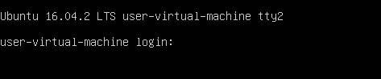

Вместо hostname будет имя системы, которое указали при установке, tty2 — номер виртуального терминала.
После успешной регистрации в системе выдается приглашение вида user@host~$, где user — регистрационное имя, host — имя системы, заданное при установке, а символ ~ — домашний каталог пользователя. Такая подсказка (или приглашение) означает, что запущен интерпретатор команд и далее можно вводить имена системных утилит и запускать другие команды.

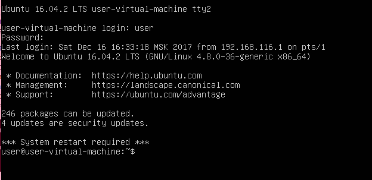

По умолчанию в системе существует 6 виртуальных терминалов, переключаться между которыми можно с помощью комбинации клавиш <Alt>+F1 …. <Alt>+F6. При регистрации номер виртуального терминала указан в системном приглашении как ttyN, где N=1..6. Для возврата в графический интерфейс используйте <Alt>+F7.
Еще одна полезная консольная комбинация клавиш — Shift-PgUP/Shift-PgDN позволяет прокручивать текст на консоли постранично. (Обратите внимание, что работать будут только кнопки PgUp и PgDn, не совмещенные с цифровой клавиатурой. Даже если Num Lock выключен, PgUp/9 и PgDn/3 не заработают).

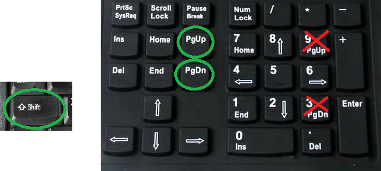

Это бывает необходимо, например, когда текст ошибки появился на консоли и тут же исчез за границами экрана.
Чтобы запустить терминальную сессию с командным интерпретатором из графического интерфейса, можно использовать приложение «Терминал», которое мы запускали в предыдущем примере с Unity. Это эмулятор терминала. Термин «эмулятор» означает, что приложение эмулирует возможности аппаратного терминала определенного типа. Эмулятор поддерживает управляющие последовательности устройства, которые позволяют выводить цветной текст, мигающие символы и переносить курсор. Также эмулируются функциональные клавиши терминала и другие особенности.

### Работа с каталогами в оболочке

Мы получили доступ к интерпретатору команд (в нашем случае эта программа называется bash). Теперь можно вводить имена системных утилит и запускать программы. Далее приведем пример типичной сессии, в которой требуется определенным образом отсортировать большое количество файлов, разложив их по разным каталогам. Мы изучим команды перемещения по файловой системе, создания каталогов и перемещения файлов.
У каждого процесса в Unix есть атрибут, который называется «текущий каталог». Есть такой атрибут и у командного интерпретатора. По умолчанию, если не указывать путь к файлам, все команды будут работать с файлами из текущего каталога. Поэтому для начала определим свое местонахождение в файловой системе, или текущий каталог командного интерпретатора. Его показывает команда pwd, которую мы вводим после приглашения командной строки user@user-virtual-machine:~$. Команда передается на исполнение только после ввода <Enter>, до этого момента ее можно редактировать, перемещать курсор стрелками, а также использовать <Backspace> для корректировки ввода. Затем команда выводит результат и завершает работу, после чего на новой строке вновь появляется приглашение.

```bash
user@user-virtual-machine:~$ pwd
/home/user
user@user-virtual-machine:~ 
```

В UNIX используется иерархическая файловая система. Самый верхний уровень иерархии — / (корневой каталог). В корневом каталоге есть подкаталог home, в котором, в свою очередь, подкаталог user, служащий домашним каталогом пользователя user, от имени которого выполняется сессия. /home/user задает так называемый полный путь домашнего каталога, то есть путь, начинающийся с корневого каталога. Еще есть относительный путь, который задает путь относительно текущего каталога. В системной подсказке user@user-virtual-machine:~$ используется один из вариантов относительного пути, где символ тильда (~) обозначает домашний каталог пользователя. Теперь изменим текущий каталог, переместившись на уровень выше, в каталог /home с помощью команды cd (Change Directory):

```bash
user@user-virtual-machine:~$ cd ..
user@user-virtual-machine:/home$
```

Параметр команды cd — каталог, куда мы желаем попасть, новый текущий каталог. Можно было использовать полный путь, набрав cd /home, но мы использовали еще один вариант относительного пути, в котором двоеточие означает вышестоящий в иерархии каталог, который также называют родительским. Как видим, текущий каталог приглашения интерпретатора также изменился. Теперь вернемся обратно в домашний каталог, используя относительный путь:

```bash
user@user-virtual-machine:~$ cd user
user@user-virtual-machine:~
```

Того же результата мы могли добиться командами `cd /home/user`, `cd ~` или просто `cd` без параметров.
Теперь исследуем домашний каталог с помощью команды ls (LiSt):

```bash
user@user-virtual-machine:~$ ls
examples.desktop  Документы  Изображения  Общедоступные  Шаблоны
Видео         	Загрузки   Музыка       Рабочий стол
```

По умолчанию ls показывает текущий каталог, однако можно задать любой интересующий нас каталог как параметр команды. В примере часть файлов показывается синим цветом: на самом деле это не файлы, а каталоги. Выделение каталогов синим — особенности настройки команды в данной системе, в других Linux/UNIX или в другом терминале все может быть по-другому, поэтому, чтобы наверняка знать, где файл, а где каталог, используйте ls c опцией -l:

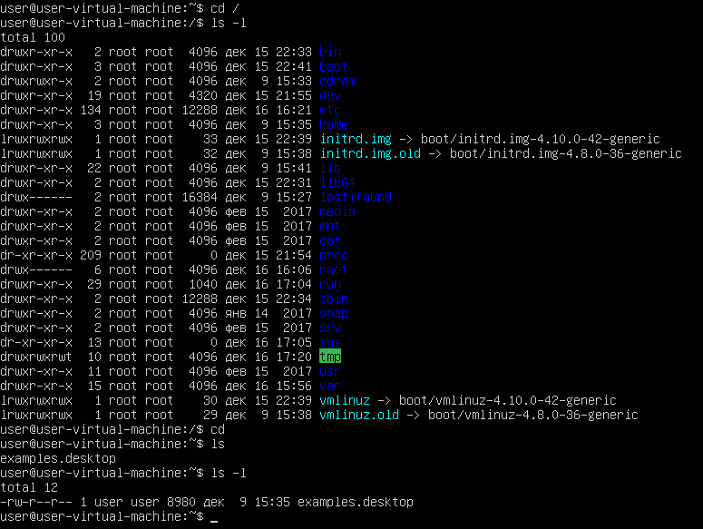

Команда выводит много информации о файлах текущего каталога. Запомните, что если первый символ строки листинга — прочерк «-», это обычный файл. Каталоги отмечены буквой «d» в первой позиции. В этом списке не все файлы. По традиции, файлы, имя которых начинается с точки по умолчанию команда ls не показывает. Обычно это служебные файлы, о них поговорим позже. Чтобы увидеть все файлы каталога, нужна опция -a:

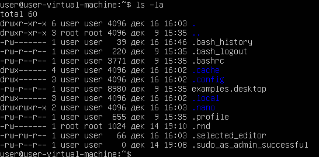

Обратите внимание на файлы c именами «.» и «..». С последним мы уже сталкивались, это ссылка на родительский каталог. А «.» обозначает специальное имя для текущего каталога. Это путевое имя можно использовать в командах.
Например, для запуска программы c именем myprog, если она находится в текущем каталоге, можно набрать `./myprog`. Кроме того, скрытые файлы в Linux (и других UNIX-подобных операционных системах начинаются с точки) имеют имена, первым символом которых является точка. На картинке выше мы видим такие примеры: .bashrc и .profile. Команда ls их не отображает по умолчанию, но команда `ls -la` отобразит в том числе и скрытые файлы. Команда `ls -lA` отобразит файлы, в том числе и скрытые, но не покажет «.» и «..»

### Практическая задача по перемещению файлов.

Теперь рассмотрим практическую задачу. В каталоге `~/My best photos` находится большое количество файлов с именами вида `IMG_YYYYMMNN.jpg` где YYYY числовое 4-х значное значение, представляющее год, MM-месяц, NN-порядковый номер фотографии. Например, мы их скопировали с флешки. Необходимо создать 2-уровневую структуру подкаталогов вида `YYYY/MM` и переместить в них соответствующие файлы. Перед началом работ требуется создать резервную копию `My best photos`.
Резервную копию создаем командой cp (CoPy):

```bash
user@user-virtual-machine:~$ cp -R My\ best\ photos/ My\ best\ photos.bak
```

Опция `-R` предназначена для рекурсивного копирования каталогов. Если внутри содержатся подкаталоги, они также будут скопированы. Обратите внимание на символы «\» перед пробелами в имени каталога. Они необходимы, т.к. пробел используется для разделения параметров команды, таким образом, имя с пробелами, экранированными обратным слэшем, воспринимается командой как один параметр. Как альтернативу для экранирования пробелов можно использовать имя в кавычках. Сделаем каталог `My best photos` текущим:

```bash
user@user-virtual-machine:~$ cd My\ best\ photos/
user@user-virtual-machine:~/My best photos$
```

Каталоги создаются командой `mkdir`:

```bash
user@user-virtual-machine:~/My best photos$ mkdir 2000/01
mkdir: невозможно создать каталог «2000/01»: Нет такого файла или каталога
user@user-virtual-machine:~/My best photos$
```

Ошибка появилась потому, что для подкаталога 01 отсутствует родительский каталог 2000, поэтому надо заранее создавать каталог 2000 или использовать опцию `mkdir -p` для автоматического создания родительского каталога.
Можно создать несколько каталогов за один вызов команды:

```bash
user@user-virtual-machine:~/My best photos$ mkdir 2000 2001 2002
```

Но есть более быстрый вариант для создания каталогов для годов с 2000 по 2018:

```bash
user@user-virtual-machine:~/My best photos$ mkdir 20{00..18}
```

Командный интерпретатор автоматически раскроет фигурные скобки и подставит вместо последнего параметра все значения: 2000 2001 2002 … 2018.
Фигурные скобки можно использовать с любыми командами, где требуются несколько параметров. Кроме двоеточия, которое позволяет перечислять числовые значения, можно использовать вариант с явным перечислением через запятую, например так:

```bash
mkdir 200{1,2,3,4,5}
```

Аналогично для создания каталогов по месяцам:

```bash
mkdir -p 20{00..18}/{01..12}
```

Теперь для перемещения фотографий в каталоги напишем небольшой цикл с использованием конструкции языка командного интерпретатора (более подробно разберем на следующих занятиях).

```bash
user@user-virtual-machine:~/My best photos$ for i in {2000..2018}
> do
>   for j in {01..12}
>   do
>     mv IMG_$i$j* $i/$j
>   done
> done
```

Каждая строка завершается вводом. Символ `>` в начале строки добавляется командным интерпретатором в знак того что конструкция требует продолжения. Мы использовали 2 вложенных цикла for такого типа:

```bash
for i in {2000...2018} do
… $i ...
done
```

На каждой итерации цикла параметр `i` принимает одно из значений с 2000 по 2018. Чтобы использовать значение параметра в теле цикла, к нему можно обратиться как `$i`. Для перемещения группы файлов за одну операцию используется команда `mv` в форме:

```
mv file1 file2 … fileN dir
```

Все параметры команды, кроме последнего — имена перемещаемых файлов. Последний параметр — каталог назначения. Имена файлов формируются с использованием параметров циклов и специального символа «*»: вместо `IMG_$i$j*` команде `mv` будет передан список всех файлов текущего каталога, которые начинаются с `IMG_YYYYMM`. Каталог назначения формируется на основе значений параметров цикла на данной итерации `$i/$j` YYYY/MM. 
После того, как мы успешно перенесли все файлы в нужные каталоги и убедились, что все правильно, можно удалить резервную копию командой `rm`.

```bash
user@user-virtual-machine:~/My best photos$ rm -rf ~/My\ best\ photos.bak/
```

Опция `-r` говорит, что надо удалить каталог рекурсивно. Опцию `-f` следует использовать с осторожностью, она сообщает команде, что удаление будет без запросов подтверждения. При удалении файлов в командной строке надо помнить, что в этом случае файлы удаляются окончательно без возможности их восстановления из корзины.
Если у вас нет файлов для подобных экспериментов (их можно получить с флешки, смонтировав ее с помощью mount или закопировать по sftp с помощью любого sftp-клиента — FileZilla, Total Commander или FAR, если вы устанавливали openssh), можно сделать заглушки с именами файлов.
Например так:

```bash
touch IMG20{00..18}{00..12}{00..05}.jpg
```

Для проверки переименования можно в каждый файл записать его имя (но стоит понимать, что это не картинка, а просто текстовый файл, названный как картинка и внутри содержащий только оригинальное имя. Сделать это можно так:

```bash
user@user-virtual-machine:~/My best photos$ for i in *.jpg
> do
>  echo $i >$i
> done
```

### Простейшие способы создания файлов

Во многих языках программирования есть команда, с помощью которой можно напечатать на экран строку. Такая команда в оболочке Linux — `echo`. При этом не обязательно обрамлять печатаемую строку в кавычки.

```bash
echo Hello world
```

С помощью этой же команды можно создать простейший текстовый файл.

```bash
echo Hello world > hello.txt
```

Перед этим убедитесь, что вы находитесь в домашней директории.
Если вы установили mc, можно редактировать и создавать файлы с помощью mcedit.
Так, чтобы создать новый файл newfile.txt достаточно набрать:

```bash
mcedit newfile.txt
```

Подсказки в нижней части экрана указывают, какие действия можно сделать. Esc — для выхода, если вы вносили изменения, редактор спросит, сохранять или нет.
Можно создать файл с консольного ввода:

```bash
cat > file2.txt
```

Вы можете вводить строки, нажимая Enter — будет осуществляться ввод следующей строки. 
Чтобы выйти, необходимо послать сигнал конца файла — Ctrl-D (^D). Такой способ может быть удобен при работе с PuTTY, так как вы можете скопировать конфигурационный файл из буфера обмена Windows в создаваемый файл (в пример file2.txt).
Также есть редактор vi, который представляет сложности для начинающих. Одна из самых больших проблем — как из него выйти. Для этого нажмите `:` и наберите `q!` и Enter. А теперь поподробнее.

### Создание и редактирование файлов

Пустой файл можно создать командой:

```bash
$ touch newfile
```

Основная задача `touch` — обновить время последнего изменения файла, которое показывает `ls -l`. Создание пустого файла, если он не существует — приятный бонус команды `touch`.
Но файл можно создать и с помощью редактора. Вызывая редактор с именем файла, вы правите существующий файл или создаете ещё не существующий.
Наиболее часто применяются редакторы:

*   mcedit;
*   vi;
*   nano.

`mcedit` — самый простой редактор для тех, кто привык к Norton Commander.
Правка осуществляется прямо в окне редактирования, доступны команды:

*   Esc — выйти. Спросит, надо ли сохранить, или нет.
*   F2 — сохранить.
*   F3 — начать выделение/закончить выделение.
*   F5 — скопировать выделенный текст.
*   F6 — переместить выделенный текст.
*   F7 — поиск подстроки.
*   F8 — удалить выделенный текст.
*   F9 — меню (доступны копирование в специальный буфер и вставка из него).

Входит в состав mc.

`vi` — непривычный для многих редактор. Обладает двумя режимами работы, команд и редактирования. Чтобы выйти, нужно нажать `:` и затем `q` и `!`
Это классический редактор, который есть в любой UNIX-подобной системе. У vi есть сторонники, и это действительно мощный редактор, но, как уже было сказано, он не является интуитивно понятным и требует минимальной подготовки. Многие начинающие пользователи сталкивались с проблемой, как из него выйти (`:q!`).
Есть ряд причин, по которым необходимо хотя бы минимальное знакомство с vi:

*   vi есть в любом UNIX, nano не слишком распространен в коммерческих системах.
*   возможно, это будет единственный редактор в ситуации, когда вы загрузились c аварийного CD и пытаетесь починить систему.
*   vi незаменим в экстремальных ситуациях, когда система перегружена и реакция на нажатие клавиши может составлять десятки секунд.
*   клавиатурные комбинации из vi можно эффективно использовать для редактирования команд в оболочке и перемещения по истории команд.
*   это правда очень мощная штука, некоторые программисты даже используют ее как IDE.

Главная особенность vi, которая вызывает недоумение у новичков — редактор действует в двух режимах — в режиме просмотра (режим команд) и в режиме редактирования текста. В режиме просмотра нельзя редактировать, в режиме редактирования нельзя перемещать курсор по файлу. Как только вы загружаете редактор, он сразу оказывается в режиме просмотра: вы можете перемещать курсор, искать текст, выполнять перемещения по файлу. Но изменять текст файла вы не можете. Для этого надо переместить курсор в нужную позицию и использовать одну из команд, переводящих vi в режим редактирования (например `i` для ввода с позиции курсора). Когда потребуется снова переместить курсор, надо опять сменить режим vi с редактирования на просмотр (клавишей `ESC`) и использовать клавиши перемещения: стрелки или (стрелки в терминале могут не работать) их буквенные аналоги — j, k,h,l (вниз, вверх, влево, вправо). Потом опять редактирование, вновь перемещение и т. д. Когда вы закончили работу, надо сохранить файл. Для этого в режиме просмотра надо набрать: `:w <filename> <ENTER>` filename и имя файла, где будут сохранены изменения. Если у файла уже есть имя, можно не указывать filename. Для выхода из vi набрать в режиме просмотра: `:q`. Если надо выйти без сохранения изменений - `:q!`

`nano` — более простой редактор, но его необходимо поставить самостоятельно.
В nano нет разделения на редактирование и просмотр, что более привычно для пользователей Windows. Кроме того, внизу экрана есть 2 справочные строки с самыми важными командами редактора. У nano все команды начинаются со значка ^, что означает клавишу Control.
Например:

*   ^X (т.е. Ctrl-X) или F2 — выйти из nano (спросит, сохранить ли файл).
*   ^O (т.е. Ctrl-O) или F3 — записать файл на диск (спросит, под каким именем сохранить. По умолчанию будет указано то, которое было при запуске, но его можно изменить).
*   ^W (т.е. Ctrl-W) или F6 — поиск с регулярным выражением (с ними мы еще познакомимся).

### Вспомогательные клавиши для эффективной работы в командной строке

При работе в командном интерпретаторе bash есть несколько комбинаций клавиш, позволяющих существенно облегчить работу. Например, в параметрах команд можно не набирать имена существующих файлов или каталогов целиком, достаточно набрать их начало и нажать клавишу табуляции.

```bash
user@user-virtual-machine:~$ cd ~/My<TAB>
```

Дальше bash выполнит поиск среди файлов с таким началом и в случае однозначного совпадения имя будет сразу дополнено:

```bash
user@user-virtual-machine:~$ cd ~/My\ best\ photos/
```

Если найденных вариантов несколько, они все будут показаны:

```bash
user@user-virtual-machine:~/My best photos$ ls 20<TAB>
2000/ 2002/ 2004/ 2006/ 2008/ 2010/ 2012/ 2014/
2001/ 2003/ 2005/ 2007/ 2009/ 2011/ 2013/
user@user-virtual-machine:~/My best photos$ ls 20
```

Можно продолжить набор, сократив количество вариантов:

```bash
user@user-virtual-machine:~/My best photos$ ls 201<TAB>
2010/ 2011/ 2012/ 2013/ 2014/
user@user-virtual-machine:~/My best photos$ ls 201
```

И так далее.
Аналогично работает автодополнение по именам команд:

```bash
user@user-virtual-machine:~/My best photos$ ma<TAB>
mail-lock make-ssl-cert manpath
mawk mail-touchlock man mapfile mail-unlock
mandb mapscrn make manhole mattrib
user@user-virtual-machine:~/My best photos$ ma
```

Кроме автодополнения существует возможность повторять ранее набранные команды с помощью стрелочек вверх-вниз на клавиатуре. Это называется историей или стеком команд.
Можно выполнять поиск по истории команд с помощью комбинации Ctrl-R (поиск назад):

```bash
(reverse-i-search)`':
```

Введите строку поиска и если в истории команд была команда с такой подстрокой, она будет найдена и подставлена.

```bash
(reverse-i-search)`cd': cd ~/My\ best\ photos/
```

Можно нажать Enter для немедленного выполнения команды или `<ESC>`, чтобы найденную команду можно было отредактировать.
Кроме того, существуют команды для быстрого перемещения по командной строке и быстрого удаления текста:

*   Ctrl-A — в начало строки.
*   Ctrl-E — в конец строки.
*   Alt-F — на слово вперед.
*   Alt-B — на слово назад.
*   Ctrl-U — удалить в строке все символы от текущей позиции до начала строки.
*   Ctrl-K — удалить в строке все символы от текущей позиции до конца строки.

И еще четыре важных для работы в терминале комбинации:

*   Ctrl-S остановит вывод на терминал. Иногда комбинацию используют при выводе больших объемов текста на терминал для временной остановки вывода. Бывает, что эту комбинацию нажимают случайно и тогда терминал как будто зависает. Не спешите паниковать, просто выполните следующую комбинацию.
*   Ctrl-Q продолжает вывод после Ctrl-S. Если кажется, что терминал завис, в первую очередь попробуйте эту комбинацию.
*   Ctrl-C завершает работу текущей программы. Используют, когда надо быстро завершить работу текущей программы или скрипта. Программа не всегда может завершиться после Ctrl-C: иногда реакцию на эту комбинацию в программе или скрипте намеренно блокируют.
*   Ctrl-R — для поиска по истории команд.

Если на первых порах работать с командной строкой в терминале тяжело, можно установить консольный файловый менеджер — mc (Midnight Commander). Это файловый менеджер для текстовых терминалов с текстовыми окнами, меню и поддержкой функциональных клавиш. Кроме того, mc содержит простой и удобный редактор для текстовых файлов — mcedit. Работа в mc не требует дополнительного обучения. Единственная тонкость может быть связана с поддержкой функциональных клавиш в разных моделях терминалов. Если функциональные клавиши не работают, используйте комбинации вида `<ESC>1` вместо F1, `<ESC>2` вместо F2 и так далее.

## Встроенная документация. Команды man, apropos

На прошлом занятии мы уже касались поиска информации о нужной программе. Разберем более подробно возможности работы с документацией.
В Unix существует встроенная система документации, обратившись к которой, всегда можно найти название нужной утилиты, описание параметра команды или пример ее использования. Например, если требуется подробное описание команды cp, используем команду man (от MANual).

```bash
user@user-virtual-machine:~$ man cp
```

Справка по командам обычно занимает несколько страниц, поэтому man использует для просмотра команду less. Для перехода к следующей странице используйте клавишу `<PgDn>`, обратно — `<PgUp>`. Если эти клавиши не срабатывают, используйте для перехода пробел и клавишу u соответственно. Для выхода из man служит клавиша q. Есть еще пара полезных клавиш: g — переход в начало, G — в конец документа. Для поиска вперед используйте `/чтоискать`, для обратного поиска — `?что искать`, повторить поиск в том же направлении — n.
Теперь пара слов о стандартных разделах справочной страницы.
`NAME` — краткое описание команды.
Раздел `SYNOPSYS` описывает различные варианты синтаксиса. В этом разделе могут использоваться специальные обозначения. Например, если опции или параметры заключены в квадратные скобки, это означает, что они не обязательны для использования. Троеточие после параметра говорит, что он может повторяться многократно, как в случае, когда несколько файлов копируются в один каталог назначения.
В разделе `DESCRIPTION` описываются опции (иногда их называют ключами) программы. Бывает, что в описании через запятую перечислены 2 опции, например `-v, --verbose`. В таких случаях мы имеем дело с разными стилями одной опции. `-v` — классический вариант, описанный в стандарте POSIX. `--verbose` — опция в стиле GNU, новомодный вариант. Можно использовать то, что больше нравится.
Еще один полезный раздел обычно находится в конце справочной странице, он называется `SEE ALSO`. Как правило, здесь приводят ссылки на другие утилиты с похожим функционалом.
Кроме man есть еще несколько полезных справочных утилит. Если мы не знаем точного имени утилиты, можно попробовать найти ее с помощью apropos, которая выполнит поиск по ключевым словам в описании утилит. Например найдем как называется утилита, которая меняет пароль пользователя:

```bash
user@user-virtual-machine:~$ apropos password
apg (1) - generates several random passwords
chage (1) - change user password expiry information
chgpasswd (8) - update group passwords in batch mode
chpasswd (8) - update passwords in batch mode
cpgr (8) - copy with locking the given file to the password or g..
cppw (8) - copy with locking the given file to the password or g..
cracklib-check (8) - Check passwords using libcrack2
create-cracklib-dict (8) - Check passwords using libcrack2
crypt (3) - password and data encryption [...]
```

Мы получили нужную информацию, но слишком много вариантов — на 3 страницы текста.
Попробуем уточнить поиск, выбрав все строчки, где встречается слово change. Используем утилиту grep, которая ищет по заданной строке в выводе от предыдущей программы. Делается это так:

```bash
user@user-virtual-machine:~$ apropos password | grep change
chage (1) - change user password expiry information
lppasswd (1) - add, change, or delete digest passwords.
passwd (1) - change user password
smbpasswd (8) - change a user's SMB password
```

Вот она, `passwd` — то, что нужно. Обратите внимание на число в скобках после имени команды. Это глава или раздел справочного руководства man, в которых может встречаться описание утилиты. Разделов много, приведем самые полезные:

*   1 — команды пользователя,
*   2 — системные вызовы ядра (используется программистами),
*   5 — форматы файлов,
*   8 — команды администрирования.

Эти номера можно использовать в командах man и apropos. Например, passwd — не только команда, но и имя системного файла. Если нам интересен формат этого файла, надо набрать:

```bash
man 5 passwd
```

Для apropos полезна опция `-s`. Например, если мы ищем программы для работы с паролями, набираем:

```bash
user@user-virtual-machine:~$ apropos -s 1 passwd
gpasswd (1) - управление /etc/group и /etc/gshadow
passwd (1) - изменяет пароль пользователя
grub-mkpasswd-pbkdf2 (1) - generate hashed password for GRUB
lppasswd (1) - add, change, or delete digest passwords.
passwd (1ssl) - compute password hashes
user@user-virtual-machine:~
```

Описание passwd — по-русски. Иногда это может создать проблемы для поиска, поэтому есть еще полезная опция, `-L`, она задает язык, на котором будет справка. Чтобы все искать и читать по-английски, задаем `apropos -s 1 -L C passwd`.

```bash
user@user-virtual-machine:~$ apropos -s 1 -L C passwd
gpasswd (1) - administer /etc/group and /etc/gshadow
grub-mkpasswd-pbkdf2 (1) - generate hashed password for GRUB
lppasswd (1) - add, change, or delete digest passwords.
passwd (1) - change user password
passwd (1ssl) - compute password hashes
user@user-virtual-machine:~
```

Еще одна полезная справочная программа — `whatis`. От apropos отличается тем, что ищет по именам команд:

```bash
user@user-virtual-machine:~$ whatis passwd
passwd (5) - файл паролей
passwd (1) - изменяет пароль пользователя
passwd (1ssl) - compute password hashes
```

Иногда в разделе справочной страницы `SEE ALSO` встречается ссылка на более полное описание утилиты в системе info и проводится команда для получения полной справки. Пример для cp:

```
info coreutils 'cp invocation'
```

Info — гипертекстовая система документации вроде текстового браузера, а команда в man содержит полную ссылку на информацию о вызове команды в info. Если запустить info без параметров, мы выйдем на главную страницу документации. Перемещение по страницам и поиск как в man. Строчки, которые начинаются со звездочек, — гиперссылки, по которым можно пойти дальше. Чтобы вернуться из ссылки на уровень выше, используйте клавишу u как Back в браузере. Выход — по клавише q.

## Процессы, потоки, потоки ядра

Современные операционные системы состоят из как минимум двух сильно отличающихся по своим возможностям частей — ядро, работающее в пространстве ядра, и на уровне режима работы процессора взаимодействующее с оборудованием и ресурсами, и пользовательское пространство, работающее в уровне ядра, и на уровне режима работы процессора ограниченное в доступе к ресурсам. Попытки обратиться к не разрешенным ресурсам приводят к вызову процессором исключения и передачи управления ядру операционной системы.
Так как Linux — система многозадачная, существует три возможности реализации многозадачности, одна — для ядра, и два — для пользовательского пространства. 
Для ядра это потоки (иногда говорят процессы) ядра.
Для пользовательского пространства это процесс и потоки. В Linux потоки также являются особого рода процессами (так они тоже имеют собственные PID), но при этом они делят одну и ту же память процесса, которому они принадлежат (первый созданный процесс, фактически первый поток процесса). При создании копии процесса (fork) происходит копирование его ресурсов, так что это более безопасно, но менее эффективно.
Каждый процесс, кроме упомянутых UID и GID, также имеет идентификаторы PID (process ID) и PPID (parent process ID).
Перечень процессов можно посмотреть с помощью команды:

```bash
$ ps aux
```

ps отображает процессы пользовательского пространства и потоки ядра (отображаются в квадратных скобках). Потоки не отображаются Чтобы посмотреть потоки, используйте ключ `-T`, если хотите посмотреть потоки конкретного процесса, используйте ключ `-p`

```bash
$ ps -T -p 4242
```

Чтобы посмотреть историю запущенных процессов, можно воспользоваться командой:

```bash
$ pstree
```

Существуют и другие способы мониторинга процессов: `top` и `htop` — обязательно ознакомьтесь с ними!
Консольная утилита top служит для динамического просмотра списка процессов. Утилита каждые несколько секунд выдает топ-20 процессов, по умолчанию отсортированный по потреблению процессорного времени. Можно сортировать список процессов по объёму занимаемой памяти, утилизации процессора, пользователям или номерам процессов.

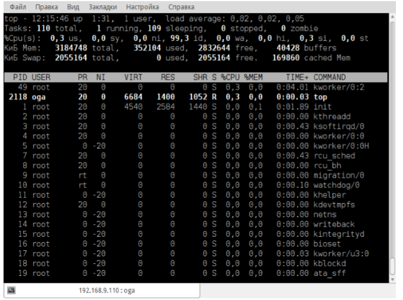

top имеет горячие клавиши:

*   `h` — вызов справки.
*   `k` — ввести PID для команды kill.
*   `r` — указать PID для изменения параметра nice, влияющий на приоритет процесса ( -20 макс. приоритет, 19 мин. приоритет, 0 — по умолчанию). Обычный пользователь может только уменьшать приоритет своих процессов, назначая им nice от 0 до 19.
*   `q` — завершить top.

Существует более продвинутая консольная утилита для мониторинга и управления процессами — `htop`. Она не установлена по умолчанию, но доступна из репозитория Ubuntu. Перечислим её возможности в сравнении с top:

*   позволяет выполнять горизонтальный и вертикальный скроллинг, что позволяет видеть все процессы и параметры командной строки;
*   htop запускается быстрее top, который предварительно собирает данные перед тем как показать список процессов;
*   в htop не надо вводить PID для kill как в top, все через скроллинг и функциональные клавиши;
*   также нет необходимости вводить PID и значение nice;
*   в htop поддерживается мышь;
*   top идет в системе по умолчанию и более распространен в мире UNIX.

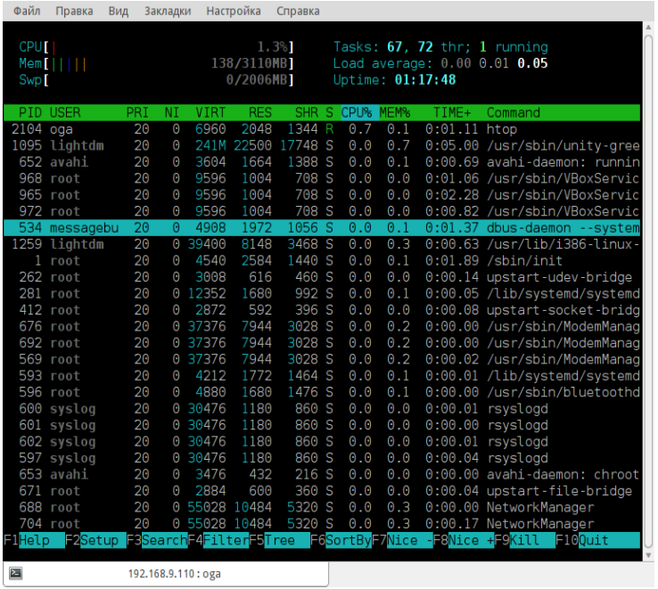

Для мониторинга ресурсов и управления процессами в графической среде Unity служит программа «Системный монитор». Для запуска найдем её в Главном меню Dash по строке System Monitor. Управление процессами интуитивно понятно. Меню «Вид» позволяет выбрать процессы пользователя или посмотреть все запущенные процессы.

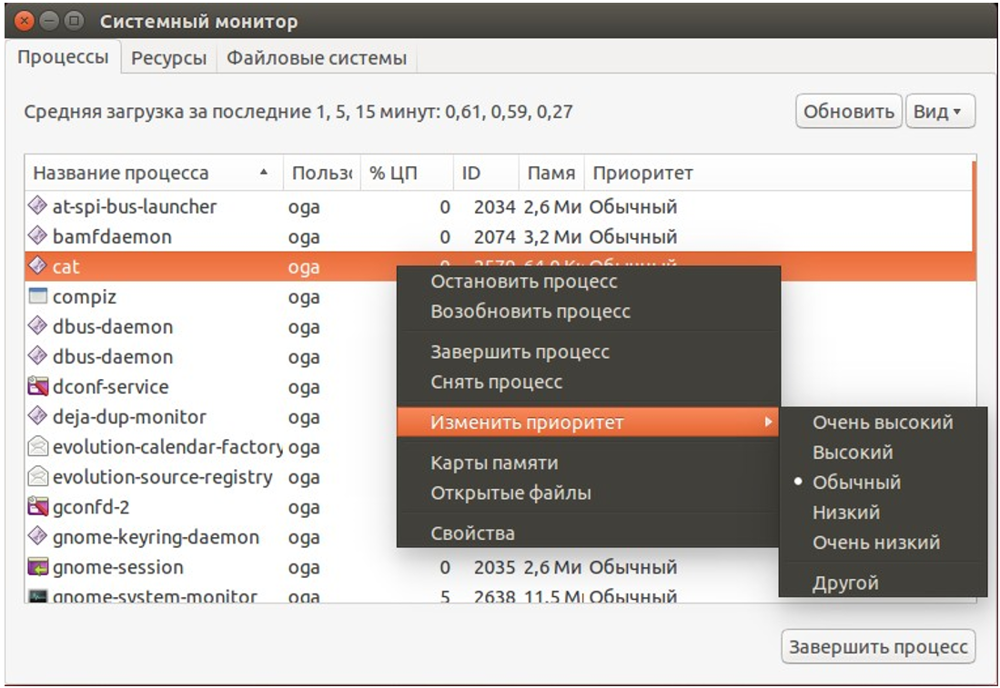

### Порядок запуска процесса

Рассмотрим порядок запуска процесса. Например, работая в оболочке, мы запустили команду ls.

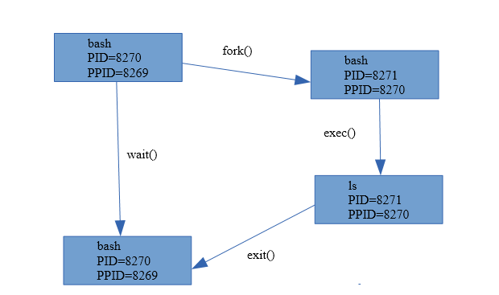

На первом этапе оболочка выполняет системный вызов `fork()`, в результате которого происходит ее клонирование: создается полная копия процесса оболочки, включая копию адресного пространства и контекста. Между клонами есть отличие: в процессе-родителе `fork()` возвращает PID потомка, а в потомке код возврата — 0. Каждый из клонов начинает выполнение с момента вызова fork, но уже самостоятельно и с учетом вышесказанного. Итак, потомок, выяснив, что он потомок (так как код возврата 0) с помощью системного вызова `exec` загружает в свое адресное пространство исполняемый код запускаемой программы, в нашем случае ls, и далее ее выполняет.
В это же время родительский процесс ожидает завершение дочернего процесса с помощью системного вызова `wait()`. Если мы запустили команду с `&` в конце, ожидания не будет.
Дочерний процесс завершается функцией `exit()`. В случае успешного завершения, exit возвращает 0, если произошла ошибка — код ошибки, отличный от нуля. После этого ядро освобождает ресурсы, которые занимал потомок, и передает код его завершения родителю в качестве кода возврата для `wait()`. 
Иногда бывает так, что процесс-родитель прекращает существование, не успев дождаться завершения `wait()`, то есть раньше завершения потомка. Процесс, у которого процесс-родитель завершился раньше) называют процессом-сиротой. Процессы-сироты усыновляет процесс init, который теперь считается для них родителем.

### Сигналы процессам

Допустим, программа зависла. Нажимаем Alt-F2 (или Ctrl-Alt-F2, если работали в X-сервер), смотрим id процесса.

```bash
$ ps ax | grep hello
```

Процессу можно направить сигнал. 
Например, 9 сигнал – принудительно снять.

```bash
$ kill -9 4242
```

В Linux существуют следующие сигналы:

*   `1 (SIGHUP)` — информирует программу о потери связи с терминалом. Ситуация часто возникала в прошлом, в режиме терминального доступа. В настоящее время может применяться для двух целей:
    *   Информирование дочернего процесса о завершении родительского. При завершении родительского процесса ядро направит сигнал 1 дочерним процессам.
        *   Если приложение запущено в фоновом режиме, с помощью указания `&` в конце команды или `fg`, при завершении консоли получит сигнал SIGHUP и программа, исполняющаяся в фоновом режиме, если была запущена таким образом.
            ```bash
            $ someprogram&
            ```
        *   либо
            ```bash
            $ someprogram
            ^Z
            $ fg
            ```
        *   Этому можно воспрепятствовать с указанием nohup.
            ```bash
            $ nohup someprogram&
            ```
    *   Очевидно, что по умолчанию сигнал приводит к завершению программы. Но демоны перехватывают данный сигнал и используют для перечитывания файлов конфигурации.
*   `2 (SIGINT)` формируется при нажатии Ctrl-C. Завершает программу, но может перехватываться или блокироваться (например, в программах, в которых Ctrl-C используются для операции «копирование» или в принципе нет необходимости такого варианта остановки).
*   `8 (SIGFPE)` — ошибка операции с целочисленной арифметикой (переполнение, деление на ноль). Сохраняется дамп памяти.
*   `9 (SIGKILL)` — безусловное завершение программы. Сигнал не может быть перехвачен программой, потому позволяет её остановить в любом случае (но не позволит снять процесс-зомби).
*   `11 (SIGSEGV)` — формируется при попытке программы обратиться к не принадлежащей ей области памяти. Обычно выводится сообщение «Segmentation fault» и сохраняется дамп памяти. Как правило, такое случается в результате ошибок программиста при работе с указателями.
*   `15 (SIGTERM)` — вежливая просьба программе завершить работу. Программа может сохранить данные и т.д.
*   Есть и другие варианты.

Для отправки сигнала из операционной системы можно использовать команду `kill`.

```bash
$ kill -15 4242
```

## Перенаправление потоков ввода-вывода

Далее мы познакомимся с подходом UNIX-Way, одним из принципов которого является то, что каждая программа хорошо отлажена и решает только одну задачу, но сами программы-утилиты можно комбинировать, что очень часто применяется. Сейчас мы разберем, каким образом это работает.
При запуске каждая программа автоматически открывает 3 специальных файла, которые ещё называют потоками ввода-вывода. Их различают по номерам файловых дескрипторов (указателей на файл):

*   0 — стандартный ввод (stdin). По умолчанию принимается с клавиатуры терминала.
*   1 — стандартный вывод (stdout). По умолчанию — на экран терминала.
*   2 — стандартная ошибка (stderr). По умолчанию — на экран терминала.

Поток стандартного вывода можно перенаправить в файл (в том числе специальный, такой как принтер или файл «в никуда» `/dev/null`). Стандартный ввод программе можно назначить не с клавиатуры, а из файла. Опишем все варианты перенаправления для каждого потока:
Для `stdout` от программы `cmd` можно использовать символы перенаправления:

*   `cmd > file` перенаправить в файл с перезаписью (при каждой записи предыдущее содержимое файла будет утрачено),
*   `cmd >>file` в файл с добавлением (новые записи будут добавлены в конец файла),
*   `cmd1 | cmd2` — конвейер. Запускаются `cmd1` и `cmd2`, при этом `stdout` от `cmd1` перенаправляется на `stdin` программы `cmd2`,
*   `cmd | tee file` — перенаправить копию потока в файл. После `tee` c потоком `stdout` можно выполнять дополнительные операции,
*   `cmd | sudo tee file` — вариант, если в `file` имеет возможность записать только root.

Для `stdin` программы `cmd` можно использовать символы перенаправления:

*   `cmd < file` перенаправить ввод из файла программе.

Для `stderr` от программы `cmd` можно использовать символы перенаправления:

*   `cmd 2> file` перенаправить в файл с перезаписью;
*   `cmd 2>>file` в файл с добавлением;
*   `cmd1 2>&1` — присоединить к `stdout`;
*   После операций с потоком `stderr` можно выполнять дальнейшее перенаправление для `stdout`.

Пример:

```bash
cmd 2> /dev/null | tee f1 f2 f3
```

Перенаправить поток ошибок в `/dev/null` (спрятать поток), поток стандартного вывода на вход программе `tee`, которая дублирует его в файлы `f1`, `f2`, `f3`.

```bash
cmd < f1 | cmd2 2>&1 > f2
```

Направить программе `cmd` ввод из файла `f1`. затем стандартный вывод `cmd` направить на вход `cmd2`. Объединить поток ошибок от `cmd2` со стандартным выводом от `cmd2` и все перенаправить в `f2`.
Создать файл.

*   `>file1` — самый простой способ создать пустой файл;
*   `cat >file1` ввести файл с консоли (завершение Ctrl-Z).

## Архиваторы и компрессоры в Linux

Наверняка вы использовали в Windows программы-архиваторы (rar и zip), которые позволяют упаковать иерархию каталогов c файлами в один сжатый архивный файл. В Linux тоже есть версии этих архиваторов, которыми можно распаковать архивы, созданные пользователями Windows. Также есть графические программы-оболочки, облегчающие пользователям работу с архивами. Но сейчас мы поговорим о других программах из мира UNIX, которые появились задолго до своих Windows-собратьев. Чем же они уникальны? 
Во-первых, есть различие в терминах. Архиваторами в UNIX и Windows называют программы, немного отличающиеся по назначению. В UNIX архиваторы выполняют следующие задачи:

*   создавать архивы как объединения заданных файлов в виде одного обычного или последовательности данных на внешнем носителе (диск, лента и т. д.),
*   добавлять в архив или извлекать из него отдельные файлы или группы файлов.

В Windows архиваторы делают то же что в UNIX, плюс дополнительно занимаются сжатием архивов. В UNIX сжатием занимаются отдельные утилиты, называемые компрессорами. Такое разделение функций является характерным для философии unixway: каждой задаче — свой продвинутый инструмент, плюс комбинация разных инструментов для решения новых задач. Подход оказался оправданным, он позволяет использовать новые, более мощные компрессоры в сочетании со старыми архиваторами. Кроме того, подход позволяет с помощью конвейеров добавлять в рабочую цепочку архиватор-компрессор другие программы, например, для шифрования данных, что очень актуально для хранения архивов на популярных облачных сервисах. Далее рассмотрим конкретные примеры программ для архивации и сжатия файлов.
В UNIX с давних времен существуют две стандартные программы-архиватора: `tar` и `cpio`. В Linux также есть GNU-версии этих утилит. Они имеют свои уникальные опции с длинными именами, но для совместимости поддерживают стандартный набор ключей. При рассмотрении мы будем стараться придерживаться стандарта, чтобы вы могли использовать утилиты в любой UNIX-системе.

### Утилита tar (Tape ARchiver)

Судя по названию, предназначалась для создания архивах на магнитных лентах, но также прекрасно работает с архивами в виде файлов. Имеет три основных варианта использования:

#### Создание архивов с tar

```
tar опции arc_file file_or_dirname ...
```

где опции имеют следующее значение:

*   `с` — создать архив.
*   `z` — сжимать файл архива с помощью gzip (см. ниже). Эта опция есть только в GNU-версии.
*   `j` — сжимать файл архива с помощью bzip2 (см. ниже). Эта опция есть только в GNU-версии.
*   `v` — (verbose) выдает в терминал имя добавляемого файла. Когда файлов много, обычно эту опцию не указывают и tar работает молча.
*   `f` — после этой опции указывают имя архивного файла. Часто используют специальное имя «-», которое означает что поток данных архива надо выдать в стандартный выходной поток. В этом режиме обычно используют конвейерную обработку, когда данные архиватора принимаются компрессором для последующего сжатия. Если забыть указать файл после -f, tar будет пытаться писать на ленточное устройство по умолчанию.
*   `file_or_dirname` — список архивируемых файлов или каталогов. Каталоги архивируются рекурсивно вместе со всем содержимым.

Пример:

```bash
tar cf foo.tar ~/foo
```

#### Просмотр оглавления архива

```
tar tvf arc_file
```

`t` — прочитать оглавление архива. Остальные опции как в случае создания архива. Пример:

```bash
tar tvf foo.tar
```

#### Извлечь файлы из архива

```
tar xvf arc_file [filename]
```

`x` — извлечь файл(ы). Если последний параметр не указывать, будут извлечены все файлы из архива в текущий каталог. Имена извлекаемых файлов надо указывать, так как они показаны в листинге оглавления архива (с тем же относительным путём).

### Компрессоры

В UNIX и Linux семейство компрессоров представлено сразу несколькими программами: `compress`, `gzip`, `bzip2`. Они используют разные алгоритмы сжатия и в разной степени эффективны. Каждый компрессор включает в себя три утилиты: утилита сжатия (`compress`, `gzip`, `bzip2`), утилита декомпрессии (`uncompress`, `gunzip`, `bunzip2`, ) и ещё одна утилита декомпрессии, которая по умолчанию выдаёт результат в стандартный вывод. Утилиты разных компрессоров имеют унифицированный интерфейс, так что нет необходимости запоминать ключи для каждого компрессора отдельно.

#### gzip

`gzip` — это GNU-версия программы compress, созданная, чтобы избежать патентных ограничений. Ключи у gzip такие же, как у compress. Дополнительно есть полезная опция, задающая с помощью числового значения от 1 до 9 степень сжатия. Это позволяет управлять соотношением сжатие/время в зависимости от потребностей, например можно задать -5 для больших файлов и выиграть на времени исполнения при достаточной степени сжатия. Суффиксы сжатых файлов, которые добавляет gzip — `.gz`. Для декомпрессии есть утилиты `gunzip` и `gzcat`, аналогичные `uncompress` и `zcat`. `gunzip` ищет файлы с суффиксами `.gz` и `.Z`, `.z`, `tgz`, `taz`.

```
gzip [ключи] [файл]...
```

*   `-с` — направляет результат в стандартный вывод, исходные файлы не меняются. Обычно для использования совместно с архиватором.
*   `-d` — выполнить декомпрессию указанных файлов.

Без ключей `gzip` выполняет сжатие каждого файла из заданного списка и записывает результат в новый файл, добавляя к имени суффикс `.gz`. Исходные несжатые файлы удаляются.
Пример использования совместно с архиватором:

```bash
tar cf - ./data | gzip -c > data.tar.gz
```

#### gunzip

Декомпрессия с `gunzip`:

```
gunzip [файл]...
```

Выполняет декомпрессию файлов из списка, если надо, добавляя к именам суффикс `gz`. Разархивированный файл записывается с именем без `.gz`. Исходный сжатый файл удаляется.

#### zcat

Декомпрессия с выдачей в стандартный вывод `zcat`:

```
zcat [файл]...
```

Этот вариант обычно используют совместно с архиватором для декомпрессии сжатых архивов:

```bash
zcat data.tar.gz | tar xf - 
```

Ещё один популярный компрессор — `bzip2`. Превосходит на большинстве файлов gzip по эффективности сжатия, но проигрывает в скорости. Опции такие же, как у gzip. Расширения архивов — `.bz2`.

## Установка программ в Ubuntu

Самые базовые возможности установки мы разобрали на прошлом уроке. Разберем подробнее.
Большинство пользователей знает, как устанавливаются программы в Windows. Многие новички в Linux страдают от того, что опираются на эти навыки. По большей части, в Linux все делается по-другому. Первое, что мы должны осознать — в Linux всегда существует несколько способов решить одну и ту же проблему. Но это не значит, что какой­-то из этих способов не будет лучше других. Поэтому рассмотрим разные способы установки программ в порядке снижения желательности их использования.

### Ключевые понятия

**Репозиторий** — хранилище пакетов. Обычно он располагается на сервере онлайн, хотя ничто не мешает создать локальный репозиторий или репозиторий на DVD. Под **пакетом** понимают файл `.deb` (в Ubuntu), который содержит в запакованном виде необходимые программные файлы, инсталляционные скрипты и разного рода дополнительную информацию. Его можно сравнить с файлами `.msi` в Windows, хотя и достаточно грубо. Часто для работы ряда программ требуются определенные дополнительные библиотеки. Тогда пакет, требующий для работы новую библиотеку, не установится, пока не появятся необходимые ему для работы пакеты. Это называется **зависимостями**. В Windows также можно иногда заметить что­-то подобное. Например некоторые игры требуют присутствия в системе определенной версии DirectX, то есть они зависят от него. В Linux такая практика является намного более распространенной. Такой подход позволяет существенно уменьшить трафик, а также место на диске, но иногда усложняет сам процесс установки. Также отметим, что `.deb`-пакеты присутствуют в ОС GNU/Linux, основанных на Debian и Ubuntu. В других системах — другие форматы пакетов и утилиты, например в RedHat и Centos — `.rpm`. Но в целом идеи во многом похожие, и, например, в Centos вместо выполнения команды `sudo apt install mc` вы будете выполнять команду `sudo yum install mc`.

### Основной способ установки программ. Использование официальных репозиториев

Самый простой способ установить новую программу в Ubuntu — выбрать пункт меню `Программы > Установить/Удалить`. Дальше выбрать необходимую программу в каталоге, поставить галочку и нажать `Применить`. Все остальное будет сделано автоматически. Система сама загрузит необходимые пакеты из Интернета, установит их и добавит новый пункт в меню. Более простой способ трудно найти.
Если вы хотите иметь больше возможностей влиять на процесс, используйте более продвинутый инструмент —­ `Synaptic`. Выберите `Система > Администрирование > Менеджер пакетов Synaptic` и получите более функциональный инструмент для работы с пакетами. В частности, вы можете устанавливать программы частично, если вам не нужна документация или еще что­-то.

Кроме того, можно использовать и консольные инструменты. Например если вы хотите установить программу для записи дисков Brasero, наберите команду `sudo apt-get install brasero` и она установится.

У такого метода установки программ есть масса преимуществ: это удобно, вы устанавливаете уже протестированные программы, которые гарантированно будут работать на вашей системе, зависимости между пакетами будут решаться автоматически, при появлении в репозитории новых версий установленных программ вас об этом проинформируют.

### Использование сторонних репозиториев

Хотя в официальных репозиториях программ очень много, однако при их использовании могут возникать проблемы. Например, некоторые программы могут присутствовать в уже устаревших версиях, а некоторых просто может не быть. При этом ряд проектов имеет собственные репозитории, такие как Wine, Elisa и др. В таком случае на официальном сайте нужной вам программы должно быть описано, как такие репозитории подключить. После подключения репозитория процесс установки не отличается от уже описанного ранее.

### Непосредственная установка из deb-пакетов

Конечно, всегда можно загрузить готовые `deb-пакеты` с помощью браузера. Существуют порталы с выложенными deb-пакетами программ, такие как `GetDeb.net`. Также можно загружать файлы напрямую с официального сайта нужной вам программы. Скачанные пакеты легко устанавливаются двойным кликом мышки. Минус такого подхода —­ менеджер обновлений не будет отслеживать появление новых версий установленной программы.

Если вам попался пакет `rpm` (для систем типа Fedora, Mandriva, SUSE и т.д.), его можно сконвертировать в `deb` с помощью утилиты `alien` (устанавливается отдельно). Однако делать это рекомендуется лишь в исключительных случаях, когда пакетов deb в доступе нет (например драйверы принтеров Canon на официальном сайте выложены исключительно в rpm).

### Установка программ с собственным инсталлятором

Иногда программы могут распространяться с собственным инсталлятором. Это ничем не отличается от ситуации в Windows. Только здесь, распаковав `tar.gz` архив с дистрибутивом программы, вы вместо `setup.exe` увидите что­-то типа `INSTALL.sh`. Если этот файл не захочет запускаться, вероятно, ему не даны права на запуск. Иногда дистрибутив программы распространяется в виде самораспаковывающегося архива. В таком случае это будет просто один-единственный файл `.sh`, который нужно запустить. Дальше вы получите мастер, где нужно будет ответить на ряд вопросов, так же, как это делается в Windows. Так устанавливаются официальные драйверы nVidia, ATI, среда разработчика NetBeans и т.п.

### Установка программ, которые не нуждаются инсталляции

Есть программы, которые распространяются в виде обычного архива `tar.gz` (часто называются тарболлы), который достаточно куда­-то распаковать. В Windows также есть такие программы, их еще часто называют словом `Portable`. Устанавливать такие программы можно куда­ угодно, но стандартное место — каталог `/opt`. Пункты на запуск в меню вам придется добавлять вручную, для этого нужно щелкнуть правой кнопкой по заголовку меню `Программы` и выбрать `Правка меню`.

### Установка программ из исходных текстов

Обычно следует избегать этого способа установки программ. Но иногда такой способ установки может оказаться единственно доступным. Основное, что понадобится — средства для компиляции, для этого сначала нужно установить пакет `build-essential`. Дальше нужно распаковать архив с кодами программы во временную папку. Потом нужно найти файл `README` или `INSTALL`, прочитать его и выполнить то, что там написано. Чаще установка программ таким способом ограничивается последовательным выполнениям следующих команд:

```bash
./configure
make
sudo make install
```

В некоторых случаях последовательность команд для установки может отличаться. Кроме того, после выполнения скрипта `./configure` вы можете получить сообщение о том, что в системе не установлено нужных библиотек для компиляции программы. В таком случае нужно будет установить их самому и повторить процесс. Обычно процесс компиляции занимает определенное время и напрямую зависит от мощности вашего компьютера.

## Репозитории в UBUNTU

Репозитории — это специальные сервера­-хранилища таких файлов. Их также можно назвать «Источники приложений». Пользовательские компьютеры подключаются к репозиториям по сети или через интернет и при помощи специальных утилит (например Synaptic) позволяют вам увидеть, какие пакеты установлены, какие доступны для установки. Большинство утилит поддерживают простой поиск по ключевым словам и способны разбивать группы пакетов по категориям.

Связка репозиторий-­утилита позволяет использовать централизованный метод установки/удаления программ, а также предоставляет удобный способ выкладывания обновлений.
В Ubuntu уже подключены необходимые репозитории, однако никто не запрещает использовать сторонние репозитории.
В репозиториях Ubuntu содержится достаточно разнообразного ПО, и зачастую вы можете найти там необходимую программу. Только если вы не нашли нужную программу в репозиториях, стоит пробовать другие пути установки.
Версии ПО, доступные через репозитории, не всегда свежие, однако они, как правило, лучше интегрированы в Ubuntu и более стабильны.

### Структура репозитория Ubuntu

В Ubuntu всё программное обеспечение делится на четыре секции, называемые компонентами, чтобы отразить разницу в лицензии и уровне доступной поддержки. Пакеты распределяются по компонентам таким образом:

*   **Main** — свободное ПО, официально поддерживаемое компанией Canonical.
*   **Restricted** — проприетарное ПО (в основном — драйверы устройств), официально поддерживаемое компанией Canonical.
*   **Universe** — свободное ПО, официально не поддерживаемое компанией Canonical, но поддерживаемое сообществом пользователей.
*   **Multiverse** — проприетарное ПО, не поддерживаемое компанией Canonical.

Существует четыре основных репозитория Ubuntu.

*   `$release` — пакеты на момент выхода релиза.
*   `$release-security` — пакеты критических обновлений безопасности.
*   `$release-updates` — пакеты обновления системы (более поздние версии ПО, вышедшие уже после релиза).
*   `$release-backports` — бэкпорты более новых версий ПО, которое доступно только в нестабильных версиях Ubuntu.
*   `partner` — репозиторий, содержащий ПО компаний­ партнеров Canonical.

Кроме официальных, существует множество репозиториев от авторов программ и от тех, кто не поленился собрать из исходников пакет и поделиться им с другими.

### Подключение репозитория

Существует много сторонних репозиториев, подключив которые, вы получите доступ к дополнительному ПО. Сделать это можно как при помощи графического интерфейса, так и в консоли.

Некоторые репозитории, помимо нужных пакетов, могут содержать экспериментальные сборки различного системного ПО, в том числе и ядер Linux. Поскольку версия этих экспериментальных пакетов, как правило, выше, чем установленная, Менеджер обновлений может попытаться «обновить» систему с этих репозиториев, что может повредить её. Поэтому внимательно читайте описание подключаемого репозитория и информацию в Менеджере обновлений.

#### Подключение при помощи графического интерфейса

Для подключения репозитория выполните следующие шаги.

1.  Откройте Центр приложений Ubuntu.
2.  Откройте пункт меню `Правка→Источники приложений…`
    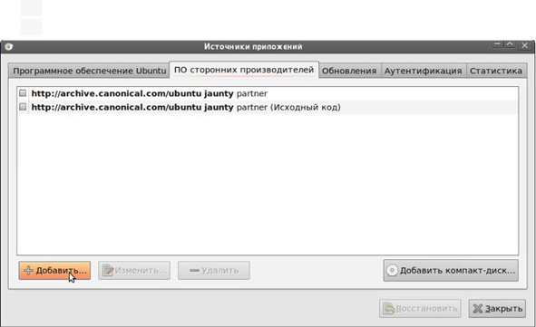
3.  В появившемся окне выберите вкладку «Другое ПО», нажмите кнопку «Добавить».
4.  В появившемся окне заполните поле «Строка APT:» и нажмите кнопку «Добавить источник».
    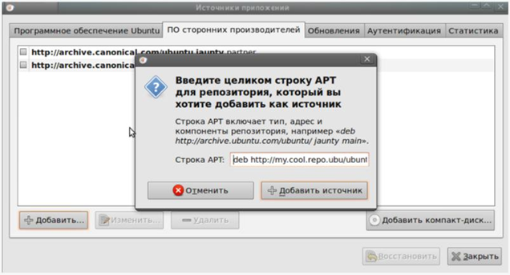

Т.к. был подключен новый источник программного обеспечения, необходимо обновить информацию о пакетах. Появится окно с предложением это сделать. Нажмите «Обновить».

После обновления информации о пакетах окно «Источники приложений» закроется, и, скорее всего, вы получите ошибку о неподписанном источнике приложений, тем не менее, вы сможете устанавливать пакеты, содержащиеся в свежеподключенном репозитории, стандартными средствами. Для устранения ошибки неподписанного репозитория см. пункт про защиту репозиториев ниже.

#### При помощи консоли (рекомендуемый способ)

В современных версиях Ubuntu добавлять репозиторий можно одной командой, вот пример для ppa-­репозитория:

```bash
sudo apt-add-repository ppa:ripps818/coreavc
```

Системный список репозиториев содержится в файле `/etc/apt/sources.list`. Чтобы добавить репозиторий,­ отредактируйте файл так:

```bash
sudo nano /etc/apt/sources.list
```

Добавьте туда APT-строку. Чем «выше» (ближе к началу файла) стоит строка, тем больший приоритет получит добавленный репозиторий.
Далее следует обновить список пакетов. Для этого выполните:

```bash
sudo apt-get update
```

Теперь вы можете устанавливать пакеты из нового репозитория, правда, для комфортной работы нужно импортировать в систему ключ репозитория, т.к. у вас постоянно будет появляться такое предупреждение:

```
W: Ошибка: http://site.com jaunty Release: Следующие подписи не могут быть проверены, так как недоступен открытый ключ: NO_PUBKEY 1234567890ADBD
```

### Устройство репозитория

Пакет (например `*.deb` файл) размещается на общедоступном интернет-ресурсе (например, `archive.ubuntu.com`). Затем информация о пакете заносится в файл `Packages`, который, в свою очередь, для удобства пакуется в `Packages.gz`.
Файлов `Packages.gz` может быть несколько (например, по одному для каждой архитектуры). Файл `Release` содержит описание репозитория в целом и ссылки на различные `Packages.gz`.
Общая схема работы выглядит примерно так:

1.  Пользовательский компьютер подключается к репозиторию, и, при наличии защиты, проверяет его истинность (см. главу Защита репозиториев).
2.  Читает файл `Release`, находит и скачивает необходимые `Packages.gz`.
3.  На основе скачанных `Packages.gz` обновляет локальную базу данных пакетов.
4.  Теперь пользовательский компьютер «знает», где находится тот или иной пакет и при необходимости легко может его скачать и установить.

### Защита репозиториев

Поскольку репозитории большей частью расположены в интернете, существует вероятность подмены их злоумышленником на свои, содержащие модифицированные пакеты. Таким образом, пользователь может установить модифицированный пакет и тем самым поставить безопасность системы под угрозу. Многие репозитории имеют защиту от подмены. Такая защита реализована при помощи сверки цифровых подписей репозитория и клиента. В случае, когда репозиторий имеет цифровую подпись, а пользовательский компьютер содержит открытый ключ для него, такой репозиторий считается доверенным.
В Ubuntu по умолчанию доверенными являются репозитории на установочных дисках и основные интернет-репозитории — `archive.ubuntu.com`. При наличии на пользовательском компьютере нескольких подключенных репозиториев предпочтение отдается доверенным.
При подключении репозитория, защищенного цифровой подписью, вам нужно скачать (обычно с ресурса, рассказывающего про этот репозиторий, или с сервера ключей, что является более предпочтительным в любом случае) открытый ключ и добавить его в систему. Иногда для скачивания предоставляется доступный для установки пакет, который при установке сам прописывает ключ репозитория. Если вы скачиваете ключ с сайта репозитория, вы получите обычный файл с расширением `.key`, `.gpg` или другим. Добавить его в систему можно так:

```bash
sudo apt-key add repo.key
```

`repo.key` — полученный вами ключ репозитория.
Или при помощи графического интерфейса запустите «Источники приложений» (`Система→Администрирование→Источники приложений`), перейдите на вкладку «Аутентификация» и нажмите на кнопку «Импортировать файл ключа…»: ­ откроется диалог выбора файла. Выберите файл ключа и нажмите ОК.

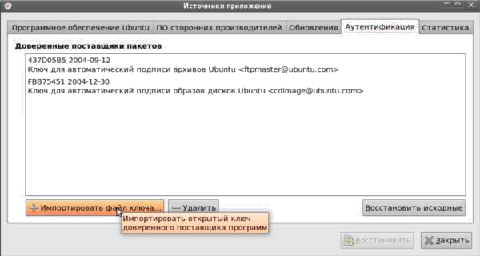

Однако гораздо более предпочтительным является добавление ключа со специального защищённого сервера. Обычно, когда заходит речь о ключе, даётся его непонятный с первого взгляда буквенно­цифровой идентификатор вида `123ABCDEFG456` (строчка из произвольных цифр и букв латинского алфавита в верхнем регистре). Это ­ уникальное имя ключа. Иногда ключ описывается строчкой вида `1024R/123ABCD`, тогда идентификатором является часть после слэша. Ключи преимущественно хранятся на специальных серверах, откуда любой может их получить. Ключи для репозиториев Ubuntu принято хранить на `keyserver.ubuntu.com`. Для получения и импортирования в систему ключа с сервера необходимо выполнить команду:

```bash
sudo apt-key adv --keyserver keyserver.ubuntu.com --recv-keys 12345678
```

Вместо `keyserver.ubuntu.com` можно подставить адрес другого сервера ключей, а вместо `12345678` написать идентификатор нужного вам ключа.
Чтобы разом попытаться импортировать все недостающие ключи репозиториев, выполните в консоли:

```bash
sudo apt-key adv --recv-keys --keyserver keyserver.ubuntu.com `sudo aptitude update 2>&1 | grep -o '[0-9A-Z] {16}$' | xargs`
```

Здесь присутствует регулярное выражение, мы научимся писать их на следующем уроке. Ряд часто встречаемых регулярных выражений и команд с их использованием можно найти в интернете, но еще лучше уметь их писать.

## Логи, просмотр логов

После установки программы или в процессе ее работы могут возникнуть проблемы и ошибки, которые требуется просмотреть и проанализировать.
Для хранения логов предусмотрена директория `/var/log`.
При этом имеются как системные логи, так и логи для отдельных программ. 
Общесистемные логи, как правило, хранятся в файле `/var/log/syslog` (или в `/var/log/messages`, например в Centos).
Сообщения ядра хранятся в `/var/log/dmesg` (может понадобится при добавлении драйверов-модулей ядра).
Записи в журналах обычно содержат метку времени, имя хоста, на котором выполняется описываемый процесс, и имя процесса.
Просматривать журналы можно при помощи программы постраничного вывода, например, `less`, искать определенные записи (например, сообщения ядра от определенного демона) можно при помощи команды `grep`:
Например:

```bash
# less /var/log/messages
```

или

```bash
# grep "ppp" /var/log/messages | tail
```

Посмотреть последние 25 строк файла можно командой `tail`:

```bash
$ tail -25 /var/log/syslog
```

Без указания ключа `tail` выдаст последние 10 строк.
Если нужно выдавать последние строки файла по мере их появления, используйте ключ `-f`.

```bash
$ tail -f /var/log/syslog
```

Чтобы прервать работу `tail -f`, используйте комбинацию `Ctrl-C`. Есть команда, аналогичная `tail`, только для начала файла. Это команда `head`. Без параметров выдает первые 10 строк указанного файла:

```bash
$ head filename
```

## Основные элементы Linux: ядро, графическая оболочка, командный интерпретатор, UNIX way

Разберем основные компоненты Linux-системы более подробно. Но для начала остановимся на философии UNIX, которой следуют UNIX-подобные операционные системы, в том числе и Linux.

### UNIX way

Философия Unix, известная как `UNIX way`, является подходом, которому следует архитектура UNIX-подобных систем. Есть несколько разных определений, что такое `UNIX way`, при этом среди них можно выделить несколько важных принципов. Среди них мы отметим:

*   Утилиты — маленькие отлаженные программы, решающие только свою задачу.
*   Более сложные задачи можно решать, комбинируя утилиты, запуская их с помощью конвейеров.
*   Конфигурационные файлы хранятся в виде простых текстовых файлов.
*   Все есть файл.

Это означает, что лучше одна программа, решающая только одну задачу, но делающая это хорошо. Благодаря использованию потоков и возможности работы с устройствами как файлами, вывод и ввод таких программ можно совмещать, добиваясь гибкости. Мы уже использовали это на примере комбинации команды `apropos` и `grep`.
Принципы UNIX вы будете использовать при работе Linux и наблюдать воочию постоянно.

### Ядро

Центральный элемент любой операционной системы — ядро. Ядро загружается в память при старте системы и его код выполняется процессором на привилегированном (по сравнению с пользовательскими процессами) уровне. Для пользователя эта часть системы прозрачна — не очень заметна, зато программисты активно используют функции ядра, называемые системными вызовами при написании программ, которые работают с файлами и периферийным оборудованием. Ядро взаимодействует с оборудованием посредством встроенных или динамически подгружаемых драйверов и позволяет программистам работать с периферией как с обычными файлами. Доступ к файлам и файловым системам — также функция ядра. Вообще унифицированное понятие файла (файлом является почти любое устройство: жесткий диск, мышь, звуковая карта) — характерная для систем семейства UNIX черта, составляющая вместе с остальными ключевыми особенностями так называемый стиль `UNIX way`. Поскольку Linux является многозадачной и многопользовательской системой, ядро также занимается распределением ресурсов между программами и обеспечивает разграничение доступа к ресурсам. Например, попытка процесса (программы на этапе исполнения ) обратиться за пределы своего адресного пространства немедленно приведет к его аварийному завершению системой без ущерба для остальных процессов. Переключение между процессами и диспетчеризация ввода-вывода также важные функции ядра.

### Системные утилиты, оболочка

Кроме ядра, важной частью системы являются системные утилиты. В Linux они представлены стандартным набором утилит, разработанных в рамках проекта GNU. Среди них есть команды администрирования пользователей, утилиты для управления файлами и процессами, а также утилиты для обработки текста. Большинство утилит не имеет графического интерфейса; они выдают и принимают на вход информацию в виде обычного текста, поэтому в UNIX существует множество стандартных утилит для обработки и форматирования текстов. Для запуска системных утилит и других программ служит командный интерпретатор или, как его еще называют, оболочка (shell), основной инструмент системного администратора Linux. Интерпретатор — своего рода язык программирования, позволяющий создавать сложные сценарии (скрипты), также он используется интерактивно для последовательного ввода команд. Одна из составляющих стиля `UNIX way` — каждая утилита предназначена для выполнения отдельной узкой задачи и способна выполнять ее максимально гибко при помощью большого набора опций. Кроме того, утилиты способны взаимодействовать друг с другом, последовательно передавая друг другу результаты своей работы через конвейер. Это одна из наиболее мощных составляющих `UNIX way`, которая будет подробно описана далее.

### Демоны

Кроме системных утилит, есть класс специальных программ, которые называют демонами. Типичный демон — программа, которая обслуживает сетевой сервис; обычно она уже запущена и находится в ожидании запросов. Примеры демонов, с которыми мы познакомимся дальше — веб-сервер, почтовый сервер, сервер доменных имен. Обратите внимание, что здесь слово «сервер» используется в значении «программа, предоставляющая сервис».

### Приложения пользователя, графический интерфейс X Window System

Последний класс программ, самый многочисленный — пользовательские приложения. Это различные прикладные программы: офисные приложения (LibreOffice), браузер (Mozilla Firefox), почтовый клиент (Thunderbird). Прикладные программы не являются частью системы, поэтому их набор и версии могут отличаться для разных дистрибутивов. Среди прикладных программ отдельно стоит выделить графические, которые используют систему графического интерфейса X Window System. Графическая система появилась в UNIX где-то с середины 80-x. В отличие от графической среды Microsoft Windows, в UNIX графическая среда не является составной частью ядра системы, это отдельный набор программ и библиотек, от которого при желании можно отказаться. Обычно на серверах вообще не используют графическую оболочку, выполняя все задачи с использованием интерпретатора команд. X Window System изначально задумывалась как сетевая система клиент-серверного типа. Это подразумевает физическое разделение клиентов — программ, которые отправляют запросы на вывод графики, и X-сервера, программы, которая запущена на стороне пользователя и непосредственно занимается выводом графики на графическом устройстве клиента, обслуживая запросы X-клиентов на отрисовку графических примитивов. Это немного необычное расположение клиента и сервера, когда сервер работает на компьютере пользователя, а клиенты находятся на удаленной системе. Клиент-серверная архитектура X Window и наличие открытого стандартного протокола позволяет запускать графические приложения Linux на широком круге устройств и операционных систем. X-сервер как стандартное приложение существует почти в любой Unix/Linux системе, также доступны X-серверы для ОС семейства Windows. Linux предоставляет великое множество графических окружений, хотя почти все они основаны на использовании X Windows. Их разнообразие проявляется в компонентах графической подсистемы: оконных менеджерах и графических средах. Кратко остановимся на самых распространенных.

### Оконные менеджеры, окружения рабочего стола

Оконные менеджеры — программы, которые управляют размещением на рабочем столе окон вновь запущенных приложений и позволяют управлять их размером и текущим расположением: менять размер, перетаскивать, схлопывать и разворачивать. Оконные менеджеры определяют внешний вид окон, оконное меню, рамки, кнопки управления, тени и так далее. Наиболее популярные на сегодняшний день менеджеры окон — Enlightenment, FVWM, Openbox и еще много других. Как правило, оконные менеджеры используются в составе так называемых окружений рабочего стола. Окружение рабочего стола включает в себя набор специальных приложений для организации рабочего стола: панели запуска, меню доступа к приложениям, индикаторы событий, специальные поисковые элементы. Кроме того, в состав окружения обычно входит набор приложений пользователя, плотно интегрированных с остальными элементами. Современные окружения рабочего стола максимально задействуют ресурсы графического адаптера и сопровождают работу пользователя 3D-анимацией и различными визуальными эффектами. Среди популярных на сегодняшний день окружений стоит отметить KDE4, Gnome 3 и Unity. Последняя как раз используется в основной десктоп-версии дистрибутива Ubuntu. Помимо основной версии, сообщество разработчиков Ubuntu поддерживает специальные дистрибутивы, основанные на альтернативных графических средах — KDE, XFCE и LXDE. Среди популярных альтернативных сборок Ubuntu: Kubuntu (с KDE), Xubuntu (XFCE) и Lubuntu (LXDE). Если на вашем компьютере мало ресурсов, лучше вместо основной версии Ubuntu с Unity использовать дистрибутив Lubuntu, использующий графический интерфейс LXDE, которому достаточно для работы 512 Мб RAM. LXDE использует привычную концепцию меню программ в стиле Windows XP и мы не будем на нем останавливаться. В курсе мы кратко расскажем о работе с Unity. Эта достаточно новая графическая среда может показаться непривычной после интерфейса Microsoft Windows или других графических сред Linux, поэтому далее будут описаны основные элементы рабочег... [truncated]

### Основные элементы рабочего стола Unity

После ввода пароля и регистрации в системе, пользователь получает картинку рабочего стола. Кратко расскажем о его основных его элементах.

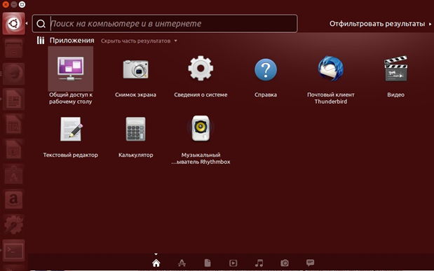

**Панель запуска (Launchpad)** — набор значков вдоль левой стороны экрана для запуска наиболее часто используемых приложений. Запуск приложения выполняется по однократному клику на значок. При запуске значок начинает характерно пульсировать, а стартовавшее приложение отмечается маленьким светлым треугольником слева от значка запущенного приложения. Если приложение запущено в нескольких экземплярах, количество треугольников слева соответствует количеству экземпляров. Окно текущего приложения помечается светлым треугольником справа от значка приложения. По правой кнопке мыши на значке появляется контекстное меню приложения и список уже запущенных экземпляров.

**Глобальное меню (The Panel)** — горизонтальная полоса вдоль верхней части экрана. В левой части отображается меню текущего запущенного приложения; здесь же находятся кнопки управления размером окна, если приложение запущено в полноэкранном режиме. Меню приложения появляется только при нахождении указателя мыши в верхней части экрана. Эта особенность часто ставит в тупик неподготовленного пользователя, который не может найти меню приложения. В правой части меню располагаются так называемые индикаторы: индикатор сети, переключатель раскладки, уровень громкости, уровень батарей и так далее. Самый правый индикатор — доступ к настройкам рабочего стола и меню выключения системы.

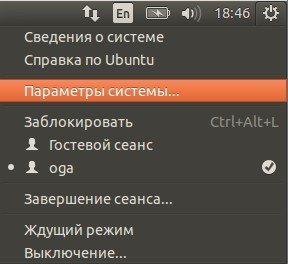

**Главное меню (The Dash)** — окно, которое появляется по клику на верхний значок в панели запуска (значок с логотипом Ubuntu). Если после этого ничего не набирать и не щелкать, на экране появятся значки последних запускавшихся приложений и недавно использовавшихся файлов. Затем с помощью главного меню можно выполнять поиск установленных приложений и файлов. В нижней части экрана главного меню расположены значки, представляющие набор «линз». Так называются области, по которым выполняется поиск. По умолчанию результаты показываются в «домашней» линзе, которая дает результаты по локально установленным приложениям и файлам в домашнем каталоге. Также существует линза приложений (в виде буквы A), представляющей не только установленные приложения, но и те, которые можно установить через Центр Установки Приложений. Кликнув по значку каждого приложения, можно получить его краткое описание и ссылку на сайт разработчика. Остальные линзы предоставляют поиск по файлам, музыке и видео, в т.ч. в Интернете. Дополнительно сузить область поиска можно с помощью фильтров, которые доступны по ссылке в верхнем правом углу — «Отфильтровать результаты». В качестве фильтров можно указать категории и источники поиска. Закрывается окно главного поиска клавишей ESC.

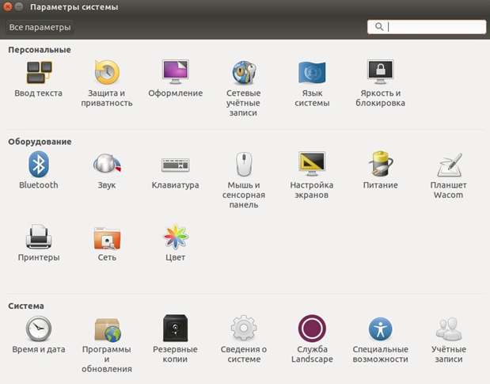

Доступ к графическим утилитам администрирования можно получить через самый правый значок глобального меню, выбрав «Параметры системы».

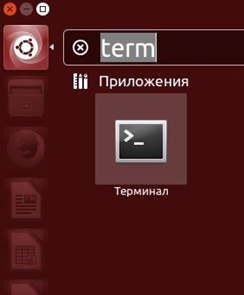

### Пример пользовательской сессии

В примере будет продемонстрирован запуск приложения «Терминал», которое по умолчанию установлено, но не имеет значка в панели запуска. Мы покажем, как добавить его туда. Далее изменим настройки оформления рабочего стола, добавив к панели запуска значок с рабочими пространствами и покажем, как ими пользоваться. По завершении сессии мы выключим систему.

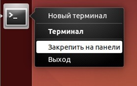

Выполним поиск приложения через главное меню по строке «term» и запустим найденное приложение.
Появится окно терминала и значок запущенного приложения возникнет в панели запуска.

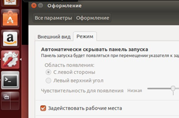

Правой кнопкой мыши на значке терминала в панели запуска появится меню, в котором выберем пункт «Закрепить на панели». Теперь терминал можно запускать непосредственно через панель запуска.
Для добавления на панель запуска значка «Рабочие места» кликните значок «Оформление» в окне «Настройки системы». Далее отметьте галочкой «Задействовать рабочие места» в закладке «Режимы».

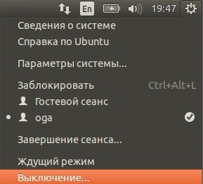

На панели запуска появится значок с экраном, разделенным на четыре части. По клику на этом значке текущий рабочий стол уменьшится до четверти экрана и станут видны остальные четверти, представляющие собой виртуальные рабочие пространства, в которых можно запускать набор приложений, не загромождая окнами остальные рабочие места.
Выключим систему через правый индикатор глобального меню, «Выключение», «Выключить».


## Практическое задание

При работе над практическим заданием:

1.  Просмотреть содержимое директорий `/etc`, `/proc`, `/home`. Посмотреть пару произвольных файлов в `/etc`.
2.  Выяснить, для чего предназначена команда `cat`. Используя данную команду, создайте два файла с данными, а затем объедините их в один. Просмотрите содержимое созданного файла. Переименуйте файл, дав ему новое имя.
3.  Создать несколько файлов. Создайте директорию, переместите файл туда. Удалите все созданные в этом и предыдущем задании директории и файлы.
4.  В ОС Linux скрытыми файлами считаются те, имена которых начинаются с символа “.”. Сколько скрытых файлов в вашем домашнем каталоге? (Использовать конвейер. Подсказка: для подсчета количества строк можно использовать `wc`).
5.  Попробовать вывести с помощью `cat` содержимое всех файлов в директории `/etc`. Направить ошибки в отдельный файл в вашей домашней директории. Сколько файлов, которые не удалось посмотреть, оказалось в списке?
6.  Запустить в одном терминале программу, в другом терминале посмотреть PID процесса и остановить с помощью `kill`, посылая разные типы сигналов. Что происходит?
7.  *Отобразить в `/dev` список устройств, которые в настоящее время используются вашим UID (для этого используется команда `lsof`). Организовать конвейер через `less`, чтобы посмотреть их должным образом.
8.  *Cоздайте директорию для хранения фотографий, в ней должны быть директории по годам, (например, за последние 5 лет), и в каждой директории года по директории для месяца.
9.  * Полезное задание на конвейер. Использовать команду `cut` на вывод длинного списка каталога, чтобы отобразить только права доступа к файлам. Затем отправить в конвейере этот вывод на `sort` и `uniq`, чтобы отфильтровать все повторяющиеся строки. Потом с помощью `wc` подсчитать различные типы разрешений в этом каталоге. Самостоятельно решить задачу, как сделать так, чтобы в подсчет не добавлялись строка Итого и файлы `.` и `..` (ссылки на текущую и родительскую директории)

*Примечание. Задания с 7 по 9 даны для тех, кому упражнений 1-6 показалось недостаточно.

## Дополнительные материалы

1.  [https://ru.wikipedia.org/wiki/Философия_UNIX](https://ru.wikipedia.org/wiki/%D0%A4%D0%B8%D0%BB%D0%BE%D1%81%D0%BE%D1%84%D0%B8%D1%8F_UNIX)
2.  [https://losst.ru/tsikly-bash](https://losst.ru/tsikly-bash)

## Используемая литература

Для подготовки данного методического пособия были использованы следующие ресурсы:

1.  [https://ru.wikipedia.org/wiki/Философия_UNIX](https://ru.wikipedia.org/wiki/%D0%A4%D0%B8%D0%BB%D0%BE%D1%81%D0%BE%D1%84%D0%B8%D1%8F_UNIX)
