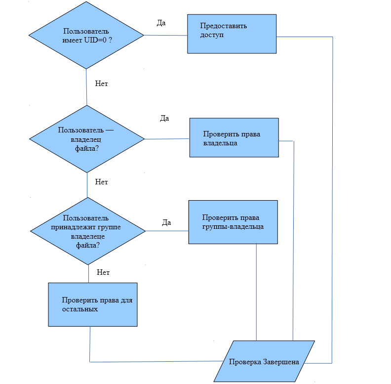
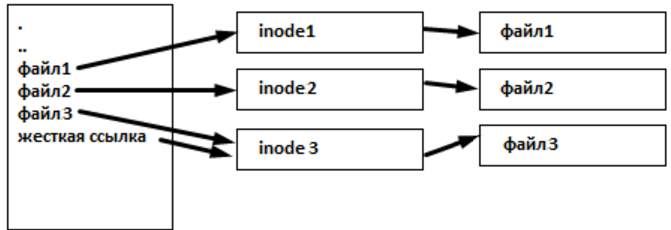

# Файлы и права доступа в Linux

Пользователи и права в Linux. Работа с файлами. Выполнение операций от имени суперпользователя.

## Оглавление
- [Введение](#введение)
- [Пользователи и группы](#пользователи-и-группы)
  - [/etc/passwd — файл с учетными записями](#etcpasswd-файл-с-учетными-записями)
  - [/etc/shadow — файл с паролями](#etcshadow-файл-с-паролями)
  - [Группы](#группы)
  - [Создание пользователей и групп](#создание-пользователей-и-групп)
- [Права файлов](#права-файлов)
  - [Чтение, запись, выполнение](#чтение-запись-выполнение)
  - [Восьмеричная запись прав](#восьмеричная-запись-прав)
  - [Айноды](#айноды)
  - [Права доступа для директорий](#права-доступа-для-директорий)
  - [umask](#umask)
  - [Дополнительные атрибуты](#дополнительные-атрибуты)
- [Владелец и группа файла](#владелец-и-группа-файла)
- [Работа с файлами](#работа-с-файлами)
  - [Перемещение по каталогам](#перемещение-по-каталогам)
  - [Просмотр текстовых файлов](#просмотр-текстовых-файлов)
  - [Удаление файлов](#удаление-файлов)
  - [Копирование файлов](#копирование-файлов)
  - [Ссылки](#ссылки)
- [Работа с правами суперпользователя](#работа-с-правами-суперпользователя)
  - [sudo](#sudo)
  - [/etc/sudoers](#etcsudoers)
  - [su](#su)
- [Практическое задание](#практическое-задание)
- [Дополнительные материалы](#дополнительные-материалы)
- [Используемая литература](#используемая-литература)

## Введение
Linux, будучи UNIX-подобной системой, сильно отличается от DOS. Знаменитая DOS была однозадачной однопользовательской системой, что порождало проблемы как при совместном использовании нескольких задач (они могли запускаться последовательно, и более того, влиять друг на друга, в том числе на ядро операционной системы, вызывая зависания), так и при использовании компьютера разными пользователями.
Существенным недостатком DOS также являлось то, что написана она была на 16-битном 8086-ассемблере, без поддержки аппаратных механизмов защиты процессора.
Ядро Linux изначально было написано для 80386 архитектуры с реализацией колец защиты процессора. Использование UNIX-архитектуры избавило Linux от многих детских болезней Windows. В Windows 9x разработчики были вынуждены придерживаться обратной совместимости с DOS и старыми версиями Windows, выполняя пользовательский код в пространстве ядра (что было чревато частыми синими окнами смерти), в Windows NT механизмы разграничения прав сделали это бесполезным.
Linux обладает хорошими возможностями по защите. Во-первых, ядро выполняется в пространстве ядра, а пользовательские приложения — в пространстве пользователей, таким образом приложение не может обрушить ядро. Впрочем, так как Linux обладает архитектурой монолитного модульного ядра, возможна загрузка драйверов в память и работа их в пространстве ядра. Теоретически драйвер может обрушить систему (вызвать kernel panic). Но это гораздо большая редкость, чем в Windows, и, несмотря на огромное количество драйверов именно для Linux, как правило, они хорошо отлажены. Это обусловлено тем, что Linux, как и модули ядра — свободное программное обеспечение, что позволяет легко отлавливать ошибки и вносить изменения.
Linux — многопользовательская система. Каждый процесс в пользовательском пространстве выполняется от имени того или иного пользователя. Поддержка отдельных прав на чтение, запись и выполнение обеспечивается на уровне файловой системы. На самом деле и такая система не безупречна. Например, root имеет доступ ко всему, вне зависимости от прав. За это UNIX-модели критикуют. Другой момент связан с тем, что могут понадобиться более гибкие возможности, например, чтобы выделять права на файл не с помощью групп, а перечисляя отдельных пользователей. Такие возможности в Linux тоже есть.
SELinux — система с принудительным контролем доступа. Сложна в настройке, но позволяет с ювелирной точностью настроить те системы, которым критична безопасность. SELinux — дополнительный инструмент к безопасности Linux и не позволит разрешить то, что запрещено правами доступа. Но то, что разрешено правами доступа, можно запретить с помощью SELinux. Например, можно явным образом указать, к каким директориям может обращаться веб-сервер или почтовая служба, исключив возможности несанкционированного доступа. Можно указать явным образом, какие порты может использовать другая программа. SELinux — это то, что надо для параноидальной безопасности системы; он был разработан в АНБ США. У SELinux есть аналог — AppArmor. Обе системы построены на схожих принципах, взаимозаменяемы, но обладают разными достоинствами/недостатками.
ACL (Access Control List) позволяет задавать списки пользователей и их права для работы с файлом, что может более гибко конфигурировать доступ, чем стандартный набор категорий: владелец-группа-остальные.

## Пользователи и группы
С файлами всё же работает не непосредственно пользователь, а тот или иной процесс. Такой процесс может непосредственно выполнять команды пользователя, а может выполняться и автоматически (по расписанию, в ответ на входящий клиентский запрос).
Выделяются три вида пользователей:
*   Человек. Пользователь, который вводит логин-пароль и работает с системой.
*   Демон. Псевдопользователь, от лица которого процесс-демон выполняет действия.
*   Суперпользователь (Администратор).
В Ubuntu по умолчанию можно работать только с первым видом пользователей, их так и называют — пользователи. Пользователи для демонов называются, как правило, псевдопользователями, и таким пользователем нельзя выполнить вход в систему.
Работа от имени суперпользователя в Linux-системах не приветствуется, а в Ubuntu по умолчанию запрещена. Иногда возникает потребность выполнить действия от имени суперпользователя. Для этого понадобится временно «надеть костюм суперпользователя» — выполнить команду sudo или su.
Независимо от того, как процесс был запущен (например, вы зашли в консоль, с помощью Alt-F1, getty, увидев активность пользователя, передал управление login, и тот, в случае успешного запуска, запустил оболочку (shell) с правами того пользователя, который ввёл свой логин и пароль), либо был запущен системой init или cron-ом, процесс получает UID и GID.
*   UID – User ID.
*   GID — Group ID.
По умолчанию для каждого пользователя (в этом мы убедимся) создается одноимённая группа. Но системный администратор волен создавать и новые группы. Более того, один пользователь, кроме основной группы, может состоять в нескольких. Это удобно для организации совместной работы, например, разработчики могут входить в группу developer. Есть специальная группа (в Ubuntu она именуется sudo): те, кто в нее входят, могут выполнять команды от имени суперпользователя. При установке Ubuntu автоматически добавляет в эту группу того пользователя, которого вы создали,
Несмотря на то, что имена пользователей и групп пишутся в понятном для человека виде, сама система оперирует с UID и GID. UID для суперпользователя (root) всегда равен 0 — это особый UID. UID обычных пользователей (учетных записей) начинаются обычно с номеров, больших 1000.

### /etc/passwd — файл с учетными записями
Мы знаем, что есть директория /home, в которой хранятся домашние директории пользователей. Но не всех пользователей, которые технически присутствуют в системе. Там нет псевдопользователей. А у рута есть своя директория — /root.
Есть файл /etc/passwd. На чтение он доступен всем. Если посмотреть на название, можно подумать, что он хранит пароли. Когда-то так и было, и даже сейчас в нем есть поле для пароля, которое никогда не используется. Давайте посмотрим этот файл:
```bash
user@vlamp:~$ cat /etc/passwd
root:x:0:0:root:/root:/bin/bash
daemon:x:1:1:daemon:/usr/sbin:/usr/sbin/nologin
bin:x:2:2:bin:/bin:/usr/sbin/nologin
sys:x:3:3:sys:/dev:/usr/sbin/nologin
sync:x:4:4:sync:/bin:/bin/sync
......................................
user:x:1001:1001:user 1:/home/user:/bin/bash
petrov:x:1002:1002:Petrov Petr:/home/user:/bin/bash
```
Каждая строка содержит информацию об учетной записи пользователя. По сути это табличный файл, где колонки разделены двоеточиями.
Первая колонка — регистрационное имя пользователя, логин для пользователей.
Вторая — хешированный пароль, и сейчас не применяется. Поэтому там стоит x.
Третья — UID пользователя. Именно по UID система различает пользователей. У суперпользователя UID=0. Теоретически можно поменять root на что-то другое. Для ОС важно, чтобы UID=0. Но так не принято делать. Более того, обычно в passwd UID уникален, но можно завести несколько записей с одним UID и разными именами. В этом случае система не будет различать таких пользователей. Но так тоже не принято делать. UID обычных пользователей начинается с 1000, чтобы было легче их отличить от псевдопользователей — служебных учетных записей, от лица которых работают сервисы.
Четвертая колонка содержит GID пользователя. Отметим, что в passwd указывается основная группа, но пользователь может входить в несколько групп одновременно. Остальные группы, в которых участвует пользователь, находятся в файле /etc/groups.
Пятое поле предназначено для дополнительной информации. Там может содержаться полное ФИО пользователя, через запятую указаны телефон, должность — что угодно. Часто оно дублирует логин.
Шестое поле — домашняя директория или рабочий каталог.
Седьмое поле указывает оболочку, которая будет запускаться при входе в систему. Для обычных пользователей здесь указывают командный интерпретатор, например, /bin/bash. Для псевдопользователей указана специальная утилита /usr/sbin/nologin. Это так называемая псевдооболочка, программа, работа которой заключается в том, чтобы запуститься и тут же завершить работу, сообщив, что доступ невозможен.

### /etc/shadow — файл с паролями
Даже хеш от пароля в открытом виде хранить — плохая идея. Поэтому теперь пароли, точнее хеши от них, хранятся в файле /etc/shadow.
Хеш — это результат действия функции, превращающей пароль в набор символов определённой длины. В отличие от шифрования процесс хеширования необратим, по хешу нельзя восстановить пароль. Однако возможность подобрать пароль, если злоумышленник получил хеш, остаётся. Чтобы усложнить попытки подбора пароля, функция хеширования использует соль (salt), случайное число, генерируемое при создании хэша. Соль сохраняют вместе с хешем в файле /etc/shadow. Соль для каждого хеша разная, что делает невозможным использование заранее созданных хешей для подбора паролей. Посмотрим файл /etc/shadow.
Сделать это можно только от имени рута.
```bash
user@vlamp:~$ sudo cat /etc/shadow
root:!:14547:0:99999:7:::
daemon:*:14544:0:99999:7:::
bin:*:14544:0:99999:7:::
............................
user:$6$wtML.mV4$.I5WeTp9tgGkIjJM4uLR5p6TVUqPrSvJ0N2W/t//0jVBrW QsfmNmfPJYxVrjZ21/Ir70:14564:0:99999:7:::
```
Файл /etc/shadow доступен на чтение только членам группы shadow и на запись суперпользователю.
Так же, как /etc/passwd, это текстовый файл с полями, разделёнными двоеточиями.
По порядку:
1.  Регистрационное имя пользователя.
2.  Соль + хеш. Псведопользователи здесь тоже присутствуют, но у них в этом поле стоит звёздочка. Это значит, что под учётными записями зайти в систему не получится. Восклицательный знак в этом поле для пользователя root означает, что учётная запись заблокирована, то есть зайти как root в систему тоже не удастся. При блокировке пользователя перед его записью соли и хеша будет поставлена звёздочка, а при разблокировке — удалена. Можно разблокировать и рут, но для этого ему надо задать пароль.
3.  Дата последней смены пароля, выраженная в днях с начала эпохи. Началом эпохи в UNIX считается дата 1 января 1970 года по гринвичу. От этой даты в секундах идёт отсчёт времени в UNIX, что позволяет учитывать високосные дни и високосные секунды. 0 в этом поле означает, что пользователь должен сменить пароль при следующем входе в систему. Пустое поле означает, что проверка устаревания пароля отключена.
4.  Количество дней, через которое пользователь может поменять пароль, не позволяет менять пароль по несколько раз в день. Если 0, ограничение не действует.
5.  Количество дней, после которого необходимо будет сменить пароль.
6.  За сколько дней до устаревания пароля начать предупреждать пользователя, что пароль устаревает.
7.  Сколько дней после устаревания пароля продолжать принимать его. После устаревания и окончания этого периода учётная запись с устаревшим паролем блокируется.
8.  Дата устаревания учетной записи в днях с начала UNIX-эпохи. Разница с датой устаревания пароля в том, что пользователь не сможет войти в систему не только с действующим паролем, но и вообще.
9.  Последнее поле не используется.
Так как в «сыром» виде работать с такой информацией сложно, для этого используется команда chage (это не опечатка, так и пишется без n).
С её помощью суперпользователь может задать вышеописанные настройки для пользователя (по умолчанию они не задаются). Обычный пользователь также может ей воспользоваться, используя параметр -l и указав своё регистрационное имя. Программа покажет существующие правила смены пароля для вашей учетной записи:
```bash
user@vlamp:~$ chage -l user
Последний раз пароль был изменён                                : апр. 22, 2014
Срок действия пароля истекает                                   : никогда
Пароль будет деактивирован через                                : никогда
Срок действия учётной записи истекает                           : никогда
Минимальное количество дней между сменой пароля                 : 0
Максимальное количество дней между сменой пароля                : 99999
Количество дней с предупреждением перед деактивацией пароля     : 7
```

### Группы
Группы — удобный интерфейс для организации группового доступа. Так как в Linux устройства тоже являются файлами и управление доступом к ним аналогично.
```bash
oga@uho:~$ ls -lL /dev/cdrom
brw-rw----+ 1 root cdrom 11, 0 июня   1 13:33 /dev/cdrom
```
Видно, что права на чтение и запись имеют пользователи, которые входят в группу cdrom.
Обратите внимание на признак блочного устройства в первой позиции атрибутов.
Плюс в конце строчки прав означает, что используются ACL, можно их посмотреть командой getfacl.
В файле /etc/passwd для пользователя указана только основная группа пользователя. Как узнать, в каких ещё группах состоите? Можно это сделать с помощью команды id:
```bash
oga@uho:~$ id
uid=1000(user) gid=1000(user) группы=1000(user), 4(adm), 24(cdrom), 27(sudo)
```
Показаны ID групп и в скобках указаны их имена. Кроме того, команда показывает текущие UID и GID оболочки.
Также можно с помощью grep найти в файле /etc/group все строки, в которых встречается имя пользователя user:
```bash
user@vlamp:~$ grep user /etc/group
adm:x:4:syslog,user
cdrom:x:24:user
sudo:x:27:user
```
Формат файла groups: первое поле — имя группы, третье — GID-идентификатор. В последнем поле через запятую перечислены пользователи — члены группы. Второе поле аналогично парольному полю в /etc/passwd. Пароль может быть запрошен при использовании команды newgrp, которая запускает копию оболочки с установленным GID оболочки.
Как правило, запуск новой копии оболочки с указанным GID не защищается паролем, но администратор может назначить пароль на группу с помощью команды gpasswd. Хеши паролей на установку группы хранятся в файле /etc/gshadow.
newgrp аналогичен sudo, но запускает оболочку с GID нужной группы. Теперь при создании файлов группа будет назначаться не основная, а выбранная с помощью newgrp. Учтите, что newgrp не меняет GID, а запускает новую копию оболочки. Возвращать исходную GID надо не с помощью новой newgrp, а с помощью gid и никак иначе.

### Создание пользователей и групп
Создадим группу developer:
```bash
# groupadd developer
```
Создадим двух пользователей — ivanov и petrov:
```bash
# useradd -m -G developer -s /bin/bash ivanov
# useradd -m -G developer -s /bin/bash petrov
```
Мы использовали опции:
-m — также создать домашний каталог. По умолчанию каталог создаётся в /home с именем учётной записи, например, /home/ivanov. Если надо создать нестандартный каталог, можно указать его, используя параметр параметра -d.
-G — список групп, к которым принадлежит создаваемый пользователь. По умолчанию также создается персональная группа пользователя с именем учётной записи. Она является первичной и по умолчанию все файлы пользователя создаются с этой группой в качестве группы-владельца.
-s — задает оболочку пользователя. Для обычных пользователей обычно это /bin/bash. Для ftp/sftp-пользователей и системных псевдопользователей на этом месте указывается псевдооболочка, например, /usr/sbin/nologin или /bin/false.
Иногда бывает полезным указать номер пользовательского ID явным образом с помощью параметра -u : например, -u 1001. Это бывает полезным, если у вас несколько систем с одинаковыми учетными записями и вы хотите, чтобы при переносе файлов на флешке между ними, у файлов был один владелец. Для этого надо следить, чтобы на системах одинаковые пользователи имели один UID. То же самое для групп: у groupadd есть параметр -g для указания GID.
По умолчанию для новых учетных записей без пароля заблокирован вход в систему, поэтому установим пароль для пользователей с помощью passwd, например:
```bash
# passwd petrov
```
Есть альтернативный способ создания пользователя.
```bash
# adduser smirnov
```
Предложит несколько вопросов, ответив на которые, мы полностью сконфигурируем будущего пользователя, в том числе и его пароль.
Если нам понадобится изменить параметры для уже созданного пользователя, поможет утилита usermod. Параметры аналогичны утилите useradd. Также её можно использовать для блокировки/разблокировки пользователей. Опция -L позволит заблокировать учётную запись. Операция блокировки добавляет символ «!» в начало пароля в файле /etc/shadow. Параметр -U снимает блокировку. Для удаления учётной записи предназначена утилита userdel. Полезный ключ -r удаляет из системы домашний каталог пользователя.

## Права файлов
### Чтение, запись, выполнение
Традиционно в Linux для каждого файла присутствуют атрибуты r (чтение), w (запись), x (выполнение), которые устанавливаются для трех групп: владелец, группа и остальные. На самом деле атрибутов больше, есть дополнительные атрибуты (SUID, SGID, stickiy bit), а также признаки того, что файл является директорией, символической ссылкой, файловым потоком – тоже являются особого вида атрибутами.
Посмотрим перечень файлов с ключом -l
```bash
user@vlamp:~$ ls -l
итого 44
-rw-r--r-- 1 user user 8980 апр.  22 16:56 examples.desktop
drwxr-x--- 2 user user 4096 апр.  22 17:25 Видео
drwxr-xr-x 2 user user 4096 апр.  22 17:25 Документы
```
Первая колонка — это список прав доступа к файлу или каталогу. Самый первый символ обозначает тип файла: прочерк для обычных файлов, d — для каталогов, l — для символических ссылок и т.д. Затем следует список прав доступа к файлу. Права для файла задаются перечислением прав для каждой из 3-х категорий. Перечисление идёт по порядку: сначала для пользователя-владельца, потом для группы-владельца и, наконец, для всех остальных. Права для каждой категории также задаются по порядку соответствующими им буквами r, w, x. Если право есть, в позиции ставится буква, если нет права — прочерк. Например, для каталога Видео последовательность rwx r–x ––– описывает что владелец файла (первые 3 символа rwx) имеет все 3 вида прав, члены группы-владельца (вторая тройка) имеют права на чтение и исполнение, права на запись нет: r-x ; все остальные пользователи (последняя тройка) не имеют никаких прав вообще, во всех позициях прочерк.
Также мы видим, что файлы принадлежат пользователю user и группе user.
Попробуйте обычным пользователем вывести содержимое системного файла на экран. Не каждый получится просмотреть. Например:
```bash
user@vlamp:~$ cat /etc/shadow
cat: /etc/shadow: Отказано в доступе
```
Особым образом работает с файлами root. Он всегда может переместить, переименовать файл, изменить права.
Последовательность проверки прав выглядит следующим образом:




Для изменения прав доступа используется команда chmod.
```bash
$ chmod +x myfile
```
Сделает файл исполняемым для пользователя, группы и всех остальных.
Можно явным образом указать, для кого мы хотим установить права.
*   u — владелец,
*   g — группа,
*   o — остальные,
*   a — для всех (ugo),
*   можно комбинировать.
Дать права на выполнение только владельцу:
```bash
$ chmod u+x myfile
```
Дать права на выполнение владельцу и группе:
```bash
$ chmod ug+x myfile
```
Можно комбинировать и права. Дать права на выполнение и запись владельцу и группе:
```bash
$ chmod ug+wx myfile
```
Права можно не только давать, но и забирать. Убрать право на выполнение у всех (у пользователя, владельца, группы):
```bash
$ chmod -x myfile
```
Убрать право на выполнение у остальных пользователей:
```bash
$ chmod o-x myfile
```
Кроме + и - , есть ещё и присвоить =.
Разница в том, что +r и -r меняют только право на чтение. = меняет все три: rwx.
Если у файла права rwx r–x r– –, то
```bash
$ chmod +w myfile
```
задаст права rwx rwx rw –.
А вот
```bash
$ chmod =w myfile
```
задаст права –w– –w– –w –.
Чувствуете разницу?
Можно задать несколько вариантов прав:
```bash
$ chmod u=rwx,g=rx,o=r myfile
```
Удобнее это делать символьно. Но то же самое можно записать как:
```bash
$ chmod 754 myfile
```

### Восьмеричная запись прав
Восьмеричная система счисления позволяет предоставить права файлов в виде семи (восьми) цифр.

| r   | w   | x   | Права | Двоичное | Десятичное |
| --- | --- | --- | ----- | -------- | ---------- |
| –   | –   | –   | –––   | 000      | 0          |
| –   | –   | x   | --x   | 001      | 1          |
| –   | w   | –   | -w-   | 010      | 2          |
| –   | w   | x   | -wx   | 011      | 3          |
| r   | –   | –   | r--   | 100      | 4          |
| r   | –   | x   | r-x   | 101      | 5          |
| r   | w   | –   | rw-   | 110      | 6          |
| r   | w   | x   | rwx   | 111      | 7          |

Права 777 означают, что файл могут читать, изменять и исполнять все.
```bash
$ chmod 777 myfile
```

### Айноды
В отличие от системы FAT (например, exFAT часто используется на флешках), в Linux принята организация файловых систем с отдельным хранением атрибутов. Каталог ссылается не сразу на файл, а на айнод (i-node), содержащий атрибуты (метаинформацию о файле) и ссылающийся на файлы. Такой подход определяет логику работы с ФС в Linux.

ID айнодов можно посмотреть командой:
```bash
$ ls -ila
```

### Права доступа для директорий
Из понимания структуры файловой системы следует понимание прав для директорий. Директория — особый файл, который хранит имя файла и номер айнода. Права на чтение и запись — пользователь может прочитать данный файл, посмотреть имена файлов. Право на запись — возможность добавить новый файл: придется прописать в оглавлении директории новое имя.
Особым образом интерпретируется атрибут x для директорий. По умолчанию он установлен. Если атрибут x снят с директории, её невозможно сделать активной (cd). Сравните, в mc нажатие Enter по файлу с атрибутом x вызывает его выполнение, нажатие Enter по директории с атрибутом x вызовет переход в эту директорию.
Атрибут x даёт доступ к inode и на чтение, и на запись. Если атрибут x снят, файл невозможно ни изменить, ни прочитать из-за невозможности получить доступ к атрибутам.
Если у директории нет права на чтение, вы не сможете посмотреть ее оглавление. Но если знаете имя файла, сможете его посмотреть, явным образом указав его по имени.

### umask
Существует атрибут по умолчанию.
Для файлов — 644, для директорий — 755. Чтобы задать атрибут по умолчанию сразу, используется следующая идея. Берём некую маску, которую вычитаем из 666 для файлов и 777 для директорий. По умолчанию это 022. Таким образом, 666 – 022 = 644, 777 – 022 = 755.
Задается командой umask:
```bash
$ umask 022
```
Вы можете изменить этот порядок. Например, если группа должна обладать теми же правами, что и пользователь, вы можете указать
```bash
$ umask 002
```
перед необходимыми действиями.
Это можно сделать в скрипте перед выполнением группы действий или задать для пользователя в скрипте ~/.bash_profile (выполняется при входе через логин) и/или ~/.bash_rc (выполняется при других запусках оболочки)

### Дополнительные атрибуты
К сожалению, трёх категорий прав не всегда оказывается достаточно.
Например, программа passwd, которая меняет пароль пользователя. Владельцем программы является root, а пароли хранятся в зашифрованном виде в /etc/shadow, владельцем которой тоже является root. И если пароль задаёт root, как его сменить пользователю? У программы passwd есть право на выполнение для остальных, поэтому пользователь user, запустив программу passwd, будет работать с UID=1001, и изменить файл /ect/shadows система не должна. Если это нужно сделать, есть особый атрибут SUID (Set User ID). Если этот атрибут присвоен исполняемому файлу (двоичному), при исполнении программы у неё будет UID не запустившего пользователя, а владельца файла. Технически это будет осуществляться через использование ещё двух идентификаторов. EUID (Equivalent UID) используется для определения прав доступа к файлу (он и будет установлен в 0), и RUID (Real UID) сохраняет настоящее значение UID (и будет равен 1001).
В листинге SUID выглядит так:
```bash
user@vlamp:~$ ls -l /usr/bin/passwd
-rwsr-xr-x 1 root root 45420 февр. 17 06:42 /usr/bin/passwd
```
На месте права на исполнение для владельца вместо x показана буква s.
Установить SUID можно с помощью команды:
```bash
$ chmod u+s myfile
```
SUID — в определённой степени уязвимость. Так как обычно владельцем программы с атрибутом SUID является root, имеющий неограниченные права, при выполнении программа фактически выполняется от root и только она сама может контролировать корректность тех или иных действий (например, passwd, запущенная от простого пользователя не должна менять пароль суперпользователю и другим пользователям). Если в программе окажется уязвимость, теоретически пользователь-злоумышленник, не обладая нужными правами, сможет выполнить произвольный код. Например, если получится из программы с SUID запустить оболочку, она будет запущена с правами root.
По этой же причине SUID не работает для скриптов. Чтобы запустить скрипт с SUID, потребовалось бы присвоить SUID для интерпретатора оболочки или скрипта (ни в коем случае так никогда не делайте), либо скомпилировать в gcc простейшую обертку, которая запускает скрипт и присвоить ей SUID. Это будет работать, но не защищает от уязвимостей в самом скрипте.
Кроме SUID, существует аналогичный атрибут для групп — SGID (Set Group ID). Работает аналогично, но для исполняемого файла заменяет GID на GID группы файла. Фактически это тоже работает через механизмы RGID и EUID процессов.
Но, в отличии от SUID, у SGID есть ещё одна очень полезная особенность. Когда пользователь создаёт файл, файлу присваиваются UID и GID пользователя. Это не всегда удобно, особенно при совместном доступе. Но если для директории установить атрибут SGID, вновь создаваемый файл и директории в ней будут получать GID не пользователя, а родительской директории. Таким образом, если вы создадите директорию developer для совместной работы группы developer и установите соответствующую группу для данной директории, каждый разработчик, создавая файл, не будет вынужден менять группу на developer, она уже будет установлена. Останется только дать каждому файлу права на группу, а лучше сразу задать umask 002.
Установить SGID можно с помощью команды:
```bash
$ chmod g+s developer
```
В листинге SGID выглядит так:
```bash
user@vlamp:~$ ls -l /opt/developer
drwxrwsr-x 1 root developer 45420 февр. 17 06:42 /opt/developer
```
Третий атрибут — sticky bit. Он применяется для директорий, у которых права на чтение и выполнение даны для остальных пользователей, например, для директории /tmp.
При таких правах любой пользователь может не только создать или изменить файл (даже чужой), но и удалить. Но директория /tmp используется для межпроцессного взаимодействия, и такой вариант крайне нежелателен. Несколько программ могут обмениваться через файл, но удалить его должна только программа, создавшая его. Вот в таких случаях применяется атрибут sticky bit.
В листинге он отмечается буквой t в последней позиции:
```bash
user@vlamp:~$ ls -l /tmp
drwxrwxrwt 17 root root 400 мая   23 17:50 /tmp/
```
Если файл или каталог не имеет атрибута execute для категории «остальные», буква t превращается в букву T. Этот атрибут для каталогов допускает удаление только файлов, принадлежащих пользователю.
Для файлов этот атрибут сейчас не используется. Во времена UNIX, когда диски были большими по размеру, но маленькими по объёму и невероятно медленными, этот атрибут использовался для исполняемых файлов, чтобы не выгружать образ программы из памяти после её завершения и ускорить повторный запуск программы.
Установить sticky bit можно с помощью команды:
```bash
user@vlamp:~$ chmod +t /developer/tmp
```
Что интересно, дополнительные атрибуты можно задавать и в восьмеричной системе счисления.
Например:
```bash
$ mkdir /developer/tmp
$ chmod 1777 /developer/tmp
```
В таком случае применяется уже не 3-значный, а 4-значный формат. Первый знак устанавливает расширенные атрибуты и рассчитывается как сумма для установленных расширенных битов: 1(sticky) + 2(SGID) + 4(SUID).

## Владелец и группа файла
Чтобы изменить группу, применяют утилиту chgrp. Сначала указываем группу, а потом файл(ы).
Например:
```bash
# chgrp developer /var/www
```
Или ещё лучше, укажем опцию -R и поменяем рекурсивно (для всех вложенных файлов тоже).
```bash
# chgrp -R developer /var/www
```
Команда chown позволяет поменять владельца либо сразу владельца и группу:
```bash
# chown developer /var/www
```
или:
```bash
# chown  www-data:developer /var/www
```
-R тоже работает (работает он и для chmod):
```bash
# chown -R  www-data:developer /var/www
# chmod -R  gu=rw,o=r,g+s /var/www
```

## Работа с файлами
### Перемещение по каталогам
Текущий каталог — атрибут любого процесса, в том числе, оболочки, такой же, как UID и GID. Поэтому не существует отдельной внешней команды cd для смены текущего каталога. Команда cd — внутренняя программа оболочки. Без параметров cd переносит пользователя в домашний каталог. Также можно указать новый каталог с относительным (от текущего) или абсолютным (от корневого каталога) путем. Иногда в пути используют специальные значения:
*   ~ или ~/ — домашний каталог или путь относительно него.
*   . или ./ — текущий каталог или путь относительно текущего.
*   .. или ../ — родительский каталог или путь от родительского каталога.
*   ~user — домашний каталог пользователя user.
*   ~- — предыдущий посещенный каталог.
*   ~+ — путь текущего каталога.
Эти символы можно комбинировать в команде cd:
```bash
$ cd
$ cd /
$ cd /etc
$ cd ~-
$ cd usr
$ cd bin
$ cd ../lib
$ cd lib
$ cd ../../home
```
Также можете посмотреть, что будет, если вместо cd использовать echo (используется для вывода на экран строк).
Например:
```bash
$ echo ~
$ echo ~-
$ echo ~+
$ echo ~root
$ echo ~user
```

### Просмотр содержимого каталогов осуществляется с помощью ls:
```bash
ls [ключи] [имя каталога]
```
Команда без параметров показывает содержимое текущего каталога. Можно указать каталог, который мы желаем просмотреть в качестве параметра.
*   -l — расширенный вывод с правами, владельцами и датой.
*   -ld — расширенный вывод для каталога, без этого параметра ls покажет файлы в каталоге, а не права на него.
*   -i — листинг с номерами айнодов.

### Просмотр текстовых файлов
Небольшие текстовые файлы удобно просматривать командой cat:
```bash
$ cat filename
```
Однако перед этим лучше убедиться, что файл на самом деле текстовый:
```bash
user@vlamp:~$ file /etc/profile
/etc/profile: ASCII text
```
Команда file определяет тип содержимого файла по характерным сигнатурам. Если отправить cat'ом на терминал бинарный файл (например, программу), терминал может воспринять двоичное содержимое как управляющую информацию, после чего будет работать неадекватно. Если вы случайно попали в такую ситуацию, её можно исправить командой tput reset ^M :
```bash
tput reset ^M
```
Надо учитывать, что команду придётся набирать вслепую, эхо на терминале может быть отключено выводом бинарного файла. По тем же причинам в конце используется ^M вместо Enter. Если надо посмотреть большой текстовый файл, используйте команду less.
Иногда бывает необходимо посмотреть последние несколько строк файла. Особенно это полезно для файлов логов, которые могут содержать значительное число записей, а нас интересует только информация о последних событиях.

### Удаление файлов
Удалить файл или директорию можно с помощью команды rm:
```bash
$ rm somefile
```
Если это директория, она должна быть пустой.
Можно удалять директории с содержимым (удалить рекурсивно):
```bash
$ rm -R somefile
```
Почему не надо использовать команду rm -rf /?

### Копирование файлов
Файлы и каталоги копируются командой cp:
Сделать копию файла file под именем filecopy:
```bash
$ cp file filecopy
```
Скопировать файл file в folder (folder/file):
```bash
$ cp file folder
```
При копировании в директорию можно указать несколько файлов:
```bash
$ cp file1 file2 file3 folder
```
Можно использовать замены bash (о них мы еще поговорим), например, один символ заменить знаком ?, несколько символов *.
```bash
$ cp file? folder
```
Команда скопирует все файлы, начинающиеся с file, у которых пятым символом будет любой (file1, filea, file8, file9).
```bash
$ cp file* folder
```
Команда скопирует вообще все файлы, которые начинаются с file (как уже указанные file1, filea, file8, file9, но еще и filelist, filename, files, file2001 и т.д.)
Можно копировать и директории. -R означает рекурсивное действие — будет выполнено для всех файлов внутри, и внутри поддиректорий.
Создать у директории folder полную копию foldercopy:
```bash
$ cp -R folder foldercopy
```
В дальнейшем обратите внимание на программу rsync. Она умеет копировать со множеством интересных опций, но на самом деле она выходит далеко за рамки копирования. Это утилита для синхронизации файлов, как локально, так и по сети. Может применяться для создания резервных копий, бэкапов, позволяет сжимать файлы при передаче, обладает множеством полезных опций.
Пример — скопировать файлы с сохранением группы и владельца:
```bash
$ rsync -og file1 file2
```
С командой mv для переименования/перемещения разберитесь самостоятельно.

### Ссылки
В Linux один файл может иметь не одно имя, а несколько. В зависимости от того, равноправные это имена или только ссылки на исходный файл — такие записи называются жесткими или символическими ссылками.
Жесткая ссылка — на один айнод имеется несколько записей.
```bash
$ echo test>file1
$ ln file1 file2
$ cat file1
test
$ cat file2
test
$ ln file2 file3
$ cat file3
test
$ rm file1
$ cat file2
test
```
Выше мы создали файл с одной строкой test и сделали на него жесткую ссылку file2.
Вывели на экран содержимое исходного file1, и содержимое file2. Затем повторили процесс, создав жесткую ссылку file3. Даже если мы удалим file1, ссылки file2 и file3 останутся.
Убедитесь, что у жестких ссылок один и тот же айнод:
```bash
$ ls -ila
```
Название «жесткая ссылка» в определённой степени условно. С одной стороны, когда мы создаем жесткую ссылку на существующий файл, мы действительно ещё раз ссылаемся на существующий айнод. Но после этого невозможно определить, кто является первым, кто — вторым. Жёсткие ссылки — механизм, позволяющий иметь несколько имен для одного файла.
Можно создавать жесткие ссылки, находящиеся в разных каталогах, но только если они присутствуют на одном разделе.
```bash
ln /etc/hosts /home/hosts
```
Невозможно создать ссылку на айнод в другом устройстве (тем более, что в примонтированной системе в принципе не может быть айнодов).
Так как мы ссылаемся на один и тот же айнод, владелец, атрибуты, даты будут одними и теми же для всех жестких ссылок.
Несмотря на то, что у GNU-утилиты ln есть ключ -d для создания жестких ссылок на директории (должен использоваться только рутом), на практике он не работает: ядро операционной системы отказывается выполнить такое действие.
Для директорий, а также файлов в других разделах, необходимо использовать символические ссылки.
Также можно сделать иллюзии ссылки на директорию благодаря монтированию командой mount c опцией --bind:
```bash
# mkdir TEST1
# echo test>TEST1/test
# ln -d TEST1 TEST2
ln: failed to create hard link 'TEST2' => 'TEST1': Operation not permitted
# mkdir TEST2
# ls -ila|grep TEST
.........
# mount TEST1 TEST2 --bind
# ls -ila
.........
# ls TEST2
# umount TEST2
```
Монтирование --bind бывает полезно при создании изолированного окружения с помощью chroot, когда для работы отдельного приложения в целях безопасности создаётся подиерархия, имитирующая корневую систему.
Для большинства случаев достаточно символических ссылок. Символические ссылки могут быть созданы и на директории, и на файлы в других файловых системах. Фактически символическая ссылка — нечто похожее на ярлык, но она воспринимает на уровне ядра операционной системы. Все действия с ярлыком (кроме удаления) происходят с оригинальным файлом. Для символических ссылок всегда присутствует файл-оригинал и символическая ссылка на него.
Создать символическую ссылку можно с помощью ln с ключом s.
```bash
$ ln -s file1 file2
```
Попробуйте удалить file1 и попробовать вывести на экран содержимое file2.
Символические ссылки активно используются в Ubuntu (Systemd, apache2, nginx).
Примером символической ссылки является и /dev/cdrom, которое ссылается на /dev/sr0).

## Работа с правами суперпользователя
Суперпользователь — пользователь системы с UID=0 и обычно с регистрационным именем root. На суперпользователя не распространяются ограничения прав доступа, ему доступны любые файлы системы. Однако работа с правами суперпользователя может быть небезопасна. Начиная от ошибочных действий, которые могут повредить систему, заканчивая возможностью выполнения вредоносного кода с правами суперпользователя.
Более того, повреждение системных файлов может выявиться не сразу, а только при последующей перезагрузке.
Поэтому рекомендуется без необходимости не использовать учётную запись суперпользователя. По умолчанию в Ubuntu учётная запись пользователя root не имеет пароля и заблокирована. Это означает, что с логином root нельзя зарегистрироваться в системе непосредственно, или по сети, или локально через одну из виртуальных консолей.

### sudo
Как мы уже знаем, все действия от имени суперпользователя выполняется через систему sudo. Все команды которые необходимо выполнить с правами суперпользователя, запускаются через программу sudo в формате:
```bash
user@vlamp:~$ sudo <команда>
```
Программа sudo имеет root в качестве владельца исполняемого файла и установленный атрибут SUID. Проверьте это самостоятельно.
Это не означает, что sudo будет выполнять все команды, которые её попросят сделать.
При запуске sudo сверяется с файлом /etc/sudoers, чтобы проверить, может ли запустивший её пользователь получить права суперпользователя для выполнения команды. Если да, пользователю предлагается ввести пароль (не пароль рута, а собственный. Вдруг настоящий пользователь отошел, а за терминалом кто-то другой?), после чего запускает команду на исполнение с EUID=0, то есть с правами суперпользователя.

### /etc/sudoers
Файл настроек sudo — /etc/sudoers. Лучше не редактировать этот файл напрямую, для этого используют команду visudo (это не значит, что вы будете редактировать его с помощью vi. Будет вызван редактор по умолчанию, в т.ч. nano или mcedit):
```bash
user@vlamp:~$ sudo visudo
```
Эта программа загружает файл в редактор и выполняет его блокировку, чтобы одновременно никто не выполнял его редактирование этой командой. После завершения редактирования программа выполняет проверку формата файла на правильность, чтобы никто его случайно не испортил. Строки файла /etc/sudoers в простейшем варианте имеют следующий формат:
```
user host=command
```
User — имя пользователя или группы (если начинается с %). ALL для всех пользователей. Заданные пользователи или участники группы имеют права выполнять команды на указанных хостах с правами суперпользователя. host — обычно на этом месте строчка ALL, что идентифицирует все компьютеры в сети. Также здесь может быть localhost, то есть локальный компьютер или имя/адрес компьютера. Поле полезно, когда в большой сети поддерживается единый файл /etc/sudoers и на разных компьютерах этой сети в sudo требуется разрешить разные команды. Command — может быть ALL для любой команды или список команд. Возможно указание опций, например, NOPASSWD: разрешает выполнение команды без запроса пароля. Команду обязательно надо указывать с полным путем. В качестве примера разрешим пользователю user через sudo выполнять остановку системы командой shutdown без запроса пароля. Это можно сделать, добавив в /etc/sudoers строчку:
```
user ALL=NOPASSWD: /sbin/shutdown
```
Если же вы хотите назначить права через группу, создайте группу shutdown и в /etc/sudoers укажите:
```
%shutdown ALL=NOPASSWD: /sbin/shutdown
```
Кроме выполнения команд от имени суперпользователя, sudo можно использовать для выполнения команд с любыми GID или UID. В таком варианте в /etc/sudoers используется более сложный формат:
```
user   host=(user:group) command
```
В таком варианте добавлены новые параметры user и group. При установке Ubuntu был создан пользователь с возможностью выполнять любые команды с любыми UID и GID через стандартную конфигурацию sudo. Такое право даёт пользователю членство в группе sudo, которая описана в стандартном /etc/sudoers строкой:
```
# Allow members of group sudo to execute any command
%sudo   ALL=(ALL:ALL) ALL
```
В разных версиях Linux данная группа может называться по-разному, в Ubuntu после 12 версии это группа sudo.
sudo можно использовать для запуска команд от имени других пользователей и групп c помощью ключей -u и -g
```bash
$  sudo -u petrov id
$  sudo -u petrov -g developer  id
```
Обратите внимание, что во втором варианте использования EGID поменялся на developer, до этого была установлена первичная для petrov группа petrov. Иногда бывает необходимо выполнить подряд несколько команд и не хочется каждый раз набирать sudo перед командой. В таком случае, если вы уверены в своих силах, можно использовать sudo с параметром -i:
```bash
user@vlamp: ~$  sudo -i
root@vlamp: ~#
```
После того, как оболочка суперпользователя больше не нужна, сеанс sudo надо завершить командой exit или комбинацией ^D.

### su
Кроме sudo, в UNIX есть более старая команда с похожим функционалом, команда su (switch user). В простейшем случае надо набрать su user, где user имя пользователя, в которого мы хотим переключиться. Система запросит пароль для этого пользователя и запустит оболочку c UID и GID пользователя. После завершения действий также нужно выйти с помощью exit.
Без параметров su запустит сеанс оболочки от имени рута. Придется указать пароль от рута, а после завершения действий также выполнить exit. В отличие от sudo, для su надо знать пароль другого пользователя. В случае суперпользователя su не будет работать, пока не задать пароль пользователю root (по умолчанию пароля нет).
```bash
$  su -c id  petrov
```
Все действия, выполняемые su, можно выполнить с помощью sudo, но знать su полезно, т. к. su есть в любой UNIX-системе, а sudo встречается не везде.

## Практическое задание
При работе над практическое заданием:
1.  Создать файл file1 и наполнить его произвольным содержимым. Скопировать его в file2. Создать символическую ссылку file3 на file1. Создать жесткую ссылку file4 на file1. Посмотреть, какие айноды у файлов. Удалить file1. Что стало с остальными созданными файлами? Попробовать вывести их на экран.
2.  Дать созданным файлам другие, произвольные имена. Создать новую символическую ссылку. Переместить ссылки в другую директорию.
3.  Создать два произвольных файла. Первому присвоить права на чтение, запись для владельца и группы, только на чтение для всех. Второму присвоить права на чтение, запись только для владельца. Сделать это в численном и символьном виде.
4.  Создать пользователя, обладающего возможностью выполнять действия от имени суперпользователя.
5.  * Создать группу developer, несколько пользователей, входящих в эту группу. Создать директорию для совместной работы. Сделать так, чтобы созданные одними пользователями файлы могли изменять другие пользователи этой группы.
6.  * Создать в директории для совместной работы поддиректорию для обмена файлами, но чтобы удалять файлы могли только их создатели.
7.  * Создать директорию, в которой есть несколько файлов. Сделать так, чтобы открыть файлы можно только, зная имя файла, а через ls список файлов посмотреть нельзя.

Примечание. Задания с 5 по 7 даны для тех, кому упражнений 1-4 показалось недостаточно.

## Дополнительные материалы
1.  SELInux [https://www.ibm.com/developerworks/ru/library/linux/l-selinux/](https://www.ibm.com/developerworks/ru/library/linux/l-selinux/)
2.  SELinux [https://habrahabr.ru/company/kingservers/blog/209644/](https://habrahabr.ru/company/kingservers/blog/209644/)
3.  .bash_rc, .bash_profile и т.д. [http://rus-linux.net/nlib.php?name=/MyLDP/BOOKS/Bash-Guide-1.12-ru/bash-guide-03-1.html](http://rus-linux.net/nlib.php?name=/MyLDP/BOOKS/Bash-Guide-1.12-ru/bash-guide-03-1.html)
4.  rsync [http://linux-notes.org/rezervnoe-kopirovanie-s-rsync-v-linux/](http://linux-notes.org/rezervnoe-kopirovanie-s-rsync-v-linux/)
5.  man rsync [http://www.opennet.ru/man.shtml?category=1&topic=rsync](http://www.opennet.ru/man.shtml?category=1&topic=rsync)
6.  Как посмотреть потоки в Linux (ps, top, htop) [https://losst.ru/kak-posmotret-potoki-protsessa-v-linux](https://losst.ru/kak-posmotret-potoki-protsessa-v-linux)
7.  ACL [http://help.ubuntu.ru/wiki/access_control_list](http://help.ubuntu.ru/wiki/access_control_list)

## Используемая литература
Для подготовки данного методического пособия были использованы следующие ресурсы:
1.  [https://ru.wikipedia.org/wiki/SELinux](https://ru.wikipedia.org/wiki/SELinux)
2.  [http://www.clinuxworld.com/security/155-selinux](http://www.clinuxworld.com/security/155-selinux)
3.  [http://docscom.ru/blog/nix/84.html](http://docscom.ru/blog/nix/84.html)
4.  [https://linuxsoid.club/setup-use-acl-linux](https://linuxsoid.club/setup-use-acl-linux)
