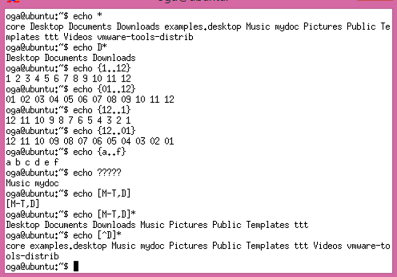
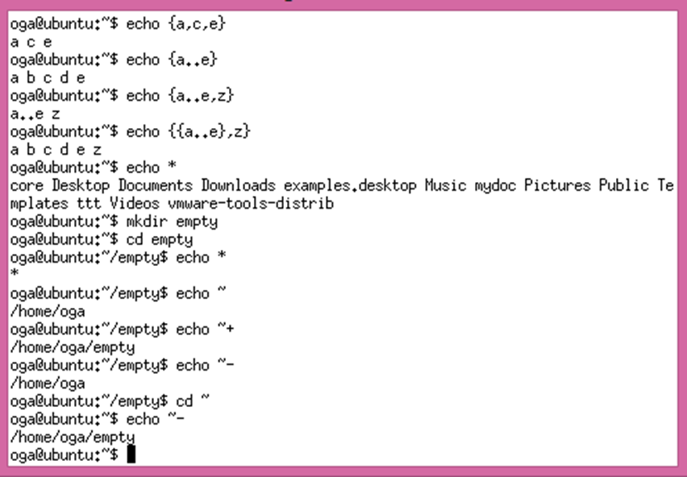
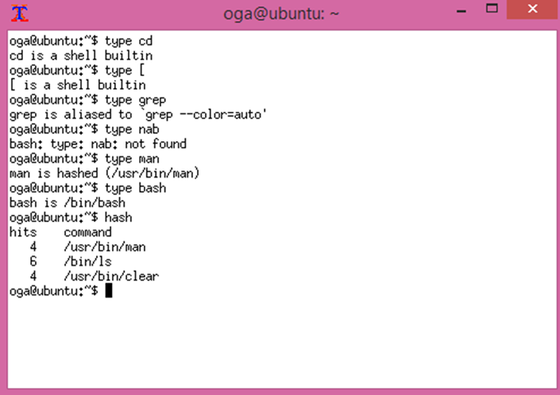
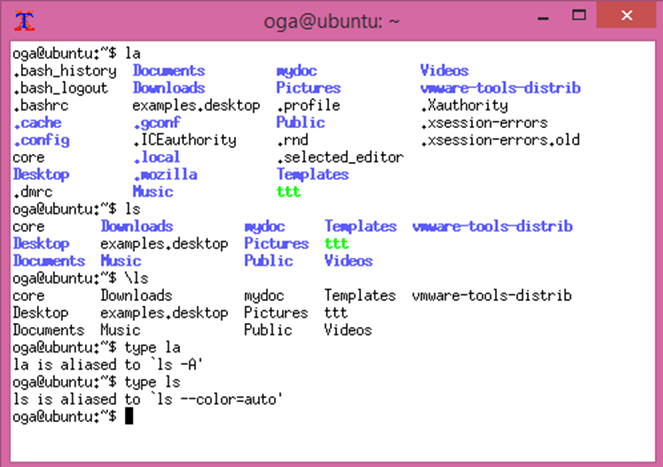
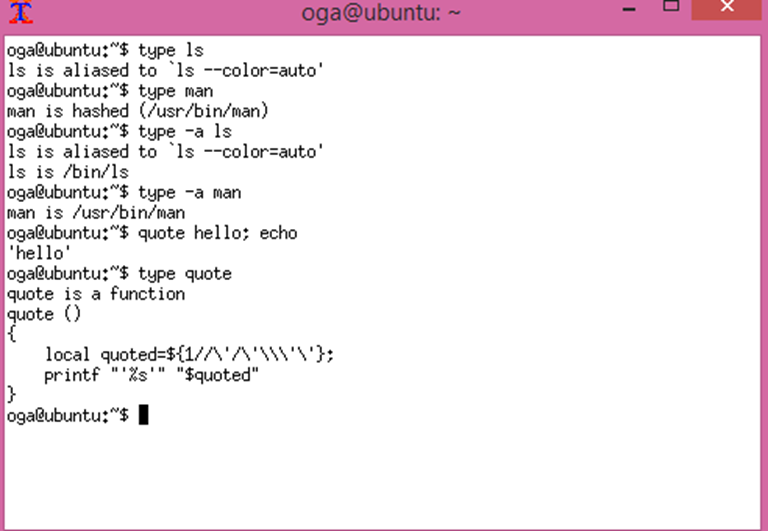

# Программирование bash

## Оглавление
- [Некоторые возможности bash](#некоторые-возможности-bash)
  - [Шаблоны подстановки](#шаблоны-подстановки)
  - [Переменные](#переменные)
- [Простейшие скрипты](#простейшие-скрипты)
  - [Hello world](#hello-world)
  - [Скрипты vs. командная строка](#скрипты-vs-командная-строка)
- [Тонкости работы с переменными](#тонкости-работы-с-переменными)
  - [Получение значение параметров](#получение-значение-параметров)
  - [Присвоение переменной вывода программы](#присвоение-переменной-вывода-программы)
  - [Арифметические операции](#арифметические-операции)
- [Циклы и другие управляющие конструкции](#циклы-и-другие-управляющие-конструкции)
  - [Цикл for](#цикл-for)
  - [Условный оператор](#условный-оператор)
  - [break и continue для цикла](#break-и-continue-для-цикла)
- [Функции](#функции)
- [Типы команд](#типы-команд)
- [Пишем скрипты](#пишем-скрипты)
  - [Располагаем фотографии по файлам](#располагаем-фотографии-по-файлам)
  - [Переименование файлов по шаблону](#переименование-файлов-по-шаблону)
  - [Резервное копирование файлов](#резервное-копирование-файлов)
- [CRON — запуск задач по расписанию](#cron--запуск-задач-по-расписанию)
  - [Планировщик заданий Cron](#планировщик-заданий-cron)
  - [Утилита crontab](#утилита-crontab)
- [Практическое задание](#практическое-задание)
- [Дополнительные материалы](#дополнительные-материалы)
- [Используемая литература](#используемая-литература)

## Некоторые возможности bash

### Шаблоны подстановки
Некоторые уже нам знакомы. Например~.
Обратите внимание, что, в отличие от ~,~- и ~+, пути . и .. не являются подстановками. По сути, это специфические жесткие ссылки на текущую и вышестоящую директории, что легко проверить с помощью команды ls с ключом -il.
Во что превращаются подстановки, можно проверить с помощью команды echo:

```bash
$ echo ~
```

Чем-то похоже на регулярные выражения, но не стоит путать. Например, один любой символ в регулярных выражениях обозначается как ., а в подстановках — как ?. Любое число символов в регулярных выражениях обозначается как .*, а в подстановках — как *.
Создадим три файла file1,file2,file3:

```bash
$ touch file1
$ touch file2
$ touch file3
$ echo file?
```

Вывести список всех пятисимвольных файлов в текущей директории:

```bash
$ echo ?????
```

Вывести список всех файлов, которые начинаются с буквы b:

```bash
$ echo b*
```

Логично, что можно использовать в операциях с файлами:

```bash
$ cp b* folder/
```

Скопировать все файлы, которые начинаются с b в директорию folder.
Просто * заменяется на перечень всех файлов, присутствующих в директории:

```bash
$ echo *
```

Но если директория пустая, подстановка произведена не будет:

```bash
$ mkdir empty
$ cd empty
$ echo *
*
```

Вместо любого символа ? можно указать символ из диапазона.
В шаблонах подстановки существуют и перечисления. Выглядят аналогично регулярным выражениям:

```bash
$ echo file?
file1 file2 file 3 file4 filea fileb
$ echo file[1-2]
file 1 file2
$ echo file[^1-2]
file 3 file4 filea fileb
```

Как вы догадались, [^диапазон] означает любой символ, кроме указанных в диапазоне.
Подстановка * выводит список файлов в текущей директории или звездочку, если директория пуста. Для того, чтобы вывести список из чего-то другого, кроме файлов из текущей директории, можно задать перечень. Сравните:

```bash
$ echo {1..12}
$ echo {01..12}
$ echo {21..01}
$ echo {21..1}
```

Обратите внимание, что соблюдается не только порядок, но и число знаков. Можно использовать для создания файлов. То есть действия выше можно было записать короче:

```bash
$ touch file{1..3}
```

Можно создать директории:

```bash
$ mkdir -p foto{2001..2017}/{01..12}
```

Примеры:



Можно использовать перечисления не только из чисел, но и символов:

```bash
$ echo {a..f}
$ echo {f..a}
```

Можно использовать несколько значений через запятую:

```bash
$ echo {a,c,e}
```

Одновременно использовать и .. и , не получится, но можно использовать вложенные подстановки.
Ещё примеры:



### Переменные
В bash используются переменные окружения, они служат для организации работы операционной системы и приложений. Но при этом переменные могут использоваться и в скриптах по аналогии с переменными в других языках программирования
Чтобы присвоить переменной значение, используется запись:

```bash
myvar=example
```

Мы присвоили переменной myvar значение example. Если мы хотим присвоить значение, содержащее пробелы, необходимо либо экранировать пробелы, либо заключить все выражение в кавычки:

```bash
myvar2=example\ with\ long\ string
myvar3=" very long long string"
```

Чтобы использовать значение переменной, необходимо в начале переменной использовать $:

```bash
echo $myvar
echo $myvar1
echo $myvar2
```

Регистр важен: myvar и MyVar разные значения.
Чтобы точно указать границы переменной, можно использовать фигурные скобки:

```bash
echo ${myvar}12
```

На экран выведется example12. 
Эта возможность используется для конкатенации строк.

```bash
a=good
echo $a
b=idea
echo $b
echo $good$idea
echo ${good}${idea}123
```

В отличие от других языков, не нужно для конкатенации использовать . или +, но надо указывать границы имени переменных, если они не очевидны. Есть и системные переменные, например, $LANG $PATH. Переменная $PATH содержит путь поиска для исполняемых программ.
Переменные, созданные во время действия сессии, вы можете использовать. Но если вы запустите новую копию bash, там они действовать не будут. Чтобы сделать переменные доступными для дочерней сессии, необходимо использовать export:

```bash
$ export test=hello
$ sudo
# echo $test
# exit
$ echo $test
```

Можно отправить переменную только в порожденную оболочку.
Сравните:

```bash
$ test=new sudo
$ sudo
# echo $test
# exit
$ echo $test
```

## Простейшие скрипты
Скрипты на bash — обычные текстовые файлы, которые можно создать с помощью привычного вам текстового редактора (nano, vi, mcedit или даже непосредственно с консоли cat > myscript.sh). Традиционно скрипты именуются с использованием расширения .sh, но это не обязательно, для выполнения скрипта важно не расширение, а атрибут на исполнение.
После того, как файл создали, необходимо дать права на выполнение, например:

```bash
$ chmod +x myscript.sh
```

Обратите внимание, все команды, которые вы напишете в текстовом редакторе, можно вводить непосредственно в консоли. При этом в данной сессии bash будут сохраняться введенные вами значения переменных окружения, а также функции, но до выхода из сессии или перезагрузки.
Простейшая управляющая конструкция — комментарий.

```bash
# просто комментарий
```

Особая форма, похожая на комментарий, используется для идентификации приложения, которое будет выполнять скрипт, так называемый shebang:

```bash
#!/bin/bash
```

Или:

```bash
#!/bin/sh
```

Такая строка присутствует в начале каждого скрипта.
Могут быть и такие варианты:

```bash
#!/usr/bin/perl –w
```

И даже такие:

```bash
#!/usr/bin/php
```

В Linux (и в Unix тоже) перед тем, как запустить на исполнение текстовый файл, командный интерпретатор (в нашем случае bash) читает из него первую строку. Если она начинается с символов #!, интерпретатор добавляет все, что следует за этими символами (а это обычно путь до интерпретатора) к получившейся строке имени файла и исполняет. Мы запускаем файл ./myscript.php, в первой строке которого указано #!/usr/bin/php:

```bash
$ ./myscript.php
```

Интерпретатор bash, считав первую строку #!/usr/bin/php, выполняет следующую команду:

```bash
/usr/bin/php ./myscript.php
```

Обратите внимание, что на скрипты атрибуты SGID и SUID не действуют! Применяется атрибут интерпретатора скриптов, а интерпретатору ставить SGID или SUID очень опасно. На практике, если действительно необходимо сделать скрипт, выполняющийся c SUID, пишут обертку на C или другом компилируемом языке программрования, и на полученный бинарный файл ставят атрибут SUID. Этот файл с SUID выполняет скрипт, и так как скрипт запущен программой с нужными атрибутами, права выполнения будут наследоваться).
Итак, первая строка — shebang, остальные же строки меняются.
Например, скрипт может выглядеть так:

```bash
#!/bin/bash
echo Starting backup
# Переходим в директорию work, вложенную в домашнюю папку
cd ~/work
# Копируем все файлы в папку backup, также находящуюся в домашней папке
cp * ~/backup
```

Кто-то вспомнит .bat-файлы в DOS и Windows. Сравнение абсолютно правомерно, решаются аналогичные задачи.
Аналогичный скрипт в DOS/WINDOWS выглядел бы так.
myscript.bat:

```batch
rem Starting backup
# Переходим на диск, в котором расположена домашняя папка
cmd /k %HOMEDRIVE%
rem Переходим в домашнюю папку
cd %HOMEPATH%
rem Копируем файлы
copy work/* backup
```

Отметим, что возможности COMMAND.COM/CMD.EXE очень ограничены, и более правильным было бы сравнение возможностей bash с PowerShell, если говорить о Windows.
По сравнению с CMD синтаксис bash больше похож на язык программирования. На bash можно писать и сложные программы, но если возникла потребность решить задачу более сложную, чем автоматизация рутины системного администрирования, имеет смысл перейти на более подходящий язык программирования, например, Python или Perl.
При этом синтаксис bash может выглядеть местами странно и архаично по сравнению с такими языками, как C++ или JavaScript. Определённую роль в становлении bash сыграл язык АЛГОЛ 68, некоторые конструкции заимствованы из него.

### Hello world
Традиционная первая программа:

```bash
#!/bin/bash
echo Hello world
```

Как помним, echo, консольная команда, которая выводит на экран все параметры.
На самом деле:

```bash
echo Hello world
```

равносильно:

```bash
echo "Hello" "world"
```

В академическом смысле правильнее было бы записать:

```bash
#!/bin/bash
echo "Hello world"
```

Это не очевидно для команды echo, но станет более понятно при операциях с переменными.

### Скрипты vs. командная строка
Обычно скрипт содержит несколько команд, которые без него пришлось бы вводить вручную в командной строке.
Сделаем небольшой скрипт, который получает данные из репозитория (чуть более подробно мы узнаем об этом в 7 уроке), чтобы не вводить команды каждый раз вручную.
Например:

```bash
#!/bin/bash
# Так как все файлы должны принадлежать группе www-data, а для директории
# /var/www/project установлен SGID, нужно, чтобы все файлы получали группу директории
# а не группы пользователя
umask 002
#Переходим в рабочую директорию
cd /var/www/project
# обновляем данные из репозитория
git fetch master
git checkout
git pull
#Кстати, у geekbrains есть бесплатный  курс по git
# https://geekbrains.ru/courses/66
```

В скриптах можно использовать переменные, а затем задействовать их в вызове команд.

```bash
#!/bin/bash
folder=/var/www/project
ls $folder
[ -d $folder ]&&cd $folder
```

Если c ls все понятно, то [ — особый оператор. Кроме аргументов, он должен закрываться ].
Результат действия оператора [ — изменение кода возврата $?, который будет равен либо истине, либо ложному значению. Чтобы понять, как работает, сделаем небольшой скрипт errorlevel:

```bash
#!/bin/bash
echo Первый аргумент $1
exit $1
```

Всё, что делает скрипт — печатает на экран значение первого аргумента и возвращает его же в качестве кода возврата.
Так, этот скрипт напечатает 1 и установит код возврата в ложь:

```bash
$ ./errorlevel 1
```

Этот скрипт — в истину:

```bash
$ ./errorlevel 0
```

Это непривычно по сравнению с другими языками программирования, где ложь — 0, а не ноль — истина. Логика скриптов и двоичных программ тоже состоит в том, что 0 — нормальное завершение, а не ноль (1 или 2 или 3 и т.д.) — код ошибки. Поэтому bash интерпретирует код ошибки как false, а 0 как true.
Этот скрипт тоже вернёт в качестве результата ложь:

```bash
$ ./errorlevel 9
```

Кстати, вместо наших ./errorlevel 0 и ./errorlevel 1 есть уже готовые команды true и false. Сравните:

```bash
$ ./errorlevel 0
$ echo $?
$ true
$ echo $?
```

Код возврата надо обработать сразу, либо присвоить переменной. Отметим, что выполнение любой другой команды или программы изменит значение $?, так как эта переменная всегда содержит код возврата последнего запущенного приложения или команды.
Следующим интересным моментом является запуск следующей команды в зависимости от результата выполнения предыдущей.
В таком случае обязательно будут выполнены обе команды по очереди.

```bash
команда1;команда2
```

Но есть еще два варианта записи:

```bash
команда1&&команда2
```

Команда 2 выполнится только в случае успешного выполнения команды 1, и команда 2 выполнится после ошибочного завершения команды 1.

```bash
команда1||команда2
```

Часто можно видеть такую комбинацию:

```bash
mkdir SomeFolder&&cd SomeFolder
```

Она позволяет создать директорию и перейти в нее. Если по каким-то причинам создать директорию не удастся (уже есть файл с таким именем, или не достаточно прав), то попытки перехода в директории выполнено не будет. Еще пример:

```bash
mkdir SomeFolder||echo Не получилось
```

Теперь можно скомбинировать с [. Если файл существует, выводим на экран:

```bash
[ -e somefile ]&&cat somefile
```

Если файл не существует, создадим его:

```bash
[ -e somefile ]||touch somefile
```

К параметрам в скрипте можно получить доступ через переменные $1, $2, $3 ,а число аргументов — $#. Если номер параметра больше 9, надо указывать его в фигурных скобках ${10}, ${11}:

```bash
#!/bin/bash
[ $# == 3 ]&&echo Все верно, три параметра
```

И неравенство:

```bash
#!/bin/bash
[ $# != 3 ]&&echo Должно быть ровно три параметра
```

Существуют следующие варианты сравнения:
*   -lt — меньше;
*   -gt — больше;
*   -lte — меньше или равно;
*   -gte — больше или равно.

```bash
#!/bin/bash
[ $# -lt 3 ]&&echo Параметров не может быть меньше трех
```

А если нам хочется сделать несколько действий? Группы команд можно сгруппировать в фигурные скобки:

```bash
#!/bin/bash
[ $# -lt 3 ]&&
{
                     echo Параметров не может быть меньше трех
                     echo Формат использования
                     echo $0 arg1 arg2 arg3
                     exit 1
}
```

$0 содержит имя скрипта. Поэтому, как бы мы его ни переименовали, работать будет правильно.
Есть в bash и условный оператор:

```bash
#!/bin/bash
if [ $# -lt 3 ]
then
                     echo Параметров не может быть меньше трех
                     echo Формат использования
                     echo $0 arg1 arg2 arg3
                     exit 1
else
                     echo все хорошо, продолжаем
                     ln $1 $2
                     ln -s $1 $3

fi
```

Фигурные скобки в данном случае не нужны.
fi — наследие языка Алгол 68,там действительно if заканчивался на fi.
Как вы поняли, данная программа создаёт для файла, указанного в первом аргументе, жесткую ссылку с именем, указанным во втором аргументе, и символическую ссылку с именем, указанном в третьем.
Скрипт можно упростить. Если число аргументов меньше трёх, программа завершится вызовом exit с возвратом false и все, что будет fi, выполнится, только если число аргументов больше или равно 3.

```bash
#!/bin/bash
if [ $# -lt 3 ]
then
                     echo Программа создает на указанный файл жесткую и символическую ссылку
                     echo Формат использования
                     echo $0 original_file hardlink_name sofftlink_name
                     exit 1
fi
original_file=$1
hardlink_name=$2
softlink_name=$3
echo Создаем
ln $original_file $hardlink_name
ln -s $original_file $softlink_name
```

Обратите внимание на разницу в условном операторе в bash и других языках.
[ — не часть конструкции if, а отдельная программа (вы может написать и if makedir somefile).
Пробелы между сравниваемыми элементами и оператором сравнения обязательны, так как это обычные аргументы, передаваемые программе через пробел!
Есть в bash и вариант с множественным выбором case. Заканчивается он оригинально c помощью esac. Обратите внимание, после каждого варианта следует ;;.
Общий формат:

```bash
case выражение in
значение1) действия;; 
значения2)действия;; 
значения3)действия;; 
..
esac
```

Пример:

```bash
#!/bin/bash
LOG=~/usefullscripts/monitor/logfile
tail -0f "${LOG}" |     while read i
do
 case $i in
       "err1")
 zenity --info --text="В журнале  ошибка 1" ;; 
 "err2")
 zenity --info --text="В журнале  ошибка 2" ;; 
 "err3")
 zenity --info --text="В журнале  ошибка 3" ;; 
 esac
done
```

Так как zenity требует X-Server, будет работать, если запустить в терминале либо через ssh с X11-Forwarding (в т.ч. в Windows+Putty+XMing).
Если хотите запускать в консоли легко можно преобразовать скрипт с помощью:

```bash
sed -i s/zenity --info --text=/echo /g
```

Можно сделать и с регулярными выражениями, тогда нужно использовать ещё один вариант, [[ — усиленный и улучшенный вариант [, больше похожий на то, что есть в привычных языках программирования. Он поддерживает и регулярные выражения:

```bash
tail -0f "${LOG}" |     while read i
do
 [[ $i =~ "шаблон1"]]&&{zenity --info --text="Вариант 1";continue;}
 [[ $i =~ "шаблон2"]]&&{zenity --info --text="Вариант 2";continue;}
 [[ $i =~ "шаблон3"]]&&{zenity --info --text="Вариант 3";continue;}
done
```

Оператор continue заставляет проигнорировать следующие операторы и сразу перейти к done.
Есть в bash и цикл for:

```bash
for переменная in диапазон
do
   действия
done
```

В качестве списка можно использовать *, $* (все аргументы), подстановки {2010..2017} и т.д.
Напечатать все файлы:

```bash
for i in *
do
    echo $i
done
```

Напечатать числа от 10 до 1 в обратном порядке:

```bash
for i in {10..1}
do
    echo $i
done
```

Преобразовать все файлы txt из DOS-овского или WINDOWS-кого формата (\r\n) в UNIX-формат:

```bash
for file in *txt
do
 cat $file | tr -d "\r" >tempfile
 mv tempfile $file
done
```

Дополнительно убрать все строки, содержащие пробелы/табуляцию в начале:

```bash
for file in *txt
do
    grep -v "^[[:space:]]" $file | tr -d "\r" >tempfile
 mv tempfile $file
done
```

Допустим, у нас есть php-файлы, загруженные с DOS-машины. И мы хотим не только убрать \r (пробелы трогать не будем), но еще и преобразовать <? в <?php.

```bash
for file in *txt
do
    tr -d "\r"|sed 's/<?/<?php/g' >tempfile
 mv tempfile $file
done
```

## Тонкости работы с переменными
Чтобы присвоить значение переменной, необходимо без пробелов написать следующую конструкцию:

```bash
varname=value
```

Например:

```bash
version=1.0
```

Попытаемся записать через пробел:

```bash
version = 1.0
```

Интерпретатор попробует запустить программу version с ключами = и 1.0. В результате будет выдано сообщение об ошибке. В отличие от команды echo, пробелы имеют значение.
Эта команда приведёт к интересным последствиям:

```bash
message=read man
```

Всё потому, что для интерпретатора это означает создать копию оболочки bash, определить в ней переменную message, равное значению read и запустить в этой оболочки команду man.
Поэтому если мы хотим присвоить всю строку переменной, нужно заключить всю строку в кавычки:

```bash
message="read man"
```

Или экранировать пробелы:

```bash
message=read\ man
```

Имена переменных (как и команды, но это следует из особенностей файловой системы) регистрозависимые. Name и name — разные переменные.
Чтобы использовать значение переменной, его необходимо отправить как параметр какой-нибудь команде, либо присвоить другой переменной. Когда мы не присваиваем значение переменной, а получаем, перед именем переменной используется знак доллара $. Простейший вариант использования — напечатать ее содержимое с помощью echo:

```bash
echo $message
```

Если вы напишете как в примере ниже, в результате так и будет напечатано message, потому что в данном случае это не имя переменной, а просто строка:

```bash
echo message
```

В процессе исполнения все указания переменных со знаком доллар заменяются на значения соответствующих переменных.

```bash
#!/bin/bash
var=test
var1=not
var2=bad
echo $var $var1 $var2
```

Выведет:

```
test not bad
```

Есть и ещё один вариант взятия значения переменной ${имя переменной}.
Аналогично предыдущему скрипту:

```bash
#!/bin/bash
var=test
var1=not
var2=bad
echo "${var}" "${var1}" "${var2}"
```

Вернет то же самое:

```
test not bad
```

Это может быть удобно, когда необходимо соединить значения нескольких переменных без пробелов.
Например:

```bash
#!/bin/bash
var=test
var1=not
var2=bad
echo "${var}ing" "${var2}"
```

Вернет:

```
testing bad
```

Таким образом можно выполнять конкатенацию.

### Получение значение параметров
Допустим, надо написать учебную утилиту, которая выводит на экран первые три параметра.

```bash
./myprint test1 test2 test3
```

Должно выдать результат:

```
test1 test2 test3
```

Для получения значений параметров есть специальные переменные $1, $2, $3 и так далее до $9. Есть и переменные для аргументов, следующих за девятым. Но их надо брать в фигурные скобки, например, ${10}, либо использовать команду shift, которая сдвигает все значения влево.

```bash
shift
echo $9
```

Так мы получим значение изначально десятого аргумента. При выполнении shift третий аргумент станет вторым, а второй перед этим — первым. Первый будет утрачен.
Допустим, мы пишем программу, которая выводит способ её использования.
Используем test.sh.

```bash
#!/bin/bash
echo Usage:
echo ./test.sh arg1 arg2 ...
```

Результат запуска:

```bash
$ ./test.sh
Usage:
./test.sh arg1 arg2 …
$
```

Но если вы переименуете файл из test.sh в mybackup.sh, результат запуска будет прежним.

```bash
$ ./mybackup.sh
Usage:
./test.sh arg1 arg2 …
$
```

Нужно что-то менять. Для этого используется особая переменная $0. Она содержит имя запущенной программы. Меняем код.
Используем mybackup.sh.

```bash
#!/bin/bash
echo Usage:
echo $0 arg1 arg2 ...
```

Результат запуска:

```bash
$ ./mybackup.sh
Usage:
./mybackup.sh arg1 arg2 …
$
```

Переименовали:

```bash
$ mv ./mybackup.sh ./fullbackup.sh
$./fullbackup.sh
Usage:
./fullbackup.sh arg1 arg2 …
$
```

И как бы мы ни переименовывали, всегда будет верно указано имя вызванного файла.
Если нам важно число аргументов, есть специальная переменная $#, которая хранит количество параметров.
$1, $2, $3 напоминают argv[1], argv[2], argv[3] , как в C или C++ — первый, второй и третий параметры. argv[0] также хранит имя файла программы, как и $0, а $# как и argc — число параметров.

### Присвоение переменной вывода программы
Чтобы получить код возврата, используем $?. Чтобы получить результат вывода в stdout и присвоить переменной, есть два способа. Заключить команду в обратные апострофы:

```bash
files=`ls`
```

Результат будет аналогичен команде files=* покуда директория не пуста. Либо, что то же самое:

```bash
files=$(ls)
```

### Арифметические операции
Как вы догадались, в результате выполнения команд:

```bash
a=3
b=4
с=$a+$b
echo "a+b= $c"
```

Выведет:

```
a+b=3+4
```

Всё потому, что bash прежде всего ориентирован на работу со строками. Для использования арифметики необходимо задействовать команду let:

```bash
a=3
b=4
let "c=a+b"
echo "a+b= $c"
```

Выведет:

```
a+b=7
```

Пример использования разных операций:

```bash
#!/bin/bash
#Прочитаем с клавиатуры a и b
echo "Введите a: "
read a
echo "Введите b: "
read b
let "c = a + b"  #сложение
echo "a+b= $c"
let "c = a * b"  #умножение
echo "a*b= $c"
let "c = a ** b" #возведение в степень
echo "a^b= $c"
let "c = a / b"   #деление
echo "a/b= $c"
let "c <<= 2"    #сдвигает c на 2 разряда влево
echo "c после сдвига на 2 разряда: $c"
let "c = a % b" # находит остаток от деления a на b
echo "$a / $b. остаток: $c "
```

Возможны и сокращенные формы записи. Увеличить a на пять:

```bash
let  "a += 5"
```

Умножить a на пять:

```bash
let  "a *= 5"
```

Здесь важно оговориться, что bash не умеет работать с дробными числами. Значения с точкой или запятой будут восприниматься как строки. Если очень нужно использовать арифметику с плавающей точкой, используют b или сразу пишут скрипты на Python или Perl.
Кроме let, есть команда expr. В отличие от let, она сразу выводит на экран результат. Используются переменные с указанием $, обязательны пробелы и кавычки не нужны:

```bash
a=3
b=1
expr $a + $b
```

expr умеет работать и с логическими операторами, например, < или > но их надо экранировать:

```bash
a=3
b=1
expr $a \> $b
```

Чтобы присвоить результат выражения, можно использовать:

```bash
a=3
b=1
c=`expr $a + $b`
```

Но для этого есть более удобная форма записи с помощью конструкции $(( )):

```bash
a=3
b=1
c=$(($a + $b))
```

И для того же есть еще более удобная форма записи с помощью конструкции $[ ]:

```bash
a=3
b=1
c=$[$a + $b]
```

Какую использовать — выбирать вам.

## Циклы и другие управляющие конструкции

### Цикл for
Конструкция for имеет вид:

```bash
for переменная in диапазон
do
Действие
done
```

Пример:

```bash
#!/bin/bash
for i in {1..5}
do
 echo $i
done
```

Обратите внимание на использование знака $ в переменных. Результат выполнения:

```
1
2
3
4
5
```

Пример избыточен, похожую задачу можно решить более простым способом:

```bash
echo {1..5}
```

Результат:

```
1 2 3 4 5
```

Для более сложных вариантов вывода можно было бы воспользоваться printf:

```bash
printf "%b\n" {1..5}
```

printf — очень полезная команда, со множеством опций и возможностей форматирования вывода. Можно обработать весь список аргументов:

```bash
#!/bin/bash
for i in $*
do
 echo $i
done
```

Вместо диапазона значений можно попробовать использовать шаблоны для имён файлов:

```bash
#!/bin/bash
for i in *
do
 echo $i
done
```

Будет выведен список папок и файлов. Если папка, в которой вы находитесь, пуста, результат будет иной. Единственная итерация с i придаст этой переменной значение *.
Есть возможность использования for более привычным для программиста способом:

```bash
#!/bin/bash
for (( c=1; c<=5; c++ ))
do
   echo "Попытка номер $c"
done
```

Результат вывода:

```
Попытка номер 1
Попытка номер 2
Попытка номер 3
Попытка номер 4
Попытка номер 5
```

### Условный оператор

```bash
if условие
then
действия
fi
```

Или:

```bash
if условие
then
действия
else
действия в противном случае
fi
```

Обратите внимание, что в качестве условия в bash используется не логический оператор, а вызов конкретной команды. [ — это синоним команды test,отличается только тем, что для test не нужен закрывающий ], а для [ — нужен. Более сложные ветвления можно организовать с помощью elif.
Пример: testleap.sh — високосный ли год сейчас:

```bash
#!/bin/bash
year=`date +%Y`
if [ $[$year % 400] -eq 0 ]; then
  echo "Это високосный год. В феврале 29 дней."
elif [ $[$year % 4] -eq 0 ]; then
        if [ $[$year % 100] -ne 0 ]; then
            echo "Это високосный год. В феврале 29 дней."
        else
          echo "Это не високосный год. В феврале 28 дней."
        fi
else
 echo "Это не високосный год. В феврале 28 дней."
fi
```

[ позволяет делать проверки:
*   == равенство;
*   != неравенство;
*   -lt меньше;
*   -gt больше;
*   -lte меньше или равно;
*   -gte больше или равно;
*   -f файл;
*   -d директория;
*   и некоторые другие.

Команда [ может быть не совсем удобна, например, при подстановке переменной: если она состоит из нескольких слов, получится несоответствие аргументам команды test. То есть здесь мы получим ошибку:

```bash
a=hello new world
b=test
[ $a == $b]&&echo yes
```

На практике получим:

```
[ hello new world == test ]
```

Могут помочь кавычки:

```bash
[ "$a" == "$b"]&&echo yes
```

Для удобства можно использовать более новый инструмент [[.
В отличие от [, это не программа. [[ не разбивает значения переменных на несколько слов, понимает более привычные для других языков способы записи.

```bash
if [[ 2 < 3 ]]
then
   echo Yes
fi
```

### break и continue для цикла
Если необходимо перейти сразу к следующей итерации, используется continue:

```bash
#!/bin/bash
for f in *
do
        # если копия .bak есть то будем читать следующий файл
	if [ -f "${f}.bak" ]
	then
		echo "Skiping $f file..."
		continue  # переходим к следующей итерации
	fi
        # архива нет, копируем
	/bin/cp "$f" "${f}.bak"
done
```

Если необходимо прервать цикл, используется break:

```bash
#!/bin/bash
for d in $* 
do
#для каждого из аргументов пытаемся создать директорию,
#если хотя бы раз не получилось, выходим из цикла
         mkdir "$d"||break
done
```

Можно использовать фигурные скобки:

```bash
#!/bin/bash
for d in $* 
do
#для каждого из аргументов пытаемся создать директорию
#если хотя бы раз не получилось, выходим из цикла
         mkdir "$d"||
         {
                         echo Недостаточно прав, останавливаемся
                             break
                             #а если надо выйти из программы, используем exit с кодом ошибки
                         }
done
```

## Функции
На прошлом занятии мы написали небольшой скрипт errorlevel:

```bash
#!/bin/bash
echo Первый аргумент $1
exit $1
```

Можно вместо скрипта использовать функцию, определив её в .bashrc /.profile или только внутри функции.

```bash
function errorlevel(){
echo Первый аргумент $1
return $1
}
```

Функция похожа на отдельный скрипт, аналогично принимает аргументы. Но есть и различия.
При запуске функции не создаётся нового окружения. Можно при запуске другого скрипта не запускать его в новой копии, а попытаться в той же. Это делается так:

```bash
. somescript
```

Но если приложение работает в фоновом режиме, новая копия bash будет создана все равно.
Но основных отличий два:
*   $0 возвращает имя скрипта, а не функции. Кстати, посмотрите, чему $0 равен в интерактивной оболочке.
*   exit возвращает управление из скрипта. Если нужно выйти из функции, используется return.

Вызывается функция так же, как и скрипт:

```bash
function errorlevel(){
echo Первый аргумент $1
return $1
}
errorlevel 1
echo $?
errorlevel 0
echo $?
```

## Типы команд
В bash нет типов переменных, но зато есть типы команд. Большинство команд, в отличие от привычных языков программирования, не встроенные, а отдельные. Это может быть очень необычным.
Типы команд:
*   ключевые слова интерпретатора;
*   внутренние команды;
*   внешние команды (программы);
*   функции;
*   алиасы.

Помогает узнать тип команды команда type.
Использование:

```bash
type [опции] команда
```

Опции:
*   -a — выведет все варианты команд, а не только тот, который будет вызываться.
*   -p — выведет значения команд, которые находятся во внутреннем кэше оболочки.
*   -t — выведет, чем является команда: псевдоним, ключевое слово, встроенная функция или файл.

Примеры:



Отдельно стоит сказать о хэшировании. При первом использовании команды, если она не встроенная, bash ищет её в директориях, перечисленных в переменной $PATH. В случае успеха этот путь запоминается, перечень таких запомненных путей можно посмотреть с помощью hash.
Отдельно стоит рассказать про алиасы. Алиасы — псевдонимы для команд с возможными предустановленными аргументами. ls выдает подсвеченный вывод, но по умолчанию она не должна этого делать, а все благодаря алиасу.
Узнать положение программы самостоятельно можно с помощью which:

```bash
$ which ls
```



Если нужно использовать оригинальную команду, ее следует экранировать:

```bash
\ls
```



Функции:
Функции выполняются быстрее, так как интерпретатор сначала проверяет их, а потом уже алиасы.

## Пишем скрипты

### Располагаем фотографии по файлам
В каталоге находится большое количество файлов (18000) с именами вида YYYYMMNN.jpg, где YYYY — числовое 4-х значное значение, представляющее год, MM — месяц, NN — порядковый номер фотографии. Необходимо создать двухуровневую структуру подкаталогов вида YYYY/MM и переместить в них соответствующие файлы. Перед началом работ требуется создать резервную копию файлов.
Работаем с jpgsort.sh.

```bash
#!/bin/bash
#Создадим структуру директорий
mkdir -p 20{00..17}/{01..12}
# В цикле обходим года
for i in {2000..2017}
do
           #в цикле обходим месяцы
           for j in {00..12}
          do
                #все файлы вида 20XXMMчто-нибудь.jpg перемещаем в 20XX/MM
                #имя файла не меняем
               mv "$i""$j"*jpg "$i"/"$j"
          done
done
```

Задача не так уж далека от практики. Когда автора из дизайнерского отдела попросили помочь преобразовать большое количество файлов из одной файловой иерархии в другую, на всё ушло не более пяти минут.

### Переименование файлов по шаблону
В каталоге есть множество файлов с именами вида IMG_000{000..300}.jpg Необходим скрипт, который:
1.  В качестве параметра принимает имя префикса, который будет использован в новых именах вместо IMG_ .
2.  В качестве параметра принимает список файлов, которые подлежат переименованию с новым префиксом.
3.  Переименовывает файлы из п.2 с новым префиксом.

Числовой индекс файлов заново начинается с единицы для заданного префикса. Например, вот так:

```bash
./rename.sh Sea_morning  IMG_00000?.jpg
```

В результате все файлы (IMG_000000.jpg IMG_000001.jpg …. IMG_000009.jpg) получат имена Sea_morning1.jpg Sea_morning2.jpg … Sea_morning9.jpg.
Скрипт переименования:

```bash
#!/bin/bash
#сначала проверим,  все ли аргументы заданы и если не все, укажем, как использовать,
# если число аргументов меньше 2,
if [ $# -lt 2 ]
then
          # выводим на экран правила использования
         echo Usage:
           #вместо $0 будет подставлено имя файла
         echo $0 newprefix file1 file2 …
          #выходим с кодом возврата 1 (т.е. false)
         exit 1
fi
#сохраним префикс из $1 в переменную
prefix=$1
#сдвинем аргументы влево,
shift
#теперь с $1 имена файлов
#будем считать порядковый номер файла, пока пусть будет 0
count=0
#в цикле для всех аргументов
for file in $* 
do
         #увеличиваем count на 1
          count=$[count+1]
          #переименовываем следующий файл в ПрефиксПорядковыйномер.jpg
          #ключ -n запретит перезаписать файл, если он уже есть с таким именем
           mv -n "${file}" "${prefix}${count}.jpg"
done
#сообщим код возврата 0 при выходе (true)
exit 0
```

### Резервное копирование файлов
В файле backlist находится список файлов и каталогов, которые подлежат резервному копированию. Каталоги сохраняются рекурсивно, со всеми входящими в них файлами и подкаталогами. Резервные копии сохраняются в каталоге backdir. Резервные копии необходимо сохранять в виде архивов tar, сжатых компрессором gzip. Имена файлов резервных копий должны иметь вид YYYYMMDDbackup.tar.gz, где YYYY — год, MM — месяц, DD — день создания копии. Перед каждым бэкапом надо удалять старые архивы, сохраняя копии за последние 7 дней, а также бэкапы за 14, 21, 28, 35, 42, 49, 56 дни — то есть один за две недели, один за три недели и т.д.
Используем backup.sh.

```bash
#!/bin/bash
#сначала определим функцию, которая будет возвращать true, если файл нужно сохранить,
#и false, если можно удалить
saveit() {
             #список дней, через которые файлы должны быть сохранены
             savelist="14 21 28 35 42 49 56"
             #узнаем сегодняшнюю дату в UNIX-time — в секундах с полночи 1 января 1970 года —
            #начала эпохи UNIX. Переменной присвоим вывод программы date с ключом, указывающим,
            # что нам нужны секунды
today=$(date +"%s")
             #посчитаем, сколько времени прошло. Вычтем из сегодняшней даты аргумент
             #функции saveit (тоже в секундах) и переведем в дни (60 секунд*60минут*24 часа —
            #столько секунд в дне
             ago=$[($today-$1)/86400]
             # в цикле перебираем 14, 21, 28
             for days in $(echo $savelist)
                 do
                          #если число прошедших дней присутствует в списке
                               if [ $ago = $days ]
                                                       then
                                                                 return 0 #истина, нужно сохранить,
                               fi
                      done
                    #во всех остальных случаях
                        return 1 #ложь - удаляем
}
#файл со списком директорий для архивации
backlist=~/backup/backlist
#директория для архивов
backdir=~/usefullscripts/backup/backdir
#переходим в директорию с бэкапами
#обходим все файлы
cd $backdir
for i in *
 do
             [ "$i" = "*" ] && break  #директория пуста, расходимся

           #Тут требуются пояснения
           # печатаем имя файла, а оно помните в формате YYYYMMDDbackup.tar.gz
           # с помощью echo
           # c помощью cut оставляем только YYYYMMDD и вывод отправляем как параметр#
           # команде date, которая преобразует дату в секунды.
           # эту-то дату мы переменной fday и присвоим
           fday=$(date -d `echo "$i" | cut -c 1-8` +"%s")
            # а теперь проверяем: если saveit вернула ложь — удаляем
          saveit $fday || rm "$i"
done
#все выше — всего лишь ротация архивов
#архивация делается одной строчкой

cat  "$backlist"  | xargs find | xargs tar -oc |  gzip -9c > $(date +"%Y%m%d")backup.tar.gz
#либо
#cat  "$backlist"  | xargs find | xargs tar -cfz $(date +"%Y%m%d")backup.tar.gz

cd ~-
  #cat выводит список файлов и директорий из нашего файла
 #xargs передает этот список в качестве аргументов команде find, которая найдет все файлы,
#указанные и содержащиеся в директории
#tar соединяет все эти файлы в один поток
#gzip его сжимает
#имя файла мы получаем из сегодняшней даты, записанной с помощью date в формате
# ГГГГММД и добавив backup.tar.gz
```

У написанного скрипта есть один изъян: он будет удалять все файлы старше 7 дней. Ответьте на вопрос — почему? Как выйти из ситуации? Надо запускать скрипт по ротации раз в неделю. А в остальные дни только на создание архивов.

```bash
#!/bin/bash
#сначала определим функцию, которая будет возвращать true, если файл нужно сохранить
#и false, если можно удалить
saveit() {
             #список дней, через которые файлы должны быть сохранены
             savelist="14 21 28 35 42 49 56"
             #узнаем сегодняшнюю дату в UNIX-time - в секундах с полночи 1 января 1970 года -
            #начала эпохи UNIX. Переменной присвоим вывод программы date с ключом, указывающим,
            # что нам нужны секунды
today=$(date +"%s")
            #посчитаем, сколько времени прошло. Для этого вычтем из сегодняшней даты аргумент
            #функции saveit (тоже в секундах) и обратно переведем в дни (60 секунд*60минут*24 часа -
             #столько секунд в дне
             ago=$[($today-$1)/86400]
             # в цикле перебираем 14, 21, 28
             for days in $(echo $savelist)
                 do
                          #если число прошедших дней присутствует в списке
                               if [ $ago = $days ]
                                                       then
                                                                 return 0 #истина, нужно сохранить
                               fi
                      done
                    #во всех остальных случаях
                        return 1 #ложь - удаляем
}
#добавим по --help справку
[ "$1"  = "--help" ]&&{
                                    echo Usage:
                                    echo For once a week rotate
                                    echo $0 --rotate
                                    echo For other days: (only backup)
                                    echo $0
                                    exit
                                     }

#файл со списком директорий для архивации
backlist=~/backup/backlist
#директория для архивов
backdir=~/usefullscripts/backup/backdir
cd $backdir
#ротация. Делаем только если есть атрибут --rotate
[ "$1"  = "--rotate" ]&&{
#переходим в директорию с бэкапами
#обходим все файлы
for i in *
 do
             [ "$i" = "*" ] && break  #директория пуста, расходимся
           #Тут требуются пояснения
           # печатаем имя файла, а оно помните в формате YYYYMMDDbackup.tar.gz
           # с помощью echo
           # c помощью cut оставляем только YYYYMMDD и вывод отправляем как параметр#
         # команде date, которая преобразует дату в секунды.
           # эту-то дату мы переменной fday и присвоим
           fday=$(date -d `echo "$i" | cut -c 1-8` +"%s")
            # а теперь проверяем: если saveit вернула ложь - удаляем
          saveit $fday || rm "$i"
done
}
#все выше - всего лишь ротация архивов
#архивация делается одной строчкой
 cat  "$backlist"  | xargs find | xargs tar -oc |  gzip -9c > $(date +"%Y%m%d")backup.tar.gz
cd ~-
#cat выводит список файлов и директорий из нашего файла
 #xargs передает этот список в качестве аргументов команде find, которая найдет все файлы,
#указанные и содержащиеся в директории
#tar соединяет все эти файлы в один поток,
#gzip его сжимает
#имя файла мы получаем из сегодняшней даты, записанной с помощью date в формате
# ГГГГММД и добавив backup.tar.gz
```

Соответственно, скрипт надо запускать каждый день:

```bash
./backup.sh
```

В воскресенье:

```bash
./backup.sh --rotate
```

Вручную это делать неудобно и не производительно. В запуске задач по расписанию нам поможет Cron.

## CRON — запуск задач по расписанию

### Планировщик заданий Cron
Cron — программа-­демон, предназначенная для выполнения заданий в определённое время или через определённые промежутки времени. Список заданий, которые будут выполняться автоматически в указанные моменты времени, содержится в файле /etc/crontab (и файлах /var/spool/cron). Посмотрим содержимое /etc/crontab:

```bash
root@vlamp:~# cat /etc/crontab
# /etc/crontab: system-wide crontab
# Unlike any other crontab you don't have to run the `crontab'
# command to install the new version when you edit this file
# and files in /etc/cron.d. These files also have username fields,
# that none of the other crontabs do.
SHELL=/bin/sh
PATH=/usr/local/sbin:/usr/local/bin:/sbin:/bin:/usr/sbin:/usr/bin
# m h dom mon dow user  command
17 *    * * *   root    cd / && run-parts --report /etc/cron.hourly
25 6    * * *   root    test -x /usr/sbin/anacron || ( cd / && run-parts --report /etc/cron.daily )
47 6    * * 7   root    test -x /usr/sbin/anacron || ( cd / && run-parts --report /etc/cron.weekly )
52 6    1 * *   root    test -x /usr/sbin/anacron || ( cd / && run-parts --report /etc/cron.monthly )
```

Минуты могут принимать значение от 0 до 59, часы от 0 до 23, дни месяца от 1 до 31, месяц от 1 до 12, дни недели от 0 (воскресенье) до 6 (суббота). Дальше указываем пользователя (если делаем через утилиту crontab, это не нужно) и саму команду. Обратите внимание на SHELL и PATH. Не все будет работать так же, как в консоли или скрипте.
Кроме числовых значений, доступны и другие знаки. Например, *, определяет все допустимые значения. Если все звездочки — это означает, что скрипт будет запускаться каждую минуту, каждый день.
Через запятую (',') можно указать несколько значений: 1,3,4,7,8.
Тире ('—') определяет диапазон значений, например: 1-­6, что эквивалентно 1,2,3,4,5,6.
Звездочка ('*') определяет все допустимые значения поля. Например, звездочка в поле «Часы» будет эквивалентна значению «каждый час».
Слэш ('/') может использоваться для пропуска данного числа значений. Например, */3 в поле «Часы» эквивалентно строке 0,3,6,9,12,15,18,21; * означает «каждый час», но /3 диктует использовать только первое, четвертое, седьмое и так далее, значение, определенное *. Например, каждые полчаса можно задать как */30.
Минимальное время — одна минута. Cron каждую минуту просматривает список заданий и ищет те, которые нужно выполнить. Если требуется совершить действие с интервалом менее одной минуты, можно пойти на хитрость, использовать в команде sleep:

```bash
*/30 * * * *   user    echo каждые полчаса запускаемся. Время $(date) >>~/mylog
*/30 * * * *   user   sleep 30; echo каждые полчаса через 30 секунд. Время $(date) >>~/mylog
```

Дни недели и месяца в трехбуквенном варианте:
sun mon tue wed thu fri sat
jan feb mar apr may jun jul aug sep oct nov dec

Дополнительные переменные cron

| Переменная  | Описание             | Эквивалент    |
|-------------|----------------------|---------------|
| @reboot     | Запуск при загрузке  |               |
| @yearly     | Раз в год            | 0 0 1 1 *     |
| @annually   | То же, что и @yearly |               |
| @monthly    | Раз в месяц          | * * 1* *      |
| @weekly     | Раз в неделю         | 0 0 * * 0     |
| @daily      | Раз в день           | 0 0 * * *     |
| @midnight   | В полночь (00:00)    | То же, что и @daily |
| @hourly     | Каждый час          | 0 * * * *     |

Теперь мы можем ставить скрипт бэкапирования в крон:

```bash
0 0 * * 1-6   user   ~/backup.sh
0 0 * * 0  user   ~/backup.sh --rotate
```

Отдельно стоит сказать о выводе команд. 
По дефолту крон отправляет вывод скрипта на почту пользователю, который его запустил. Для любого локального пользователя можно настроить внешний ящик, куда будет отправляться предназначенная ему почта. Эти ящики можно вписать в конфиг /etc/aliases (после его редактирования нужно запустить команду newaliases, подробнее настройку рассмотрим на последнем занятии). Это поведение можно изменить, используя директиву MAILTO. Укажем имя пользователя, которому будет послано сообщение о выполнении задания:

```
MAILTO=username
```

Вместо имени также можно использовать электронный адрес:

```
MAILTO=example@example.org
```

Пример:

```bash
 # как обычно, с символа '#' начинаются комментарии
 # в качестве командного интерпретатора использовать /bin/sh
 SHELL=/bin/sh
 # результаты работы отправлять по этому адресу
 MAILTO=paul@example.org
 # добавить в PATH домашний каталог пользователя
 PATH=/bin:/usr/bin:/home/paul/bin
 #### Здесь начинаются задания, 

 # выполнять каждый день в 0 часов 5 минут, результат складывать в log/daily
 5 0 * * * $HOME/bin/daily.job >> $HOME/log/daily 2>&1
 # выполнять 1 числа каждого месяца в 14 часов 15 минут
 15 14 1 * * $HOME/bin/monthly
 # каждый рабочий день в 22:00
 0 22 * * 1-5 echo "Пора домой" | mail -s "Уже 22:00" john
 23 */2 * * * echo "Выполняется в 0:23, 2:23, 4:23 и т. д."
 5 4 * * sun echo "Выполняется в 4:05 в воскресенье"
 0 0 1 1 * echo "С новым годом!"
 15 10,13 * * 1,4 echo "Эта надпись выводится в понедельник и четверг в 10:15 и 13:15"
 0-59 * * * * echo "Выполняется ежеминутно"
 0-59/2 * * * * echo "Выполняется по четным минутам"
 1-59/2 * * * * echo "Выполняется по нечетным минутам"
 # каждые 5 минут
 */5 * * * * echo "Прошло пять минут"
 # каждое первое воскресенье каждого месяца. -eq 7 — код дня недели, т.е. 1 -> понедельник , 2 -> вторник и т.д.
 0 1 1-7 * * [ "$(date '+\%u')" -eq 7 ] && echo "Эта надпись выводится каждое первое воскресенье каждого месяца в 1:00"
```

### Утилита crontab
Утилита позволяет править файл заданий, вызывая указанный по умолчанию редактор (vi, mcedit, nano. Как и visudo, правится не /etc/crontab, а пользовательские файлы в /var/spool/cron).
Добавление файла расписания:

```bash
$ crontab имя_файла_расписания
```

Вывести содержимое текущего файла расписания:

```bash
$  crontab -­l
```

Удаление текущего файла расписания:

```bash
$ crontab ­-r
```

Редактирование текущего файла расписания (при первом запуске будет выведен список поддерживаемых текстовых редакторов):

```bash
$ crontab ­-e
```

Этот ключ позволяет выполнять вышеописанные действия для конкретного пользователя:

```bash
# crontab ­-u username
```

## Практическое задание
1.  На скрипты:
    a) Написать скрипт, который удаляет из текстового файла пустые строки и заменяет маленькие символы на большие (воспользуйтесь tr или sed).
    b) Написать скрипт мониторинга лога, используя утилиту tailf, чтобы он выводил сообщения при попытке неудачной аутентификации пользователя /var/log/auth.log, отслеживая сообщения примерно такого вида:
    May 16 19:45:52 vlamp login[102782]: FAILED LOGIN (1) on '/dev/tty3' FOR 'user', Authentication failure
    Проверить скрипт, выполнив ошибочную регистрацию с виртуального терминала.
    c) Создать скрипт, который создаст директории для нескольких годов (2010 — 2017), в них — поддиректории для месяцев (от 01 до 12), и в каждый из них запишет несколько файлов с произвольными записями (например 001.txt, содержащий текст Файл 001, 002.txt с текстом Файл 002) и т.д.
2.  * Более сложные задания на скрипты (и cron):
    *   Создать файл crontab, который ежедневно регистрирует занятое каждым пользователем дисковое пространство в его домашней директории.
    *   Создать скрипт ownersort.sh, который в заданной папке копирует файлы в директории, названные по имени владельца каждого файла. Учтите, что файл должен принадлежать соответствующему владельцу
    *   Написать скрипт rename.sh, аналогичный разобранному, но порядковые номера файлов выравнивать, заполняя слева нуля до ширины максимального значения индекса: newname000.jpg, newname102.jpg (Использовать printf). Дополнительно к 3 добавить проверку на расширение, чтобы не переименовать .sh.
    *   Написать скрипт резервного копирования по расписанию следующим образом:
    В первый день месяца помещать копию в backdir/montlhy.
    Бэкап по пятницам хранить в каталоге backdir/weekley.
    В остальные дни сохранять копии в backdir/daily.
    Настроить ротацию следующим образом. Ежемесячные копии хранить 180 дней, ежедневные — неделю, еженедельные — 30 дней. Подсказка: для ротации используйте find.
    Примечание. Задание 2 дано для тех, кому упражнения 1 показалось недостаточно.

## Дополнительные материалы
1.  [https://ru.wikipedia.org/wiki/Bash](https://ru.wikipedia.org/wiki/Bash)
2.  [http://rus-linux.net/nlib.php?name=/MyLDP/BOOKS/Bash-Guide-1.12-ru/bash-guide-index.html](http://rus-linux.net/nlib.php?name=/MyLDP/BOOKS/Bash-Guide-1.12-ru/bash-guide-index.html)
3.  [http://codeq.ru/code/cron](http://codeq.ru/code/cron)

## Используемая литература
Для подготовки данного методического пособия были использованы следующие ресурсы:
1.  [https://www.cyberciti.biz/faq/bash-for-loop/](https://www.cyberciti.biz/faq/bash-for-loop/)
2.  [http://rus-linux.net/nlib.php?name=/MyLDP/BOOKS/Bash-Guide-1.12-ru/bash-guide-07-3.htm](http://rus-linux.net/nlib.php?name=/MyLDP/BOOKS/Bash-Guide-1.12-ru/bash-guide-07-3.htm)
3.  [https://habrahabr.ru/post/52871/](https://habrahabr.ru/post/52871/)
4.  [https://www.opennet.ru/docs/RUS/bash_scripting_guide/x6646.html#EXPRREF](https://www.opennet.ru/docs/RUS/bash_scripting_guide/x6646.html#EXPRREF)
5.  [http://rus-linux.net/MyLDP/admin/cron-and-crontab-schedule-linux.html](http://rus-linux.net/MyLDP/admin/cron-and-crontab-schedule-linux.html)
6.  [https://debian.pro/1999](https://debian.pro/1999)
7.  [http://codeq.ru/code/cron](http://codeq.ru/code/cron)
