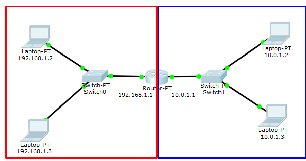
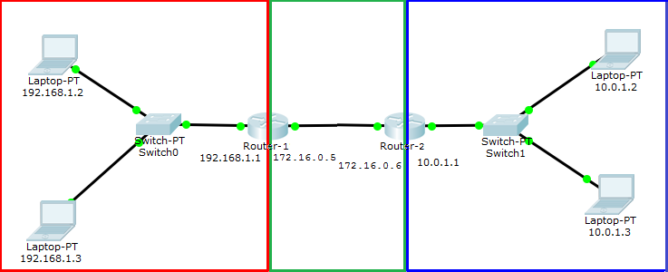
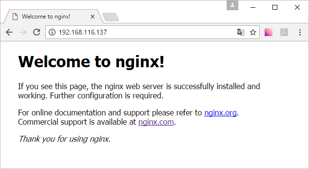
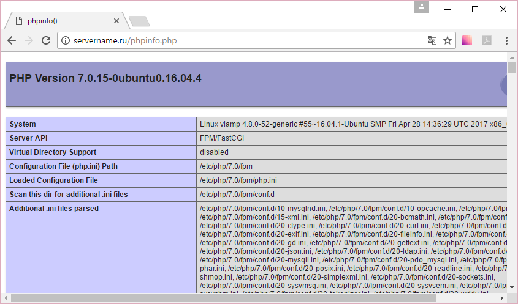
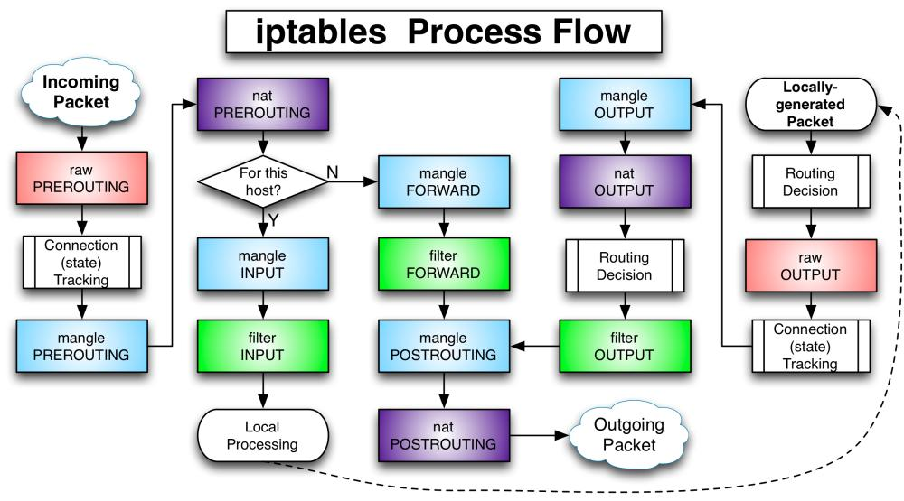

# Веб-сервисы

Сетевые возможности Linux. Веб-сервисы. Nginx, Apache2. Let’s encrypt. Сетевой фильтр netfilter и утилита iptables.

## Оглавление
- [Введение](#введение)
- [IP-адреса, маски, MAC-адреса](#ip-адреса-маски-mac-адреса)
- [Клиент-сервер](#клиент-сервер)
- [Маршрутизация](#маршрутизация)
- [Минимум для работы TCP/IP](#минимум-для-работы-tcpip)
- [MySQL](#mysql)
- [Протокол HTTP](#протокол-http)
- [Немного об Apache2 и Nginx](#немного-об-apache2-и-nginx)
- [Знакомство с Apache2](#знакомство-с-apache2)
- [Безопасность HTTP](#безопасность-http)
- [Nginx](#nginx)
- [Сетевой фильтр](#сетевой-фильтр)
- [Практическое задание](#практическое-задание)
- [Дополнительные материалы](#дополнительные-материалы)
- [Используемая литература](#используемая-литература)

## Введение
Для работы с сетевыми сервисами нужно понимать основы TCP/IP-стека, которые мы проходим в отдельном курсе.
Но даже сейчас нужно знать некий минимум о работе в сети, понимать, что такое IP-адрес и чем он отличается от MAC-адреса, что такое TCP- и UDP-порты, умение посмотреть открытые порты. Кроме того, защититься, разрешив трафик только на те сервисы, которые вы планируете использовать для обслуживания пользователей извне.
Чтобы реализовать полноценный LAMP, мы уже умеем устанавливать и настраивать Linux, Apache2 и PHP. Но дополнительно нам ещё нужна MySQL, да еще и почту тоже надо как-то отправлять. В этом нам поможет Postfix.
Кроме LAMP, также существуют LEMP или LNMP (Linux+[Enginx]*+MySQL+PHP и Linux+Nginx+MySQL+PHP), Nginx (произносится как [Энджинкс]), а также LNAMP =(Linux+Nginx+Apache+MySQL+PHP).
Сегодня мы научимся настраивать полноценный веб-сервер с почтой и базами данных.

### IP-адреса, маски, MAC-адреса
Более подробно данная тема раскрыта в уроке по TCP/IP.
Упрощенно можно считать, что IPv4-адрес — это 4 байта (октета), записанные в десятичной системе. Пример: 192.168.0.1 или 8.8.8.8. Они используются как адреса хостов, сетей и в качестве broadcast-адресов (широковещательных).
В классовой адресации первый адрес из диапазона будет адресом сети, а последний — broadcast-адресом. Маска позволяет определить по адресу, к какой сети он относится.
Пример: если для адреса 192.168.1.1 указана маска 255.255.255.0, это сеть 192.168.1.0, а широковещательный адрес — 192.168.1.255.
К слову, для адреса 192.168.1.1 может быть задана и маска 255.255.0.0. Тогда адресом сети будет уже 192.168.0.0, а broadcast`ом — 192.168.255.255. При этом адреса 192.168.1.0. и 192.168.1.255 могут быть адресами хостов, как и 192.168.1.1. Существует еще более сложная система адресации — бесклассовая (разбирается в курсе TCP/IP).
IP-адреса на машине можно посмотреть с помощью команды ifconfig:
```bash
user@user-virtual-machine:~$ ifconfig
ens33     Link encap:Ethernet  HWaddr 00:0c:29:29:80:b7
          inet addr:192.168.116.129  Bcast:192.168.116.255  Mask:255.255.255.0
          inet6 addr: fe80::da89:c6b5:3098:4d72/64 Scope:Link
          UP BROADCAST RUNNING MULTICAST  MTU:1500  Metric:1
          RX packets:127500 errors:0 dropped:0 overruns:0 frame:0
          TX packets:342871 errors:0 dropped:0 overruns:0 carrier:0
          collisions:0 txqueuelen:1000
          RX bytes:147726823 (147.7 MB)  TX bytes:302244447 (302.2 MB)
          Interrupt:19 Base address:0x2000

lo        Link encap:Local Loopback
          inet addr:127.0.0.1  Mask:255.0.0.0
          inet6 addr: ::1/128 Scope:Host
          UP LOOPBACK RUNNING  MTU:65536  Metric:1
          RX packets:1999 errors:0 dropped:0 overruns:0 frame:0
          TX packets:1999 errors:0 dropped:0 overruns:0 carrier:0
          collisions:0 txqueuelen:1
          RX bytes:665887 (665.8 KB)  TX bytes:665887 (665.8 KB)
```
Здесь видим два сетевых интерфейса: ens33 — Ethernet, с MAC-адресом 00:0c:29:29:80:b7, IP-адресом 192.168.116.129 и маской 255.255.255.0. Отсюда можем узнать, что хост принадлежит к сети 192.168.116.0. Есть статистика по сетевому интерфейсу, информация о локальном IPv6-адресе, MTU (это размер данных кадра (фактически, IP-пакета), в который могут быть упакованы данные TCP-сегмента или UDP-дейтаграммы. Он не может быть превышен).
Видим интерфейс локальной петли. Все адреса в сети 127.0.0.1 могут идентифицировать только конкретную машину и не уходят в сеть. Любая посылка, отправленная на адрес 127.0.0.1, не покинет компьютер (виртуальную машину). Такую адресацию используют для взаимодействия между локальными приложениями (Nginx обращается к Apache2, который слушает TCP-порт 80 по адресу 127.0.0.1; PHP обращается к MySQL, который слушает TCP-порт 3306 по адресу 127.0.0.1 и так далее).
Неформально адреса делят на «белые», которые могут маршрутизироваться в Интернете (например, 8.8.8.8, 5.255.255.55), и «серые», которые не обладают такой способностью и используются в локальных сетях. Две разные локальные сети могут использовать одни и те же диапазоны «серых» адресов: большинство DSL-модемов предоставляет по DHCP адреса в сети 192.168.1.1/255.255.255.0, а многие WiFi-роутеры — в сети 192.168.0.1/255.255.255.0
Тем не менее, даже компьютеры с «серыми» адресами могут выходить в Интернет:
*   если используется прокси-сервер — тогда будет доступен только Интернет, так как все остальные TCP/IP-службы будут ограничены локальной сетью. Даже если веб-адрес будет доступен по IP 5.255.255.55, команда ping 5.255.255.55 покажет, что связи нет;
*   или NAT — точнее NAPT, которая будет подменять «серый» адрес, предоставленный провайдером, на «белый» адрес провайдера.
Команда ping позволяет проверить доступность узла:
```bash
user@user-virtual-machine:~$ ping -c 4 5.255.255.55
PING 5.255.255.55 (5.255.255.55) 56(84) bytes of data.
64 bytes from 5.255.255.55: icmp_seq=1 ttl=128 time=41.1 ms
64 bytes from 5.255.255.55: icmp_seq=2 ttl=128 time=40.7 ms
64 bytes from 5.255.255.55: icmp_seq=3 ttl=128 time=41.3 ms
64 bytes from 5.255.255.55: icmp_seq=4 ttl=128 time=41.3 ms
--- 5.255.255.55 ping statistics ---
4 packets transmitted, 4 received, 0% packet loss, time 3006ms
rtt min/avg/max/mdev = 40.798/41.168/41.375/0.222 ms
user@user-virtual-machine:~$
```
Ключ -с указывает количество отправок. Если запустить без него, ping будет осуществляться до нажатия Ctrl+C.
ping с ключом -b позволяет сделать ping всех узлов в сети, используя broadcast-адрес:
```bash
# ping -b 192.168.116.255
```
Ответят все компьютеры, на которых не заблокирован ICMP-протокол, или используемые ICMP UDP-порты.

### Клиент-сервер
По большей части в сетевых подключениях фигурирует клиент-серверное взаимодействие. Программа-клиент, используя стек TCP/IP, обращается к программе-демону и получает (а иногда отправляет) контент.
При этом серверы — это программы-демоны. Они постоянно находятся в памяти и при запуске, которым управляет (в нашем случае) systemd, занимают TCP- или UDP-порт и слушают. В случае с UDP — ожидают приема сообщений, с TCP-портом — сессии. Для этого сервер открывает соответствующие сокеты (STREAM для TCP или DGRAM для UDP) и слушает.
Перечень прослушиваемых TCP-портов на машине можно посмотреть с помощью команды netstat:
```bash
# netstat -tl
```
Просмотреть список прослушиваемых UDP-портов:
```bash
# netstat -ul
```
Чтобы узнать номера портов без расшифровки (только номер порта), добавляем n. Опции можно комбинировать:
```bash
# netstat -ntul
```
Если хотим посмотреть список соединений во всех состояниях на текущий момент, добавляем a:
```bash
# netstat -ntua
```
Просмотреть список прослушиваемых UNIX-сокетов:
```bash
# netstat -x
```
Обратите внимание, что netstat — это не сканирование портов, он показывает непосредственно информацию от ядра операционной системы. Для скана портов понадобится утилита nmap. Сначала ее надо установить:
```bash
# apt install nmap
```
Теперь можно посмотреть, какие порты открыты на общедоступном сервере:
```bash
# nmap vk.com
```
Скорее всего, увидим порты 80 и 443 для веб-сервера. И это правильно, ведь лишний открытый порт — это риск проблем с безопасностью сервера (особенно, если это конфигурация по умолчанию).
Доменное имя преобразуется с помощью службы имен DNS:
```bash
# dig vk.com
root@user-virtual-machine:/etc/openvpn/ccd# dig vk.com
; <<>> DiG 9.10.3-P4-Ubuntu <<>> vk.com
;; global options: +cmd
;; Got answer:
;; ->>HEADER<<- opcode: QUERY, status: NOERROR, id: 39370
;; flags: qr rd ra; QUERY: 1, ANSWER: 2, AUTHORITY: 0, ADDITIONAL: 1
;; OPT PSEUDOSECTION:
; EDNS: version: 0, flags:; MBZ: 0005 , udp: 512
;; QUESTION SECTION:
;vk.com.                                IN      A
;; ANSWER SECTION:
vk.com.                 5       IN      A       87.240.165.82
vk.com.                 5       IN      A       95.213.11.180
;; Query time: 43 msec
;; SERVER: 127.0.1.1#53(127.0.1.1)
;; WHEN: Fri Apr 14 23:59:46 MSK 2017
;; MSG SIZE  rcvd: 67
```
Каждый раз при обращении к браузеру из URL берется следующая информация: http://site.ru/path/file?param=something.
Первая часть — протокол:
*   http — нешифрованный http, порт по умолчанию — 80;
*   https — шифрованный http (http, упакованный в tls), порт 443;
*   ftp — нешифрованный ftp, порт по умолчанию — 21.
Других протоколов браузеры обычно не знают.
Вторая часть — адрес сайта:
*   доменное имя — преобразуется в IP-адрес. Именно на него будет установлена TCP-сессия;
*   может быть сразу IP-адрес — например, http://192.168.0.1/admin.
Третья часть — путь (как правило, ресурса):
*   он будет передан на сервер — это может быть действительно путь в файловой системе;
*   может включать параметры — например, ?param=something, которые обработает php;
*   может быть полностью произвольным — и с помощью настроек Apache2 или Nginx переадресовываться скрипту (например, index.php), который разберет путь по собственным правилам.
Иногда (очень редко) используемый TCP-порт может быть указан явно.
Пример: http://site.ru:8080/music.mp3 означает, что, несмотря на использование http, будет подключен порт не 80, а 8080. Это может быть сервер радиостанции (например, icecast2). Соответственно, если TCP-сегменты приходят на порт 80, их получает приложение Apache2, если на 8080 — Icecast. Сами приложения используют динамические порты в верхнем диапазоне.
IANA зарезервировала для использования в качестве динамических порты 49152–65535. На практике этот диапазон сильно разнится в зависимости от того, в какой операционной системе используется. В Linux крайние значения диапазона можно посмотреть с помощью этой команды:
```bash
root@user-virtual-machine:/etc/openvpn/ccd #cat /proc/sys/net/ipv4/ip_local_port_range
32768   60999
```
Отличие динамических портов от используемых серверами в том, что прослушиваемый порт может принимать много соединений, а браузер, подгружая несколько картинок одной страницы, использует несколько TCP-соединений, и на каждое будет отдельный динамический порт. Это легко посмотреть с помощью tcpdump или wireshark.

| Уровень | Адреса | Что адресуем |
| :--- | :--- | :--- |
| 4 | Прикладной уровень | URL, email-адреса (как правило, на основе доменных имен), длина переменная в символьном виде |
| 3 | Транспортный уровень | TCP-порты и UDP-порты, длина — два байта |
| 2 | Сетевой уровень | IP-адреса. Для версии 4 —длина 4 байта |
| 1 | Уровень сетевых интерфейсов | MAC-адреса. Длина — 6 байт |

### Маршрутизация
Напрямую связь между хостами, адресуемыми IP-адресами, может быть только в рамках одной сети. Если адрес хоста 192.168.0.1, невозможно отправить сообщение на адрес 10.0.0.1. Для этих целей применяется маршрутизация. Она бывает статическая (задаваемая с помощью правил route) и динамическая (с помощью протоколов динамической маршрутизации — BGP, RIP, OSPF).
У каждого компьютера есть таблица маршрутизации. Она показывает, в какой сетевой интерфейс следует отправлять пакет с IP-адресом, если он предназначен получателю, доступному через канальный уровень напрямую (в той же физической среде); или на какой шлюз, находясь в этой сети, он будет перенаправлять пакеты в другую, к которой тоже подключен.



Если на компьютере 192.168.1.2 посмотрим таблицу маршрутизации, увидим:
```bash
user@user-virtual-machine:~$ route
```
или
```bash
user@user-virtual-machine:~$ ip route
Kernel IP routing table
Destination     Gateway         Genmask         Flags Metric Ref    Use Iface
default         192.168.1.1    0.0.0.0          UG    100    0        0 ens33
192.168.1.0   *                255.255.255.0    U     100    0        0 ens33
```
ip route может сокращаться до ip r — и все остальные команды утилиты ip сокращаются, как команды в cisco-маршрутизаторах (например, ip r a).
Это в случае, если Router подключен к внешней сети. Может быть и такая картина:
```bash
user@user-virtual-machine:~$ route
Kernel IP routing table
Destination     Gateway         Genmask         Flags Metric Ref    Use Iface
10.0.1.0        192.168.1.1    255.255.255.0    UG    100    0        0 ens33
192.168.1.0   *                255.255.255.0    U     100    0        0 ens33
```
Таблица маршрутизации присутствует на каждой машине с поддержкой стека TCP/IP (даже на Windows). Когда операционная система получает к отправке пакет, она по IP-адресу и маске сравнивает, в какой сетевой интерфейс и какой шлюз его отправить. В первом случае у нас было два маршрута. Один — для устройств, подключенных к той же сети, 192.168.1.0 в сетевой интерфейс ens33. И другой маршрут по умолчанию — на шлюз 192.168.1.1, подключенный (обратите внимание) к той же сети. Пакеты на все другие IP-адреса будут отправляться туда.
Во втором случае пакеты на адреса в сети 192.168.1.0 отправляются в сетевой интерфейс ens33, так как доступны через канальный уровень. Пакеты на адреса в сети 10.0.1.0 отправляются на адрес шлюза 192.168.1.0 в этой же сети. Остальные пакеты в данной конфигурации будут отброшены с сообщением No Route to host.
Чтобы это заработало, необходимо включить IP-forwarding:
```bash
# echo 1 > /etc/proc/sys/network/ipv4/ip_forward
```
Данное действие будет работать только до перезагрузки. Чтобы работало постоянно, нужно так:
```bash
# echo "net.ipv4.ip_forward=1" > /etc/sysctl.d/98-ip.conf
```
Сложнее настройка статической маршрутизации между двумя маршрутизаторами. Предположим, они у нас уже есть (в данном случае в роли маршрутизаторов выступают Linux-машины). У каждой из машин есть по два сетевых интерфейса. У клиентских машин ближняя машина-маршрутизатор указана в маршруте по умолчанию.
Но при этом машина 192.168.1.1, получая сообщение от 192.168.1.2, ничего не знает о сети 10.0.1.0. В прошлом случае знала, так как подобный маршрут возникает уже при поднятии соответствующего сетевого интерфейса. В этом легко убедиться, подняв нужный сетевой интерфейс (настоящий или псевдоним, как в примере) и посмотрев таблицу маршрутов:
```bash
# ifconfig ens33:dummy 172.30.1.1 netmask 255.255.255.0 up
# route
# ifconfig ens33:dummy down
```
Оба маршрутизатора должны быть настроены на пересылку пакетов (IP Forwarding необходимо разрешить на обеих машинах).



Соответствующие маршруты надо указать и на маршрутизаторах.
На Router-1:
```bash
# route add -net 10.0.1.0 netmask 255.255.255.0 gw 172.16.0.6
```
или
```bash
# ip r add 10.0.1.0/24 via 172.16.0.6
```
Указали, что маршрут в сеть 10.0.1.0 знает машина 172.16.0.6. Обратите внимание: указываем адрес в нашей сети.
На Router-2:
```bash
# route add -net 172.16.0.0 netmask 255.255.255.0 gw 172.16.0.5
```
или
```bash
# ip r a 172.16.0.0/24 via 172.16.0.5
```
После этого машины из сетей 192.168.1.0 и 10.0.1.3 смогут работать друг с другом. Если между Router-1 и Router-2 нет прямой связи, а надо адресовать частные адреса, понадобится уже тоннель.

### Минимум для работы TCP/IP
Для работы в TCP/IP в целом (и в Интернете в частности) у машины должны быть следующие настройки:
*   MAC-адрес у сетевой карты (присутствует по умолчанию);
*   IP-адрес (даже «серый», если шлюз использует NAT);
*   маска сети;
*   маршрут по умолчанию (IP-адрес шлюза);
*   IP-адреса одного или двух DNS-серверов для преобразования доменных имен в IP-адреса (часто DNS-сервером выступает шлюз, но могут быть указаны публичные кэширующие DNS-сервера от Google: 8.8.8.8 и 8.8.4.4).
Все настройки (кроме первого пункта) могут быть получены по DHCP при подключении компьютера к сети (или загрузке ОС, если к сети уже подключен).

## MySQL
Устанавливаем:
```bash
sudo apt-get install mysql-server mysql-client mysql-common php7.0-mysql
```
При установке будет предложено создать пароль для рута (не линуксового, а майскьюэлового – это разные вещи).
Правим /etc/mysql/mysql.conf.d/mysqld.cnf:
bind-address=другой машины либо 0.0.0.0
Например, bind-address=192.168.131.1, если вы хотите с хостовой машины под виндовс обращаться к MySQL. Либо оставьте:
bind-address=127.0.0.1
Рекомендуется:
```ini
[mysqld]
skip-character-set-client-handshake
character-set-server=utf8
init-connect='SET NAMES utf8'
collation-server=utf8_general_ci
...
[client]
default-character-set=utf8
..
```
Добавляем в файл /etc/mysql/conf.d/mysqldump.cnf строчку:
```ini
[mysqldump]
default-character-set=utf8
```
Очистить MySQL от мусора. Запустить:
```bash
mysql_secure_installation
```
Зайти рутом:
```bash
mysql -u root -p
```
Создаем базу mydatabase:
```sql
CREATE DATABASE mydatabase;
```
Создаём пользователя user с паролем 1234 и даем ему все права на эту базу:
```sql
GRANT ALL ON mydatabase.* TO user@localhost IDENTIFIED BY '1234';
Exit
```
Заходим пользователем user и вводим пароль:
```bash
mysql -u user -p
1234
```
Указываем, какую базу будем использовать:
```sql
USE mydatabase;
```
Создаем таблицу
```sql
create table mytable (
id int not null auto_increment,
txt varchar(100),
n int,
primary key (id));
```
Добавляем значения:
```sql
insert into mytable (txt,n) values('Wall Street',7);
insert into mytable (txt,n) values('5th Avenu',1);
...
select * from mytable;
```
Получаем на выход содержимое таблицы. Если хочется работать в веб-интерфейсе, можно установить phpMyAdmin. Можно подготовить команды в отдельный файл, например, cmds.sql:
```sql
USE mydatabase;
insert into mytable (txt,n) values('Gorki park',7);
insert into mytable (txt,n) values('Kremlin',NULL);
```
Выполняем данные из файла:
```bash
mysql -u user -p mydatabase <cmds.sql
```
Можно зайти юзером и сделав USE и SELECT полюбоваться результатом.
Делаем бэкап:
```bash
mysqldump -u user -p mydatabase >backup.sql
```
С помощью скриптов и крона можно сделать это регулярным. Восстанавливаем (и воспользуемся один раз mysqladmin, а не mysql).
Создаем рутом базу newbase:
```bash
mysqladmin -u root -p create newbase
```
Импортируем в newbase бэкап:
```bash
mysql -u root -p --default-character-set=utf8 newbase<backup.sql
mysql -u root -p
USE newbase;
select * from mytable;
exit
```

## Введение
Веб-сервер — сервис, принимающий HTTP-запросы и выдающий ответы, как правило, содержащие HTML-код (но могут присутствовать и двоичные файлы).
Apache2 — популярный и, пожалуй, лидирующий веб-сервер. Есть и другие.
*   lighthttpd — используется во встраиваемом оборудовании с линуксом на борту;
*   Microsoft IIS — в основном на Windows Server;
*   Nginx — еще один популярный веб-сервер, часто работающий в связке с Apache;
*   Google Web Server — вариация Apache2 от Nginx.
Технически веб-приложение не обязательно должно использовать отдельный веб-сервер. Возможна реализация протокола HTTP внутри самого приложения, но такие решения могут применяться для встраиваемых систем, и по большей части применяется тот или иной веб-сервер.
LAMP — Linux+Apache2+MySQL+PHP — самая популярная конфигурация сервера, ориентированного на выдачу веб-содержимого. Linux мы уже умеем устанавливать и настраивать, осталось изучить остальные компоненты LAMP.
Стоит отметить, что Apache2 может использоваться и в Windows, как для сервера, так и для локальной разработки (также такая конфигурация называется WAMP).

## Протокол HTTP
Простой текстовый протокол, позволяющий запросить у веб-сервера информацию. HTTP-протокол позволяет передавать заголовки (информация о user аgent, в роли которого, как правило, выступает браузер, но не всегда: curl и wget тоже user agent, таким образом, не каждый HTTP-клиент — браузер. Веб-сервер также сообщает информацию о себе, метаинформацию о документе, кодировку и тип содержимого: MIME-type, что позволит клиенту корректно раскодировать информацию).
Существует несколько типов запросов, но наиболее часто применяются GET и POST.
GET служит для запроса страницы. Как правило, в качестве адреса ресурса в GET передаётся путь к файлу относительно веб-директории. Например, /articles/article.html.
Если запрашивается веб-приложение, ему могут быть переданы параметры /articles.php?page=12.
Возможно настроить веб-сервер так, чтобы веб-приложение было замаскировано, а параметры передавались через имена «папок» и «файлов». То есть /articles/pages/12.html может означать как файл 12.html, хранящийся в директории pages, которая находится в директории articles, так и некий скрипт, у которого запрашивается некая статья с номером 12.
Такие запросы, благодаря параметрам или пути к ресурсу, могут передавать информацию на сервер. Но такие значения кешируются и сохраняются в истории браузера, поэтому для передачи информации на сервер используются запросы POST.
Как правило, с помощью POST отправляются новые файлы на веб-сервер (upload), записи на форумах и блогах, логин и пароль для входа в ту или иную систему. Запрос POST, как правило, передается скрипту на PHP (или другом языке), и тот его обрабатывает.
В ответ сервер может вернуть HTML-код запрошенного ресурса или двоичный файл (например, картинку). В ответе веб-сервер сообщает код, например:
*   200 Ok — все хорошо, ресурс найден и отправлен пользователю;
*   201 Created — новая страница на сайте создана (например, скриптом PHP, который получил запрос POST);
*   301 — ресурс переехал;
*   404 — страница не найдена (либо в файловой системе, либо скрипт не сумел найти соответствующую запись в БД);
*   403 — доступ запрещен (например при HTTP-аутентификации пользователь не сумел ввести правильный пароль);
*   500 — ошибка сервера (ошибка в конфигурационном файле).

## Немного об Apache2 и Nginx
Протокол HTTP, как правило, работает через TCP-сессию. Поэтому для приёма нескольких одновременных соединений веб-сервер должен использовать процессы или потоки.
Чтобы определить, как осуществлять распараллеливание обработки, в Apache2 используется mpm — Apache Multi-Processing Module, то есть «Модуль мультипроцессовой обработки». Существуют также следующие варианты:
*   mpm-prefork — используются заранее созданные процессы, стандартный вариант работы;
*   mpm-itk — основан на prefork, но позволяет также запускать процессы от имени разных пользователей. Используется хостерами.
*   mpm-worker — использует заранее созданные потоки (p_threads). Логично, что такой способ будет нестабильным, учитывая специфику работы Apache2: PHP, запущенный в качестве модуля будет выполнен внутри потока, а не процесса.
В этом принципиальная разница в работе Apache2 только со статическим содержимым (mpm-worker, используются потоки) или со скриптами (mpm-prefork, используются предварительно созданные процессы). Разница потоков и процессов заключается в том, что потоки работают с одними и теми же данными. Данные процессов изолированы от других процессов (даже дочерних). Это небезопасно при выполнении в потоках разного кода. Поэтому для исполнения php и других скриптов применяется mpm-prefork.
Nginx использует другой механизм: он создает один мастер-процесс и один или более процессов-воркеров (worker). Как правило, на одном CPU используется один воркер, но может применяться и больше, например при интенсивном вводе-выводе. Все входящие подключения распределяются по воркерам. Каждый воркер использует одну очередь и более низкоуровневые механизмы, чем потоки, такие, как kqueue во FreeBSD или epoll в Linux. Каждый воркер может обработать довольно значительное число соединений. Используя низкоуровневые возможности операционной системы, и вместо того, чтобы доверять переключение между задачами процессорного времени с помощью потоков, Nginx самостоятельно реализует обработку одновременных соединений. Именно поэтому Nginx может работать только со статическим содержимым. Но этим же достигаются высокое быстродействие и отказоустойчивость. Чтобы использовать динамическое содержимое, генерируемое скриптами, Nginx может получать результаты выполнения скриптов от Apache2 или непосредственно PHP, работающего через модуль php-fpm. Так как в таком случае скрипты выполняются в другом процессе, работа Nginx безопасна. Nginx будет хорошо работать, если файлы, к которым обращаются HTTP-запросы, не блокируются другими приложениями. В случае появления «медленного запроса» при использования механизма пула потоков такой запрос отдается отдельному потоку.
Разница между Apache2 и Nginx в том, что модули Apache2 выполняются в рамках одного приложения. Это работает быстрее, чем если бы модуль находился в отдельном приложении. Но так как потоки в данном случае использовать небезопасно (один скрипт может повредить данные другого скрипта, если они запускаются в потоках), Apache2 использует по умолчанию процессы. Каждый запрос выполняется в отдельном процессе,созданном заранее (такой механизм называется prefork).
Таким образом, Apache2 оказывается более медленным в выдаче статического содержимого, но удобным для работе с динамическим контентом. Именно поэтому часто используется связка Nginx+Apache2.

## Знакомство с Apache2
Для начала познакомимся с Apache2. Он существовал раньше Nginx, и хотя сейчас Nginx активно вытесняет Apache2, минимальное знакомство с ним нужно. Почему? Многие программы (Zabbix, Asterisk) и CMS (WordPress, Drupal и т.д.) заточены под Apache2. Чтобы настроить их работу на Nginx, нужно представлять архитектуру Apache2.
Для установки Apache2 выполним команду:
```bash
$ sudo apt-get -y install apache2
```
Легко проверить, что Apache2 установился. Узнайте IP-адрес вашей машины и введите его в браузере. Вы должны увидеть стартовую страницу-заглушку веб-сервера Apache2.
Изучите структуру конфигурации в директории /etc/apache2.
Обратите внимание, что вы не найдёте httpd.conf. Если вы где-то нашли информацию о данном конфигурационном файле, она уже устарела. Вместо него применяется набор из apache2.conf и конфигурационных файлов, расположенных в соответствующих директориях.
В Debian и Ubuntu используется удобный подход на основе символических ссылок. Директория *-available хранит доступные конфигурационные файлы, а *-enabled — символические ссылки на активные настройки в данный момент.

### Конфигурационные файлы, conf-available/conf-enabled
Большинство настроек хранятся в директориях conf-available и conf-enabled. Папка conf-available содержит файлы *.conf — все доступные конфигурационные файлы. Папка conf-enabled содержит символические ссылки на конфиги из conf-available. Именно эти конфигурационные файлы активны, остальные «выключены». Утилиты a2enconf и a2disconf включают и выключают соответствующий конфиг. Фактически они создают/удаляют символическую ссылку через ln -s и предлагают послать серверу Apache2 сигнал restart или reload.

### Модули Apache2, mods-available и mods-enabled
Директории mods-available и mods-enabled хранят модули. Если модуль не был установлен, его следует установить через apt-get install.
Активация/деактивация модулей выполняется аналогично конфигурационным файлам через утилиты a2enmod/a2dismod.

### Виртуальные хосты, sites-available и sites-enabled
Конфигурационные файлы для виртуальных хостов содержатся в директориях sites-available и sites-enabled. Исходно файлы находятся в sites-available и они не активны. При активации сайта создается символическая ссылка в директории sites-enabled на соответствующий конфигурационный файл из директории sites-available. При деактивации символическая ссылка из директории sites-enabled удаляется, а сам конфигурационный файл в директории sites-available остаётся, что очень удобно, так как можно подключать/отключать сайты.
Активация или деактивация хоста (если клиент не оплатил хостинг) идет через команды a2ensite и a2dissite.
Обратите внимание на два файла, присутствующих по умолчанию: 000-default.conf и default-ssl.conf.
Это пример сайта (отвечает для всех доменных имен по IP-адресу вашего сервера), первый для протокола HTTP (порт 80), второй для протокола HTTPS (порт 443).
По умолчанию включен только HTTP.

### Создаём простейший конфигурационный файл
Обратите внимание, что при попытке запуска веб-сервер выдает предупреждение:
```
Could not reliably determine the server's fully qualified domain name, using 127.0.1.1 for ServerName
```
Можно сделать соответствующую запись в файле /etc/apache2.conf, но мы пойдем другим путем: создадим fqdn.conf в директории conf-available и активируем конфиг.
```bash
$ echo "ServerName localhost" | sudo tee /etc/apache2/conf-available/fqdn.conf
$ sudo a2enconf fqdn
```

### Работаем с модулями
#### Пример 1. Модуль активен
Предположим, IP-адрес вашей виртуальной машины — 192.168.131.136. Тогда с помощью модуля Apache2 status мы можем посмотреть состояние сервера. Но если вы попытаетесь просмотреть в браузере http://192.168.131.136/server-status, увидите ошибку 403. Доступ запрещен.
Что это означает? Если мы посмотрим в mods-enable, увидим, что модуль status там присутствует, стало быть, он активен. Значит ситуация не в том, что модуль не активен, а в настройках прав доступа. Можем посмотреть данный ресурс локально, например, в текстовом браузере lynx:
```bash
$ lynx  http://192.168.131.136/server-status
```
Или перейдя через Alt-F7 в X-Windows и запустив этот адрес в Firefox.
Работает. Но можно настроить так, чтобы из сети вашей хостовой машины тоже можно было посмотреть данный файл. Откройте файл /etc/apache2/mods-available/status.conf и после строки:
```
Require local
```
...добавьте:
```
Require ip 192.168.131.0/24
```
Исправьте на адрес вашей сети.
Необходимо, чтобы сервер перечитал конфигурацию:
```bash
$ sudo systemctl reload apache2
```
#### Пример 2. Модуль установлен, но не активен
Следующий пример. Кроме модуля status, есть модуль info.
Откройте http://192.168.131.136/server-info
Независимо от того, с хоста или гостевой машины вы смотрите, будет ошибка 404 (not found).
Если мы посмотрим в mods-enabled, мы не найдем файл info, но в mods-available он присутствует. Он установлен, но не активен.
Поэтому выполняем:
```bash
$ sudo a2enmod info
$ sudo systemctl restart apache2
```
Проверяем.
Также можете поправить IP-адреса, чтобы Info можно было видеть с машины-хоста (аналогично выше проделанным операциям).

#### Пример 3. Модуль не установлен
Например, php7. Для этого установим его и некоторые дополнения (для работы с MySQL, Curl — http-клиент для работы с удаленными файлами, json — часто применяемый транспорт между бэкендом и фронтендом):
```bash
$sudo apt-get -y install php7.0 libapache2-mod-php7.0 php7.0-mysql php7.0-curl php7.0-json
```
Перезапускаем веб-сервер:
```bash
$ sudo systemctl reload apache2
```
Проверяем:
```bash
$ php -v
```
Залогинимся пользователем root и создадим phpinfo:
```bash
# cat >/var/www/html/info.php
<?php
phpinfo();
?>
Ctrl-D
```
Проверяем: http://192.168.131.136/info.php.
Чтобы каждый раз не писать IP-адрес, можно в файле (если ваша машина-хост — Windows) c:\windows\system32\drivers\etc\hosts прописать его с помощью редактора FAR или Notepad++.
192.168.131.136 test.tst

### Виртуальные хосты (много сайтов на одном сервере)
Если пропишем в файле c:\windows\system32\drivers\etc\hosts (если ваша машина-хост — Windows) или в /etc/hosts (если Linux или Mac OS):
```
192.168.131.136 test.tst
192.168.131.136 test.a
192.168.131.136 test.b
```
…все равно каждый раз будет выдаваться одна и та же страница-заглушка.
Как поддерживать несколько сайтов?
*   Использовать разделение по портам. test.tst ведет на один сайт, а test.tst:8080 — на другой. Так иногда осуществляют доступ к админке, но чаще всего так поступают, если на сервере работает несколько приложений-серверов HTTP. Например, на test.tst на 80 порте по умолчанию работает Apache2, а на test.tst:8080 — сервер онлайн-радиостанции icecast2. В последнее время так поступать не принято, так как с помощью Nginx можно осуществлять проброс трафика (например, test.tst/audio/ будет передавать трафик icescat2, слушающему трафик на 127.0.0.1:8080, а остальные пути — на 127.0.0.1:80, который слушает Apache2).
*   Использовать несколько IP-адресов. В этом случае многосайтовость будет осуществляться благодаря механизму DNS. Веб-сервер будет определять сайт по IP-адресу.
*   Использовать механизм виртуальных хостов. В этом случае в протоколе http передается заголовок host, который указывает доменное имя. В этом случае сайты будут различаться по хосту.

#### Многосайтовость по порту
Скопируйте 0000-default.conf в 8080.conf. Отредактируйте. Исправьте, чтобы получилось так:
```apache
<VirtualHost *:8080>
```
DocumentRoot /var/www/8080
Создайте соответствующую директорию и положите туда файл, указав в title и h1, что это именно сайт с порта 8080.
В ports.conf добавьте:
```
Listen 8080
```
Активируйте сайт и перезагрузите сервер:
```bash
# a2ensite 8080
# systemctl reload apache2
```
Проверьте. Деактивируйте сайт.

#### Многосайтовость по IP-адресу
Поднимите новый IP-адрес на вашей машине:
```bash
# ifconfig ens33:second 172.16.0.1 netmask 255.255.0.0 up
```
В Windows (Win+X > Командная строка > Административная) пропишите маршрут на этот адрес через IP-адрес вашей виртуальной машины:
```
c:\>route add 172.16.0.0 mask 255.255.0.0 192.168.131.128
```
192.168.131.128 — адрес гостевой Ubuntu.
Добавьте адрес 172.16.0.1 в hosts в Windows (исправьте):
```
172.16.0.1 test.b
```
Скопируйте 000-default.conf в test.b. Отредактируйте test.b:
```apache
<VirtualHost 172.16.0.1:80>
```
Не забудьте создать директорию, указать ее в test.b и создать индекс. Активируйте сайт, попросите веб-сервер перечитать конфигурацию, проверьте. Сравните в браузере сайты test.a и test.b.
Теперь деактивируйте сайт, удалите конфигурационный файл test.b и отключите сетевой интерфейс ens33:second.
Не забудьте удалить маршрут в Windows:
```
c:\>route delete 172.16.0.0 mask 255.255.0.0 192.168.131.128
```
#### Многосайтовость по домену
Скопируйте 000-default.conf в test.a. Раскомментируйте в файле ServerName и впишите туда test.a:
```
ServerName test.a
```
Не забудьте создать директорию, указать ее в test.a и создать индекс. Активируйте сайт, попросите веб-сервер перечитать конфигурацию, проверьте.
Сравните. Удалите сделанные изменения или настройте сайты.

## Безопасность HTTP
HTTP — небезопасный протокол. Пароли, отправленные через POST или сообщенные вам, могут попасть в руки любому, кто имеет доступ к одной из промежуточных машин — провайдеру, соседям по хостингу и так далее.
Поэтому все чаще используется HTTPS. HTTP оправдан только в том случае, если сайт только отдает незашифрованное содержимое (например, простейшая домашняя страничка или информационный ресурс). Если на сайте присутствует форма авторизации, используйте HTTPS. Более того, наличие HTTPS является основным требованием Google и Яндекс для ранжирования, так что этот протокол оправдан даже для сайтов, не получающих данных от пользователя.
Технически HTTPS — это протокол HTTP, использующий сессию TLS. А HTTP непосредственно использует сессию TCP. Для работы по HTTPS принято использовать порт 443.

### TLS
TLS — новый протокол безопасности, основанный на SSL (TLSv1 успел устареть, это надо учитывать). Его идея состоит в использовании алгоритма RSA, сложность взлома которого определяется алгебраической сложностью задачи нахождения простых сомножителей натурального числа.
RSA — алгоритм асимметричного шифрования. Вместо общего симметричного ключа используется пара асимметричных ключей: публичный и приватный. То, что зашифровано одним, может быть расшифровано парным ключом. При этом публичный ключ распространяется корреспондентам, а приватный остается только у выпустившего его. Публикация приватного ключа — ошибка, требующая перевыпуска ключа и сертификатов.
Ассиметричные алгоритмы могут одновременно решить только одну задачу из двух:
*   шифрование трафика — если шифруется публичным ключом, расшифруется приватным. Зашифровать может любой, а прочитать — только владелец публичного ключа. Трафик не доступен для прослушивания, но подтвердить подлинность отправителя невозможно;
*   аутентификация — проверка подлинности абонента. Отправитель шифрует приватным ключом, а получатели расшифровывают публичным. Если они смогли расшифровать, значит послать мог только отправитель, чей публичный ключ у них есть. Но расшифровать такой трафик может любой.
Так как на практике требуется решение обеих задач, применяется третья сторона — удостоверяющий центр. Публичные ключи удостоверяющих центров импортируются в браузеры их производителем. Удостоверяющая способность таких центров (CA) не вызывает сомнений.
Владелец сайта выпускает приватный и публичный ключи и подписывает публичный ключ у удостоверяющего центра. Для этого центру сертификации передается запрос на подпись по стандарту X.509, а в ответ он отправляет сертификат. Так браузер может проверить, является ли сайт тем, за кого себя выдает.
Сертификат — публичный ключ и дополнительная информация, хэш от которой зашифрован приватным ключом удостоверяющего центра. Подпись ключа — услуга, предоставляемая удостоверяющими центрами. Можно подписать сайт собственно сгенерированным удостоверяющим центром, но браузеры будут выводить сообщение, что валидность ресурса проверить невозможно. Но для тестирования вариант самоподписанного сертификата подойдет.
Зачастую на практике, говоря SSL, подразумевают TLS. Тем не менее, SSL v3 и TLS v1 уже признаны небезопасными, и это надо иметь в виду при настройке сервисов, использующих шифрование.

### Проверка mod_ssl и доступ по HTTPS
Активирует default-ssl сайт:
```bash
# sudo a2ensite default-ssl
```
Перечитайте конфигурацию сервера и проверьте — ничего не вышло, не активирован модуль ssl.
Активируйте:
```bash
# sudo a2enmod ssl
```
Перезагрузите сервер, проверьте test.tst — теперь все работает. Если посмотрим, какой сертификат выдан, увидим:
Имя сертификата: Ubuntu.
Выдан Ubuntu.
Можно попробовать подготовить свой сертификат для проверки работы.
Если установлен openssl, сгенерировать самоподписанный ключ можно с помощью скрипта /usr/lib/ssl/apache2­/mod_ssl/gentestcrt.sh.
Мы рассмотрим вариант генерации самоподписанного сертификата по шагам.

### Настройка сайта с самоподписанным сертификатом
Разберем ручной способ создания самоподписанных сертификатов. На практике используется подпись сертификатов настоящим удостоверяющим центром. Генерация самоподписанных сертификатов может быть полезна для понимания механизма работы, а также для тестирования.
Сначала создадим собственный центр сертификации (CA). Для этого добавим частный ключ для CA:
```bash
# cd /etc/apache2/
# mkdir ssl
# chmod 700 ssl
# cd ssl
#openssl genrsa -des3 -out my-ca.key
```
Секретная фраза — пароль к центру сертификации. Создаем сертификат.
```bash
# openssl req -new -x509 -days 3650 -sha256 -key my-ca.key -out my-ca.crt
```
Придется ввести пароль, который уже запомнили, и ответить на вопросы. Создаем ключ для Apache2:
```bash
# openssl genrsa -des3 -out my-apache.key 1024
```
Потребуется ввести секретную фразу. Ее мы удалим из сертификата сервера Apache, чтобы она не запрашивалась при каждом старте:
```bash
# openssl rsa -in my-apache.key -out new.my-apache.key
# mv new.my-apache.key my-apache.key
```
Создаем запрос на подпись сертификата Certificate Signature Request (csr), чтобы подписать в центре сертификации:
```bash
# openssl req -new -key my-apache.key -out my-apache.csr
```
Раньше необходимо было поместить в поле Common name FQDN доменное имя — например, test.tst. Сейчас используются только значения DNS.1, DNS.2 (и так далее) в секции [ alt_names ], так как в поле Common name можно было указать только одно доменное имя. Более того, сейчас Google Chrome даже не пытается анализировать поле Common name.
Поэтому понадобится сделать еще ряд дополнительных действий (до выполнения шагов, изложенных выше), либо использовать скрипт генерации сертификата.
Отредактируем файл /etc/ssl/openssl.cnf:
```bash
nano /etc/ssl/openssl.cnf
```
Раскомментируем строку:
```
req_extensions = v3_req
```
Дальше нужно найти секцию [ v3_req ] (пробелы имеют значение). Найдите в разделе такие строки:
```
basicConstraints = CA:FALSE
keyUsage = nonRepudiation, digitalSignature, keyEncipherment
```
Сразу под ними допишем следующее:
```
subjectAltName = @alt_names
[ alt_names ]
DNS.1 = www.server.com
DNS.2 = server.com
DNS.3 = admin.server.com
```
Секция alt_names будет содержать альтернативные имена доменов, которые требуется включить в сертификат. Замените их на свои. После этой операции нужно вернуться на три шага назад, сгенерировать my-apache.key и csr.
Теперь подпишем сертификат Apache в центре сертификации:
```bash
# openssl x509 -req -in my-apache.csr -out my-apache.crt -sha256 -CA my-ca.crt -CAkey my-ca.key -CAcreateserial -days 36
# chmod 0400 *.key
```
В качестве альтернативы всем вышеописанным действиям можно воспользоваться следующим скриптом. Поменяйте значения в секциях [ dn ], [ alt_names ] и добавьте при необходимости DNS.2 (и т.д.):
```bash
#!/bin/bash

echo "Creating key and request..."
openssl req -new -nodes -keyout my-apache.key -out my-apache.csr -config <(
cat <<-EOF
[req]
default_bits = 4096
prompt = no
default_md = sha256
req_extensions = req_ext
x509_extensions = usr_cert
distinguished_name = dn

[ dn ]
C=RU
ST=Moscow Region
L=Moscow
O=Geekbrains, OOO
OU=IT department
emailAddress=admin@geekbrains.ru
CN = *.geekbrains.ru

[ usr_cert ]
basicConstraints=CA:FALSE
nsCertType = client, server, email
keyUsage = nonRepudiation, digitalSignature, keyEncipherment
extendedKeyUsage = serverAuth, clientAuth, codeSigning, emailProtection
nsComment = "OpenSSL Generated Certificate"
subjectKeyIdentifier=hash
authorityKeyIdentifier=keyid,issuer

[ req_ext ]
subjectAltName = @alt_names
basicConstraints = CA:FALSE
keyUsage = nonRepudiation, digitalSignature, keyEncipherment
extendedKeyUsage = serverAuth, clientAuth, codeSigning, emailProtection

[ alt_names ]
DNS.1 = *.geekbrains.ru
EOF
)

echo "Signing..."
openssl x509 -req -in my-apache.csr -CA my-ca.crt -CAkey my-ca.key -CAcreateserial -out my-apache.crt -days 5000 -extensions req_ext -extfile <(
cat <<-EOF
[req]
default_bits = 4096
prompt = no
default_md = sha256
req_extensions = req_ext
x509_extensions = usr_cert

[ usr_cert ]
basicConstraints=CA:FALSE
nsCertType = client, server, email
keyUsage = nonRepudiation, digitalSignature, keyEncipherment
extendedKeyUsage = serverAuth, clientAuth, codeSigning, emailProtection
nsComment = "OpenSSL Generated Certificate"
subjectKeyIdentifier=hash
authorityKeyIdentifier=keyid,issuer

[ req_ext ]
subjectAltName = @alt_names
basicConstraints = CA:FALSE
keyUsage = nonRepudiation, digitalSignature, keyEncipherment
extendedKeyUsage = serverAuth, clientAuth, codeSigning, emailProtection

[ alt_names ]
DNS.1 = *.geekbrains.ru
EOF
)
echo "Done!"
```
Далее редактируем default-ssl.conf:
```
SSLCertificateFile /etc/apache2/ssl/my-apache.crt
SSLCertificateKeyFile /etc/apache2/ssl/my-apache.key
SSLCACertificateFile /etc/apache2/ssl/my-ca.crt
```
Перезагружаем сервер, проверяем https://test.tst. Смотрим информацию о сертификате и видим, что отображается созданный и подписанный нами образец.

### Создание сертификата с помощью Let’s Encrypt
Сначала установим Certbot:
```bash
$ cd /usr/local/sbin
$ sudo wget https://dl.eff.org/certbot-auto
$ sudo chmod a+x /usr/local/sbin/certbot-auto
```
Получим сертификат:
```bash
$ sudo certbot-auto certonly --webroot --agree-tos --email myemail@domen.ru -w /var/www/ -d domen.ru -d www.domen.ru
$ sudo certbot-auto --apache
```
*   `--webroot` — специальный ключ, повышающий надежность работы Certbot под Nginx;
*   `--agree-tos` — автоматическое согласие с Условиями предоставления услуг (Terms of Services);
*   `--email myemail@domen.ru` — ваш e-mail. Будьте внимательны: его нельзя изменить. Он потребуется для восстановления доступа к домену и для его продления;
*   `-w /var/www` — указываем корневую директорию сайта;
*   `-d domen.ru` — через ключ -d указываем, для каких доменов запрашиваем сертификат. Начинать надо c домена второго уровня domen.ru и через такой же ключ указывать поддомены: например, -d www.domen.ru -d opt.domen.ru.
Команда sudo certbot-auto --apache внесет необходимые изменения в конфигурационные файлы Apache.
Скрипт Certbot начнет работу, предложит установить дополнительные пакеты. Соглашайтесь и ждите завершения.
При успешном завершении работы Certbot поздравляет с генерацией сертификата и выдает следующее сообщение:
```
IMPORTANT NOTES:
 - If you lose your account credentials, you can recover through
   e-mails sent to sammy@digitalocean.com
 - Congratulations! Your certificate and chain have been saved at
   /etc/letsencrypt/live/domen.com/fullchain.pem. Your
   cert will expire on 2017-03-12. To obtain a new version of the
   certificate in the future, simply run Let's Encrypt again.
 - Your account credentials have been saved in your Let's Encrypt
   configuration directory at /etc/letsencrypt. You should make a
   secure backup of this folder now. This configuration directory will
   also contain certificates and private keys obtained by Let's
   Encrypt so making regular backups of this folder is ideal.
 - If like Let's Encrypt, please consider supporting our work by:

   Donating to ISRG / Let's Encrypt:   https://letsencrypt.org/donate
   Donating to EFF:                    https://eff.org/donate-le
```
Когда установка SSL-сертификата Apache Ubuntu будет завершена, вы найдете созданные файлы сертификатов в папке /etc/letsencrypt/live/domen.ru/. В этой папке будет четыре файла:
*   cert.pem — ваш сертификат домена;
*   chain.pem — сертификат цепочки Let's Encrypt;
*   fullchain.pem — cert.pem и chain.pem вместе;
*   privkey.pem — секретный ключ вашего сертификата.
Теперь вы можете зайти на сайт по https. Чтобы проверить, как работает SSL и правильно ли выполнена установка ssl-сертификата на сайт, можно открыть в браузере эту ссылку:
https://www.ssllabs.com/ssltest/analyze.html?d=domen.ru&latest
SSL настроен. Стоит иметь в виду, что сертификаты, полученные от Let’s Encrypt, действительны в течение 90 дней, поэтому рекомендуется продлевать их каждые 60 дней.
Клиент letsecnrypt имеет команду renew, которая позволяет проверить установленные сертификаты и обновить их, если до истечения срока осталось меньше 30 дней.
Чтобы запустить процесс обновления для всех настроенных доменов, выполните:
```bash
$ sudo certbot-auto renew
```
Если сертификат был выдан недавно, команда проверит его дату истечения и выдаст сообщение, что продление пока не требуется. Если вы создали сертификат для нескольких доменов, в выводе будет показан только основной. Но обновление будет актуально для всех.
Самый простой способ автоматизировать этот процесс — добавить вызов утилиты в планировщик cron. Для этого выполним команду:
```bash
$ crontab -e
```
И добавим строку:
```
30 2 * * 1 /usr/local/sbin/certbot-auto renew
```
Команда обновления будет выполняться каждый понедельник в 2:30. Информация про результат выполнения будет сохраняться в файл /var/log/le-renewal.log.

## Nginx
Для работы nginx нам понадобится свободный 80 порт, поэтому убедитесь что он не занят сервером Apache. Если же он им используется, смените порт на 8080. Не забудьте перезапустить Apache. Также можете удалить или переименовать стандартную страничку от Apache /var/www/html/index.html .
Теперь можно приступать к установке и дальнейшей настройке nginx:
```bash
apt install nginx
```
Если хочется совсем новую версию, нужно воспользоваться репозиторием производителя, но надо понимать, что конфигурация будет не в debian-стиле. Поэтому лучше сохранить конфигурационные файлы, они удачно настроены для работу с Ubuntu, возможно, придется в них подглядеть.
На официальном сайте Nginx в wiki-сообществе на странице https://www.nginx.com/resources/wiki/start/topics/tutorials/install/ подробно указано, что делать (для Ubuntu 16.0).
Сначала надо создать файл /etc/apt/sources.list.d/nginx.list и добавить туда строки:
```
deb http://nginx.org/packages/ubuntu/ xenial nginx
deb-src http://nginx.org/packages/ubuntu/ xenial nginx
```
После этого:
```bash
sudo apt-get update
```
Мы получим ошибку вида:
```
Reading package lists... Done
W: GPG error: http://nginx.org/packages/ubuntu xenial InRelease: The following signatures couldn't be verified because the public key is not available: NO_PUBKEY ABF5BD827BD9BF62
W: The repository 'http://nginx.org/packages/ubuntu xenial InRelease' is not signed.
N: Data from such a repository can't be authenticated and is therefore potentially dangerous to use.
N: See apt-secure(8) manpage for repository creation and user configuration details.
```
Вот эта фраза после NO_PUBKEY нам понадобится. Её нужно вставить после sudo apt-key adv --keyserver keyserver.ubuntu.com --recv-keys:
```bash
sudo apt-key adv --keyserver keyserver.ubuntu.com --recv-keys   ABF5BD827BD9BF62
```
Теперь:
```bash
sudo apt-get update
sudo apt-get install nginx
```


Но этого, конечно, мало. Заглянем в директорию /etc/nginx.
Здесь есть файл nginx.conf (в котором есть подключение всех файлов в conf.d), здесь будут подключения (а могут и не быть, но можно сделать на sites-enabled).
В директории /etc/nginx/sites-available находится файл default, который и обеспечивает работу нужной страницы.
Если мы хотим сделать новый файл, легко его скопировать и настроить.
Какие-то вещи здесь похожи на Apache2, какие-то сильно отличаются.
Для начала давайте разберем пример default по умолчанию.
```nginx
server {
    listen 80 default_server;
    listen [::]:80 default_server;

    # SSL configuration
    #
    # listen 443 ssl default_server;
    # listen [::]:443 ssl default_server;

    root /var/www/html;

    # Add index.php to the list if you are using PHP
    index index.html index.htm index.nginx-debian.html;

    server_name _;

    location / {
        # First attempt to serve request as file, then
        # as directory, then fall back to displaying a 404.
                try_files $uri $uri/ =404;

    }

    # pass the PHP scripts to FastCGI server listening on 127.0.0.1:9000
    #
    #location ~ \.php$ {
    #       include snippets/fastcgi-php.conf;
    #
    #       # With php7.0-cgi alone:
    #       fastcgi_pass 127.0.0.1:9000;
    #       # With php7.0-fpm:
    #       fastcgi_pass unix:/run/php/php7.0-fpm.sock;
    #}

    # deny access to .htaccess files, if Apache's document root
    # concurs with nginx's one
    #
    #location ~ /\.ht {
    #       deny all;
    #}
}
```
Бросаются в глаза listen и servername.
Есть и root, но добавляется незнакомая сущность location. После работы с .htaccess довольно сложно привыкнуть к работе с Nginx, ведь в нем нет отдельных правил для директорий в том виде, в каком они были в апач. Апач смотрел текущую директорию на предмет наличия этого скрытого файла, затем родительскую и так далее. Поэтому все фокусы с rewrite здесь выглядят по-другому.
Как вы заметили, location может быть несколько. В location допустимы регулярные выражения, если они относятся к данному серверу (но если мы перенаправляем трафик на другой сервер Apache2, придется обойтись без regexp). Разница в том, что Apache2 смотрит в директории, Nginx анализирует запросы. location — набор конфигураций, который подпадает под тот или иной запрос.
Пока мы видим немного — все запросы, которые идут от /, нужно рассматривать как запрос статических файлов из директории /var/www/html.
Также закомментированы несколько примеров.
Это отправка запросов, содержащих .php на Fast-CGI, слушающем 127.0.0.1 по TCP-порту 9000.
В любом случае, .htaccess файлы не должны выдаваться запрашивающим (кстати, апач или php через cgi могут обрабатывать ту же самую директорию), поэтому также нужно раскомментировать запрет на .ht-файлы.
Как мы можем улучшить конфигурационные файлы для сайта?
Создать директории для всех и для активных сайтов, если они ещё не созданы:
```bash
mkdir /etc/nginx/sites-{available,enabled}
```
Проверить в файле /etc/nginx/nginx.conf. наличие строчки include /etc/nginx/conf.d/*.conf, если её нету, то добавить:
```
include /etc/nginx/sites-enabled/*.conf;
```
Можно перезапустить сервер и убедиться, что все работает.
Дальше создадим директории для доступных и активных сайтов, переместим default.conf в доступные сайты и скопируем в servername.conf, а также создадим на него символическую ссылку.
```bash
cd /etc/nginx/sites-available/
cp default servername.conf
cd ../sites-enabled/
ln -s ../sites-available/servername.conf .
```
Поправим и servername.conf. Добавим два описания для server: одно с root, другое с редиректом. Вот что у нас получилось:
```nginx
server {
    listen 80;
    listen [::]:80;

    server_name www.servername.ru;
    return 301 $scheme://servername.ru$request_uri;
}

server {
    listen 80;
    listen [::]:80;

    root   /var/www/html;

    # Add index.php to the list if you are using PHP
    index index.html index.htm index.nginx-debian.html;

    server_name  servername.ru;

...
}
```
Давайте теперь заставим сервер все запросы передавать на другой сервер:
```nginx
server {
    listen 80;
    listen [::]:80;

    server_name www.servername.ru;
    return 301 $scheme://servername.ru$request_uri;
}

server {
    listen 80;
    listen [::]:80;

    root   /var/www/html;

    # Add index.php to the list if you are using PHP
    index index.html index.htm index.nginx-debian.html;

    server_name  servername.ru;

    location / {
        proxy_pass http://192.168.131.27;
    }
}
```


Можно сделать несколько location, скажем, один обрабатывает /, другой — /wiki, третий — /shop, и направить все на разные сервера.
Но еще интереснее балансировать нагрузку. В Nginx есть реализация Round Robin, когда запросы по очереди будут раскидываться по указанным серверам. Для этого в Nginx имеется модуль upstream:
```nginx
upstream backend {
    server 1.2.3.4       weight=5;
    server 5.6.7.8:8080;

    server 192.168.131.60   backup;
    server server3.example.ru   backup;
}
server {
    server_name www.servername.ru;
    return 301 $scheme://servername.ru$request_uri;
}
server {
    root   /var/www/html;

    # Add index.php to the list if you are using PHP
    index index.html index.htm index.nginx-debian.html;

    server_name  servername.ru;

    location / {
        proxy_pass http://backend;
    }
}
```
Обратите внимание, что, если первые два сервера не ответят, а третий доступен, Nginx вернет данные от Apache2, хотя и с большой задержкой.
Устанавливаем php-fpm.
```bash
apt install php7.0-fpm
systemctl status php7.0-fpm
```
Создадим /var/www/html/phpinfo.php:
```php
<?php
phpinfo();
?>
```
Настраиваем наш сайт:
```nginx
server {
    listen 80;
    listen [::]:80;

    server_name www.servername.ru;
    return 301 $scheme://servername.ru$request_uri;
}
server {
    listen 80;
    listen [::]:80;

    root   /var/www/html;

    # Add index.php to the list if you are using PHP
    index index.php index.html index.htm index.nginx-debian.html;

    server_name  servername.ru;

    location / {
       try_files $uri $uri/ =404;
    }

    location ~ \.php$ {
        include snippets/fastcgi-php.conf;
        fastcgi_pass unix:/run/php/php7.0-fpm.sock;
    }
    # deny access to .htaccess files, if Apache's document root
    # concurs with nginx's one
    #
    location ~ /\.ht {
        deny  all;
    }
}
```
Проверяем. Если ошибка, у нас есть логи /var/log/php7.0-fpm.log, /var/log/nginx/error.log.
Если ошибка возникнет, скорее всего из-за пользователя и группы, которым принадлежит файл fastcgi_pass unix:/run/php/php7.0-fpm.sock; настройте так, чтобы и Nginx и php7.0-fpm могли к нему обратиться. Сделать это можно, добавив пользователя Nginx, от имени которого работает веб-сервер, в группу www-data, от имени которой работает php-fpm.
```bash
# usermod -a -G www-data nginx
```
Более того, все файлы в директории веб-сервера тоже лучше всего сделать принадлежащими пользователю www-data.
Если все сделали правильно:



## Сетевой фильтр
Сетевой фильтр служит для защиты вашей машины от внешних атак. То есть, если вы используете только TCP-порты 80 и 443 для веб-сервера, доступны извне должны быть только одни. Также используется 22 TCP-порт для ssh, но лучше перенести этот порт на другой, не известный злоумышленникам (например на 49123 или 61666)
Кроме того, с помощью сетевого фильтра решаются задачи NAT, предоставления доступа через NAT в инет для виртуальных машин и контейнеров, а также DNAT (Destination NAT), то есть проброс портов в соответствующие Docker или LXC-контейнеры.
Рассмотрим подробнее команды iptables. Говоря в общем, iptables — утилита, задающая правила для сетевого фильтра Netfilter и работающая в пространстве ядра Linux.

### Netfilter
Стек TCP/IP по большей части реализован в пространстве ядра. Если использовать Linux-машину в качестве шлюза, транзитные (forward) пакеты будут перенаправляться из одного сетевого интерфейса в другой, и пользовательское пространство в этом процессе задействовано не будет.
Более того, доставка сообщения соответствующему приложению данной машины проходит ряд этапов на канальном, сетевом и транспортном уровне, и все это осуществляется на уровне ядра.
Сетевой интерфейс, принимая кадр, определяет, должен ли его отбросить (отключен promisc-режим, и MAC-адреса назначения и сетевой карты не совпадают) или принять (MAC-адрес сетевой карты совпадает или включен promisc-режим). На практике promisc-режим нужен, чтобы проанализировать чужой трафик через tcpdump или WireShark.
На сетевом уровне анализируется IP-адрес назначения (наложением IP-масок и сравнением с IP-адресами сетей, либо прямым указанием IP-хостов). В зависимости от того, какой сети он принадлежит, определяется, надо ли отправить пакет в другой сетевой интерфейс, в адрес шлюза или передать локально. В последнем случае он передается соответствующему приложению.
Обрабатывается транспортный уровень. Если это UDP, он передается приложению, слушающему UDP-порт, или отправившему с него сообщение и ожидающему ответа. Если это TCP-порт, ядро обрабатывает механизмы установки соединения, контроля целостности, сборки TCP-сегментов в единый поток данных/файл. Данные уже побайтово передаются в соответствующее приложение, которое либо слушает TCP-порт, либо установило TCP-соединение.
На каждом из этих этапов могут производиться действия как по фильтрации, так и по преобразованию пакетов/дейтаграмм/TCP-сегментов.



### Iptables
Iptables — утилита для работы с правилами, которые использует сетевой фильтр netfilter.
Netfilter — компонент ядра, а iptables — утилита, работающая в пользовательском пространстве.
Формат запуска:
```
iptables [-t таблица] команда [критерий] [ -j цель]
```
Команды:
*   -L — посмотреть список правил (можно указать цепочку, иначе выводятся все);
*   -F — удалить все правила (можно указать цепочку, иначе очистятся все);
*   -A — добавить правило (критерий и цель) в заданную цепочку;
*   -D — удалить правило (критерий и цель, либо порядковый номер в заданной цепочке);
*   -P — установить политику по умолчанию для заданной цепочки;
*   -I — вставка нового правила в цепочку;
*   -N — создать новую цепочку с заданным именем в таблице;
*   -X — удалить заданную цепочку (но сначала нужно удалить в ней правила, и на нее не должны ссылаться правила из других цепочек);
Другие команды посмотрите самостоятельно.
Пример:
```bash
root@user-virtual-machine:~# iptables -L
Chain INPUT (policy ACCEPT)
target     prot opt source               destination
Chain FORWARD (policy ACCEPT)
target     prot opt source               destination
Chain OUTPUT (policy ACCEPT)
target     prot opt source               destination
root@user-virtual-machine:~#
```
Видим цепочки в выводе команды. Вспомним про этапы обработки пакетов на уровне ядра. Обратите внимание, что политика по умолчанию — ACCEPT, то есть все пакеты по умолчанию пропускаются.
Существуют и другие политики (например, DROP).
Пример:
```bash
root@user-virtual-machine:~# iptables -P INPUT DROP
```
Она разорвет ваше соединение через ssh (не стоит так делать на настоящих машинах). Если это произошло на виртуальной машине, осталось только зайти в нее и вернуть политику по умолчанию:
```bash
root@user-virtual-machine:~# iptables -P INPUT ACCEPT
```
Политика по умолчанию задает порядок работы с пакетами, для которых нет ни одного правила. Если в цепочке правил ни одно не подошло, в итоге применяется действие по умолчанию, которое и задается политикой. Если правило подошло, действие по умолчанию не выполняется.
Цепочка — это набор правил, которые проверяются по пакетам поочередно (напоминает язык программирования). В таблице filter видим цепочки INPUT, FORWARD и OUTPUT. Но есть и другие таблицы (их нужно указывать явно): таблица nat, когда нам необходима трансляция адресов и портов, и mangle — когда требуется внести изменения в пакет (например, установить ttl в 64 и скрыть от провайдера использование подключения как шлюза к собственной сети).
```bash
root@user-virtual-machine:~# iptables -t nat -L
Chain PREROUTING (policy ACCEPT)
target     prot opt source               destination
Chain INPUT (policy ACCEPT)
target     prot opt source               destination
Chain OUTPUT (policy ACCEPT)
target     prot opt source               destination
Chain POSTROUTING (policy ACCEPT)
target     prot opt source               destination
```
Для критериев можно использовать следующие параметры:
*   -p — тип протокола: tcp,udp, icmp (полный список здесь: cat /etc/protocols);
*   -s — IP-адрес отправителя (можно использовать адреса сетей с маской 10.0.0.0/255.0.0.0 или 10.0.0.0/8). Можно применять логическое отрицание, поставив символ ! перед адресом;
*   -d — IP-адрес получателя (синтаксис аналогичный);
*   -i — сетевой интерфейс, с которого получен пакет (по умолчанию пакеты обрабатываются независимо от того, с какого интерфейса они пришли);
*   -o — сетевой интерфейс, в который предполагается отправка пакета. Может применяться только в цепочках OUTPUT, FORWARD и POSTROUTING;
*   -m — лимит, устанавливает предельное число пакетов в единицу времени, которое способно пропустить правило;
*   --sport — порт (или диапазон портов) отправителя;
*   --dport — порт назначения (куда предназначен пакет).
Остальные параметры изучите самостоятельно.
В качестве цели можно использовать следующий действия:
*   ACCEPT — принять пакет;
*   REJECT — отбросить пакет, но выдать сообщение об ошибке на хост отправителя;
*   DROP — отбросить пакет, не уведомляя отправителя;
*   SNAT (для таблицы NAT) — преобразовать IP-адрес отправителя в заголовке пакета, подменив адрес, указанный в критерии, на свой «белый» IP-адрес, указанный после SNAT ( --to-source=...);
*   DNAT (для таблицы NAT) — destination NAT (когда надо перенаправить пакеты с одной машины на несколько разных в зависимости от критериев);
*   MASQUERADE (для таблицы NAT) — преобразовать IP-адрес отправителя в заголовке пакета, подменив адрес, указанный в критерии, на свой (например, если он динамический);
*   LOG — журналировать пакеты и события;
*   MARK (для таблицы mangle) — пометить пакет;
*   TTL (для таблицы mangle) — изменить TTL (например, установить его снова в 64, скрыв движения по локальной сети от провайдера);
Другие действия изучите самостоятельно.
Обратите внимание: имеет значение порядок правил в цепочке. Сравните:
```bash
# iptables -A INPUT -p tcp -j DROP
# iptables -A INPUT -p tcp --dport=22 -j ACCEPT
```
Этот вариант полностью отрежет компьютер от внешнего мира. Несмотря на то, что второе правило разрешает порт 22 (ssh), до него дело не дойдет, так как при срабатывании правила (а оно сработает на любой пакет с TCP-сегментом), будет переход на DROP и завершение движения в цепочке.
А такой вариант сначала разрешит порт 22 и дальше проверять не будет. Те, кто не 22, пойдут дальше и будут отброшены:
```bash
# iptables -A INPUT -p tcp --dport=22 -j ACCEPT
# iptables -A INPUT -p tcp -j DROP
```
Рассмотрим примеры. Установим для таблиц по умолчанию политики DROP.
Примечание: не делайте так, работая по ssh. Сначала по ssh настройте правила, дающие доступ к машине, а уже потом применяйте политики. На локальной машине можно сразу.
```bash
# iptables -P INPUT DROP
# iptables -P OUTPUT DROP
# iptables -P FORWARD DROP
```
Таким способом мы запретим и межпроцессный обмен, и обмен через локальную петлю. Не будет действовать локальный DNS-сервер (в Ubuntu он работает по адресу 127.0.1.1), PHP не сможет обратиться к MySQL и так далее. Поэтому:
```bash
# iptables -A INPUT -i lo -j ACCEPT
# iptables -A OUTPUT -o lo -j ACCEPT
```
Запрет ICMP — это неправильно. ICMP — часть механизма IP и служит для нормальной работы стека TCP/IP. Машины, у которых полностью запрещен ICMP, создают проблемы при конфигурации сетей, являясь своего рода «черными дырами».
```bash
# iptables -A INPUT -p icmp -j ACCEPT
# iptables -A OUTPUT -p icmp -j ACCEPT
```
Далее следует разрешить локальные соединения с динамических портов (мы уже знаем, где их посмотреть):
```bash
# cat /proc/sys/net/ipv4/ip_local_port_range
32768 61000
# iptables -A OUTPUT -p TCP --sport 32768:61000 -j ACCEPT
# iptables -A OUTPUT -p UDP --sport 32768:61000 -j ACCEPT
```
Разрешить только те пакеты, которые мы запросили:
```bash
# iptables -A INPUT -p TCP -m state --state ESTABLISHED,RELATED -j ACCEPT
# iptables -A INPUT -p UDP -m state --state ESTABLISHED,RELATED -j ACCEPT
```
Но если работаем как сервер, следует разрешить и нужные порты:
```bash
# iptables -A INPUT -i eth0 -p TCP --dport 22 -j ACCEPT
# iptables -A OUTPUT -o eth0 -p TCP --sport 22 -j ACCEPT
```
Разрешили ssh. Если работали через него, теперь можно применять политики по умолчанию.
Аналогично откройте доступ на порты веб-сервера 80 и 443. Проверьте порты настроенной машины с помощью nmap самостоятельно (просканируйте порты с другой машины).
Примеры проброса порта в контейнер:
```bash
# iptables -t nat -A PREROUTING --dst 1.2.3.4 -p tcp --dport 80 -j DNAT --to-destination 10.0.0.2
```
Пример проброса с одного порта на другой:
```bash
# iptables -t nat -D PREROUTING -p tcp --dport 80 -j REDIRECT --to-port 8080
```
Более подробно смотрите в официальной документации.
```bash
$ man iptables
```

### Сохранение значений
Обратите внимание, что все значения, вводимые через iptables, не будут сохранены при перезагрузке.
Для сохранения можно воспользоваться двумя способами:
*   Установить демон iptables-persistent, который будет сохранять введенные значения;
*   Использовать утилиты iptables-save и iptables-restore. Но вызывать их нужно самостоятельно и при сохранении, и при старте.
По умолчанию iptables-save выводит список правил в stdout, а iptables-restore читает из stdin. Потому надо перенаправить в файл:
```bash
# iptables-save > /etc/iptables.rules
```
Чтобы восстановить, нужно вызвать iptables-restore:
```bash
# iptables-restore < /etc/iptables.rules
```
Поднятые сетевые интерфейсы, маршруты тоже не сохранятся. Для сохранения в Ubuntu используйте файл /etc/network/interfaces либо iptables-persistent, или можно добавить iptables-restore < /etc/iptables.rules в /etc/rc.local.
Пример настройки interfaces — в /usr/share/doc/ifupdown/examples/network-interfaces.gz.
Так можно настроить статический сетевой интерфейс /etc/network/interfaces:
```
iface ens33 inet static
     address 192.168.200.2
     network 192.168.200.0
     netmask 255.255.255.0
     broadcast 192.168.200.255
     dns-nameservers 192.168.200.1 8.8.8.8
     up route add -net 192.168.220.0 netmask 255.255.255.0 gw 192.168.200.220
     up route add default gw 192.168.200.1
     down route del default gw 192.168.200.1
     down route del -net 192.168.220.0 netmask 255.255.255.0 gw 192.168.200.220
     pre-up iptables-restore < /etc/iptables.rules
     post-down iptables-restore < /etc/iptables.downrules
```
Или так — для динамического интерфейса:
```
auto ens33
iface ens33 inet dhcp
  pre-up iptables-restore < /etc/iptables.rules
  post-down iptables-restore < /etc/iptables.downrules
```
Файл /etc/reslov.conf в /etc/resolv.conf.d использовать не следует. Настройки DNS теперь находятся в вышеописанном файле.
Обратите внимание, что в RedHat-подобных системах (centos) сетевые настройки хранятся совсем в других файлах и форматах.

## Практическое задание
1.  Настроить nginx с php-fpm.
2.  Настроить nginx в качестве балансировщика. Используя mod_upstream, раскидывать весь входящий трафик по трем Apache2-серверам, находящимся в локальной сети.
3.  Настроить сетевой фильтр, чтобы был доступ только к сервисам http и ssh.
4.  * Настроить правила iptables, чтобы из внешней сети можно было обратиться только к портам 80 и 443. Запросы, идущие на порт 8080, перенаправлять на порт 80.
5.  * Настроить доступ по ssh только из указанной сети.
Примечание. Задания 4-5 дано для тех, кому упражнений 1-3 показалось недостаточно.

## Дополнительные материалы
1.  https://www.nginx.com/resources/wiki/start/topics/tutorials/install/
2.  https://www.nginx.com/resources/wiki/start/topics/tutorials/config_pitfalls/
3.  http://nginx.org/ru/docs/beginners_guide.html
4.  iptables в примерах: http://www.k-max.name/linux/iptables-v-primerax/
5.  iptables-persistent: http://liberatum.ru/blog/iptables-linux-secure

## Используемая литература
Для подготовки данного методического пособия были использованы следующие ресурсы:
1.  https://interface31.ru/tech_it/2010/10/pochtovyj-server-dlya-nachinayushhix-nastraivaem-dns-zonu.hthttp://itzx.ru/linux/derektiva-nginx-location-s-primerami
2.  https://bogachev.biz/2016/01/13/%D0%9F%D1%80%D0%BE%D0%B1%D1%80%D0%BE%D1%81-%D0%B8-%D0%BF%D0%B5%D1%80%D0%B5%D0%BD%D0%B0%D0%BF%D1%80%D0%B0%D0%B2%D0%BB%D0%B5%D0%BD%D0%B8%D0%B5-%D0%BF%D0%BE%D1%80%D1%82%D0%BE%D0%B2-%D0%B2-iptables/
3.  https://ru.wikipedia.org/w/index.php?title=Сетевая_модель_OSI&oldid=83830272
4.  https://ru.wikipedia.org/wiki/Динамический_порт
5.  http://www.resoo.org/docs/iptables_ipchains/iptables-help.pdf
6.  https://www.cyberciti.biz/faq/setting-up-an-network-interfaces-file/
7.  https://help.ubuntu.com/community/IptablesHowTo
8.  http://help.ubuntu.ru/wiki/настройка_сети_вручную
