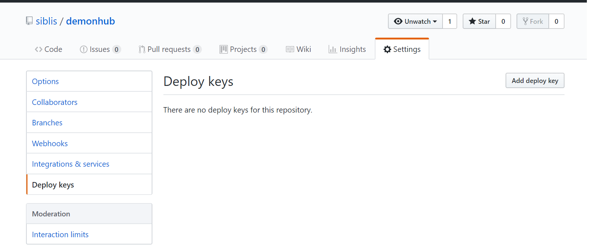
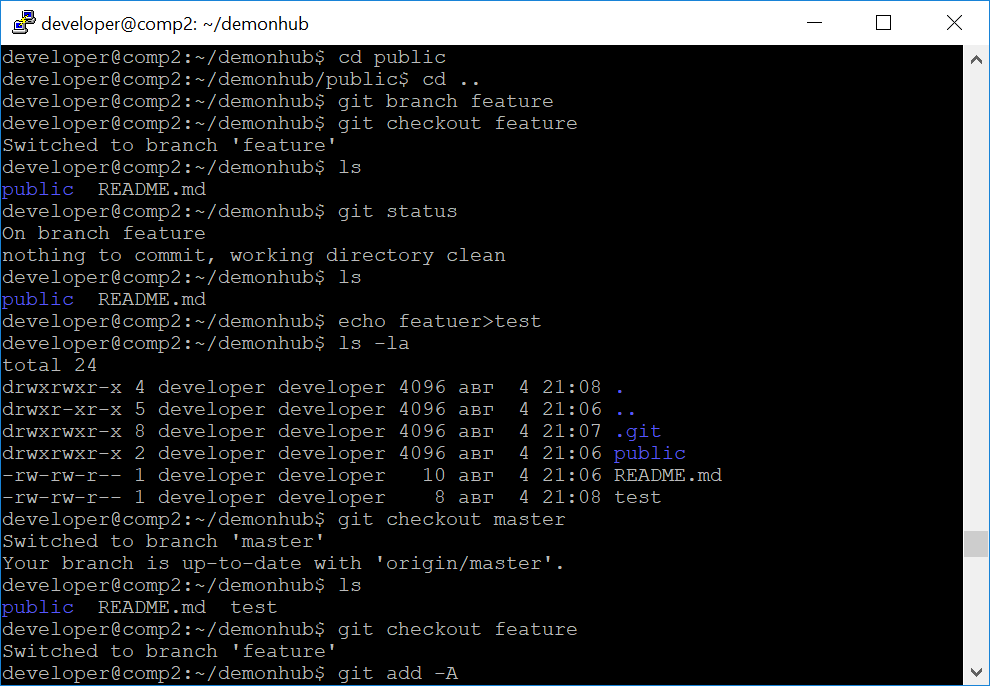
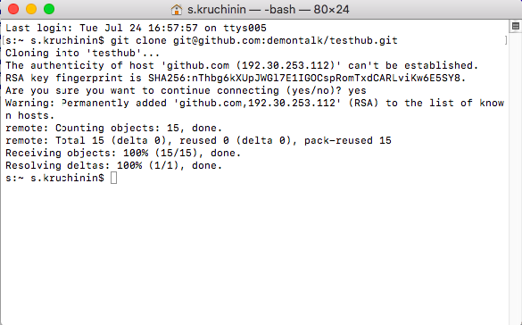
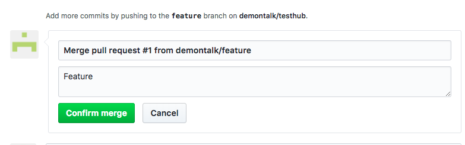

# Введение в Git

## Оглавление
- [Введение](#введение)
- [Работа в Git](#работа-в-git)
  - [Создание репозитория на GitHub](#создание-репозитория-на-github)
  - [Клонируем репозиторий на локальную машину (или сервер)](#клонируем-репозиторий-на-локальную-машину-или-сервер)
  - [Работаем в репозитории](#работаем-в-репозитории)
  - [То, что не должно попасть в репозиторий](#то-что-не-должно-попасть-в-репозиторий)
  - [Самые частые команды](#самые-частые-команды)
  - [Хуки](#хуки)
  - [Работа с Pull Request](#работа-с-pull-request)
- [Git-flow](#git-flow)
- [Немного об SVN](#немного-об-svn)
  - [Некоторые консольные команды SVN](#некоторые-консольные-команды-svn)
- [Практическое задание](#практическое-задание)
- [Дополнительные материалы](#дополнительные-материалы)
- [Используемая литература](#используемая-литература)

## Введение
Как работать над одним проектом одновременно нескольким разработчикам? А если разработчики начнут править разные версии программы, как быть? Да и как управлять версиями? Создавать большое количество директорий .bak? А если нужно вернуться к предыдущей версии?
Как было раньше? Множество архивов, обмен файлами, .tar.gz, .rar. Согласитесь, это не очень удобно.
Даже если проект разрабатывается в одиночку, легко запутаться. Если его разрабатывает команда, без системы управления версиями не обойтись.
Знакомство с системами управления версиями необходимо не только программистам, но и системным администраторам и инженерам devops. Почему? Во-первых, чтобы настроить среду для работы программ (изменения забираются из репозитория, например, с помощью Git). Во-вторых, скрипты и конфигурационные файлы тоже могут храниться в репозиториях. В частности, зоны DNS-серверов иногда хранят в Git, а серверы получают их из репозитория, а не друг у друга.
Системы управления версиями позволяют хранить несколько версий продукта, при необходимости возвращаясь к старым, одновременно развивать несколько версий (веток) проекта разными разработчиками и потом сливать (мержить) их. В настоящее время среди систем контроля управления версиями лидирует Git — распределенная система, созданная Линусом Торвальдсом для разработки ядра операционной системы Linux. Но так было не всегда. Существовали централизованные системы CVS и SVN (последняя все еще применяется в некоторых проектах), а среди распределенных систем менее успешный конкурент Git — Mercurial.
Системы контроля версий можно развернуть на домашнем компьютере или сервере, но, как правило используются специализированные хостинги. Наиболее известные: GitHub, BitBucket, GitLab.
Для работы с системами управления версий используются графические клиенты и клиенты для терминала. Мы будем изучать Git и познакомимся с ним, вызывая команды Git клиента из терминала.

## Работа в Git
### Создание репозитория на GitHub
Заходим на GitHub.


Кликаем Start a project, чтобы начать новый проект.


Пишем имя проекта.
Бесплатно доступен только Public, Private — за деньги (бесплатные есть в BitBucket и GitLab).
Добавьте сразу readme.md, также при желании можно добавить .gitignore (те файлы, которые не должны отправляться в Git, например конфиги с паролями БД, или библиотеки, которые устанавливаются соответствующим пакетным менеджером).
Также можно добавить лицензию, например GNU GPL.


Жмем Create repository.
### Клонируем репозиторий на локальную машину (или сервер)
После этого надо склонировать. Например, в /var/www.
Но для начала создадим пользователя developer:
```bash
sudo -i 
useradd developer
```
Введем пароль.


Добавим пользователя в группу sudo:
```bash
usermod -a -G sudo developer
```


Залогинимся, проверим, работает ли sudo, а также в какие группы мы входим, и есть ли директория .ssh.


Директория с ключами пуста.
Генерируем ключ:
```bash
ssh-keygen
```
По умолчанию запишет в ~/.ssh/ два файла id_rsa и id_rsa.pub.
Также спросит пароль. Это не пароль от ssh, это пароль на доступ к ключу.
Если вы его забудете, доступ потеряется. Кроме того, ПО не сможет без вас выполнить подключение. Поэтому оставим пустым.


Обратите внимание, что длина ключа 2048 бит. Маловато.
Лучше использовать 4096:
```bash
ssh-keygen -t rsa -b 4096 
```
У нас появилось два ключа: id_rsa и id_rsa.pub.
    • id_rsa -- приватный.
    • id_rsa.pub -- публичный.
Публичный ключ сделан, чтобы его отправлять куда-либо.
Приватный никогда не должен покидать место, где он создан. Если вы создаете пару ключей для доступа с сервера к Git-репозиторию,  ключ  генерируется и хранится на сервере.
Если нужен ключ, чтобы подключиться с локального компьютера к удаленному серверу, генерируем его на клиенте, и на сервер отправляем публичный ключ, никак иначе.
Лучше даже убрать лишние права на ключ:
```bash
chmod 400 id_rsa
```
Далее с помощью:
```bash
cat id_rsa.pub
```
...выводим ключ на экран (только не нажимайте Enter, пока не введете .pub, иначе пару придется перегенерировать).
Копируете всю строку:


На сайте жмём на Settings:


Deploy keys.

Жмём Add deploy keys.

Даем название ключу, копируем ключ (изменить будет нельзя, только удалить и загрузить заново).
Если требуется Write access, поставьте галочку.

Теперь можно клонировать.
Но не получится: сначала нужно изменить рекурсивно владельца и группу у директории /var/www на www-data.
```bash
sudo chown www-data:www-data -R /var/www
```
После добавить пользователя developer в группу www-data.
```bash
sudo usermod -a -G www-data developer
```
C помощью команды id проверим, все ли верно.
```bash
id
```


Но если мы попытаемся создать директорию test, ничего у нас не получится. Дело в том, что /var/www создана рутом, а у рута umask 022, а не 002, поэтому доступа на запись для группы нет.
Исправляем:
```bash
chmod g+x -R /var/www
```


После этого все работает.
Если Git-клиент не установлен, его следует установить:
```bash
sudo apt update
sudo apt install git
```
После можно выполнить:
```bash
git
```
Так мы узнаем список опций. Можно использовать даже команду
```bash
man git
```
Клонируем репозиторий, так как это предложил Git-хостинг.


Обратите внимание, что репозиторий создан от имени developer и группа его же. А группа должна быть www-data.
Снесем репозиторий. Делается это просто:
```bash
rm -rf /var/www/demonhub :))))
```
После надо сделать так, чтобы все создаваемые файлы и папки в директории наследовали группу www-data.
Делается это с помощью SGID, для этого мы используем:
```bash
sudo chmod g+s -R /var/www
```
Теперь можно смело клонировать:

Теперь на месте и группа директории www-data.

### Работаем в репозитории
Создаем директорию. 
```bash
mkdir /var/www/demonhub/public
```
Помните, что Nginx должен смотреть не в /var/www/demonhub, а в /var/www/demonhub/public, обязательно поправьте конфиг.
Закоммитим и запушим.
Но в репозитории она не появится, нужно, чтобы мы добавили файлы.

Следуем подсказкам git-клиента. Создадим простой файл, добавим его и закоммитим.
```bash
echo test>test.txt
git add -A
git commit -m”new file test.txt”
```

Мы можем еще раз клонировать репозиторий в другую папку. Увидим, что все, что мы сделали, теперь там тоже есть. Это может быть репозиторий у другого пользователя или на другой машине.
Вернемся в репозиторий:
```bash
cd /var/www/demontest
```
Создадим ветку feature (ветка, в которой мы пока находимся — master).
```bash
git branch feature
```
Переключимся в нее:
```bash
git checkout feature
```
Оба вышеперечисленных действия (создать ветку и переключиться в нее) можно сделать сразу одной командой:
```bash
git checkout -b feature
```


Создадим файл. Но не закоммитим, а переключимся в master, а потом в branch, попутно посмотрев оглавление. Файл и там, и там.
Как так? Он не в репозитории. Он лежит в папке.
Чтобы файл был в репозитории, его надо закоммитить. После этого он будет лежать в .git. Изменения хранятся в виде дельты, что экономит время.
Теперь, если вы сделаете чекаут в другую ветку, файла уже не будет.

А что, если сделать чекаут в другую ветку и создать такой же файл?

Как теперь слить изменения?
Прежде чем отправить изменения в удаленный репозиторий, мы должны получить изменения с сервера (мы в мастере).
```bash
git pull
```
После этого переключиться в функциональную ветку feature и слить изменения из ветки мастер:
```bash
git checkout feature
git merge master
```
При слиянии клиент обнаружит конфликт, который не сможет разрешить сам.

Это придется сделать вручную. Отредактируем файл, оставив так, как должно быть, и закоммитим изменения.
Теперь нам надо перейти в ветку мастер и слить туда изменения из feature:
```bash
git checkout master
git merge feature
```


После чего можно отправлять изменения.

Все файлы на месте:


### То, что не должно попасть в репозиторий
Пароли и локальные настройки не должны попадать в репозиторий. Для таких вещей есть файл .gitignore.
Файл может располагаться в любой директории проекта, но лучше всего использовать его в корне репозитория.
Синтаксис файла:
    • #комментарий,
    • /file — правило распространяется только на файл в текущей директории,
    • file — правило распространяется на файлы с таким именем в текущей и вложенных директориях,
    • * и ? имеют то же значение, что в шаблонах подстановки bash,
    • folder/ — полностью игнорировать содержимое директории folder (слеш обязателен),
    • имеются и некоторые другие команды (см. доп. литературу).
Пример:
```
#игнорируем все файлы с именем db.conf
db.conf
#также игнорируем файлы *.tmp и *.zip
*.tmp
*.zip
#игнорируем config.conf только в текущей директории
/config.conf
#игнорируем все директории, имеющие имя tmp
tmp/
```
### Самые частые команды
Подведем итоги.
Команда `git clone` — создание локальной копии удалённого репозитория.
```bash
сd ~/gitprojects
git clone https://user@somehost:port/~user/repository/project.git
```
В примере — https, но лучше использовать как выше — ssh.
Далее `git add` — индексация файлов. Добавить все файлы:
```bash
git add .
```
Добавить один файл:	
```bash
git add somefile.php
```
Закоммитить проиндексированные файлы (отправить в локальный репозиторий):
```bash
git commit -m”добавил авторизацию”
```
Отправить изменения в удалённый репозиторий:
```bash
git push
```
Если в удалённом репозитории были изменения, сделать это не удастся. Понадобится сделать `git pull` — получить изменения из удалённого репозитория:
```bash
git pull
```
Создание новой ветки experiments:
```bash
git branch experiments
```
Переключение в другую ветку:
```bash
git checkout experiments
```
Влить изменения из experiments в основную ветку (master):
```bash
git checkout master
git merge experiments
```
Подробнвый список команд [http://www.calculate-linux.ru/main/ru/git](http://www.calculate-linux.ru/main/ru/git) 
### Хуки
Хуки позволяют выполнять автоматические действия при разных событиях. Если мы перейдем в директорию .git, а потом Hooks, мы увидим много интересного.


Это и есть хуки. Это скрипты, которые будут выполняться при разных событиях. 
Например, вызывать пакетные менеджеры соответствующих языков и выполнять обновления библиотек (библиотеки, как вы знаете, в репозиториях не хранятся).

Можно скопировать файл с расширением .sample (или переименовать), а можно создать новый.
Например,мы сделаем файл pre-commit:
```bash
#!/bin/bash
echo Hello world
```
Перед выполнением следующего коммита он напишет «Hello, world», как на картинке. Кстати, вместо bash может быть другой иной скриптовый язык, PHP, Perl или Python.
Хуки очень полезная штука, обязательно используйте!
### Работа с Pull Request
Как правило, на практике возможность отправлять изменения дается далеко не всем. Наиболее распространенная модель — Pull Request. Вы делаете форк, вносите изменения и отправляете пулл реквест, чтобы владелец проекта принял решение, сливать ваши изменения или нет.

#### Как сделать Pull Request
Заходим под аккаунтом, отличным от того, которому принадлежит проект:

Переходим в проект

Жмем fork:

Идет процесс:

Теперь у вас форк проекта.

Точно так же добавляем публичный ключ в репозиторий:

Клонируем на локальную машину:

Жмем Use ssh:

Открываем терминал (при необходимости переходим в нужную папку) и делаем  `git clone` с указанным адресом.


 Склонировалось.



Но коммитить в мастер нехорошо. Давайте отменим изменения:


Делается это командой `git revert`  c указанием хеша коммита, который хотим отменить. Будет вызван редактор, чтобы указать, какие изменения мы сделали.

:wq!
Кроме того, следует отслеживать изменения оригинального репозитория.
Узнаем его адрес:

Делаем `git remote add upstream` и `git fetch`, чтобы получить изменения, если они есть:

Теперь давайте поработаем с ветками. 
Создадим ветку feature и сразу перейдем в нее:

```bash
git checkout -b feature
```

Создадим новый файл и закоммитим его.

```bash
git add api.md
git commit
```
Откроется редактор:


Теперь нужно подробно описать изменения, чтобы рецензенту было проще принять Pull Request.
Если вы не имели дело с редактором vim: перейти в режим вставки — i,  выйти из него — Esc, в режиме команд (он включен по умолчанию) записать — :w!,  записать и выйти — :wq!, выйти без записи —:w!.


Теперь можно отправить изменения в форк репозитория:

```bash
git push origin feature
```

Обратите внимание: на сайте в репозитории:

В форке:

Кликаем на feature:

Жмём New pull request:

Видим, что различий нет.

Выбираем feature:

Жмём Create pull request:

Добавляем описание и жмем кнопку:

Реквест отправлен, осталось принять.

Заходим в репозиторий (другим пользователем):


Жмём на Pull requests:

Жмём на Feature (имя нашей ветки):

Жмём merge.

Жмём Confirm merge.

Смержили в мастер.

 После приема реквеста необходимо влить изменения в репозиторий.

```bash
git checkout master
git pull upstream master
git push origin master
```

## Git-flow
Программистам может быть интересен git-flow —  надстройка над git, упрощающая работу с ветками. 
Установка:
```bash
 apt-get install git-flow
```
Подробнее о работе: [https://danielkummer.github.io/git-flow-cheatsheet/index.ru_RU.html](https://danielkummer.github.io/git-flow-cheatsheet/index.ru_RU.html). 
 
## Немного об SVN
git в настоящее время — лидирующая система управления версиями. Но кое-где еще используется svn. Данный раздел факультативен, и будет полезен тем, кто интересуется svn.
SVN отличается от Git и похожего на git Mercurial тем, что это централизованное хранилище. Поэтому, если начинать работу с svn, могут возникнуть некоторые сложности в понимании работы Git и Mercurial.
svn (Subversion) — система управления версиями с централизованным репозиторием.
Имеется ствол разработки — trunk. От ствола разработки могут быть сделаны ответвления (branch). После того как ветви слиты (merge), branch можно удалить.
В SVN поддерживаются теги (tag, метки). Технически они не отличаются от веток, но при этом предполагается, что в тегах хранятся предыдущие версии продукта.
SVN удобен для выпуска проектов с периодическим выпуском релизов и относительно длинным релизным циклом. Очень неудобен SVN в работе с несколькими ветками. В отличие от git svn не подразумевает создание локальных копий репозиториев и децентрализованной разработки.
### Некоторые консольные команды SVN
Svn cheсkout — создание рабочей копии из хранилища.
```bash
svn checkout http:/svn.someproject.ru
```
Получение данных из хранилища — svn update.
Добавление файлов в хранилище — svn add.
```bash
svn add somefile.php
```
Отправка данных в репозиторий — svn commit (-m — комментарий к изменению, может содержать идентификатор тикета или задачи). 
```bash
svn commit somefile.php -m”Добавил авторизацию”
```
Создание ветки:
```bash
svn copy svn://svn.someproject.ru/proj1/trunk  svn://svn.someproject.ru/proj1/branches/1.1.0 -m 'Разработка версии 1.1.0'
```
В рабочей копии вносить изменения следует не в trunk, а в ветку:
```bash
cd основная директория проекта
svn switch svn://svn.someproject.ru/proj1/branches/1.1.0
svn update
```
После того, как все изменения в ветке закоммичены,  необходимо сделать слияние с основной веткой:
```bash
svn switch  svn://svn.someproject.ru/proj1/trunk
svn merge svn://svn.someproject.ru/proj1/branches/1.1.0  
svn commit -m 'Версии 1.1.0'
```
Если в процессе работы над веткой были изменения в trunk (например, хотфиксы), перед слиянием ветки в транк необходимо сделать слияние транка в ветку.
Выпуск: создается тег и рабочая копия сервера переключается в tag.
```bash
svn copy  svn://svn.someproject.ru/proj1/trunk svn://svn.someproject.ru/proj1/tags/1.1.0
svn switch svn://svn.someproject.ru/proj1/tags/1.1.0
```
Это простые примеры. Не показано разрешение конфликтов и слияние нескольких веток.
Существует графический интерфейс для SVN — TortoiSVN.

## Практическое задание 
При работе над практическим заданием:  
    1. Задание выполняется в одиночку (в этом случае нужно два разных аккаунта на github) либо в парах. Нужно создать репозиторий, другим аккаунтом (или другому участнику) сделать его форк, внести изменение, сделать Pull Request. Далее следует смержить Pull Request. 
## Дополнительные материалы
    1. Как работать с ключами ssh — [https://help.github.com/articles/adding-a-new-ssh-key-to-your-github-account/](https://help.github.com/articles/adding-a-new-ssh-key-to-your-github-account/)
    2. Как сделать PR — [https://help.github.com/articles/creating-a-pull-request/](https://help.github.com/articles/creating-a-pull-request/)
    3. Как обновить код с оригинального репозитория — [https://help.github.com/articles/syncing-a-fork/](https://help.github.com/articles/syncing-a-fork/)
    4. .gitignore — [http://orlov.io/ru/articles/podrobnee-o-faile-gitignore](http://orlov.io/ru/articles/podrobnee-o-faile-gitignore)
    5. git-flow — [https://danielkummer.github.io/git-flow-cheatsheet/index.ru_RU.html](https://danielkummer.github.io/git-flow-cheatsheet/index.ru_RU.html) 
 

## Используемая литература
Для подготовки данного методического пособия были использованы следующие ресурсы:
    1. Использование GitHub-клиента для Bitbucket: [http://www.infragistics.com/community/blogs/david_burela/archive/2013/03/31/using-the-github-for-windows-app-with-bitbucket.aspx](http://www.infragistics.com/community/blogs/david_burela/archive/2013/03/31/using-the-github-for-windows-app-with-bitbucket.aspx) 
    2. [https://git-scm.com/book/ru/v1/%D0%92%D0%B2%D0%B5%D0%B4%D0%B5%D0%BD%D0%B8%D0%B5-%D0%9E-%D0%BA%D0%BE%D0%BD%D1%82%D1%80%D0%BE%D0%BB%D0%B5-%D0%B2%D0%B5%D1%80%D1%81%D0%B8%D0%B9](https://git-scm.com/book/ru/v1/%D0%92%D0%B2%D0%B5%D0%B4%D0%B5%D0%BD%D0%B8%D0%B5-%D0%9E-%D0%BA%D0%BE%D0%BD%D1%82%D1%80%D0%BE%D0%BB%D0%B5-%D0%B2%D0%B5%D1%80%D1%81%D0%B8%D0%B9)
    3. Rebase [https://webdevkin.ru/posts/raznoe/izuchaem-git-merge-vs-rebase-dlya-nachinayushhix](https://webdevkin.ru/posts/raznoe/izuchaem-git-merge-vs-rebase-dlya-nachinayushhix) 
    4. [https://git-scm.com/book/ru/v1/%D0%92%D0%B5%D1%82%D0%B2%D0%BB%D0%B5%D0%BD%D0%B8%D0%B5-%D0%B2-Git-%D0%9F%D0%B5%D1%80%D0%B5%D0%BC%D0%B5%D1%89%D0%B5%D0%BD%D0%B8%D0%B5](https://git-scm.com/book/ru/v1/%D0%92%D0%B5%D1%82%D0%B2%D0%BB%D0%B5%D0%BD%D0%B8%D0%B5-%D0%B2-Git-%D0%9F%D0%B5%D1%80%D0%B5%D0%BC%D0%B5%D1%89%D0%B5%D0%BD%D0%B8%D0%B5) 
    5. [https://rustycrate.ru/%D1%80%D1%83%D0%BA%D0%BE%D0%B2%D0%BE%D0%B4%D1%81%D1%82%D0%B2%D0%B0/2016/03/07/contributing.html](https://rustycrate.ru/%D1%80%D1%83%D0%BA%D0%BE%D0%B2%D0%BE%D0%B4%D1%81%D1%82%D0%B2%D0%B0/2016/03/07/contributing.html)
    6. [https://habr.com/post/125999/](https://habr.com/post/125999/) 
    7. [https://ru.stackoverflow.com/questions/431520/%D0%9A%D0%B0%D0%BA-%D0%B2%D0%B5%D1%80%D0%BD%D1%83%D1%82%D1%8C%D1%81%D1%8F-%D0%BE%D1%82%D0%BA%D0%B0%D1%82%D0%B8%D1%82%D1%8C%D1%81%D1%8F-%D0%BA-%D0%B1%D0%BE%D0%BB%D0%B5%D0%B5-%D1%80%D0%B0%D0%BD%D0%BD%D0%B5%D0%BC%D1%83-%D0%BA%D0%BE%D0%BC%D0%BC%D0%B8%D1%82%D1%83](https://ru.stackoverflow.com/questions/431520/%D0%9A%D0%B0%D0%BA-%D0%B2%D0%B5%D1%80%D0%BD%D1%83%D1%82%D1%8C%D1%81%D1%8F-%D0%BE%D1%82%D0%BA%D0%B0%D1%82%D0%B8%D1%82%D1%8C%D1%81%D1%8F-%D0%BA-%D0%B1%D0%BE%D0%BB%D0%B5%D0%B5-%D1%80%D0%B0%D0%BD%D0%BD%D0%B5%D0%BC%D1%83-%D0%BA%D0%BE%D0%BC%D0%BC%D0%B8%D1%82%D1%83)
    8. [https://toster.ru/q/28207](https://toster.ru/q/28207)
