# SOA и введение в Docker

## Монолитная и SOA-архитектура приложений. Введение в Docker

### Оглавление
- [Введение](#введение)
- [Контейнеризация](#контейнеризация)
- [Установка Docker](#установка-docker)
- [Работа с Docker](#работа-с-docker)
- [Практическое задание](#практическое-задание)
- [Дополнительные материалы](#дополнительные-материалы)
- [Используемая литература](#используемая-литература)

---

<a name="введение"></a>
## Введение

Для начала познакомимся с монолитной и сервис-ориентированной архитектурой веб-приложений.

### Как строились веб-приложения раньше?

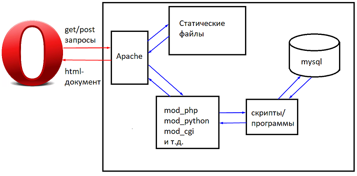

Покупался сервер (а часто и не сервер, а так называемый shared-хостинг, когда пользователю предоставлялась директория с привязанным виртуальным хостом и таблица в СУБД, как правило, MySQL) и все приложение находилось на одном сервере.
Такой подход можно обозначить как монолитную архитектуру. Ее отличает удобство администрирования и выпуска новых релизов, все хранится в одном месте, низкий порог вхождения, нет затрат на распределенную архитектуру.
Но есть и недостатки.
Это отсутствие возможности масштабируемости и отказоустойчивости. Такой подход подойдет для самостоятельно (или не самостоятельно) написанного блога или простой CMS, но не подойдет для современного сервиса.

### Как строится современный сервис.

Когда браузер пытается обратиться к некоему доменному имени, сначала происходит запрос к DNS.
DNS выдает несколько записей A, которые тасуются (алгоритм Round Robin), и браузер пытается обратиться по первому IP-адресу (если нельзя получить ответ по первому адресу, современные браузеры попытаются обратиться ко второму IP-адресу, в случае его наличия).
Это можно самостоятельно проверить с помощью команды dig:

```bash
dig mail.ru
```

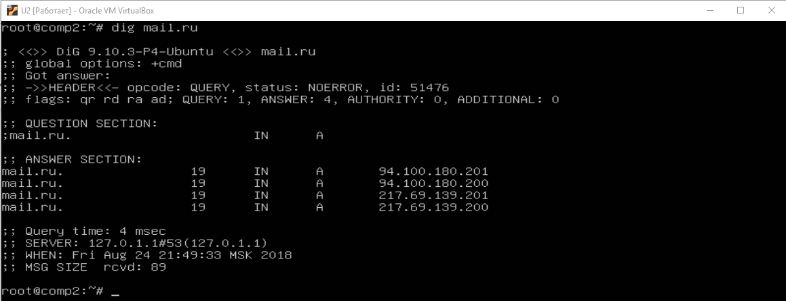

Полученный список адресов — серверы фронтенды (не путать с фронтенд, в смысле html&css&js) либо, для более сложных сервисов и проектов, load balancer.
Load Balancer может быть как аппаратным решением, так и программным, Nginx прекрасно справляется с этой ролью.
Frontend обрабатывает запросы, которые не требуют значительной нагрузки на сервер, в противном случае передают запрос бэкенд, который может выполнять трудоемкие вычисления, результат которых может быть закеширован на фронтенд-серверах.

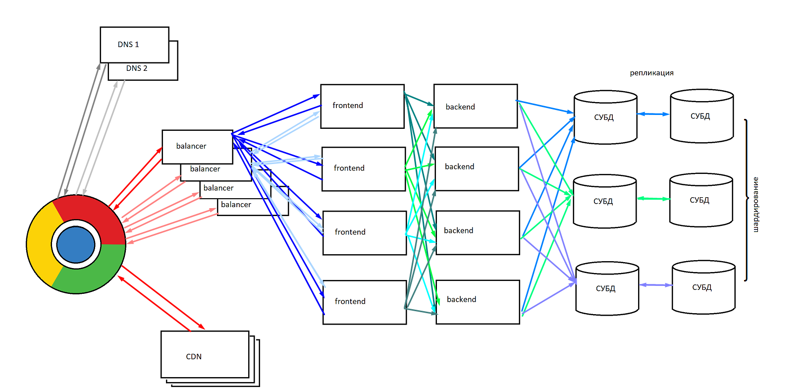

Также требуется решить еще ряд проблем. Для современных социальных сетей невозможно поместить всех пользователей в СУБД, размещенную на одной машине. Частично проблему можно решить, выделив разные базы данных для новостей, переписки, профилей. Но часто даже профили не могут поместиться в одну базу данных. В этом случае применяют шардирование —  для каждой единицы данных применяется вычисление, на каком сервере (в каком шарде) хранятся данные, после этого происходит/чтение запись.


От системы требуется отказоустойчивость, поэтому каждую базу данных нужно реплицировать. Более того, какие-то пользователи могут быть активными, какие-то — нет. Поэтому данные нужно держать в оперативной памяти (Redis/MongoDB). Для поиска применяются другие решения (Sphinx, Elastic Search).
Схема значительно сложнее, чем для монолитной архитектуры, и это мы еще не детализировали, какое ПО мы используем. 
Рассмотрим пример технологий, которые могут потребоваться для реализации веб-приложения.
Кеширующий сервер — Nginx. Кроме того, Nginx умеет балансировать нагрузку.
Далее мы реализуем с помощью PHP/Python/Java некий сервис (профили, страницы, новости).
При этом архитектура http такова, что мы можем делать запросы на сервер, и сервер отвечает. Это подходит для страниц и новостей, но не подходит, например, для чата или совместного редактирования документов. Здесь применяются long pooling — когда сервер не отвечает на get-запрос сразу, а оставляет соединение, дожидаясь поступления события, либо веб-сокеты (WSS, web socket secure). Этот протокол позволяет инициативно отправлять клиенту сообщение, не дожидаясь запроса. Для использования long pooling и WSS требуется отдельное программное обеспечение, comet server.
Если пользователи активно используют сервис, данные удобно хранить в оперативной памяти. Для этого может использоваться Redis или NoSQL.

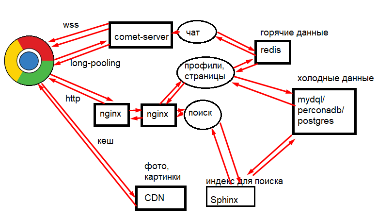

Для постоянного хранения данных используется одна из популярных SQL-СУБД, MySQL и ее форки (например, PerconaDB) либо Postgres.
Для реализации поиска SQL-решения будет недостаточно. Здесь понадобится применять Sphinx или Elastic Search.


Как много всего скрывается за фронтендом!)
Для хранения статического контента (фото, картинок, видео) понадобится сеть CDN, и ее проще использовать готовую, чем создавать самому.
Но и это еще не все. Такую систему надо обслуживать, мониторить.
Централизованно этой деятельностью занимаются DevOps-инженеры. Сюда входит CD/CI (Continious Delivery/Continious Integration), мониторинг, распространение конфигурации.
А если рассмотреть с точки зрения приложения?

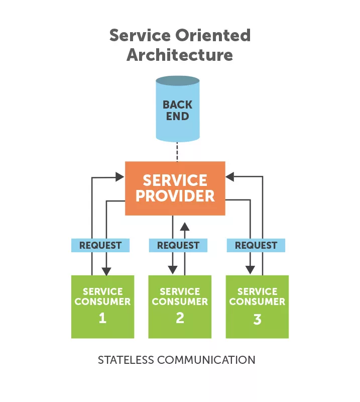

У нас есть клиенты (веб-клиент),  iOS-приложение, Android-приложение. Есть REST API, которое позволяет обеспечивать функции клиентских приложений, обращаясь к сервису. И backend, который мы рассмотрели. При этом для разных сервисов могут использоваться разные решения, в чем мы, собственно, и убедились.

---

<a name="контейнеризация"></a>
## Контейнеризация

Как начать создавать приложение самостоятельно? Неужели необходимо сразу покупать десяток серверов? На самом деле нет.
Достаточно изолировать каждый сервис в свой контейнер. Это позволяет структурировать сервисы и обеспечивает дополнительную надежность. В случае возникновения проблем с одним сервисом (закончилась оперативная память, сервис упал, был взломан хакерами), это не затронет другой.
Контейнеризация — частный случай виртуализации.
Современные VDS-провайдеры предлагают KVM-виртуализацию и OpenVirtuozo-виртуализацию. Реже встречается XEN. KVM- и XEN-виртуализация создают виртуальную машину, изнутри не отличающуюся от настоящей. Можно использовать любую операционную систему, написанную для той же аппаратной платформы, то есть внутри Linux можно запускать Windows и наоборот. 
OpenVirtuozo — контейнерная виртуализация. То есть не настоящая виртуальная машина, а несколько групп процессов созданных на одном ядре операционной системы, изолированных между собой. Им дается своя директория на диске, свой IP-адрес, и в конечном итоге такая песочница очень похожа на настоящую машину. Виртуализировать таким образом можно только операционные системы на том же ядре. То есть с помощью OpenVZ невозможно запустить Windows внутри Linux, а Centos внутри Ubuntu — очень даже можно (так как ядро одно и то же).
Для построения микросервисной архитектуры также следует использовать контейнеры.
Наиболее популярные решения:
    - Docker.
    - LXC (Linux Container).
Docker контейнизирует даже не сами операционные системы, а приложения, LXC создает легковесные контейнеры. При этом технологии похожие, для удобной работы с LXC может понадобиться LXD (LXC Daemon).
Для использования LXC или Docker понадобится применять виртуализацию вида KVM или XEN. На домашней виртуалке (VirtualBox или VMWare) тоже будет работать.
Основная логика работы такая:

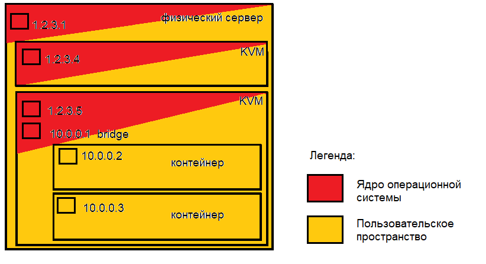

Теперь рассмотрим, как получает доступ приложение внутри контейнера.

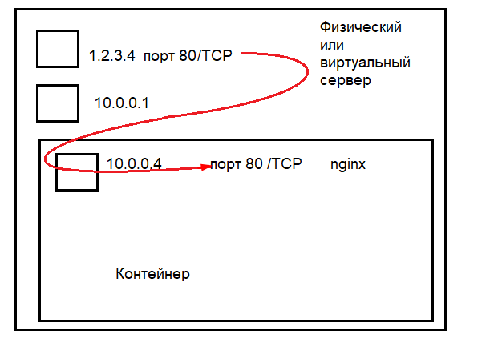

Обращение происходит к IP-адресу физического сервера или VDS (KVM/Xen). Далее порт пробрасывается в контейнер. На вышеприведенном рисунке происходит проброс с 1.2.3.4:80 TCP на 10.0.0.4:80 TCP. Используется механизм iptables/netfilter DNAT. Порт, на который пробрасываются входящие соединения, не обязательно должен совпадать с внешним портом. То есть можно пробросить с 1.2.3.4:80 на 1.2.3.4:8080, например. Также используется механизм iptables/netfilter (Masquerade).

---

<a name="установка-docker"></a>
## Установка Docker

Нам понадобится Ubuntu 16 и выше, 64-битная версия.
Традиционно выполним:

```bash
sudo apt-get update
```

Docker легко поставить из официального репозитория операционной системы (и я думаю, вы уже начали набирать нужные команды), но, чтобы установить его последнюю версию, воспользуемся официальным репозиторием докера.
Добавляем ключ репозитория:

```bash
curl -fsSL https://download.docker.com/linux/ubuntu/gpg | sudo apt-key add -
```

Добавим репозиторий (команда дана для Ubuntu 16):

```bash
echo "deb https://apt.dockerproject.org/repo ubuntu-xenial main" | sudo tee /etc/apt/sources.list.d/docker.list
```
 
 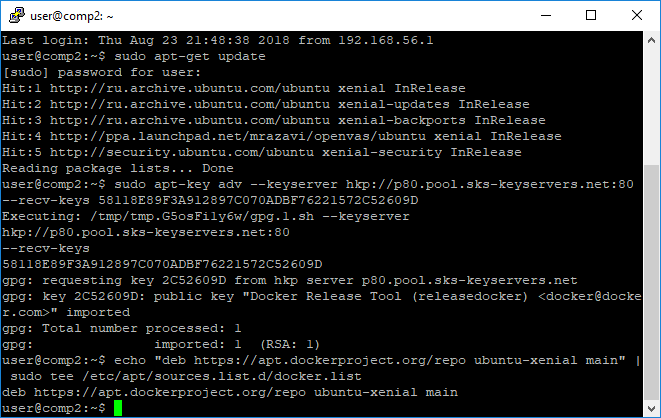
 
Еще раз:

```bash
sudo apt-get update
```

Переключимся из репозитория Ubuntu 16 в репозиторий Docker:

```bash
apt-cache policy docker-engine
```

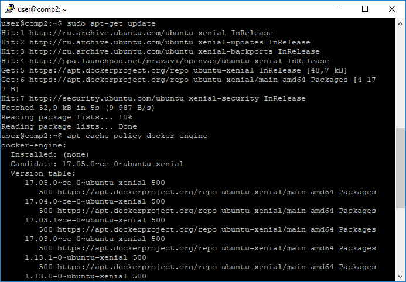

Внимательно посмотрите на вывод. Docker-engine еще не установлен. 
Пора бы установить. Делается это так:

```bash
sudo apt-get install -y docker-engine
```

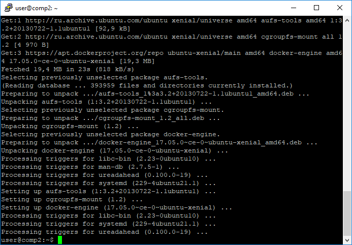

Все ок.
Проверяем:

```bash
sudo systemctl status docker
```

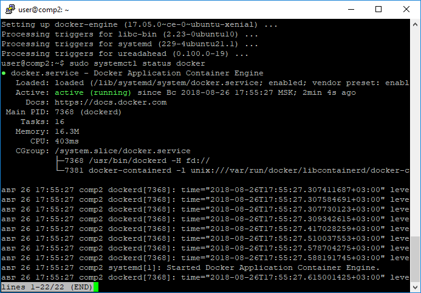

---

<a name="работа-с-docker"></a>
## Работа с Docker

Если вызвать команду docker без параметров, она выдаст список доступных команд.

```bash
docker
```

Можно ожидать примерно следующего вида вывод:

```
user@comp2:~$ docker

Usage:  docker COMMAND

A self-sufficient runtime for containers

Options:
      --config string      Location of client config files (default
                           "/home/user/.docker")
  -D, --debug              Enable debug mode
      --help               Print usage
  -H, --host list          Daemon socket(s) to connect to
  -l, --log-level string   Set the logging level
                           ("debug"|"info"|"warn"|"error"|"fatal") (default
                           "info")
      --tls                Use TLS; implied by --tlsverify
      --tlscacert string   Trust certs signed only by this CA (default
                           "/home/user/.docker/ca.pem")
      --tlscert string     Path to TLS certificate file (default
                           "/home/user/.docker/cert.pem")
      --tlskey string      Path to TLS key file (default
                           "/home/user/.docker/key.pem")
      --tlsverify          Use TLS and verify the remote
  -v, --version            Print version information and quit

Management Commands:
  container   Manage containers
  image       Manage images
  network     Manage networks
  node        Manage Swarm nodes
  plugin      Manage plugins
  secret      Manage Docker secrets
  service     Manage services
  stack       Manage Docker stacks
  swarm       Manage Swarm
  system      Manage Docker
  volume      Manage volumes

Commands:
  attach      Attach local standard input, output, and error streams to a running container
  build       Build an image from a Dockerfile
  commit      Create a new image from a container's changes
  cp          Copy files/folders between a container and the local filesystem
  create      Create a new container
  diff        Inspect changes to files or directories on a container's filesystem
  events      Get real time events from the server
  exec        Run a command in a running container
  export      Export a container's filesystem as a tar archive
  history     Show the history of an image
  images      List images
  import      Import the contents from a tarball to create a filesystem image
  info        Display system-wide information
  inspect     Return low-level information on Docker objects
  kill        Kill one or more running containers
  load        Load an image from a tar archive or STDIN
  login       Log in to a Docker registry
  logout      Log out from a Docker registry
  logs        Fetch the logs of a container
  pause       Pause all processes within one or more containers
  port        List port mappings or a specific mapping for the container
  ps          List containers
  pull        Pull an image or a repository from a registry
  push        Push an image or a repository to a registry
  rename      Rename a container
  restart     Restart one or more containers
  rm          Remove one or more containers
  rmi         Remove one or more images
  run         Run a command in a new container
  save        Save one or more images to a tar archive (streamed to STDOUT by default)
  search      Search the Docker Hub for images
  start       Start one or more stopped containers
  stats       Display a live stream of container(s) resource usage statistics
  stop        Stop one or more running containers
  tag         Create a tag TARGET_IMAGE that refers to SOURCE_IMAGE
  top         Display the running processes of a container
  unpause     Unpause all processes within one or more containers
  update      Update configuration of one or more containers
  version     Show the Docker version information
  wait        Block until one or more containers stop, then print their exit codes

Run 'docker COMMAND --help' for more information on a command.
user@comp2:~$
```

И самое первое, что мы можем узнать — информацию о Docker с помощью info. Здесь уже понадобится sudo, как правило, команды Docker выполняются с sudo.

```bash
sudo docker info
```

Выдача будет примерно следующая:

```
Containers: 0
 Running: 0
 Paused: 0
 Stopped: 0
Images: 0
Server Version: 17.05.0-ce
Storage Driver: aufs
 Root Dir: /var/lib/docker/aufs
 Backing Filesystem: extfs
 Dirs: 0
 Dirperm1 Supported: true
Logging Driver: json-file
Cgroup Driver: cgroupfs
Plugins:
 Volume: local
 Network: bridge host macvlan null overlay
Swarm: inactive
Runtimes: runc
Default Runtime: runc
Init Binary: docker-init
containerd version: 9048e5e50717ea4497b757314bad98ea3763c145
runc version: 9c2d8d184e5da67c95d601382adf14862e4f2228
init version: 949e6fa
Security Options:
 apparmor
 seccomp
  Profile: default
Kernel Version: 4.15.0-29-generic
Operating System: Ubuntu 16.04.4 LTS
OSType: linux
Architecture: x86_64
CPUs: 1
Total Memory: 3.853GiB
Name: comp2
ID: A33D:LLTB:2R6C:I5OF:HPDX:WVED:73PR:44IP:IQBW:JCKN:YQWV:WBVO
Docker Root Dir: /var/lib/docker
Debug Mode (client): false
Debug Mode (server): false
Registry: https://index.docker.io/v1/
Experimental: false
Insecure Registries:
 127.0.0.0/8
Live Restore Enabled: false

WARNING: No swap limit support
```

Работа с Docker-контейнерами ведется по следующим принципам:
    - контейнер создается из образа,
    - после остановки контейнер не сохраняется,
    - скрипты, файлы баз данных хранятся на монтируемой в контейнер директории,
    - доступ осуществляется извне через проброс портов.
Образы хранятся в репозиториях, для Docker стандартно используется библиотека образов Docker Hub. Можно использовать готовые образы или создавать свои и загружать.
Проверить, что все работает, можно с помощью команды:

```bash
sudo docker run hello-world
```

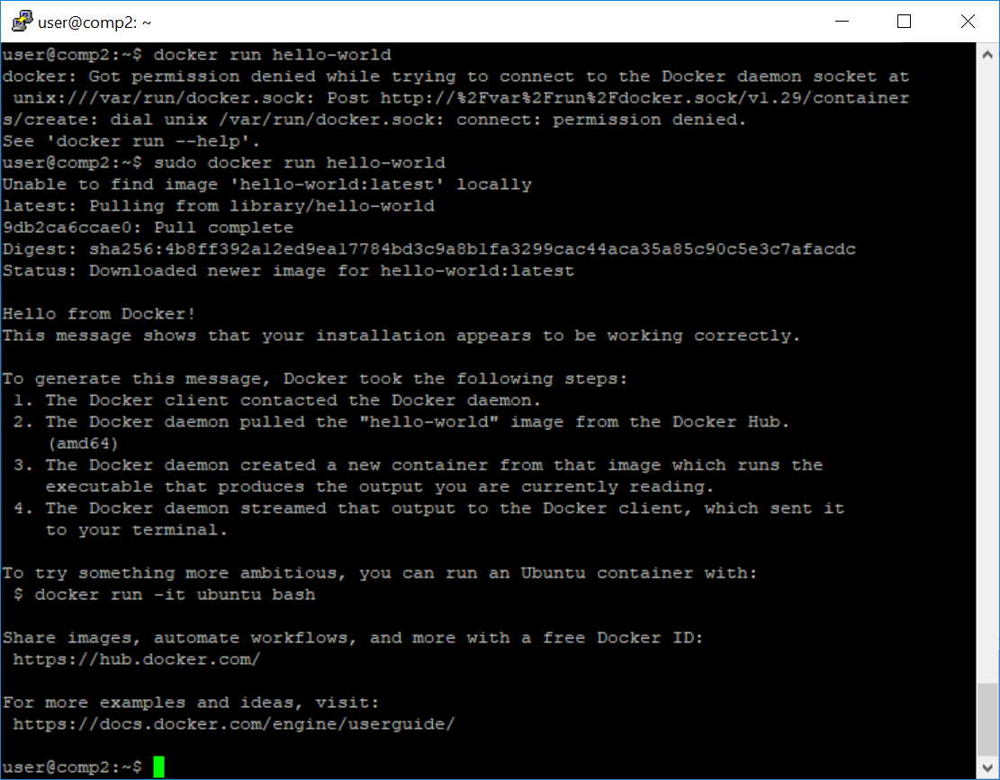

Обратите внимание, что образ не присутствовал в нашем локальном репозитории и был получен автоматически.
Для поиска надо использовать docker search:

```bash
sudo docker search nginx
```

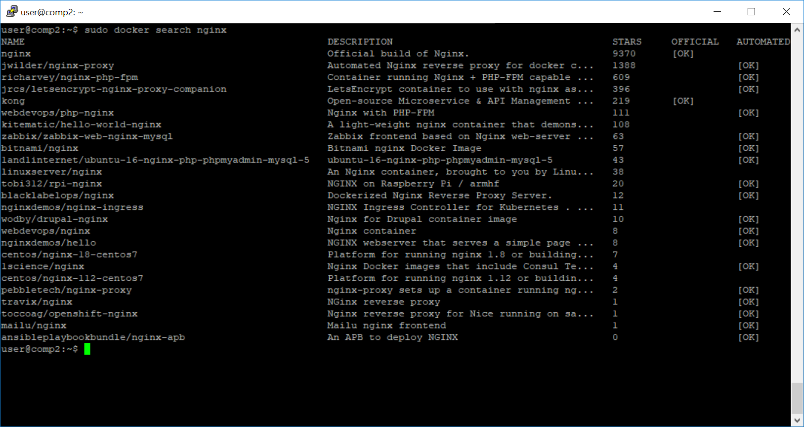

[Ok] в поле Official говорит, что репозиторий поддерживается сообществом и пригоден для использования. 
Скачаем:

```bash
sudo docker pull nginx
```

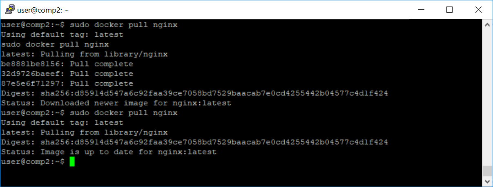

Запустим:

```bash
 sudo docker run -d --name nginx -p 80:80 -v /var/www/html:/usr/share/nginx/html nginx
```

Мы запустили контейнер с именем Nginx, пробросили локальный порт 80 (слева) в порт контейнера (справа) 80, пробросили директорию /var/www/html в директорию /usr/share/nginx/html.

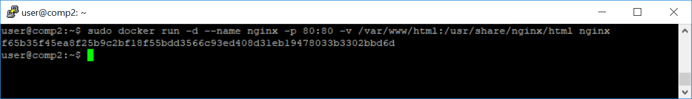

Теперь можем посмотреть список контейнеров:

```bash
sudo docker ps
```

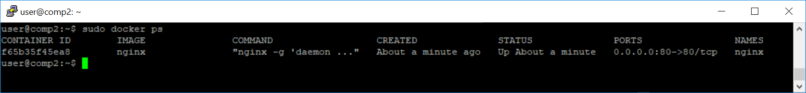

Кроме того, мы можем запустить оболочку внутри контейнера и  произвести какие-то действия, даже установить ПО, но оно будет установлено на время. Если в контейнере нужно использовать ПО, лучше сделать свой образ и загрузить его в Docker Hub.

```bash
sudo  docker exec -ti nginx bash
```

Выход:

```bash
exit
```

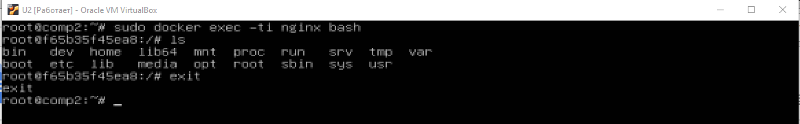

---

<a name="практическое-задание"></a>
## Практическое задание 

При работе над практическим заданием:  
    1. Установить в виртуальную машину или VDS Docker, сделать два контейнера, один для Nginx, второй для MySQL, настроить совместную работу. Если вы изучаете программирование на  PHP, Python или Java, используйте их в проектах для работы с БД. Если вы изучаете системное администрирование, тестирование или информационную безопасность, воспользуйтесь PHP и несложной CMS, например, WordPress.
 
---

<a name="дополнительные-материалы"></a>
## Дополнительные материалы

1. [Использование GitHub-клиента для Bitbucket](http://www.infragistics.com/community/blogs/david_burela/archive/2013/03/31/using-the-github-for-windows-app-with-bitbucket.aspx) 
2. [О контроле версий](https://git-scm.com/book/ru/v1/%D0%92%D0%B2%D0%B5%D0%B4%D0%B5%D0%BD%D0%B8%D0%B5-%D0%9E-%D0%BA%D0%BE%D0%BD%D1%82%D1%80%D0%BE%D0%BB%D0%B5-%D0%B2%D0%B5%D1%80%D1%81%D0%B8%D0%B9)
3. [Rebase](https://webdevkin.ru/posts/raznoe/izuchaem-git-merge-vs-rebase-dlya-nachinayushhix) 
4. [Ветвление в Git - Перемещение](https://git-scm.com/book/ru/v1/%D0%92%D0%B5%D1%82%D0%B2%D0%BB%D0%B5%D0%BD%D0%B8%D0%B5-%D0%B2-Git-%D0%9F%D0%B5%D1%80%D0%B5%D0%BC%D0%B5%D1%89%D0%B5%D0%BD%D0%B8%D0%B5) 
5. [Участие в проекте](https://rustycrate.ru/%D1%80%D1%83%D0%BA%D0%BE%D0%B2%D0%BE%D0%B4%D1%81%D1%82%D0%B2%D0%B0/2016/03/07/contributing.html) 
6. [Рабочий процесс git-flow](https://habr.com/post/125999/) 
7. [Как вернуться (откатиться) к более раннему коммиту?](https://ru.stackoverflow.com/questions/431520/%D0%9A%D0%B0%D0%BA-%D0%B2%D0%B5%D1%80%D0%BD%D1%83%D1%82%D1%8C%D1%81%D1%8F-%D0%BE%D1%82%D0%BA%D0%B0%D1%82%D0%B8%D1%82%D1%8C%D1%81%D1%8F-%D0%BA-%D0%B1%D0%BE%D0%BB%D0%B5%D0%B5-%D1%80%D0%B0%D0%BD%D0%BD%D0%B5%D0%BC%D1%83-%D0%BA%D0%BE%D0%BC%D0%BC%D0%B8%D1%82%D1%83)
8. [Как правильно делать rebase?](https://toster.ru/q/28207) 

---

<a name="используемая-литература"></a>
## Используемая литература

Для подготовки данного методического пособия были использованы следующие ресурсы:
9. [Установка и использование Docker в Ubuntu 16.04](https://www.8host.com/blog/ustanovka-i-ispolzovanie-docker-v-ubuntu-16-04/)
10. [Docker for beginners](https://blog.maddevs.io/docker-for-beginners-a2c9c73e7d3d) 
11. [Установка Nginx в контейнере на Docker](http://linux-notes.org/ustanovka-nginx-v-kontejnere-na-docker/) 
12. [Install Docker CE on Ubuntu](https://docs.docker.com/install/linux/docker-ce/ubuntu/)
