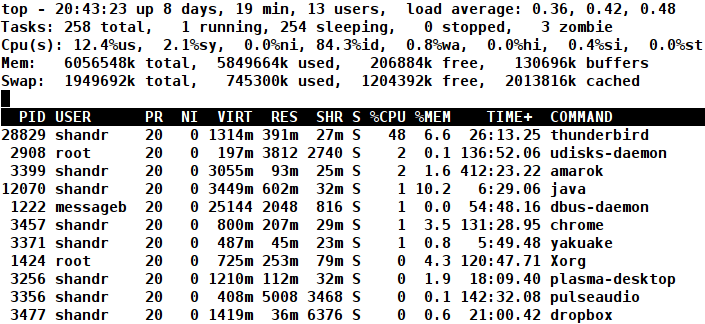
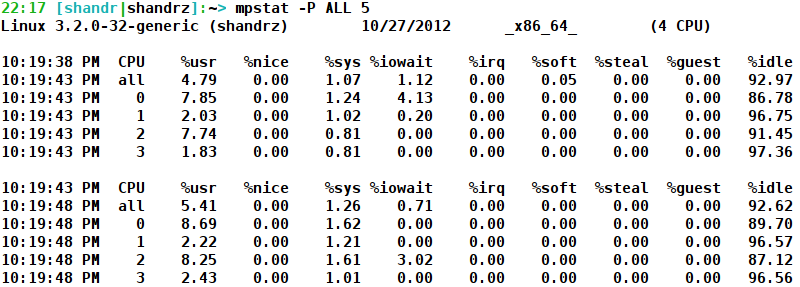
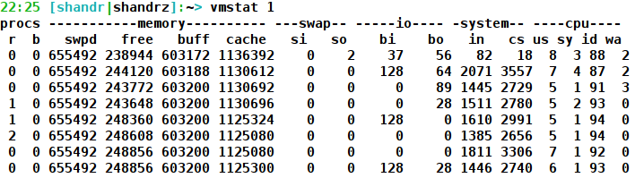
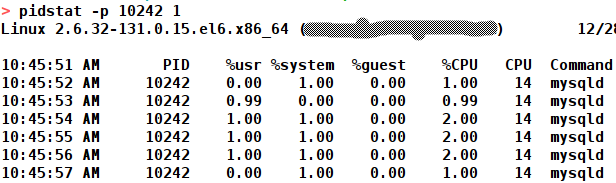
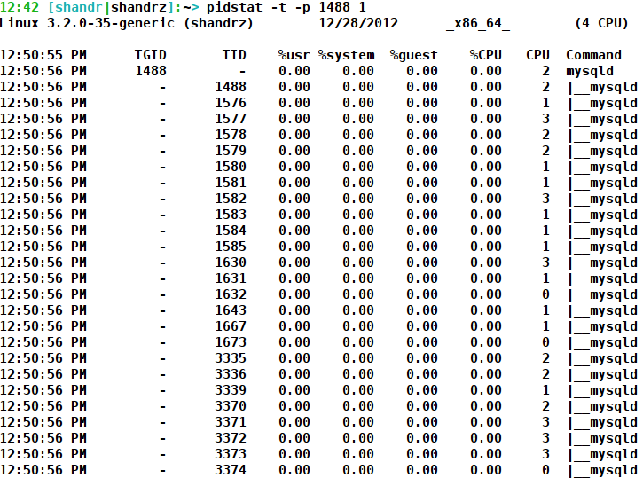

[Оригінал статті](https://shandrz.blogspot.com/2012/10/linux-performance-troubleshooting-cpu.html)

# Усунення несправностей продуктивності Linux - процесор

Однією з найважливіших навичок інженера технічної підтримки є вміння усувати проблеми з продуктивністю сервера. Один з найефективніших способів - це використання інструментів моніторингу, таких як Zabbix або Nagios. Ці інструменти хороші і допомагають зрозуміти, що змінилося в поведінці системи і викликало проблеми з продуктивністю. Але інформації, яку вони надають, не завжди достатньо, щоб знайти справжню причину проблеми. Може існувати процес, який спожив всю системну пам'ять, або процес, який з'їв усі цикли процесора. У моїй повсякденній роботі було багато випадків, коли проблему потрібно було вирішити негайно! І вам потрібно негайно зрозуміти, що відбувається всередині сервера. Отже, темою нашої дискусії є інструменти для усунення несправностей продуктивності Linux.

Існує чотири наступні ресурси, які впливають на продуктивність системи:

*   Процесор
*   Пам'ять
*   Ввід/вивід сховища (hdd)
*   Мережевий ввід/вивід

Сьогодні я розповім про інструменти для усунення несправностей процесора. Майже всі інструменти для усунення несправностей є універсальними і показують широкий спектр системних показників, але я зосереджуся на показниках, пов'язаних з поточною темою.

*   ## top

Я думаю, що це найвідоміший інструмент системного узагальнення в Linux, і кожен адміністратор або інженер повинен його дуже добре розуміти. **top** - це інтерактивна програма, яка показує різні статистичні дані Linux. Ось звичайний вивід top:

Перший показник, на який ми повинні звернути увагу, це '**id**' (idle). Це означає час простою. Чим ближче це значення до 100%, тим більше вільних ресурсів процесора має ваша система. Це відсоток часу, протягом якого ваш процесор вільний. І якщо це значення близьке до '0' - ваша система безперечно страждає від нестачі ресурсів процесора.

Ще один дуже важливий параметр - це '**load average' (середнє навантаження).** Я знайшов дуже гарне пояснення **LA** (Load Average) з 'man uptime':

_Середнє навантаження системи - це середня кількість процесів, які перебувають у стані готовності до виконання або в стані безперервного очікування. Процес у стані готовності до виконання або використовує процесор, або чекає на його використання. Процес у стані безперервного очікування чекає на якийсь доступ до вводу/виводу, наприклад, чекає на диск. Середні значення обчислюються за три часові інтервали. Середні навантаження не нормалізуються за кількістю процесорів у системі, тому середнє навантаження 1 означає, що однопроцесорна система завантажена весь час, тоді як на 4-процесорній системі це означає, що вона була в простої 75% часу._

Що ще ви повинні знати про **LA:**

1.  Він показує інформацію за 1, 5, 15 хвилин (0.36, 0.42, 0.48 на зображенні вище)
2.  Ви повинні розглядати ці значення як цінні показники в довгостроковому періоді. Наприклад, протягом місяця **LA** становив близько 5, але раптом він зріс до 10. Отже, це показник того, що щось змінилося, і ви повинні з'ясувати причину. Ви не повинні розглядати це значення як показник навантаження на процесор у реальному часі. Я бачив дуже різний діапазон **LA**, від 0 до 500, і в деяких випадках той самий сервер мав дуже швидкий час відгуку з LA ~100 (і навіть 500!!!) і був майже мертвий з 20. Щоб перевірити поточне навантаження на процесор, використовуйте параметр '**id'**.

Рядок **'Cpu(s)'** показує детальну інформацію про те, на що процесор витрачав свій час у %:

**us** (user): _Час, який процесор витратив на виконання процесів користувачів, які не були "nice"_
**sy** (system): _Час, який процесор витратив на виконання ядра та його процесів_
**ni** (nice): _Час, який процесор витратив на виконання процесів користувачів, які були "nice"_
**wa** (wait): _Час, витрачений на очікування вводу/виводу (зазвичай жорсткого диска)_
**hi** (hardware interrupt): _Кількість часу, протягом якого процесор обслуговував апаратні переривання_
**si** (software interrupt): _Кількість часу, протягом якого процесор обслуговував програмні переривання_
**st** (stolen): _Кількість процесорного часу, "вкраденого" у цієї віртуальної машини гіпервізором для інших завдань (наприклад, для запуску іншої віртуальної машини)_

Давайте розглянемо ці показники трохи уважніше:
Якщо є високе значення в **'us'** - це означає, що сервер запускає якийсь(і) процес(и) користувача, що споживає(ють) багато процесорного часу. Це може бути MySQL, apache, скрипти користувача та будь-який інший процес, який був запущений користувачем або від імені користувача.

Що означає високе '**sy'**? Процесор може виконувати код в ядрі Linux від імені коду програми. Процес переходить в режим ядра, коли він робить системний виклик або отримує переривання або сигнал. Розуміння ядра не є темою цієї статті. Якщо у вас дуже високе '**sy**', можливо, є багато системних викликів, викликаних високою активністю вводу/виводу (мережа, жорсткий диск), багато перемикань контексту процесів, дуже інтенсивна робота брандмауера (iptables) тощо.
Як знайти системні/ядерні процеси? Натисніть кнопку 'c' в top, і ви знайдете ці процеси в квадратних дужках. Наприклад, [kthreadd]. Але, на жаль, навряд чи ви знайдете ці процеси, що використовують ваш CPU% в top. Наприклад, сьогодні мій ноутбук мав близько 15% використання '**sy**', але жоден з процесів у 'квадратних дужках' не споживав принаймні 0.1% (. Швидше за все, процес, що споживає найбільше %CPU або %wa, є процесом, який викликає високе значення '**sy**'. Якщо ви знаєте точний спосіб його знайти - пишіть свої коментарі ;)

'**ni**' (nice) - nice - це спосіб пріоритезації процесів. Це процеси, які були запущені з командою nice для зменшення або підвищення пріоритету процесора. Таким чином, значення '**ni**' може бути агреговане зі значенням '**us**'.

'**wa**' (wait) - Якщо це значення високе, майже завжди вам слід перевірити навантаження на жорсткий диск якимось процесом. Ми обговоримо, як перевірити навантаження на жорсткий диск і що його викликає, в наступній статті

'**hi' (hardware interrupt) -** якщо це значення дуже високе, швидше за все, у вас є проблеми з апаратним забезпеченням. _**cat /proc/interrupts**_ допоможе вам пролити світло на те, що відбувається

'**si**' (software interrupt) - Зазвичай програмні переривання - це запити на ввід/вивід (Input or Output). Знову ж таки, високе значення в '**si**' може бути пов'язане з дуже високою мережевою активністю, або може бути якийсь божевільний драйвер тощо. /proc/interrupts також може допомогти у вирішенні таких проблем

'**st**' (stolen) - Цей стовпець має значення, лише якщо ви використовуєте vmware або інші гіпервізори.

Після того, як ми перевірили поточне навантаження, нам потрібно перевірити, який саме процес викликає навантаження. **top** за замовчуванням сортує програми за %CPU, тому програма, що споживає найбільше, буде вгорі. У моєму випадку це був thunderbird.

Є ще одна корисна функція **top**. Вона може показувати навантаження на процесор окремо для кожного ядра. Щоб активувати цю функцію, просто натисніть '1' в **top.**

Добре. Які ще програми можуть допомогти перевірити статистику процесора?

*   **mpstat**

Це спеціалізована програма статистики процесора. Насправді вона дублює значення, пов'язані з процесором, з top, але показує їх у більш зручному вигляді.

Використання:
`$ mpstat -P ALL 5`

Попередня команда показує статистику процесора кожні 5 секунд.

*   **vmstat**

Це мій улюблений інструмент. Він показує статистику процесора, пам'яті, вводу/виводу в дуже зручному вигляді:

Тут вам слід звернути увагу на стовпці **procs, system** та **cpu.**
Стовпець **cpu** не показує для нас жодної нової інформації. Але є новий показник '**cs**' (context switches) - кількість перемикань контексту в секунду між процесами. Якщо це значення занадто велике, це означає, що у вас багато програм, які потребують процесорного часу. Інші цікаві показники знаходяться в стовпці **procs**: **r** та **b.**
**r -** кількість процесів, що очікують на виконання (дуже схоже на середнє навантаження). Якщо це значення завжди > кількості ядер на вашому процесорі, це ознака того, що у вас може бути нестача процесора.
**b -** кількість процесів у [безперервному сні](http://stackoverflow.com/questions/223644/what-is-an-uninterruptable-process). У 99,99% випадків процес чекає на ресурс жорсткого диска. І якщо таких процесів багато, вам обов'язково слід перевірити програми, які зараз використовують жорсткий диск (ми навчимося це робити в наступних статтях).

Кілька слів про '**ps**'. Це дуже зручний інструмент, але він не дуже підходить для усунення несправностей з використанням процесора, оскільки він показує накопичену статистику процесів з моменту завантаження сервера. Отже, якщо є процес, який споживає майже весь процесор, але він збожеволів хвилину тому, ви цього не помітите за допомогою **ps.**

Мало не забув про **htop.** Це схожий на **top** інтерактивний переглядач процесів, але він має багатші можливості налаштування, ніж top. Я розповім про нього більше в статті про усунення несправностей продуктивності жорсткого диска.

Ще одна утиліта, про яку я хотів би розповісти, це **pidstat.** Цей інструмент дуже зручний, коли вам потрібно відстежувати поведінку однієї програми:

Цей інструмент не був би таким цікавим без можливості відстежувати навантаження потоків у багатопотокових програмах:

З виводу ми бачимо, що всередині лідера групи потоків mysqld (1488) є 25 потоків, і ми можемо спостерігати навантаження кожного потоку. Ця інформація може бути корисною для інструментів **gdb** або **strace**, але це вже інша історія :). Також, якщо ви передасте опцію -d до pidstat, він виведе статистику вводу/виводу.

Нашою наступною темою будуть **[проблеми з усуненням несправностей пам'яті](http://shandrz.blogspot.com/2012/11/linux-performance-troubleshooting-memory.html).**
