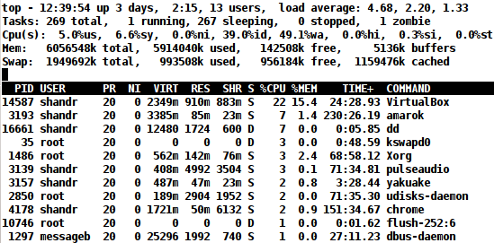
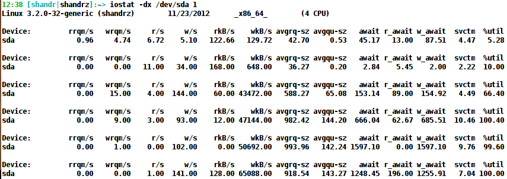
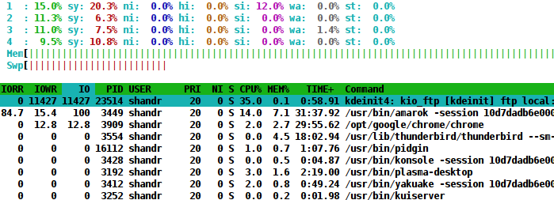
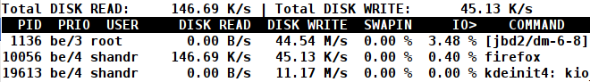
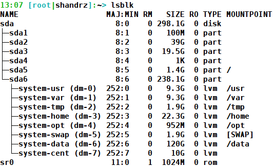
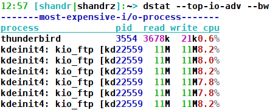
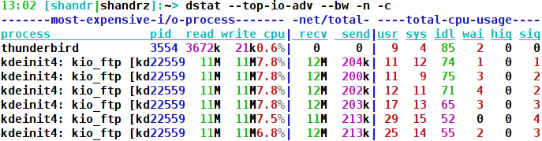

[Оригінал статті](https://shandrz.blogspot.com/2012/11/linux-performance-troubleshooting-hard.html)

# Усунення несправностей продуктивності Linux - жорсткий диск

У цій статті ми обговоримо способи зрозуміти, що вузьким місцем продуктивності вашого сервера є жорсткий диск. Прочитавши цю статтю, ви зможете перевірити поточне навантаження на жорсткий диск і що саме викликає це навантаження.

Зазвичай на сучасних серверах жорсткий диск є найповільнішою частиною всього сервера. Ви можете легко додати більше оперативної пам'яті або збільшити кількість процесорів, мати серверні моделі мережевих карт, але якщо ваша система працює з програмним забезпеченням, що залежить від жорсткого диска, а ваші жорсткі диски повільні - вся система буде повільною. Отже, для інженера підтримки усунення несправностей продуктивності жорсткого диска є дуже важливою навичкою.

Коли я вперше входжу на сервер, я запускаю команду top, щоб зрозуміти загальне навантаження на сервер та можливі причини перевантаження.

З цієї картинки ми бачимо, що:

1.  Навантаження на сервер зросло за останню хвилину. Я можу стверджувати це зі значень **load average** (середнє навантаження): **4.68, 2.20, 1.33** (1,5, 15 хвилин), і зрозуміло, що за останні 15 хвилин LA (Load Average) становив близько 1, а зараз майже 5.
2.  **id** (idle) становить лише 39% - це означає, що сервер має лише 39% вільних ресурсів процесора.
3.  **wa** (wait) становить 49.1% - це кількість часу, яку процесор чекав на ввід/вивід. Що таке ввід/вивід? У 99% випадків це жорсткий диск (1% я залишив для мережі).
4.  Деякі процеси мають стан '**D**' (uninterruptible sleep). **D** означає, що процес перебуває в 'безперервному сні'. Це означає, що процес чекає на ввід/вивід, і ви нічого не можете з цим зробити. Навіть sudo kill -9 не допоможе :). Був цікавий випадок, коли ми вбили процес сигналом -11, щоб отримати його ядро для аналізу витоку пам'яті. На той момент процес споживав близько 11 Гб оперативної пам'яті. Після отримання сигналу kill -11 він почав записувати вміст своєї оперативної пам'яті в основний файл на диску... Система була майже непридатною для використання через дуже високе навантаження, і інженери були безпорадні, оскільки неможливо було вбити цей процес, доки він не вивантажить всю свою оперативну пам'ять в основний файл. Єдиний спосіб - перезавантажити сервер або чекати..!

Отже, з 2,3 і 4 ми можемо стверджувати, що є високе навантаження на жорсткий диск. Як перевірити поточне навантаження на жорсткий диск? **iostat** допоможе!

**> iostat -dx /dev/sda 1**

де **d** - звіт про використання пристрою, **x -** відображення розширеної статистики, **/dev/sda -** мій жорсткий диск, **1** - кількість часу в секундах між кожним звітом. Перший рядок, згенерований командою iostat (і vmstat теж), надає статистику за час з моменту завантаження системи. Тому зазвичай його слід ігнорувати.

Стовпці, які нас цікавлять:

*   **r/s** (reads per second) - Кількість (після об'єднань) запитів на читання, виконаних за секунду для пристрою
*   **w/s (writes per second) - **Кількість (після об'єднань) запитів на запис, виконаних за секунду для пристрою
*   **rkB/s (read kilobytes per second) - **Кількість кілобайтів, мегабайтів, прочитаних з пристрою за секунду
*   **wkB/s (write kilobytes per second) - **Кількість секторів (кілобайтів, мегабайтів), записаних на пристрій за секунду
*   **%util (utilization percentage) - **Відсоток часу процесора, протягом якого запити вводу/виводу надсилалися на пристрій (використання пропускної здатності для пристрою). Насичення пристрою відбувається, коли це значення близьке до 100%

У моєму випадку ми бачимо, що мій жорсткий диск був завантажений до 100%. Переважно він був завантажений **запитами на запис** (від 100 до 144 запитів на секунду), і з 43 Мб до 65 Мб було записано на жорсткий диск за секунду. Типова продуктивність жорсткого диска 5400 об/хв :).
Якщо ви запускаєте iostat, не визначаючи точний жорсткий диск, він покаже вам навантаження на всі жорсткі диски з номерами device-mapper (якщо такі є). Якщо ви вкажете опцію **-N**, він відобразить зареєстровані імена device-mapper для будь-яких пристроїв device-mapper. Корисно для перегляду статистики LVM.

ДОБРЕ. На даний момент зрозуміло, що сервер має проблеми з продуктивністю жорсткого диска. Але як зрозуміти процес(и), що викликає(ють) цю проблему? Я віддаю перевагу наступним інструментам: **htop, iotop, dstat.** Давайте перевіримо їх один за одним:

*   **htop**

Цю програму можна використовувати як повну заміну **top**, і вона справді крута, з великою кількістю опцій, і одна з найцінніших опцій - це сортування виводу за значеннями процесів вводу/виводу. Як використовувати:
`$ htop -->F2-->вибрати 'Columns' у стовпці Setup --> Available Columns --> є 3 стовпці, пов'язані з вводом/виводом: IO_READ_RATE, IO_WRITE_RATE, IO_RATE(IO_WRITE_RATE + IO_READ_RATE), ви можете додати їх усі або лише 1 з них (наприклад, IO_RATE), натиснувши кнопку F5 (вони з'являться в Active_Columns)--> натисніть F10, щоб завершити.`
Ми бачимо, що потрібні стовпці є у виводі **htop**. Наступний крок - відсортувати процеси за потрібним значенням, у нашому випадку це IO_RATE: F6-->IO --> Enter. Ось і все: ми бачимо процес, що споживає найбільше вводу/виводу, у верхній частині виводу:

У моєму випадку це kio_ftp, і це правильно, я завантажував файли з ftp-сервера. Також ми бачимо, що були лише запити на запис вводу/виводу та 0 читань.
Таким же чином ви можете сортувати програми за швидкістю ЧИТАННЯ та ЗАПИСУ.

*   **iotop**

На відміну від **htop**, **iotop** можна використовувати лише для моніторингу вводу/виводу. Використання дуже просте:
`$ iotop`
Але я віддаю перевагу запуску з опцією -o (Показувати лише процеси або потоки, які фактично виконують ввід/вивід, замість того, щоб показувати всі процеси або потоки.)
`$ iotop -o`

Ми бачимо, що в той самий момент 3 процеси активно використовували диск, jbd2 - процес журналювання для ext4. **dm-6-8 -** dm - device multipath (використовується в [LVM](http://en.wikipedia.org/wiki/Logical_Volume_Manager_(Linux)) (Logical Volume Manager) у моєму випадку), 6 - номер пристрою. Вивід **lsblk** може допомогти зрозуміти, який пристрій зараз завантажений:

З картинки зрозуміло, що dm-6 - це том LVM 'system-data', який змонтований у /data. І саме в папку /data/ я копіював файли в той момент.

*   **dstat**

**dstat - **універсальний інструмент для генерації статистики системних ресурсів. Цей інструмент може показати вам усе! :). Але ми зосередимося лише на статистиці вводу/виводу:

Ми бачимо, що більшу частину часу процес, що споживає найбільше вводу/виводу, був kdeinit: kio_ftp.
Що відрізняє dstat від інших інструментів моніторингу, так це те, що ви можете поєднувати кілька статистик в одному виводі, наприклад, наступний вивід покаже статистику вводу/виводу + статистику мережі + статистику процесора!

Круто, га? І комбінація виводу обмежена лише вашою уявою :). Наприклад:
**> dstat --top-io --bw -n -c -m -p -l,** додасть інформацію про використання пам'яті, процеси та середнє навантаження.

А цей покаже комбіновану інформацію про використання диска, процес, що споживає найбільше вводу/виводу, та операції читання та запису на диск за секунду (--bw -s оптимізовані кольори для білого фону):

Якщо ви хочете зрозуміти загальну продуктивність вашої дискової підсистеми, ви можете використовувати утиліту **sysbanch**. Насправді **sysbench** можна використовувати для тестування:

*   продуктивності вводу/виводу файлів
*   продуктивності планувальника
*   швидкості виділення та передачі пам'яті
*   продуктивності реалізації потоків POSIX
*   продуктивності сервера баз даних

Якщо ви вирішили придбати сервер для додатків, що залежать від вводу/виводу (наприклад, додатків OLTP DB), серйозно подумайте про придбання хорошого RAID-контролера з кешем зворотного запису. Продуктивність вводу/виводу буде значно покращена.
Середня кількість операцій вводу/виводу на секунду (IOPS) для жорсткого диска - 125 IOPS, з RAID-контролером ~ 5 - 10K IOPS. IOPS - операції вводу/виводу на секунду. RAID з кешем зворотного запису особливо важливий для випадкових операцій запису.

Наступного разу ми поговоримо про усунення несправностей продуктивності мережі.
