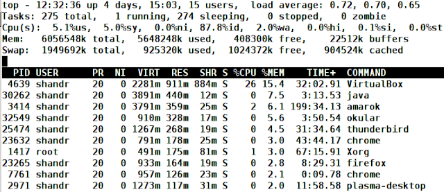
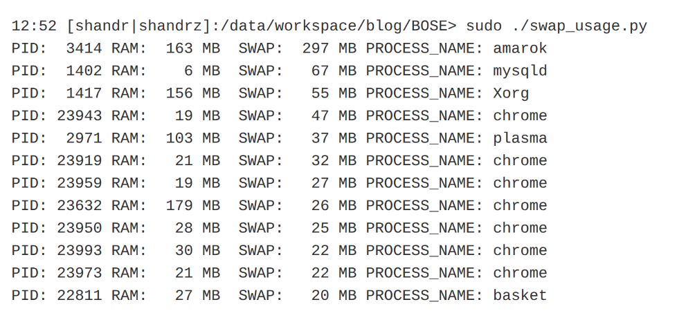

[Оригінал статті](https://shandrz.blogspot.com/2012/11/linux-performance-troubleshooting-memory.html)

# Усунення несправностей продуктивності Linux - пам'ять

Нестача пам'яті призводить до дуже серйозних проблем з продуктивністю, і сьогодні ми навчимося швидко та ефективно усувати проблеми з пам'яттю. Перше, що я зазвичай роблю після входу на будь-який сервер Linux, це запускаю **top**. І саме це ми зараз і зробимо :). Але на відміну від [попередньої](http://shandrz.blogspot.com/2012/10/linux-performance-troubleshooting-cpu.html) статті, сьогодні ми звернемо увагу на значення, пов'язані з пам'яттю (рядки, що починаються з **Mem** та **Swap**):

**Mem:**

*   **6056548 кб** **total** розмір оперативної пам'яті, який я маю
*   **5849664 кб** **used** - це загальний обсяг оперативної пам'яті, який наразі використовується системою.
*   **206884 кб** **free** - власне, нічого додати :)
*   **130696 кб buffers**.

Було нелегко з'ясувати, що насправді означають «буфери». Але я знайшов пояснення в книзі "Розробка ядра Linux": "_Коли блок зберігається в пам'яті - скажімо, після читання або в очікуванні запису - він зберігається в буфері. Кожен буфер пов'язаний рівно з одним блоком. Буфер служить об'єктом, що представляє дисковий блок в пам'яті. Нагадаємо, що блок складається з одного або декількох секторів, але не перевищує за розміром сторінку._" Отже, іншими словами, це пам'ять, яка використовується під час операцій читання/запису на диск. Вам не варто сильно про це турбуватися. Вважайте це вільною пам'яттю.

*   **2013816 кб - cached**.

Це значення зберігається в рядку '**Swap**', але тільки тому, що в рядку 'Mem' недостатньо місця :). Це частина рядка '**Mem'**. Цей кеш також зменшує доступ до диска під час операцій блокового вводу/виводу, кешуючи дискові блоки та буферизуючи операції блокового вводу/виводу до пізнішого часу. Наприклад, коли ви відкриваєте якийсь pdf-файл, він залишиться в кешованій пам'яті навіть після того, як ви його закриєте (якщо у вас достатньо пам'яті). Цілком нормально, коли це значення високе. Якщо ви вирішите знову відкрити свій pdf-файл, ОС викличе його з кешу (ОЗП), і відкриття буде набагато швидшим. І якщо вашій системі потрібна пам'ять для інших потреб (наприклад, ви відкрили свою улюблену Java IDE), а в ОС недостатньо вільної пам'яті, вона візьме її з кешу.

**Swap**:

Коли процес запитує пам'ять, ядро виділяє йому сторінку віртуальної пам'яті. Віртуальна сторінка відображається на фізичне сховище (ОЗП або Swap). Ядро дбає про відображення віртуальних сторінок на реальні сторінки пам'яті. Swap - це спеціальний розділ, який знаходиться на жорсткому диску. Ось чому він набагато повільніший, ніж ОЗП.

Простір підкачки в Linux використовується, коли обсяг фізичної пам'яті (ОЗП) заповнений. Якщо системі потрібно більше ресурсів пам'яті, а ОЗП заповнена, неактивні сторінки в пам'яті переміщуються в простір підкачки.
Процеси "думають", що їхні віртуальні сторінки відображені на реальну пам'ять, тому, якщо процес запросив пам'ять, яка виділена в області підкачки, він завантажить необхідні сторінки з підкачки в ОЗП. Якщо в ОЗП недостатньо вільної пам'ятI, ядро перемістить в SWAP найменш використовувану пам'ять. Цей механізм відомий як LRU (Least Recently Used). Коли пам'ять активно переміщується між Swap та ОЗП - це називається _пейджинг_ або _свопінг._

Коли немає вільної пам'яті підкачки, системою буде запущений OOM-killer (Out of Memory killer), який вб'є деякі процеси, щоб звільнити пам'ять. Як ядро вибирає, який процес вбити? Ядро дає оцінку кожному процесу в залежності від безлічі параметрів (час роботи, час використання процесора, привілейований процес чи ні та інші) і зберігає її в /proc/PID_процесу/oom_score. Чим більше це значення, тим більше шансів у процесу бути вбитим. Як уникнути вбивства дуже важливого процесу? В тій же папці є ще один файл, який називається **oom_adj**. Ви можете помістити сюди значення від -16 до 16. Знову ж таки, чим більше число, тим вищі шанси бути вбитим. І якщо ви поставите спеціальне значення '-17' - процес ніколи не буде вбитий.

У моєму прикладі мій ПК має **745300** **кб** у **Swap.** Це погано? Це залежить. Якщо у вас загальний обсяг підкачки 800 Мб - так, це погано. Якщо у вас багато вільного місця в підкачці, вам все одно слід перевірити, чи використовує ОС підкачку в даний момент. Ви можете використовувати **top**, щоб перевірити зміни у значеннях **Swap: used** та free. Якщо різких змін немає - підкачка зараз активно не використовується системою, і це не повинно викликати жодних проблем з продуктивністю. Інший спосіб перевірити - це використовувати утиліту **vmstat** і звернути увагу на стовпці '**swap**' (**si (swap-in), so (swap-out)**):

Ви можете бачити, що в підкачці є **203128 кб**, але значення **si** та **so** дорівнюють нулю. Це означає, що підкачка на даний момент не використовується активно в системі. Якщо ці значення не дорівнюють 0 протягом деякого періоду часу (наприклад, 30 секунд), це означає, що якийсь процес вимагав пам'ять, яка знаходиться в підкачці (стовпець si), або не вистачає пам'яті, і ядро скидає пам'ять в підкачку (so). Дуже часто перший і другий випадки відбуваються одночасно. Швидше за все, ви також помітите ненульові значення в стовпці '**b**', а значення стовпця '**wa**' матиме відносно високі числа. Отже, тепер ми повинні продовжити розслідування і з'ясувати причину.

Як знайти програму, яка споживає найбільше пам'яті? Використовуйте **top**! Щоб відсортувати програми за пам'яттю, вам потрібно запустити top -> натиснути кнопку **F**, а потім вибрати стовпець, за яким ви хочете, щоб top сортував вивід. Який стовпець вибрати? Є 4 стовпці, пов'язані з пам'яттю:

*   **VIRT (Virtual Memory Size) -** **Загальний обсяг віртуальної пам'яті, що використовується завданням. Він включає весь код, дані та спільні бібліотеки, а також сторінки, які були вивантажені, та сторінки, які були відображені, але не використані.**

Існує багато чудових [статей](http://www.linux-tutorial.info/modules.php?name=MContent&pageid=322) про віртуальну пам'ять. Коротко кажучи, це пам'ять, яку процес запросив, але не використав + її код + вивантажена пам'ять (згідно з посібником top). Згідно з [вікі](http://en.wikipedia.org/wiki/X86-64#Virtual_address_space_details), ліміт віртуальної пам'яті на процес становить 2**48 біт. У моїй тестовій системі СentOS це було 213601 МБ. Чи корисний стовпець VIRT для усунення несправностей пам'яті? Я думаю, що ні. Є винятки, якщо, наприклад, значення в стовпці VIRT дуже високе, ви можете задатися питанням, чи нормальна поведінка програми з пам'яттю, і попросити розробника перевірити.

*   **RES (Resident Size) -** **Резидентний розмір (кб).** **Невивантажена фізична пам'ять, яку використало завдання.**

Це стовпець, на який ми повинні посилатися під час розслідування проблем з пам'яттю. Він пояснює, скільки виділених блоків пам'яті, що використовуються процесом, наразі знаходяться в ОЗП. У пам'яті RES також можуть бути спільні бібліотеки, які використовуються процесом, тому реальний обсяг ОЗП, який використовує процес, знаходиться десь між (RES - SHR) та RES, залежно від того, скільки спільних бібліотек завантажено процесом та іншими процесами, що використовують ті самі бібліотеки.

*   **SHR (Shared Memory Size) - Обсяг спільної пам'яті, що використовується завданням. Він просто відображає пам'ять, яка потенційно може бути спільною з іншими процесами.**

Цей стовпець корисний для оцінки реального використання ОЗП процесом (див. пояснення до стовпця RES).

*   **%MEM (Memory Usage) -** **Використання пам'яті (RES).** **Частка доступної фізичної пам'яті, що наразі використовується завданням.**

Це відсотковий еквівалент стовпця RES.

Отже, після того, як ми прочитали пояснення до кожного стовпця, який з них ми повинні використовувати? Відповідь: **RES** або **%MEM.** Повернемося до нашого командного рядка:

***top -> натисніть кнопку 'F' -> натисніть кнопку 'q'***. - Це відкриє top і відсортує вивід за значенням **RES**, і ви побачите програми, що споживають найбільше пам'яті, у верхній частині екрана.

Ви можете бачити, що мій процес, який споживає найбільше пам'яті (RES), - це VirtualBox.
Також ви можете знайти chrome кілька разів у списку моїх процесів. Насправді на моєму ноутбуці 35 процесів chrome. На відміну від firefox, chrome створює окремий процес для кожної вкладки, розширення тощо. Отже, якщо ви хочете підрахувати реальний обсяг пам'яті, який споживає google-chrome, ви можете використати таку команду:

`> ps aux |grep -v grep |grep chrome |awk '{mem+=$6} END {print mem/1024 " MB"}'`

**1338.71 MB**

Що робити, якщо у вашій системі не вистачає пам'яті, і система дуже повільна? Є кілька способів:

Знайдіть програми, що споживають найбільше пам'яті. Якщо ці програми є критично важливими для роботи сервера, вам слід розглянути наступні кроки:

*   Перевірте, чи можна налаштувати їхні параметри, пов'язані з пам'яттю. Наприклад, MySQL має багато можливостей налаштування пам'яті. Будьте впевнені, що ви не отримаєте переваг у продуктивності, якщо встановите дуже високі буфери пам'яті MySQL. Система перейде в підкачку, і всі програми будуть страждати від нестачі пам'яті. Apache також має параметри, що впливають на споживання пам'яті
*   Перезапускайте програми в непіковий час. Насправді, це не дуже гарне рішення, і вам слід уникати цього на регулярній основі. Але це може допомогти вам вирішити нагальну проблему, перш ніж вирішити її більш елегантним способом.

Якщо ці програми не є важливими серверними програмами і просто витрачають ОЗП (і ви впевнені, що це правда :)) - просто вбийте їх і переконайтеся, що вони не будуть завантажуватися після перезавантаження.

І якщо ви оптимізували свої програми, а ваша система все ще страждає від проблем з пам'яттю - оновіть ОЗП.

Іноді вам потрібно зрозуміти, яка частина пам'яті процесу знаходиться в підкачці. Наприклад, вам потрібно звільнити пам'ять підкачки і ви хочете з'ясувати, які програми використовують підкачку. Наскільки мені відомо, немає програм, які можуть це показати. Але є спосіб перевірити це. Я покажу це на своєму процесі VirtualBox.

Усі утиліти, такі як top, vmstat, sar тощо, беруть інформацію про процеси з папки /proc/. З **top** я бачу, що він має PID 4639. Отже, ми можемо знайти різну цікаву інформацію про цей процес у папці /proc/4639. Там багато файлів, але нам потрібен файл під назвою '**status**'. Знову ж таки, у цьому файлі багато рядків. І нам потрібен рядок '**VmSwap**':

VmSwap: 8 кБ

Це означає, що в підкачці знаходиться лише 8 кБ пам'яті.

Що робити, якщо вам потрібно отримати інформацію про всі процеси? Напишіть скрипт! Я написав невеликий скрипт на python. Щоб запустити його, вам потрібен встановлений python2.7. Він показує використання підкачки процесами та їхнє використання ОЗП. Сортування виконується відповідно до використання підкачки. Вам потрібно бути root, щоб запустити його.
Я написав цей скрипт, перш ніж дізнався про файл **status**, тому скрипт бере значення про розташування сторінки з файлу **smaps**. З [документації ядра Linux](http://www.mjmwired.net/kernel/Documentation/filesystems/proc.txt): `/proc/PID/smaps` є розширенням на основі карт, що показує споживання пам'яті для кожного з відображень процесу.

Як отримати цей скрипт? Ви повинні встановити git і виконати команду:

**> git clone git://github.com/shandr/BOSE.git**

Це клонує всі скрипти в репозиторії BOSE в каталог BOSE. Потім вам потрібно:

> **cd BOSE**
> **sudo ./swap_usage.py**

**shandr@myhost:~/BOSE$ sudo ./swap_usage.py**

З виводу ми можемо бачити PID процесу, використання ОЗП, використання підкачки та назву процесу.

Нашою наступною темою буде усунення несправностей продуктивності жорсткого диска. Дякую, що прийшли :)
